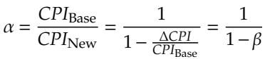
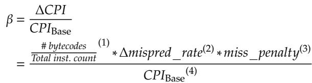

# Short-Circuit Dispatch: Accelerating Virtual Machine Interpreters on Embedded Processors 图表详解

### Figure 1: (a) Canonical dispatch loop in C; (b) Alpha assembly code; (c) Jump-threaded dispatch loop

- 图片展示了三种不同形式的虚拟机解释器调度循环，分别标记为 (a)、(b) 和 (c)，用于说明传统调度机制及其优化方案。

- **(a) Canonical dispatch loop in C**：这是用 C 语言编写的典型调度循环。其结构包括：

    - 无限循环中逐条获取字节码（`bc = *(VM.pc++)`）。
    - 解码字节码以提取操作码（`opcode = bc & mask`）。
    - 使用 `switch` 语句跳转到对应处理函数（如 `case: LOAD`, `case: ADD`）。
    - 这种方式简洁直观，但每次执行都需重复解码、边界检查和目标地址计算。

- **(b) Alpha assembly code**：这是由 GCC 编译器生成的 Alpha 架构汇编代码，对应 (a) 中的 C 代码（第2–6行）。关键部分被灰色背景高亮：

    - **Fetch 阶段**（第2–5行）：从内存加载字节码并更新虚拟 PC。
    - **Decode and Jump 阶段**（第8–18行）：
        - **Decode**（第8行）：使用 `and` 指令提取操作码。
        - **Bound check**（第9–10行）：通过 `cmpule` 和 `beq` 检查操作码是否在合法范围内。
        - **Target address calculation and jump**（第13–18行）：通过查表（`ldah`, `lda`, `s4addq`, `ldl`, `addq`）计算目标地址，并最终执行间接跳转 `jmp r31,(r1),Load`。
    - 此汇编代码清晰揭示了调度开销：即使简单操作也需多条指令完成，且间接跳转难以预测。

- **(c) Jump-threaded dispatch loop**：这是一种软件优化技术，通过将每个处理函数的入口地址存入静态数组 `labels`，并在每个处理函数末尾复制调度逻辑，从而避免在主调度循环中进行查表。

    - 核心思想是：每个字节码处理完成后，直接跳转回调度点，而非返回主循环。
    - 示例中，`goto *labels[opcode]` 替代了 `switch` 语句。
    - 优点是减少分支预测错误，因为每个跳转点有独立 BTB 条目。
    - 缺点是代码膨胀，可能导致指令缓存缺失增加。

- 三者对比总结：

| 特性         | Canonical Dispatch (C) | Alpha Assembly | Jump-threaded             |
| ------------ | ---------------------- | -------------- | ------------------------- |
| **代码结构** | 简洁，易读             | 复杂，低级     | 复制调度逻辑              |
| **性能瓶颈** | 解码+查表+跳转开销大   | 间接跳转难预测 | 代码膨胀导致 I-cache miss |
| **优化目标** | 基础实现               | 展示底层开销   | 减少分支预测错误          |
| **适用场景** | 教学/原型              | 性能分析       | 生产环境优化              |

- 该图旨在引出论文核心观点：传统调度机制存在大量冗余计算（解码、边界检查、地址计算），而现有优化（如 jump threading）虽改善预测，却未消除冗余。SCD 的创新在于利用硬件 BTB 缓存跳转表，直接跳过这些冗余步骤，实现“短路”调度。

### Figure 2: Branch MPKI breakdown for Lua interpreter

- 图片标题为 **Figure 2: Branch MPKI breakdown for Lua interpreter**，展示的是 Lua 解释器在不同基准测试中的分支错误预测率（MPKI）分解图。
- 横轴列出 11 个基准测试程序名称，包括 binary-trees、fannkuch-redux、k-nucleotide 等，末尾为 **GEOMEAN** 表示几何平均值。
- 纵轴表示每千条指令的分支错误预测次数（Mispredictions per Kilo Instructions），范围从 0 到 30。
- 图中采用堆叠柱状图形式，按分支类型分为三类：
    - **direct**：直接分支，用深灰色表示。
    - **indirect (dispatch)**：间接分支（调度相关），用中灰色表示。
    - **indirect (non-dispatch)**：间接分支（非调度相关），用浅灰色表示。
- 数据显示，在多数基准测试中，**indirect (dispatch)** 分支是主要的错误预测来源，尤其在 n-sieve 和 pidigits 中占比极高。
- 在 **n-sieve** 基准测试中，总 MPKI 超过 25，其中 **indirect (dispatch)** 占比接近 80%，表明调度循环中的间接跳转是性能瓶颈。
- **GEOMEAN** 显示整体平均 MPKI 约为 19，其中 **indirect (dispatch)** 占主导地位，说明解释器的 dispatch loop 是分支预测失效的核心区域。
- 此图支持论文观点：传统 BTB 对 dispatch loop 的间接跳转预测效果差，是嵌入式平台上解释器效率低下的关键因素。

| 基准测试       | 总 MPKI | indirect (dispatch) 占比 | 主要贡献者                  |
| -------------- | ------- | ------------------------ | --------------------------- |
| binary-trees   | ~11     | 中等                     | direct + indirect(dispatch) |
| fannkuch-redux | ~16     | 高                       | indirect(dispatch)          |
| k-nucleotide   | ~17     | 高                       | indirect(dispatch)          |
| mandelbrot     | ~18     | 高                       | indirect(dispatch)          |
| n-body         | ~12     | 中等                     | indirect(dispatch)          |
| spectral-norm  | ~11     | 中等                     | direct                      |
| n-sieve        | >25     | 极高（~80%）             | indirect(dispatch)          |
| random         | ~10     | 中等                     | indirect(dispatch)          |
| fibo           | ~13     | 高                       | indirect(dispatch)          |
| ackermann      | ~11     | 中等                     | indirect(dispatch)          |
| pidigits       | ~20     | 高                       | indirect(dispatch)          |
| **GEOMEAN**    | ~19     | 主导                     | indirect(dispatch)          |

- 该图直观揭示了 **dispatch loop 中的间接跳转是 Lua 解释器分支预测失败的主要来源**，为 SCD 提出“绕过冗余计算+硬件加速跳转”的设计提供了数据支撑。

### f45a3e3245d6a369aa60d35ed27a605164963e3a25173b3f588b1d7cde051f53.jpg

- 该图片展示了一个用于量化处理器性能提升的数学公式，其核心是计算 **CPI（Cycles Per Instruction）** 的改进比例。
- 公式定义为：**α = CPIBase / CPINew**，其中 α 表示性能提升因子。该值越大，代表新架构或优化方案带来的性能增益越显著。
- 公式进一步展开为：**α = 1 / (1 - β)**，其中 **β = ΔCPI / CPIBase**。
- 这里的 **ΔCPI** 指的是由于采用新预测器或优化技术后，每条指令所减少的平均周期数。
- 该公式揭示了性能提升与基础CPI和CPI改善量之间的非线性关系：当 **β** 接近1时，**α** 将急剧增大，意味着即使微小的CPI降低也能带来巨大的性能飞跃。
- 在论文上下文中，此公式被用来分析为何在嵌入式处理器上，先进的间接分支预测器（如VBBI）效果有限。因为嵌入式处理器通常具有 **较高的CPIBase** 和 **较低的分支误预测惩罚**，导致 **β** 值较小，从而使得 **α** 增长不明显。

| 符号    | 含义         | 说明                                          |
| ------- | ------------ | --------------------------------------------- |
| α       | 性能提升因子 | **α > 1** 表示性能提升，值越大越好            |
| CPIBase | 基础CPI      | 未采用新预测器前的每条指令周期数              |
| CPINew  | 新CPI        | 采用新预测器后的每条指令周期数                |
| β       | CPI改善率    | **β = ΔCPI / CPIBase**，衡量CPI的相对改善程度 |
| ΔCPI    | CPI减少量    | **ΔCPI = CPIBase - CPINew**                   |

- 论文作者利用此公式论证了现有预测技术在嵌入式平台上的局限性，并以此引出他们提出的 **Short-Circuit Dispatch (SCD)** 方案，该方案通过消除冗余计算而非单纯提高预测精度来实现更有效的性能提升。

### 76c24bf233a9caf70c073e5b4ab9734b120a83e599acf15a01d40ea344fbef33.jpg

- 该图片展示了一个用于分析处理器性能提升的数学公式，其核心是计算 **CPI（Cycles Per Instruction）** 的改进比例 β。
- 公式定义为：β = ΔCPI / CPIBase，其中 ΔCPI 是因优化带来的 CPI 减少量，CPIBase 是基准 CPI。
- 公式进一步展开为一个复合表达式，包含四个关键因子：
    - **(1) #bytecodes / Total inst. count**：表示在解释器循环中，字节码指令占总指令数的比例。这反映了调度开销在整个执行中的比重。
    - **(2) Δmispred_rate**：表示间接跳转预测错误率的降低量。这是衡量分支预测优化效果的核心指标。
    - **(3) miss_penalty**：表示分支预测失败时的惩罚周期数。它与处理器流水线深度直接相关，浅流水线处理器的此值较低。
    - **(4) CPIBase**：基准 CPI，代表未优化前每条指令所需的平均周期数。嵌入式处理器通常具有较高的 CPIBase。

| 因子编号 | 含义             | 对 β 的影响                                                              |
| -------- | ---------------- | ------------------------------------------------------------------------ |
| (1)      | 字节码指令占比   | 占比越高，优化潜力越大，β 越大。                                         |
| (2)      | 预测错误率降低量 | 降低越多，β 越大。但嵌入式处理器上，即使预测准确率大幅提升，收益也有限。 |
| (3)      | 预测失败惩罚     | 嵌入式处理器流水线浅，此值小，导致 β 整体偏小。                          |
| (4)      | 基准 CPI         | 嵌入式处理器 IPC 低，CPIBase 高，分母变大，导致 β 变小。                 |

- 该公式揭示了为什么传统的硬件分支预测技术（如 VBBI）在嵌入式处理器上效果不佳：尽管它们能显著降低 **Δmispred_rate**，但由于 **miss_penalty** 和 **CPIBase** 的固有特性，最终的 **CPI 改进比例 β** 很小。
- 论文作者利用此公式论证了现有优化方案的局限性，并引出他们提出的 **Short-Circuit Dispatch (SCD)** 方案，该方案旨在通过消除冗余计算来减少总指令数，从而绕过对分支预测的依赖，实现更有效的加速。

### Figure 3: Fraction of dispatch instructions for Lua

- 图片标题为 **Figure 3: Fraction of dispatch instructions for Lua**，展示的是在 Lua 解释器中，**dispatch instructions**（调度指令）占整个解释器循环总指令数的百分比。
- 横轴列出 11 个基准测试程序：binary-trees、fannkuch-redux、k-nucleotide、mandelbrot、n-body、spectral-norm、n-sieve、random、fibo、ackermann、pidigits，以及一个 **GEOMEAN**（几何平均值）。
- 纵轴表示 **Percentage of Instructions (%)**，范围从 0% 到 50%，以 10% 为间隔。
- 所有柱状图高度均超过 15%，表明在所有测试用例中，调度指令占比显著。
- **最高值出现在 mandelbrot 和 random**，均接近 **42%**，说明这两个程序在解释执行时，调度开销尤为突出。
- **最低值出现在 k-nucleotide**，约为 **17%**，但仍远高于一般程序的分支或控制流开销。
- **GEOMEAN 值约为 26%**，意味着在 Lua 解释器中，平均有超过四分之一的动态指令用于调度操作。
- 此数据支持论文核心论点：**dispatcher code 中存在大量冗余计算**，是性能瓶颈，尤其在嵌入式处理器上更需优化。
- 表格化数据如下：

| Benchmark      | Dispatch Instruction % |
| -------------- | ---------------------- |
| binary-trees   | ~19%                   |
| fannkuch-redux | ~28%                   |
| k-nucleotide   | ~17%                   |
| mandelbrot     | ~42%                   |
| n-body         | ~28%                   |
| spectral-norm  | ~27%                   |
| n-sieve        | ~26%                   |
| random         | ~42%                   |
| fibo           | ~23%                   |
| ackermann      | ~22%                   |
| pidigits       | ~25%                   |
| **GEOMEAN**    | **~26%**               |

- 该图直观揭示了传统解释器调度机制的低效性，为提出 **Short-Circuit Dispatch (SCD)** 提供了充分动机。

### Table I: ISA extension with SCD

- **Table I** 详细列出了为实现 **Short-Circuit Dispatch (SCD)** 而新增的五条指令及其语义，旨在通过硬件加速字节码分派过程。
- 指令设计围绕三个核心寄存器：**Rop**（Opcode Register）、**Rmask**（Mask Register）和 **Rbop-pc**（BOP-PC Register），以支持对 **BTB** 的高效重用。
- 新增指令包括 **setmask**、带 `.op` 后缀的通用指令、**bop**、**jru** 和 **jte flush**，共同构成一套完整的硬件加速分派机制。

| 指令                                          | 描述                                                                                                                                                                        |
| --------------------------------------------- | --------------------------------------------------------------------------------------------------------------------------------------------------------------------------- |
| **setmask Rn** (Set-mask)                  | 将寄存器 `Rn` 的值写入 **Rmask** 寄存器，用于后续字节码解码时提取操作码。                                                                                                   |
| **<inst>.op** (Suffix-for-Rop-update)      | 执行原指令 `<inst>` 后，将结果与 **Rmask** 掩码运算，结果存入 **Rop.d**，并置位 **Rop.v** 标志。                                                                            |
| **bop** (Branch-on-opcode)                 | 若当前 PC 等于 **Rbop-pc** 且 **Rop.v** 有效，则用 **Rop.d** 查找 BTB；若命中，跳转至目标地址并清零 **Rop.v**；否则顺序执行下一条指令，并更新 **Rbop-pc** 为当前 bop 地址。 |
| **jru Rn** (Jump-register-with-jte-update) | 跳转至寄存器 `Rn` 指定的目标地址；若 **Rop.v** 有效，则将 (**Rop.d**, `Rn`) 对插入 BTB 中作为 JTE，并清零 **Rop.v**。                                                       |
| **jte flush** (Flush-all-jte)              | 清除 BTB 中所有 **JTE** 条目（不触及普通 BTB 条目），并将 **Rop.v** 置零，用于上下文切换或退出解释器循环。                                                                  |

- **关键机制**：
    - **.op 后缀** 实现了“自动解码”，在加载字节码的同时完成操作码提取，省去独立解码指令。
    - **bop** 是核心加速指令，它利用 **Rop.d** 作为键值查询 BTB，实现“短路”跳转，绕过传统分派路径。
    - **jru** 在慢路径中负责填充 BTB，建立新的 JTE 映射，是缓存机制的写入点。
    - **jte flush** 确保多任务环境下 BTB 中的 JTE 不会污染其他进程，保障正确性。
- 整体设计强调**低开销**与**高兼容性**，仅需少量新寄存器和微架构改动，即可显著减少动态指令数和分支预测失误。

### Figure 4: Transformed dispatch loop (original code taken from Figure 1(b))

- 图片展示了经过 **Short-Circuit Dispatch (SCD)** 改造后的虚拟机解释器调度循环汇编代码，原始代码源自 Figure 1(b)。
- 该代码基于 Alpha 架构，但为演示 SCD 的工作原理进行了修改，重点在于引入三个新指令：**`.op` 后缀、`bop` 和 `jru`**。
- 代码结构分为三部分：**Fetch（取指）、Branch-on-opcode（基于操作码的分支）和 Decode-and-Jump（解码与跳转，即慢路径）**。
- 第3行 `ldl.op r9,0(r5)` 是关键改造点，它不仅将字节码加载到寄存器 `r9`，同时根据 `Rmask` 寄存器的掩码值提取操作码并写入 **Opcode Register (Rop)**，从而省去后续显式解码步骤。
- 第7行 `bop` 指令是 SCD 的核心。它使用 Rop 中的操作码作为键，在 **Branch Target Buffer (BTB)** 中查找对应的跳转目标地址。若命中，则直接跳转至目标；若未命中，则落入慢路径继续执行。
- 第20行 `jru r31,(r1),Load` 替代了传统的间接跳转指令 `jmp`。它在完成跳转的同时，将当前操作码（来自 Rop）和目标地址（来自 `r1`）作为一对 **Jump Table Entry (JTE)** 插入 BTB，为后续相同操作码的快速调度做准备。
- 灰色高亮部分标示了被 SCD 修改或新增的指令，清晰地对比了原始调度循环与 SCD 增强版本的区别。
- 通过这种设计，SCD 将原本需要多条指令完成的“取指-解码-边界检查-地址计算”流程，压缩为一次 BTB 查找，显著减少了动态指令数。

| 行号 | 指令                | 功能说明                                                                    |
| ---- | ------------------- | --------------------------------------------------------------------------- |
| 3    | `ldl.op r9,0(r5)`   | 加载字节码并自动提取操作码至 Rop，实现硬件辅助解码。                        |
| 7    | `bop`               | 使用 Rop 中的操作码查询 BTB，实现短路跳转。命中则直接跳转，否则进入慢路径。 |
| 20   | `jru r31,(r1),Load` | 执行跳转，并将 (操作码, 目标地址) 对插入 BTB，用于缓存。                    |

- 该图直观地体现了 SCD 的核心思想：**利用 BTB 作为硬件缓存来存储字节码跳转表，从而绕过冗余的软件计算过程**，最终达到加速解释器的目的。

### Figure 5: Pipeline structure augmented with SCD

- 图片展示了集成 **Short-Circuit Dispatch (SCD)** 的处理器流水线结构，核心目标是通过硬件加速字节码分派，减少冗余计算。
- 流水线分为五个阶段：**Fetch**、**IF/ID**、**Decode**、**ID/EX** 和 **Execute**，与传统 RISC-V 流水线兼容，仅在关键路径上增加 SCD 逻辑。
- **Rbop-pc 寄存器**存储关键间接跳转指令的 PC 地址。在 Fetch 阶段，当前 PC 与 Rbop-pc 比较，若匹配则触发 **bop?** 信号，进入 SCD 快速路径。
- **Stall Logic** 负责处理数据依赖：当 bop 指令执行时，若 Rop 寄存器尚未就绪（即 <inst>.op 尚未完成），则插入气泡（stall）等待，确保正确性。
- **Branch Target Buffer (BTB)** 被扩展以支持两种条目类型：
    - **BTB entry**：常规分支预测条目，J/B¯ 位为 0。
    - **JT entry**：字节码跳转表条目，J/B¯ 位为 1，用于 SCD 快速查找。
- BTB 查找键值根据上下文动态切换：
    - 正常情况：使用 PC 作为索引。
    - 当 bop? 为真且 Rop.v 有效时：使用 **Rop.d**（即字节码操作码）作为索引。
- **Rop 寄存器**包含两个字段：**Rop.v**（有效位）和 **Rop.d**（32 位数据）。在执行 <inst>.op 指令后，结果经 Rmask 掩码后写入 Rop.d。
- **Rmask 寄存器**存储掩码值，用于从字节码中提取操作码字段，避免软件中额外的解码指令。
- **jru 指令**在 Execute 阶段将 (Rop.d, 目标地址) 对写入 BTB，创建新的 JT entry，并重置 Rop.v 为 0。
- **多路选择器**控制 PC 更新路径：
    - 若 BTB hit 且为 JT entry，则直接跳转至目标地址。
    - 否则，PC 自增 4，进入慢路径。
- 下表总结了 BTB 条目格式：

| 字段           | 位宽 | 说明                              |
| -------------- | ---- | --------------------------------- |
| V              | 1    | 有效位，指示条目是否有效          |
| J/B¯           | 1    | 类型标志：0=BTB entry，1=JT entry |
| Tag            | N    | 标签字段，用于匹配                |
| Target Address | M    | 目标地址                          |

- 整体设计强调**低开销**：复用现有 BTB 结构，仅增加少量寄存器和控制逻辑，硬件成本极小（论文称面积增加仅 0.72%）。
- 关键创新在于将软件跳转表“缓存”到硬件 BTB 中，实现**硬件级 memoization**，绕过解码、边界检查和地址计算等冗余步骤。
- 该架构特别适合嵌入式处理器，因其浅流水线和低 IPC 特性使传统分支预测优化收益有限，而 SCD 通过减少指令数直接提升性能。

### Figure 6: Running example of SCD operations

- 图片展示了 **Short-Circuit Dispatch (SCD)** 的运行示例，通过四个阶段（a-d）演示了 **BTB** 如何被复用为 **Jump Table Entry (JTE)** 缓存，从而加速解释器调度循环。
- 每个 BTB 条目包含三个字段：**V (Valid bit)**、**J/B̄ (Jump/Branch flag)** 和 **Target address**。其中 J/B̄ 位决定该条目是普通分支预测条目（B̄=0）还是跳转表条目（J=1）。
- **图 (a) 初始状态**：BTB 中仅有两个有效且为普通分支预测的条目（V=1, J/B̄=0），无任何 JTE。此时 Rop.d 尚未载入有效操作码。

| V   | J/B̄ | Target address |
| --- | --- | -------------- |
| 1   | 0   | BTB entry      |
| 1   | 0   | BTB entry      |
| 0   | 0   | —              |
| 0   | 0   | —              |

- **图 (b) 慢路径 - bop miss**：当加载一个新字节码（如 OP_LOAD）时，其操作码经掩码后写入 **Rop.d**。执行 **bop** 指令时，以 Rop.d 为键在 BTB 中查找，因无匹配 JTE 而未命中（①）。随后进入慢路径，由 **jru** 指令将 (OP_LOAD, Target(OP_LOAD)) 插入 BTB，形成新的 JTE（②），此时该条目 V=1, J/B̄=1。

| V   | J/B̄ | Target address      |
| --- | --- | ------------------- |
| 1   | 0   | BTB entry           |
| 1   | 0   | BTB entry           |
| 1   | 1   | **Target(OP_LOAD)** |
| 0   | 0   | —                   |
| 0   | 0   | —                   |

- **图 (c) 快路径 - bop hit**：再次遇到相同操作码 OP_LOAD 时，**bop** 指令在 BTB 中命中对应的 JTE（①），直接将 PC 重定向至目标地址（②），绕过解码、边界检查和地址计算等冗余指令，实现“短路”调度。

| V   | J/B̄ | Target address      |
| --- | --- | ------------------- |
| 1   | 0   | BTB entry           |
| 1   | 0   | BTB entry           |
| 1   | 1   | **Target(OP_LOAD)** |
| 1   | 1   | Target(OP_MOVE)     |
| 1   | 1   | Target(OP_ADD)      |

- **图 (d) jte_flush**：当解释器退出调度循环时，执行 **jte_flush** 指令，仅将所有 JTE 条目的 **V 位清零**（灰色区域），而保留普通 BTB 条目不变，确保系统上下文切换后行为正确。

| V   | J/B̄ | Target address |
| --- | --- | -------------- |
| 1   | 0   | BTB entry      |
| 1   | 0   | BTB entry      |
| 0   | 1   | —              |
| 0   | 1   | —              |
| 0   | 1   | —              |

- 整个流程体现了 SCD 的核心思想：**利用现有 BTB 硬件资源缓存高频字节码的目标地址，通过硬件查找替代软件计算，显著减少动态指令数和分支误预测，尤其适用于嵌入式处理器**。

### Table II: Architectural parameters

- 该表格（Table II: Architectural parameters）对比了用于评估 Short-Circuit Dispatch (SCD) 的两种平台：**gem5模拟器**与**FPGA实现**，其核心架构参数存在显著差异，以反映真实嵌入式场景。
- **ISA层面**：
    - 模拟器采用 **64-bit Alpha** 架构，而 FPGA 实现基于 **64-bit RISC-V v2**，体现 SCD 的 ISA 独立性。
- **微架构层面**：
    - 两者均为 **Single-Issue In-Order** 设计，但主频不同：模拟器为 **1GHz**，FPGA 为 **50MHz**（综合后），更贴近资源受限的嵌入式设备。
    - 流水线深度不同：模拟器为 **4级**（Fetch1/Fetch2/Decode/Execute），FPGA 为 **5级**（Fetch/Decode/Execute/Memory/Writeback），后者更复杂。
- **分支预测器（Branch Predictor）**：
    - 模拟器配置复杂：包含 **Tournament predictor**、**256-entry BTB**、**8-entry return address stack** 及 **3-cycle penalty**。
    - FPGA 配置精简：仅含 **32B predictor**、**62-entry fully-associative BTB**、**2-entry return address stack** 及 **2-cycle penalty**，符合嵌入式低开销需求。
- **缓存系统（Caches）**：
    - 模拟器缓存更大、延迟更高：L1 I-cache 为 **16KB, 2-way, 2-cycle**；L1 D-cache 为 **32KB, 4-way, 2-cycle**。
    - FPGA 缓存更小、延迟更低：L1 I-cache 为 **16KB, 4-way, 1-cycle**；L1 D-cache 为 **16KB, 4-way, 1-cycle**，优化访存效率。
    - TLB 和块大小一致：均为 **10-entry I-TLB / D-TLB** 和 **64B block size**。
- **内存子系统（Memory）**：
    - 模拟器使用 **512MB DDR3-1600, 2 rank**，时序为 **tCL/tRCD/tRP = 11/11/11**。
    - FPGA 使用 **1GB DDR3-1066, 1 rank**，时序为 **tCL/tRCD/tRP = 7/7/7**，带宽和延迟均更低。
- **工作负载（Workloads）**：
    - 模拟器测试 **Lua-5.3.0** 和 **JavaScript (SpiderMonkey-17)**。
    - FPGA 仅测试 **Lua-5.3.0**，因 SpiderMonkey 在 RISC-V/Newlib 上构建失败。

| 参数类别             | Simulator (gem5)                                                                                      | FPGA (RISC-V Rocket Core)                                                                            |
| -------------------- | ----------------------------------------------------------------------------------------------------- | ---------------------------------------------------------------------------------------------------- |
| **ISA**              | 64-bit Alpha                                                                                          | 64-bit RISC-V v2                                                                                     |
| **Architecture**     | Single-Issue In-Order, 1GHz                                                                           | Single-Issue In-Order, 50MHz (Synthesized)                                                           |
| **Pipeline**         | Fetch1/Fetch2/Decode/Execute (4 stages)                                                               | Fetch/Decode/Execute/Memory/Writeback (5 stages)                                                     |
| **Branch Predictor** | Tournament predictor (512 global + 128 local) 256-entry BTB 8-entry RAS 3-cycle penalty      | 32B predictor 62-entry BTB (fully-assoc) 2-entry RAS 2-cycle penalty                        |
| **Caches**           | L1 I-cache: 16KB, 2-way, 2-cycle L1 D-cache: 32KB, 4-way, 2-cycle 10-entry I/D-TLB 64B block | L1 I-cache: 16KB, 4-way, 1-cycle L1 D-cache: 16KB, 4-way, 1-cycle 8-entry I/D-TLB 64B block |
| **Memory**           | 512MB, DDR3-1600, 2 rank, tCL/tRCD/tRP=11/11/11                                                       | 1GB, DDR3-1066, 1 rank, tCL/tRCD/tRP=7/7/7                                                           |
| **Workloads**        | Lua-5.3.0, JavaScript (SpiderMonkey-17)                                                               | Lua-5.3.0                                                                                            |

- 总体而言，该表清晰展示了从高性能模拟环境到资源受限嵌入式硬件平台的过渡，验证了 SCD 在真实嵌入式条件下的有效性。

### Table III: Benchmarks

- 该图片为论文中的 **Table III: Benchmarks**，详细列出了用于评估 Short-Circuit Dispatch (SCD) 性能的测试脚本及其输入参数。
- 表格包含三列：**Input script**、**Input parameter**（细分为 Simulator 和 FPGA）、以及 **Description**。
- 所有脚本均来自 **Computer Language Benchmarks Game**，用于衡量 Lua 和 SpiderMonkey 解释器在不同调度机制下的性能表现。
- 输入参数根据运行平台（模拟器或 FPGA）进行了调整，以适应不同硬件环境的执行需求。

| Input script   | Simulator | FPGA      | Description                                                                   |
| -------------- | --------- | --------- | ----------------------------------------------------------------------------- |
| binary-trees²  | 12        | —         | Allocate and deallocate many binary trees                                     |
| fannkuch-redux | 9         | 11        | Indexed-access to tiny integer-sequence                                       |
| k-nucleotide   | 250,000   | 2,500,000 | Repeatedly update hashtables and k-nucleotide strings                         |
| mandelbrot     | 250       | 4,000     | Generate Mandelbrot set portable bitmap file                                  |
| n-body         | 500,000   | 5,000,000 | Double-precision N-body simulation                                            |
| spectral-norm  | 500       | 3,000     | Eigenvalue using the power method                                             |
| n-sieve        | 7         | 8         | Count the prime numbers from 2 to M (Sieve of Eratosthenes algorithm)         |
| random         | 300,000   | 600,000   | Generate random number                                                        |
| fibo           | 12        | 32        | Calculate Fibonacci number                                                    |
| ackermann      | 7         | 10        | Use of the Ackermann function to provide a benchmark for computer performance |
| pidigits       | 500       | 6,000     | Streaming arbitrary-precision arithmetic                                      |

- **binary-trees²** 脚本仅在模拟器上运行，未在 FPGA 上测试。
- 多数脚本在 FPGA 上的输入参数显著大于模拟器，例如 **k-nucleotide** 从 250,000 增至 2,500,000，表明 FPGA 测试更注重大规模数据处理能力。
- 描述列清晰说明了每个脚本的功能，如 **n-sieve** 使用埃拉托斯特尼筛法计算素数，**ackermann** 则用于评估计算机性能基准。
- 此表格是实验设计的关键部分，确保了在不同平台上对 SCD 的有效性进行公平且全面的评估。

### Figure 7: Overall speedups for Lua and JavaScript interpreters (the higher, the better)

- 图片展示了 **Figure 7**，标题为“Overall speedups for Lua and JavaScript interpreters (the higher, the better)”，用于比较三种技术在 Lua 和 JavaScript 解释器上的性能加速效果。
- 横轴分为两部分：左侧为 **Lua** 的 11 个基准测试程序，右侧为 **JavaScript** 的 11 个基准测试程序；纵轴表示相对于基线（Baseline）的加速比（Speedup over Baseline），数值越高代表性能越好。
- 图例中包含三种技术：
    - **Jump Threading**（白色柱状图）
    - **VBBI**（灰色柱状图）
    - **SCD**（黑色柱状图）
- 在 **Lua** 部分：
    - **SCD** 在所有基准测试中均优于其他两种技术，其中 **mandelbrot** 达到最高加速比 **1.384**（即 38.4% 加速）。
    - **VBBI** 表现次之，但多数情况下仍优于 Jump Threading。
    - **Jump Threading** 在多个测试中表现不佳，甚至在某些程序（如 n-sieve）中出现负加速。
    - 几何平均（GEOMEAN）显示 **SCD** 达到 **1.199**（即 19.9% 加速），显著优于 VBBI（1.088）和 Jump Threading（0.984）。
- 在 **JavaScript** 部分：
    - **SCD** 同样表现最佳，**fannkuch-redux** 达到最高加速比 **1.372**（即 37.2% 加速）。
    - **VBBI** 表现一般，仅在少数测试中略优于 Jump Threading。
    - **Jump Threading** 在部分测试中表现尚可，但在整体上仍落后于 SCD。
    - 几何平均（GEOMEAN）显示 **SCD** 达到 **1.141**（即 14.1% 加速），优于 VBBI（1.053）和 Jump Threading（1.073）。
- 总体来看，**SCD** 在两个解释器上均实现了显著的性能提升，且在大多数基准测试中表现稳定，而 **VBBI** 和 **Jump Threading** 则存在较大的波动性。

| 技术           | Lua GEOMEAN | JavaScript GEOMEAN |
| -------------- | ----------- | ------------------ |
| **SCD**        | **1.199**   | **1.141**          |
| VBBI           | 1.088       | 1.053              |
| Jump Threading | 0.984       | 1.073              |

- 关键结论：**SCD** 是一种高效的硬件加速方案，尤其适用于嵌入式平台上的脚本解释器，其性能优势主要来源于减少冗余计算和降低指令数，而非单纯依赖分支预测优化。

### Figure 8: Normalized dynamic instruction count (the lower, the better)

- 图片展示了 **Figure 8: Normalized dynamic instruction count (the lower, the better)**，用于比较三种调度优化技术（Jump Threading、VBBI、SCD）在 Lua 和 JavaScript 解释器上的动态指令数表现。
- 横轴按基准程序分组，左侧为 **Lua**，右侧为 **JavaScript**，每个程序下有三个柱状图分别对应三种技术。
- 纵轴为归一化指令数（相对于基线），数值越低表示优化效果越好。
- **SCD（黑色柱）** 在绝大多数基准测试中显著优于其他两种技术，尤其在 Lua 的 `n-sieve`、`random`、`fibo` 和 JavaScript 的 `fannkuch-redux`、`n-body` 等程序上表现突出。
- **VBBI（灰色柱）** 表现次之，多数情况下优于 Jump Threading，但在部分程序如 Lua 的 `mandelbrot` 和 JavaScript 的 `binary-trees` 上略逊于 SCD。
- **Jump Threading（白色柱）** 在多个程序中表现最差，甚至在某些程序（如 Lua 的 `n-sieve`、JavaScript 的 `fannkuch-redux`）中高于基线，说明其代码膨胀导致指令数增加。
- 下表总结了各技术在 Lua 和 JavaScript 上的平均归一化指令数：

| 技术           | Lua 平均归一化指令数 | JavaScript 平均归一化指令数 |
| -------------- | -------------------- | --------------------------- |
| Jump Threading | ~1.02                | ~0.98                       |
| VBBI           | ~0.95                | ~0.94                       |
| SCD            | **~0.90**            | **~0.90**                   |

- 总体来看，**SCD 能有效减少冗余计算，降低动态指令数约 10%**，是提升解释器性能的关键因素。

### Figure 9: Branch misprediction rate in misses per kilo-instructions (MPKI) (the lower, the better)

- 图片展示了 **Lua** 和 **JavaScript** 两种脚本语言解释器在不同优化技术下的 **分支预测失误率 (Branch Miss Rate, MPKI)**，单位为每千条指令的失误次数，数值越低越好。

- 图表横轴分为两组：左侧为 **Lua** 的11个基准测试，右侧为 **JavaScript** 的11个基准测试。纵轴表示 MPKI 值，范围从0到40。

- 图例包含四种技术：

    - **Baseline**（白色）：未优化的原始解释器。
    - **Jump Threading**（灰色）：软件层面的跳转线程化优化。
    - **VBBI**（斜线填充）：基于值的 BTB 索引预测器，代表硬件级间接分支预测优化。
    - **SCD**（黑色）：本文提出的 **Short-Circuit Dispatch** 技术。

- **Lua 解释器表现**：

    - 多数基准测试中，**SCD** 显著降低 MPKI，例如 `mandelbrot`、`n-sieve`、`fibo`、`ackermann` 等，其黑色柱状图明显低于其他三种方案。
    - **VBBI** 在部分测试中表现接近 SCD，但在 `binary-trees`、`k-nucleotide` 等测试中仍高于 SCD。
    - **Jump Threading** 在多数测试中优于 Baseline，但不如 SCD 和 VBBI。
    - **Geomean**（几何平均）显示 SCD 达到最低 MPKI，约为 5.5 MPKI，而 Baseline 约为 18 MPKI，**SCD 降低约 70%**。

- **JavaScript 解释器表现**：

    - **SCD** 同样在大多数测试中表现最佳，如 `fannkuch-redux`、`mandelbrot`、`pidigits` 等。
    - **VBBI** 在部分测试中接近 SCD，但在 `binary-trees`、`spectral-norm` 中仍较高。
    - **Jump Threading** 表现不稳定，在某些测试中甚至劣于 Baseline（如 `random`）。
    - **Geomean** 显示 SCD MPKI 约为 12 MPKI，Baseline 约为 16 MPKI，**SCD 降低约 28%**。

- **关键结论**：

    - **SCD 不仅减少指令数，还显著降低分支预测失误率**，尤其在 Lua 上效果更突出。
    - 相较于传统硬件预测器 **VBBI**，SCD 因直接缓存跳转目标地址，避免了冗余计算和预测失败，从而获得更低的 MPKI。
    - **Jump Threading** 虽能降低部分 MPKI，但因代码膨胀导致缓存失效增加，整体效果受限。

- **数据对比摘要**：

| 技术               | Lua Geomean MPKI | JavaScript Geomean MPKI |
| ------------------ | ---------------- | ----------------------- |
| **Baseline**       | ~18              | ~16                     |
| **Jump Threading** | ~13              | ~14                     |
| **VBBI**           | ~6               | ~13                     |
| **SCD**            | **~5.5**         | **~12**                 |

- 总体而言，**SCD 在降低分支预测失误率方面优于现有主流技术**，尤其适用于嵌入式处理器环境，是提升解释器性能的有效手段。

### Figure 10: Instruction cache miss rates in misses per kilo-instructions (MPKI) (the lower, the better)

- 图片展示了在 Lua 和 JavaScript 解释器上，不同调度技术（Baseline、Jump Threading、VBBI、SCD）的 **指令缓存未命中率 (I-Cache Miss Rate)**，单位为每千条指令未命中次数 (MPKI)，数值越低越好。
- 数据按基准测试程序分组，左侧为 Lua，右侧为 JavaScript，底部有 **GEOMEAN** 表示几何平均值。
- 从图中可观察到：
    - **Jump Threading** 在多个基准测试中显著增加了 I-Cache Miss Rate，尤其在 Lua 的 `mandelbrot` 和 JavaScript 的 `mandelbrot` 上达到峰值，远高于其他方案。这与其代码膨胀特性一致。
    - **SCD** 在绝大多数基准测试中表现优于或接近 Baseline，且在部分程序（如 Lua 的 `n-sieve`, `random`, `fibo`；JavaScript 的 `binary-trees`, `fannkuch-redux`）上明显降低未命中率。
    - **VBBI** 整体表现与 Baseline 接近，未带来显著改善。
    - **GEOMEAN** 值显示：Lua 上 SCD 最优，Jump Threading 最差；JavaScript 上 SCD 与 VBBI 相当，均优于 Jump Threading。

| 技术           | Lua GEOMEAN (MPKI) | JavaScript GEOMEAN (MPKI) |
| -------------- | ------------------ | ------------------------- |
| Baseline       | ~0.28              | ~0.35                     |
| Jump Threading | ~4.80              | ~0.45                     |
| VBBI           | ~0.29              | ~0.36                     |
| SCD            | **~0.27**          | **~0.34**                 |

- 关键结论：**SCD 不仅减少动态指令数，还有效控制了指令缓存压力，避免了 Jump Threading 引发的严重缓存失效问题**，是嵌入式场景下更均衡的优化方案。

### Table IV: Cycle count and instruction count of Lua interpreter using RISC-V Rocket Core on FPGA

- 该表格（Table IV）详细记录了在 **RISC-V Rocket Core** 上通过 **FPGA** 运行 **Lua 解释器** 时，三种不同调度方案（Baseline、Jump Threading、SCD）的性能数据，包括指令数（Inst. Count）和周期数（Cycle Count），并计算了相对基线的指令节省率与加速比。

- 表格包含以下关键列：

    - **Benchmark**: 测试脚本名称，共11个。
    - **Baseline / Jump Threading / SCD**: 分别列出三种方案下的指令数与周期数。
    - **Jump Thr./Baseline & SCD/Baseline**: 计算两种优化方案相对于基线的指令节省百分比（Inst. Savings）和加速比（Speedup）。
    - **GEOMEAN**: 所有基准测试的几何平均值。

- 关键数据摘要如下：

| Benchmark      | Inst. Savings (Jump Thr.) | Speedup (Jump Thr.) | Inst. Savings (SCD) | Speedup (SCD) |
| -------------- | ------------------------- | ------------------- | ------------------- | ------------- |
| binary-trees   | 5.39%                     | 4.33%               | 9.06%               | 10.43%        |
| fannkuch-redux | 5.22%                     | -7.38%              | 11.48%              | 16.78%        |
| k-nucleotide   | 3.92%                     | -2.30%              | 7.69%               | 8.67%         |
| mandelbrot     | 3.69%                     | 5.37%               | 17.95%              | 22.67%        |
| n-body         | 2.77%                     | -1.21%              | 8.65%               | 8.97%         |
| spectral-norm  | 3.91%                     | 1.27%               | 10.00%              | 13.87%        |
| n-sieve        | 6.27%                     | -11.13%             | 10.95%              | 12.03%        |
| random         | 7.21%                     | 3.97%               | 11.92%              | 13.01%        |
| fibo           | 7.49%                     | 5.93%               | 10.56%              | 11.48%        |
| ackermann      | 5.02%                     | 5.32%               | 10.09%              | 9.30%         |
| pidigits       | 2.46%                     | -2.45%              | 6.83%               | 6.14%         |
| **GEOMEAN**    | **4.84%**                 | **0.01%**           | **10.44%**          | **12.04%**    |

- **核心发现**：

    - **SCD** 在所有基准测试中均显著优于基线，**几何平均指令节省率达 10.44%**，**几何平均加速比达 12.04%**，最高加速比出现在 **mandelbrot** 达到 **22.67%**。
    - **Jump Threading** 虽然在部分测试中减少指令数（如 random 达 7.21%），但因代码膨胀导致 **指令缓存缺失增加**，最终 **几何平均加速比仅为 0.01%**，甚至在多个测试中出现负加速（如 fannkuch-redux、n-sieve）。
    - 数据验证了论文主张：**SCD 通过硬件加速跳转表查找，有效消除冗余计算，显著降低指令数与周期数，尤其适合嵌入式环境**。

- **结论**：

    - FPGA 实测结果与仿真一致，证明 **SCD 的有效性与可实现性**。
    - 相较于软件优化（Jump Threading），**SCD 提供更稳定且显著的性能提升**，是嵌入式 VM 解释器加速的理想选择。

### Table V: Hardware overhead breakdown (area, power)

- **Table V** 详细展示了在 RISC-V Rocket Core 上集成 SCD 后，各模块的面积与功耗开销对比。整体来看，SCD 引入的硬件开销极小，仅带来 **0.72% 的面积增加** 和 **1.09% 的功耗上升**，符合其“低开销”设计目标。

- **顶层（Top）数据概览**：

    - 基线（Baseline）总面积为 0.690 mm²，总功耗为 18.46 mW。
    - SCD 版本总面积为 0.695 mm²，总功耗为 18.66 mW。
    - 面积和功耗的绝对增量分别为 0.005 mm² 和 0.20 mW，相对增幅微乎其微。

- **关键模块分析**：

    - **BTB（Branch Target Buffer）** 是受 SCD 影响最显著的模块：
        - 面积从 0.019 mm² 增至 0.023 mm²，增幅达 **21.6%**。
        - 功耗从 1.40 mW 增至 1.56 mW，增幅为 **11.7%**。
        - 尽管相对增幅较高，但因其在芯片中占比小（基线面积占 2.7%，功耗占 7.6%），对整体影响可控。
    - **ICache** 也略有增加，面积从 0.251 mm² 增至 0.255 mm²，功耗从 3.58 mW 增至 3.75 mW，增幅分别约为 1.6% 和 4.7%。
    - 其他模块如 Core、FPU、DCache 等基本保持不变，表明 SCD 修改高度局部化。

- **开销归因**：

    - SCD 的主要开销集中在 BTB 模块，用于存储 JTE（Jump Table Entry）并扩展其功能。
    - 根据论文正文，BTB 模块的面积和功耗分别占芯片总量的约 3% 和 7%，而 SCD 使其增加 0.59% 和 0.90%，进一步验证了其轻量级特性。

- **性能与开销平衡**：

    - 结合第 VI-B 节数据，SCD 在带来 **24.2% 的 EDP 改善**的同时，仅付出 **0.72% 的面积代价**，证明其在嵌入式场景下具有极高的性价比。

| 模块层级 | Baseline 面积 (mm²) | SCD 面积 (mm²) | Baseline 功耗 (mW) | SCD 功耗 (mW) |
| -------- | ------------------- | -------------- | ------------------ | ------------- |
| Top      | 0.690               | 0.695          | 18.46              | 18.66         |
| - Tile   | 0.649               | 0.654          | 14.66              | 14.86         |
| - Core   | 0.044               | 0.044          | 2.86               | 2.87          |
| - FPU    | 0.087               | 0.088          | 3.19               | 3.21          |
| - ICache | 0.251               | 0.255          | 3.58               | 3.75          |
| - BTB    | 0.019               | 0.023          | 1.40               | 1.56          |
| - DCache | 0.248               | 0.248          | 3.70               | 3.70          |

- **结论**：SCD 的硬件实现高度优化，其开销集中于 BTB，且绝对值极小，完全满足嵌入式处理器对面积和功耗的严苛要求，是加速 VM 解释器的理想方案。

### Figure 11: Sensitivity of overall speedups to varying BTB size (a) for Lua and (b) SpiderMonkey. Sensitivity to the the maximum cap imposed on the number of JTEs (c) for Lua and (d) SpiderMonkey

- 图 11 包含四个子图，分别展示 SCD 在不同 BTB 配置下的性能敏感性，涵盖 Lua 和 SpiderMonkey 解释器。
- 子图 (a) 和 (b) 显示 **BTB 大小** 对速度提升的影响：横轴为 BTB 条目数（64 至 512），纵轴为相对于基线的速度提升倍数。
    - Lua（图 a）：随着 BTB 增大，多数基准程序速度提升上升，如 mandelbrot 在 BTB=256 时达峰值约 1.35x；geomean 在 BTB=256 时最高（约 1.2x）。
    - SpiderMonkey（图 b）：趋势类似，但整体提升幅度略低，fannkuch-redux 在 BTB=256 时达 1.35x，geomean 最高约 1.15x。
- 子图 (c) 和 (d) 展示 **JTE 最大容量限制** 的影响：横轴为最大 JTE 数量（8、16、∞），纵轴同上。
    - Lua（图 c）：当限制为 8 或 16 时，部分程序如 n-sieve 性能显著下降（\<1.0），但 ackermann 等保持稳定；无限容量下 geomean 约 1.1x。
    - SpiderMonkey（图 d）：限制对性能影响较小，多数程序在 8~16 间波动不大，geomean 维持在 1.08x 左右。
- 关键观察：
    - **BTB 越大，SCD 效果越明显**，尤其对高频字节码的缓存命中率提升显著。
    - **JTE 限制过严会损害性能**，尤其对使用多字节码的程序（如 n-sieve），但适度限制可避免 BTB 被 JTE 占满导致直接分支预测失效。
    - **SpiderMonkey 因多路径调度结构，整体收益低于 Lua**，但趋势一致。
- 数据摘要表：

| 配置项    | Lua (Geomean) | SpiderMonkey (Geomean) |
| --------- | ------------- | ---------------------- |
| BTB=64    | ~1.1x         | ~1.05x                 |
| BTB=256   | **~1.2x**     | **~1.15x**             |
| BTB=512   | ~1.15x        | ~1.1x                  |
| JTE cap=8 | ~1.05x        | ~1.08x                 |
| JTE cap=∞ | ~1.1x         | ~1.08x                 |

- 结论：SCD 在小 BTB 下仍有效，但最优配置需权衡 JTE 容量与 BTB 空间，避免过度占用影响常规分支预测。
