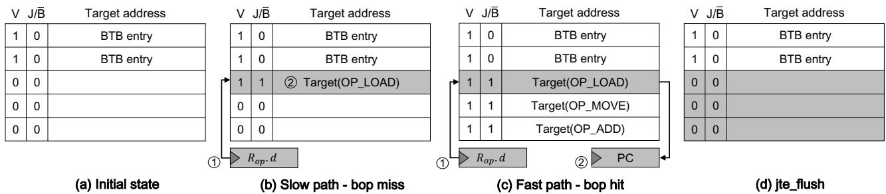
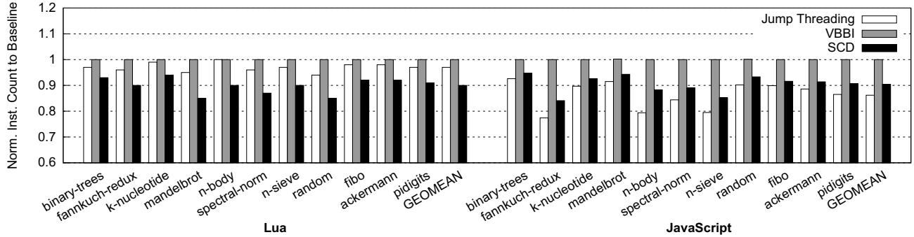
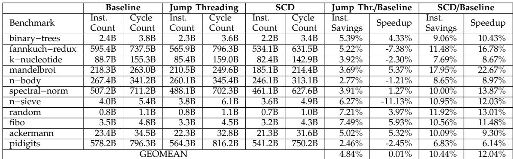
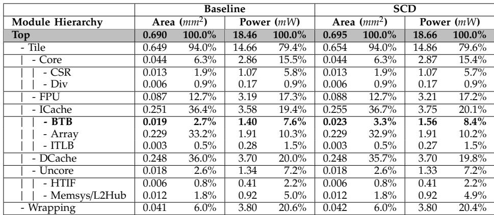
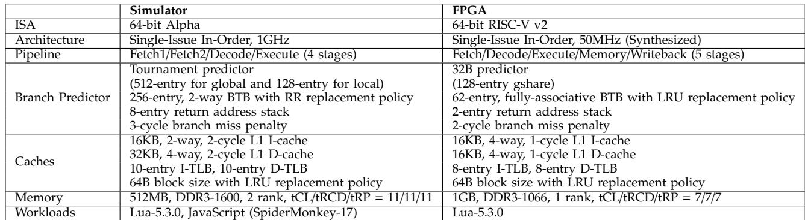

# Short-Circuit Dispatch: Accelerating Virtual Machine Interpreters on Embedded Processors 论文解析

## 0. 论文基本信息

**作者 (Authors)**: Channoh Kim, Sungmin Kim, Hyeon Gyu Cho, et al.

**发表期刊/会议 (Journal/Conference)**: ISCA

**发表年份 (Publication Year)**: 2016

**研究机构 (Affiliations)**: Sungkyunkwan University, Suwon, Korea

______________________________________________________________________

## 1. 摘要

**目的**

- 解决在**资源受限的嵌入式处理器**上，虚拟机（VM）解释器因**字节码分派循环**（bytecode dispatch loop）效率低下而导致的性能瓶颈。
- 针对现有优化技术（主要聚焦于降低间接跳转的**分支误预测率**）在浅流水线、低IPC的嵌入式平台上效果不佳的问题，提出一种新方法。
- 重点消除分派循环中更为突出的**冗余计算**问题，包括解码、边界检查和目标地址计算等重复性指令。

**方法**

- 提出 **Short-Circuit Dispatch **(SCD)，一种低成本的**微架构扩展**。
- SCD的核心思想是将软件创建的**字节码跳转表**（jump table）**叠加**（overlay）到处理器的**分支目标缓冲区**（BTB）上，将其用作一个高效的硬件查找表。
- 引入新的ISA扩展，包括三个专用寄存器和五条新指令：
    - **专用寄存器**:
        - `Rop` (**Opcode Register**): 存储待分派的操作码。
        - `Rmask` (**Mask Register**): 用于从字节码中提取操作码的掩码。
        - `Rbop-pc`: 存储分派循环中关键间接跳转指令的PC地址。
    - **新指令**:
        - `<inst>.op`: 在执行加载指令的同时，将结果用`Rmask`掩码后存入`Rop`。
        - `bop` (**branch-on-opcode**): 使用`Rop`中的操作码作为键查询BTB。若命中，则直接跳转到目标地址（**快速路径**）；否则，继续执行原始分派代码（**慢速路径**）。
        - `jru` (**jump-register-with-jte-update**): 在慢速路径末尾，将`(操作码, 目标地址)`对作为\*\*Jump Table Entry \*\*(JTE)插入BTB。
        - `setmask`: 初始化`Rmask`寄存器。
        - `jte flush`: 在上下文切换时，清空BTB中的所有JTE，以保证正确性。
- BTB条目被扩展，增加一个`J/B̄`标志位，以区分存储的是常规分支预测条目还是JTE。

 *Figure 5: Pipeline structure augmented with SCD*

**结果**

- 在**gem5周期级模拟器**上，使用两个生产级解释器（Lua和JavaScript/SpiderMonkey）进行评估：
    - SCD为Lua和JavaScript解释器分别带来了**19.9%**和**14.1%**的**几何平均加速比**，最大加速比分别达到**38.4%**和**37.2%**。
    - 相比之下，最先进的间接分支预测器VBBI仅获得\*\*8.8%**和**5.3%\*\*的加速比。
    - 性能提升主要源于**动态指令数减少**（Lua和JS分别平均减少**10.2%**和**9.6%**）和**分支误预测率降低**（MPKI分别降低**70.6%**和**28.1%**）。
- 在基于**RISC-V Rocket Core**的**FPGA**和**RTL综合**上进行更真实的评估：
    - FPGA运行结果显示，Lua解释器获得了\*\*12.0%\*\*的几何平均加速比。
    - 使用**TSMC 40nm**工艺库综合，SCD仅增加了\*\*0.72%**的芯片面积和**1.09%\*\*的功耗。
    - 综合性能与能效，SCD将Lua解释器的**能量-延迟积**（EDP）改善了**24.2%**。

| 评估平台                      | 指标                          | Lua       | JavaScript |
| :---------------------------- | :---------------------------- | :-------- | :--------- |
| **gem5 模拟器**               | **Geomean Speedup**           | **19.9%** | **14.1%**  |
|                               | Dynamic Instruction Reduction | 10.2%     | 9.6%       |
|                               | Branch MPKI Reduction         | 70.6%     | 28.1%      |
| \*\*FPGA \*\*(Rocket Core)    | **Geomean Speedup**           | **12.0%** | N/A        |
| \*\*ASIC Synthesis \*\*(40nm) | **Area Overhead**             | **0.72%** | N/A        |
|                               | **EDP Improvement**           | **24.2%** | N/A        |

**结论**

- **Short-Circuit Dispatch **(SCD) 通过利用BTB硬件实现对分派循环中纯函数（操作码到处理程序地址的映射）的**硬件级记忆化**（memoization），有效消除了嵌入式平台上解释器的主要性能瓶颈——**冗余计算**。
- SCD是一种**低成本、高效益**的解决方案，在带来显著性能和能效提升的同时，硬件开销极小（面积增加不到1%）。
- 该方法特别适用于**无法使用JIT编译**的资源受限嵌入式环境，并且其设计具有良好的通用性，可应用于多种基于字节码的虚拟机解释器。

______________________________________________________________________

## 2. 背景知识与核心贡献

**研究背景**

- 在**资源受限的嵌入式平台**上，**解释器 (Interpreters)** 因其**可移植性、较小的资源占用和紧凑的代码**等优势，被广泛用于实现高级语言**虚拟机 (VMs)**。
- 脚本语言（如 **JavaScript** 和 **Lua**）通常先被编译成**字节码 (bytecodes)**，然后由一个经典的**分派循环 (dispatch loop)** 来执行，该循环不断进行取指、解码和执行。
- 这个分派循环的核心是一个大型**跳转表 (jump table)**，其末尾的**间接跳转 (indirect jump)** 指令是主要的性能瓶颈。

**研究动机**

- 现有优化技术主要聚焦于降低间接跳转的**分支误预测率 (misprediction rate)**，但这些技术在具有**浅层流水线 (shallow pipelines)** 和**低 IPC** 的嵌入式处理器上效果不佳，因为其**分支误预测惩罚 (misprediction penalty)** 本身就较低。
- 除了分支预测问题，分派循环中还存在大量**冗余计算 (redundant computation)**，包括对每个字节码都重复进行的**解码 (decode)**、**边界检查 (bound check)** 和**目标地址计算 (target address calculation)**。分析表明，这部分开销占到了总指令数的 **25% 以上**（见图3）。
-  *Figure 3: Fraction of dispatch instructions for Lua*
- 现有的硬件指令（如 ARM 的 `tbb`/`tbh`）或软件技术（如 **jump threading**）虽然能减少指令数或改善预测，但无法从根本上消除这些冗余计算，且可能带来**代码膨胀 (code bloat)** 导致**指令缓存缺失 (instruction cache misses)** 增加的问题（见图10）。
-  *Figure 10: Instruction cache miss rates in misses per kilo-instructions (MPKI) (the lower, the better)*

**核心贡献**

- 提出了一种名为 **Short-Circuit Dispatch (SCD)** 的**低成本微架构扩展**，旨在通过**硬件加速**来消除分派循环中的冗余计算。
- SCD 的核心思想是将软件创建的**字节码跳转表**“覆盖”到处理器的**分支目标缓冲区 (Branch Target Buffer, BTB)** 上。它使用**字节码 (opcode)** 本身作为 BTB 的查询键（而非传统的 PC），从而在硬件层面直接完成从 opcode 到处理函数地址的映射。
- 设计并实现了 SCD 的完整方案，包括：
    - **ISA 扩展**：引入了三个新寄存器 (`Rop`, `Rmask`, `Rbop-pc`) 和五条新指令（如 `bop`, `jru`, `jte flush`）。
    - **微架构组织**：修改了 BTB 条目以区分普通分支和跳转表条目（JTE），并增加了相应的数据通路和**停顿逻辑 (stall logic)**。
- 通过详尽的评估证明了 SCD 的有效性与高效性：
    - 在 **gem5** 周期级模拟器上，SCD 为 **Lua** 和 **JavaScript** 解释器分别带来了 **19.9%** 和 **14.1%** 的**几何平均加速比**，远超现有技术（如 VBBI 预测器仅带来 8.8% 和 5.3% 的加速）。
    - 在基于 **RISC-V Rocket Core** 的**可综合 RTL** 模型上，SCD 在 **FPGA** 上为 Lua 解释器实现了 **12.0%** 的加速，并在 **40nm** 工艺下仅增加了 **0.72%** 的芯片面积，同时将**能耗延迟积 (EDP)** 改善了 **24.2%**。

______________________________________________________________________

## 3. 核心技术和实现细节

### 0. 技术架构概览

**整体技术架构**

本文提出了一种名为 **Short-Circuit Dispatch (SCD)** 的低开销硬件-软件协同架构，旨在加速嵌入式处理器上的虚拟机解释器。其核心思想是利用现有的 **Branch Target Buffer (BTB)** 硬件资源来缓存软件层面的字节码跳转表（jump table），从而绕过解释器分发循环中的冗余计算。

- SCD 通过一个 **ISA 扩展** 和相应的 **微架构修改** 来实现。
- 它将传统的、基于 PC 的 BTB 查找机制扩展为支持基于 **字节码 (bytecode)** 的查找。
- 当解释器执行到特定的分发点时，硬件会直接使用刚加载的字节码作为索引查询 BTB。如果命中，则立即跳转到对应的处理函数地址，完全跳过了软件中用于解码、边界检查和地址计算的指令序列。

**ISA 扩展与新指令集**
SCD 引入了三个新的专用寄存器和五条新指令来协调软硬件交互。

- **新增寄存器**:
    - **Rop (Opcode Register)**: 存储当前待分发的字节码（操作码），包含一个有效位（valid flag）和一个32位数据字段。
    - **Rmask (Mask Register)**: 存储一个掩码，用于从原始字节码中提取出纯净的操作码。
    - **Rbop-pc (BOP-PC Register)**: 存储分发循环中关键间接跳转指令的程序计数器（PC）地址，用于标识何时触发 SCD 机制。
- **新增指令** ( *Table I: ISA extension with SCD*):
    - `<inst>.op`: 一个带有后缀的加载指令，它在执行常规加载的同时，会自动将结果与 `Rmask` 进行按位与操作，并将结果存入 `Rop`。
    - `bop (branch-on-opcode)`: 这是分发循环的核心指令。当处理器取指单元发现当前 PC 与 `Rbop-pc` 匹配时，会使用 `Rop.d` 作为键在 BTB 中进行查找。命中则直接跳转（**fast path**），未命中则顺序执行后续的慢速路径代码（**slow path**）。
    - `jru (jump-register-with-jte-update)`: 替换原始的间接跳转指令。它在执行跳转的同时，会将 `(Rop.d, target_address)` 这对映射关系作为 **Jump Table Entry (JTE)** 插入到 BTB 中，供后续的 `bop` 指令使用。
    - `setmask`: 在解释器启动时初始化 `Rmask` 寄存器。
    - `jte flush`: 在上下文切换或退出解释器时，清空 BTB 中所有的 JTE 条目，以保证正确性。

**微架构组织与实现**
SCD 的微架构设计巧妙地复用了现有的 BTB 结构，仅做了最小化的改动。

- **BTB 条目扩展**: 每个 BTB 条目增加了一个 **J/B̄ (JTE/BTB)** 标志位，用于区分该条目存储的是普通的分支目标（B̄）还是字节码跳转表项（J）。
- **优先级与替换策略**: JTE 条目拥有比普通 BTB 条目更高的优先级。新的 JTE 可以驱逐旧的 BTB 条目，但反之则不行，这确保了分发性能的关键路径不受影响。
- **流水线集成** ( *Figure 5: Pipeline structure augmented with SCD*):
    - 在 **Fetch** 阶段，PC 会与 `Rbop-pc` 进行比较，以决定是否激活 SCD 查找模式。
    - 在 **Execute** 阶段，`<inst>.op` 指令会更新 `Rop`，而 `jru` 指令会生成并写入新的 JTE。
    - **Stall Logic**: 为了确保 `bop` 指令执行时 `Rop` 中的数据已经就绪，流水线会在必要时进行停顿，这对于浅流水线的嵌入式处理器是值得的权衡。
- **工作流程示例** ( *Figure 6: Running example of SCD operations*):
    1. **首次执行 (Slow Path)**: 加载字节码 -> `bop` 未命中 BTB -> 执行完整的软件分发逻辑 -> `jru` 将新映射插入 BTB。
    1. **后续执行 (Fast Path)**: 加载相同字节码 -> `bop` 命中 BTB -> 直接跳转到处理函数，跳过所有冗余指令。
    1. **清理**: 解释器退出时，执行 `jte flush` 清除所有 JTE。

### 1. Short-Circuit Dispatch (SCD) 架构扩展

**核心观点**

- **Short-Circuit Dispatch (SCD)** 是一种针对嵌入式处理器的**低成本硬件架构扩展**，旨在通过消除虚拟机解释器中字节码分发循环（dispatch loop）的冗余计算来提升性能。
- 其核心思想是将软件层面的字节码跳转表（jump table）**覆盖（overlay）** 到现有的**分支目标缓冲区（Branch Target Buffer, BTB）** 上，利用BTB作为高效的硬件查找表，从而绕过软件解码、边界检查和目标地址计算等步骤。

**实现原理与硬件组织**

- SCD通过引入新的**ISA扩展**和微架构修改来实现其功能。
- **关键硬件修改**在于对BTB条目进行扩展，增加一个 **J/B̄ 位（Jump Table / Branch bit）**：
    - 当 J/B̄ = 1 时，该BTB条目存储的是一个**跳转表条目（Jump Table Entry, JTE）**，其键（key）为字节码操作码（opcode），值（value）为对应的处理函数入口地址。
    - 当 J/B̄ = 0 时，该条目是传统的BTB条目，用于预测普通间接跳转。
- 这种设计允许BTB同时服务于两种目的，而无需增加一个独立的专用硬件表，从而控制了硬件开销。

**ISA扩展与新寄存器**

- SCD引入了三个新的专用寄存器来协调硬件与软件的交互：
    - **Rop (Opcode Register)**: 包含一个32位数据字段（`Rop.d`）用于存放当前字节码的操作码，以及一个1位有效标志（`Rop.v`）。该寄存器是BTB查找的**关键**。
    - **Rmask (Mask Register)**: 存放一个32位掩码，用于从原始字节码中提取出操作码。此寄存器在解释器启动时设置一次。
    - **Rbop-pc (BOP-PC Register)**: 存放分发循环中关键 `bop` 指令的程序计数器（PC）值，用于在取指阶段识别何时应触发基于操作码的BTB查找。
-  *Table I: ISA extension with SCD*

**算法流程：分发循环的改造**

- 原始的分发循环需要执行“取指 -> 解码 -> 查表 -> 跳转”这一系列指令。
- 使用SCD后，分发循环被改造为包含**快速路径（fast path）** 和**慢速路径（slow path）** 的结构：
    1. **字节码加载与掩码**: 加载字节码的指令被替换为带有 `.op` 后缀的新指令（如 `ldl.op`）。该指令在将结果写入通用寄存器的同时，会自动使用 `Rmask` 对结果进行掩码操作，并将提取出的操作码存入 `Rop`。
        -  *Figure 4: Transformed dispatch loop (original code taken from Figure 1(b))*
    1. **快速路径尝试 (`bop` 指令)**: 执行 `bop` 指令。在取指阶段，硬件会将当前PC与 `Rbop-pc` 比较。若匹配，则使用 `Rop.d` 作为键在BTB中查找JTE。
        - **命中**: 如果找到匹配的JTE，处理器立即跳转到目标地址，并将 `Rop.v` 置为无效。这直接绕过了后续所有解码和查表指令，构成了**快速路径**。
        - **未命中**: 如果未找到，则顺序执行下一条指令，进入**慢速路径**。
    1. **慢速路径与缓存更新 (`jru` 指令)**: 慢速路径执行原始的软件解码和跳转逻辑。但最后的间接跳转指令被替换为 `jru`（jump-register-with-jte-update）。`jru` 在执行跳转的同时，会将当前有效的 `(Rop.d, 目标地址)` 对作为一个新的JTE插入到BTB中，供后续相同操作码的快速分发使用。
    1. **上下文管理 (`jte flush` 指令)**: 在解释器退出或发生操作系统上下文切换时，调用 `jte flush` 指令，该指令会将BTB中所有JTE（即 J/B̄=1 的有效条目）置为无效，以保证执行的正确性。

**输入输出关系及整体作用**

- **输入**: SCD的输入是解释器执行流中的字节码序列。具体来说，`.op` 指令的输入是内存中的字节码，输出是填充了操作码的 `Rop` 寄存器。
- **输出**: SCD的最终输出是程序计数器（PC）的重定向，使其指向正确的字节码处理函数。这个重定向要么由 `bop` 指令（快速路径）直接完成，要么由 `jru` 指令（慢速路径）完成。
- **在整体系统中的作用**:
    - **性能提升**: 通过硬件加速，显著减少了分发循环的动态指令数。实验数据显示，对于Lua和JavaScript解释器，动态指令数平均分别减少了 **10.2%** 和 **9.6%**。
    - **降低分支误预测**: 由于快速路径完全绕过了难以预测的间接跳转，分支误预测率（MPKI）也大幅下降（Lua降低 **70.6%**，JavaScript降低 **28.1%**）。
    - **能效优化**: 减少指令执行和缓存访问直接降低了能耗。在40nm工艺下，SCD仅增加 **0.72%** 的芯片面积，却为Lua解释器带来了 **24.2%** 的能量延迟积（EDP）改善。
    - **低成本**: SCD巧妙地复用了现有的BTB资源，避免了增加专用硬件的成本，使其非常适合资源受限的嵌入式平台。

______________________________________________________________________

**性能与开销数据摘要**

| 指标               | Lua (模拟器) | JavaScript (模拟器) | Lua (FPGA/RTL) |
| :----------------- | :----------- | :------------------ | :------------- |
| **平均加速比**     | **19.9%**    | **14.1%**           | **12.0%**      |
| **最大加速比**     | **38.4%**    | **37.2%**           | **22.7%**      |
| **动态指令数减少** | **10.2%**    | **9.6%**            | **10.4%**      |
| **芯片面积开销**   | -            | -                   | **0.72%**      |
| **功耗开销**       | -            | -                   | **1.09%**      |
| **EDP改善**        | -            | -                   | **24.2%**      |

 *Figure 7: Overall speedups for Lua and JavaScript interpreters (the higher, the better)*
 *Figure 8: Normalized dynamic instruction count (the lower, the better)*
 *Table IV: Cycle count and instruction count of Lua interpreter using RISC-V Rocket Core on FPGA*
 *Table V: Hardware overhead breakdown (area, power)*

### 2. 基于操作码的BTB查找机制

**核心机制与实现原理**

- **Short-Circuit Dispatch (SCD)** 的核心创新在于将软件层面的字节码跳转表（jump table）与硬件层面的 **Branch Target Buffer (BTB)** 进行融合，从而绕过传统解释器分发循环中的冗余计算。
- 传统分发循环在每次迭代时都需要执行 **decode（解码）**、**bound check（边界检查）** 和 **target address calculation（目标地址计算）** 等一系列指令，这些操作对于同一个字节码是完全确定且可缓存的。
- SCD通过引入新的 **ISA扩展** 和 **微架构修改**，使得处理器能够在硬件层面直接完成从字节码到处理函数地址的映射。

**关键数据结构与寄存器**

- SCD引入了三个专用寄存器来支持其功能：
    - **Rop (Opcode Register)**: 存储当前待分发的字节码（经过掩码处理后的操作码）。它包含一个1位的有效标志 `Rop.v` 和一个32位的数据字段 `Rop.d`。`Rop.d` 作为查询 BTB 的 **key**。
    - **Rmask (Mask Register)**: 存储一个32位的掩码，用于从原始字节码中提取出操作码。该寄存器在解释器启动时设置一次。
    - **Rbop-pc (BOP-PC Register)**: 存储分发循环中关键间接跳转指令（即 `bop` 指令）的程序计数器（PC）值。处理器通过比对当前 PC 与 `Rbop-pc` 来判断是否处于需要进行快速分发的位置。

**算法流程与指令集扩展**

- SCD通过新增五条指令来改造原有的分发循环代码，如图4所示。
     *Figure 4: Transformed dispatch loop (original code taken from Figure 1(b))*
- **加载与解码阶段**: 原始的加载指令（如 `ldl`）被替换为带有 `.op` 后缀的新指令（如 `ldl.op`）。该指令在将字节码加载到通用寄存器的同时，会自动使用 `Rmask` 对其进行掩码操作，并将结果存入 `Rop` 寄存器。这一步在硬件层面完成了软件中的 **decode** 操作。
- **快速路径尝试 (`bop` 指令)**:
    - 当处理器取指单元发现当前 PC 与 `Rbop-pc` 匹配时，它会触发 `bop` 操作。
    - 此时，BTB 的索引 **不再是 PC**，而是 `Rop.d` 中的操作码。
    - 如果 BTB 中存在对应的 **Jump Table Entry (JTE)** 并且命中，则处理器直接将 PC 重定向到 JTE 中存储的目标地址，并清空 `Rop.v` 标志。这构成了 **fast path**，完全跳过了后续的软件分发逻辑。
    - 如果未命中，则 `bop` 指令会顺序执行（fall through），进入传统的 **slow path**。
- **慢速路径与缓存更新 (`jru` 指令)**:
    - 在 slow path 的末尾，原本的间接跳转指令（如 `jmp`）被替换为 `jru` (jump-register-with-jte-update) 指令。
    - `jru` 指令除了执行跳转外，还会将当前 `Rop.d`（操作码）和目标地址（来自源寄存器）作为一个新的 **(key, value)** 对，插入到 BTB 中，形成一个新的 JTE。这为下一次遇到相同字节码时走 fast path 做了准备。
- **上下文管理**:
    - `setmask` 指令用于初始化 `Rmask` 寄存器。
    - `jte flush` 指令用于在解释器退出或发生上下文切换时，**仅无效化 BTB 中所有的 JTE**，而不影响正常的 BTB 条目，保证了系统安全性和正确性。

**BTB的增强与组织**

- 为了区分普通的 BTB 条目和 SCD 的 JTE，每个 BTB 条目都增加了一个 **J/B¯ bit** 标志位。
    - 当 **J/B¯ = 1** 时，该条目是一个 JTE，其 tag 字段存储的是操作码（`Rop.d`）。
    - 当 **J/B¯ = 0** 时，该条目是一个传统的 BTB 条目，其 tag 字段存储的是 PC。
- 查询逻辑被修改：当由 `bop` 触发查询时，只匹配 **J/B¯ = 1** 的条目；而普通分支预测则只查询 **J/B¯ = 0** 的条目。
- **替换策略**: 默认情况下，新插入的 JTE 可以替换掉普通的 BTB 条目，但反之则不行。这确保了对解释器性能至关重要的 JTE 能够优先驻留在 BTB 中。

**输入输出关系及整体作用**

- **输入**:
    - 原始字节码流。
    - 解释器启动时配置的 `Rmask` 值。
- **输出**:
    - 对于高频出现的字节码，直接跳转到其对应的处理函数（handler），**显著减少了动态指令总数**。
    - 对于低频或首次出现的字节码，回退到原始分发路径，并在此过程中学习和缓存新的映射关系。
- **在整体系统中的作用**:
    - **消除冗余计算**: 直接绕过了分发循环中占总指令数 **25%以上** 的 decode、bound check 和地址计算指令（见图3）。
         *Figure 3: Fraction of dispatch instructions for Lua*
    - **降低分支误预测率**: 通过硬件直接跳转，避免了传统大跳转表带来的高分支误预测开销（见图9）。
         *Figure 9: Branch misprediction rate in misses per kilo-instructions (MPKI) (the lower, the better)*
    - **提升能效**: 减少指令执行和缓存访问，最终在仅增加 **0.72%** 芯片面积的情况下，为 Lua 解释器带来了 **24.2%** 的 **Energy-Delay Product (EDP)** 改进。

### 3. 新的ISA指令与寄存器

**新寄存器的设计与作用**

- **Rop (Opcode Register)**:

    - 这是一个复合寄存器，包含一个 **1-bit valid flag (Rop.v)** 和一个 **32-bit data field (Rop.d)**。
    - **Rop.d** 用于存储从字节码中提取出的操作码（opcode），并作为 **BTB (Branch Target Buffer) 查找的关键字 (key)**。
    - **Rop.v** 用于标记 **Rop.d** 中的数据是否有效。在一次分发（dispatch）完成后（无论是通过快速路径还是慢速路径），该标志会被重置为零以确保状态正确。

- **Rmask (Mask Register)**:

    - 这是一个 **32-bit** 的掩码寄存器。
    - 它的作用是在加载字节码后，通过按位与操作自动提取出其中的操作码字段。例如，Lua 的操作码位于最低 **6** 位，因此 **Rmask** 被设置为 **0x0000003F**。
    - 该寄存器通常在解释器启动时通过 **setmask** 指令设置一次，之后保持不变。

- **Rbop-pc (BOP-PC Register)**:

    - 该寄存器存储了分发循环中关键的间接跳转指令（即被 **bop** 指令替换的位置）的 **PC (Program Counter)** 值。
    - 在处理器的 **Fetch** 阶段，硬件会将当前 **PC** 与 **Rbop-pc** 进行比较。如果匹配，则触发 **SCD** 机制，使用 **Rop.d** 而非 **PC** 作为 **BTB** 的索引。

______________________________________________________________________

**新ISA指令的功能与流程**

- **<inst>.op**:

    - 这不是一个独立的指令，而是对现有加载类指令（如 `ldl`）的扩展后缀。
    - 当带有 `.op` 后缀的指令执行完毕后，其结果不仅会写入目标通用寄存器，还会**同时**与 **Rmask** 进行按位与操作，并将结果存入 **Rop.d**，同时将 **Rop.v** 置为 **1**。
    - **输入**: 内存中的原始字节码。
    - **输出**: 提取出的操作码存入 **Rop**，供后续 **bop** 指令使用。

- **bop (branch-on-opcode)**:

    - 这是一条特殊的条件分支指令，放置在原分发循环中计算跳转目标地址的代码块之前。
    - **算法流程**:
        1. 处理器在 **Fetch** 阶段检测到当前 **PC** 等于 **Rbop-pc**。
        1. 使用 **Rop.d** 作为 **key** 查询 **BTB**。
        1. 如果 **BTB** 命中（即找到了对应的 **JTE, Jump Table Entry**），则直接将 **PC** 重定向到 **JTE** 中存储的目标地址，并将 **Rop.v** 置为 **0**，完成**快速路径**分发。
        1. 如果未命中，则 **PC** 正常递增，继续执行后续的慢速路径代码（即原有的解码、边界检查和地址计算逻辑）。
    - **作用**: 作为 **SCD** 机制的入口点，尝试绕过冗余计算。

- **jru (jump-register-with-jte-update)**:

    - 这条指令替换了原分发循环末尾的普通间接跳转指令（如 `jmp`）。
    - **算法流程**:
        1. 执行普通的寄存器间接跳转。
        1. 在 **Execute** 阶段，将当前有效的 **(Rop.d, 目标地址)** 对作为一个新的 **JTE** 插入到 **BTB** 中。
        1. 同时将 **Rop.v** 置为 **0**。
    - **作用**: 在慢速路径执行完毕后，将本次分发的结果（操作码到处理函数地址的映射）缓存到 **BTB** 中，为下一次相同操作码的快速分发做准备。

- **setmask**:

    - 这是一条初始化指令，在解释器主循环开始前执行。
    - **功能**: 将一个立即数或寄存器的值写入 **Rmask** 寄存器。
    - **作用**: 根据特定脚本语言（如 Lua 或 JavaScript）的字节码格式，配置操作码的提取掩码。

- **jte flush**:

    - 这是一条管理指令，通常在解释器退出或发生 **OS** 上下文切换时调用。
    - **功能**: 遍历 **BTB**，将所有 **J/B¯** 标志位为 **J**（表示是 **JTE**）的条目的有效位（**V**）清零，从而**仅**使 **JTE** 失效，而不影响正常的 **BTB** 条目。
    - **作用**: 保证不同进程或不同解释器实例之间的 **JTE** 不会相互干扰，确保执行的正确性。

 *Table I: ISA extension with SCD*

______________________________________________________________________

**整体工作流程与输入输出关系**

- **输入**: 脚本程序被编译成的**字节码流**。
- **核心处理**:
    - 字节码通过 **<inst>.op** 指令加载并自动解码出 **opcode** 存入 **Rop**。
    - **bop** 指令利用 **Rop** 中的 **opcode** 查询 **BTB**。
        - **命中**: 直接跳转到处理函数，**输出**为执行对应字节码的语义，**绕过了**原有的解码、查表等冗余指令。
        - **未命中**: 执行慢速路径，最终由 **jru** 指令完成跳转并将映射关系存回 **BTB**。
- **在整体中的作用**: 这套 **ISA** 扩展将软件层面的**字节码跳转表**有效地“叠加”到了硬件的 **BTB** 上。**BTB** 不再仅仅是一个**预测**结构，而变成了一个**缓存**结构，直接存储了 **opcode** 到处理函数地址的映射。这从根本上消除了分发循环中大量重复且无副作用的计算，显著降低了**动态指令数**和**能耗**，特别适合**嵌入式处理器**这种对面积和能效敏感的场景。

### 4. 跳转表条目（JTE）与BTB条目的共存管理

**核心机制：JTE与BTB条目的共存**

- **统一存储结构**：Short-Circuit Dispatch (SCD) 的核心创新在于将软件层面的 **bytecode jump table** 与硬件层面的 **Branch Target Buffer (BTB)** 进行融合，而非为跳转表条目（Jump Table Entry, JTE）创建一个独立的专用缓存。
- **类型区分标志**：为了在同一物理 BTB 中区分两种不同类型的条目，每个 BTB 条目被扩展了一个新的 **J/B̄ bit**（JTE/BTB bit）。
    - 当 **J/B̄ bit = 1** 时，该条目存储的是一个 **JTE**，其内容为 `(opcode, target_address)` 的映射对。
    - 当 **J/B̄ bit = 0** 时，该条目存储的是一个 **传统的 BTB 条目**，其内容为 `(PC, target_address)` 的映射对，用于预测普通间接跳转或直接分支。
- **独立的查找逻辑**：在进行 BTB 查找时，系统会根据当前上下文决定搜索哪种类型的条目。
    - 在 **bop** 指令执行时（即尝试进行快速分发），查找逻辑**仅匹配 J/B̄ bit = 1 的 JTE 条目**，并使用 **Rop.d**（即 opcode）作为查找键（key）。
    - 在处理普通分支指令时，查找逻辑**仅匹配 J/B̄ bit = 0 的 BTB 条目**，并使用 **PC** 作为查找键。

**替换策略与资源管理**

- **优先级设定**：由于 JTE 对于加速解释器循环至关重要，而普通 BTB 条目的缺失通常只会导致一次可恢复的流水线冲刷，SCD 采用了 **JTE 优先的替换策略**。
    - **JTE 可以驱逐 BTB 条目**：当需要为一个新的 JTE 分配空间且 BTB 已满时，替换算法会选择一个 **J/B̄ bit = 0** 的普通 BTB 条目进行替换。
    - **BTB 条目不能驱逐 JTE**：反之，当需要为一个新的普通 BTB 条目分配空间时，它**不能**替换一个 **J/B̄ bit = 1** 的 JTE。这确保了关键的分发表项不会被普通分支活动所污染。
- **潜在风险与缓解措施**：这种偏向性策略在 BTB 容量极小或工作负载使用了大量不同 bytecode 的极端情况下，可能导致普通分支的预测性能下降。
    - **动态上限控制**：为了解决此问题，论文提出了一种实用的解决方案：为 BTB 中 **JTE 的最大数量设置一个上限（cap）**。通过限制 JTE 占用的资源总量，可以防止其过度挤占普通 BTB 条目的空间，从而在加速解释器和维持整体分支预测性能之间取得平衡。如图  *Figure 11: Sensitivity of overall speedups to varying BTB size (a) for Lua and (b) SpiderMonkey. Sensitivity to the the maximum cap imposed on the number of JTEs (c) for Lua and (d) SpiderMonkey* 所示，即使设置了较小的上限，SCD 依然能获得显著的性能提升。

**生命周期管理与操作系统交互**

- **显式刷新指令**：SCD 引入了 **jte flush** 指令，用于在特定时机（如解释器退出或 OS **context switch**）**批量无效化所有 JTE**。
    - 该指令**只重置 J/B̄ bit = 1 条目的有效位（V bit）**，而完全保留普通 BTB 条目，保证了系统其他部分的分支预测状态不受影响。
- **寄存器状态保存**：在 **context switch** 期间，**Rmask** 寄存器的值必须被操作系统保存和恢复，因为它定义了从 bytecode 中提取 opcode 的方式，是 SCD 正确运行的前提。相比之下，**Rop** 和 BTB 中的 JTE 可以被简单地刷新，因为它们可以在任务恢复后通过慢路径重新填充。

**输入输出关系及整体作用**

- **输入**：
    - **Opcode**：由带 `.op` 后缀的加载指令从内存中取出 bytecode，并根据 **Rmask** 自动解码后存入 **Rop** 寄存器。
    - **bop 指令的 PC**：由 **Rbop-pc** 寄存器提供，用于标识解释器分发循环中的关键跳转点。
- **输出**：
    - **目标地址**：如果 BTB 查找命中 JTE，则直接输出对应的 handler 地址，实现 **fast path**，跳过软件解码、边界检查和地址计算等冗余指令。
    - **新 JTE**：如果查找未命中，则执行原始的慢路径分发代码，最终由 **jru** 指令将新计算出的 `(opcode, target_address)` 对作为 JTE 插入 BTB，供后续使用。
- **整体作用**：通过这种硬件辅助的 **memoization** 机制，SCD 将原本每次都需要执行的、开销高昂的软件分发逻辑，转化为一次性的初始化开销和后续高效的硬件查找。这直接**消除了冗余计算**，大幅**降低了动态指令数**，从而在资源受限的嵌入式处理器上实现了显著的性能和能效提升。

### 5. 流水线停顿逻辑

**实现原理与触发条件**

- SCD 的流水线停顿逻辑（Stall Logic）旨在解决 **数据冒险**（Data Hazard）问题，具体场景是：当 **bop** 指令进入 **Fetch** 阶段时，其执行所依赖的关键输入——\*\*Opcode Register \*\*(Rop) 中的有效操作码（opcode）尚未被写入。
- 该问题的根源在于，Rop 的值是由前一条带有 `.op` 后缀的加载指令（如 `ldl.op`）在 **Execute** 阶段计算并写入的。由于流水线的深度，当 bop 被取指时，`.op` 指令可能仍在流水线中，导致 Rop 的值不可用。

**算法流程与设计选择**

- 论文提出了两种解决方案，并最终选择了 **停顿方案**：
    - \*\*方案一 \*\*(Fall-through)：不进行任何干预，让 bop 指令正常执行。由于 Rop 无效或未就绪，BTB 查找必然失败，控制流将 **fall through** 到慢速路径（slow path）。此方案无硬件开销，但会错失快速分发的机会。
    - \*\*方案二 \*\*(Stalling)：在 Fetch 阶段引入 **stall logic**，主动检测流水线中是否存在正在执行的、会更新 Rop 的 `.op` 指令。如果存在，则 \*\*暂停 \*\*(stall) bop 指令在 Fetch 阶段，直到 `.op` 指令完成并将有效 opcode 写入 Rop。
- **选择停顿方案的原因**：论文明确指出，该设计针对的是具有 **浅层流水线**（shallow pipelines）的嵌入式处理器。在此类处理器上，由停顿引入的少量气泡（bubbles/nop cycles）所带来的性能损失，远小于成功执行一次 **快速路径分发**（fast-path dispatch）所带来的收益。因此，**收益大于成本**。

**参数设置与硬件实现**

- 该机制的实现依赖于流水线中的 **前递/旁路网络**（Forwarding/Bypassing Network）或类似的 **数据就绪信号**。
- **stall logic** 是一个新增的硬件模块，位于 Fetch 阶段，负责监控流水线状态。其核心功能是比较当前 PC 与 **Rbop-pc** 寄存器的值以识别 bop 指令，并检查 Rop 的有效位（**Rop.v**）及相关的数据就绪信号。
- 一旦 stall 条件满足，它会向流水线控制单元发出信号，冻结 bop 及其后续指令的取指，直到依赖解除。

 *Figure 5: Pipeline structure augmented with SCD*

**输入输出关系及在整体中的作用**

- **输入**：
    - 当前取指地址（PC）。
    - **Rbop-pc** 寄存器的值（用于识别 bop 指令）。
    - 流水线中各指令的状态，特别是 `.op` 指令是否在执行及其目标寄存器。
    - **Rop** 寄存器的有效位（**Rop.v**）和数据就绪信号。
- **输出**：
    - 一个 **stall 信号**，用于控制 Fetch 阶段是否暂停。
- **在 SCD 整体架构中的作用**：
    - **保障正确性**：确保 bop 指令在执行 BTB 查找时，使用的 opcode 是来自**刚刚取回的字节码**，而非过期或无效的数据。
    - **最大化性能收益**：通过强制等待正确的 opcode，使得 **快速路径分发** 的命中率得以保证，从而最大化地消除冗余计算，实现论文所述的 **动态指令数减少** 和 **性能加速**。它是连接 `.op` 指令和 `bop` 指令的关键同步机制，是 SCD 能够高效工作的必要条件。

______________________________________________________________________

## 4. 实验方法与实验结果

**实验设置**

- **仿真平台**：

    - 使用 **gem5** 周期级模拟器，基于 **MinorCPU** 模型。
    - 处理器参数参照 **ARM Cortex-A5**，代表典型的嵌入式处理器。
    - 实现了两种基线优化方案用于对比：**Jump Threading** (软件) 和 **VBBI** (Value-Based BTB Indexing, 硬件)。

- **FPGA/RTL 平台**：

    - 基于开源的 **64-bit RISC-V Rocket Core** (Chisel 编写)。
    - RTL 模型被综合为 Verilog，并在 **Xilinx ZC706 FPGA** 上运行。
    - 由于构建问题，FPGA 评估仅针对 **Lua** 解释器。
    - 使用 **Synopsys Design Compiler** 和 **TSMC 40nm** 标准单元库进行面积和功耗估算。

- **工作负载**：

    - 选用两个生产级解释器：**Lua-5.3.0** (47个字节码) 和 **SpiderMonkey-17.0** (229个字节码)。
    - 基准测试集包含 **11个脚本**，源自 **Computer Language Benchmarks Game**。
    - 所有解释器均使用 **gcc -O3** 编译，并关闭垃圾回收以减少干扰。

- **关键架构参数**：
     *Table II: Architectural parameters*

**结果数据分析**

- **整体性能加速比 (Simulation)**：

    - **SCD** 在 **Lua** 和 **JavaScript (SpiderMonkey)** 上分别取得了 **19.9%** 和 **14.1%** 的**几何平均加速比**，最大加速比分别达到 **38.4%** 和 **37.2%**。
    - 相比之下，**VBBI** (SOTA硬件方案) 仅获得 **8.8%** 和 **5.3%** 的加速比，而 **Jump Threading** (软件方案) 在 Lua 上甚至导致 **-1.6%** 的性能下降。
         *Figure 7: Overall speedups for Lua and JavaScript interpreters (the higher, the better)*

- **性能提升根源**：

    - **指令数减少**：SCD 通过绕过分发循环中的冗余计算，将 **Lua** 和 **SpiderMonkey** 的动态指令总数平均减少了 **10.2%** 和 **9.6%**。
         *Figure 8: Normalized dynamic instruction count (the lower, the better)*
    - **分支预测错误率降低**：SCD 同时将 **Lua** 和 **SpiderMonkey** 的分支 **MPKI** (每千条指令的预测错误数) 分别降低了 **70.6%** 和 **28.1%**。
         *Figure 9: Branch misprediction rate in misses per kilo-instructions (MPKI) (the lower, the better)*
    - **Jump Threading 的缺陷**：虽然减少了指令数，但其代码膨胀导致 **指令缓存缺失率** (I-cache MPKI) 急剧上升（例如 Lua 从 0.28 升至 4.80），抵消了收益。
         *Figure 10: Instruction cache miss rates in misses per kilo-instructions (MPKI) (the lower, the better)*

- **FPGA/RTL 验证结果**：

    - 在真实的 **RISC-V Rocket Core** 上，SCD 对 **Lua** 解释器实现了 **12.0%** 的几何平均加速比，与模拟器结果趋势一致。
    - SCD 平均减少了 **10.4%** 的指令数。
    - **Jump Threading** 在 FPGA 上效果甚微，几何平均加速比仅为 **0.01%**。
         *Table IV: Cycle count and instruction count of Lua interpreter using RISC-V Rocket Core on FPGA*

- **硬件开销与能效**：

    - **面积开销**：仅增加 **0.72%**。
    - **功耗开销**：仅增加 **1.09%**。
    - **能效提升**：结合性能提升，\*\*能量延迟积 \*\*(EDP) 改善了 **24.2%**。
    - 关键模块 **BTB** 的面积和功耗分别增加了 **21.6%** 和 **11.7%**，但对整体设计的**关键路径无影响**。
         *Table V: Hardware overhead breakdown (area, power)*

**消融实验与敏感性分析**

- **BTB 容量敏感性**：

    - 实验评估了不同 **BTB 大小** (从 64 到 1024 项) 对 SCD 性能的影响。
    - 结果表明，即使在最小的 **64 项 BTB** 上，SCD 依然能显著超越基线，证明了其在资源极度受限环境下的有效性。
         *Figure 11: Sensitivity of overall speedups to varying BTB size (a) for Lua and (b) SpiderMonkey. Sensitivity to the the maximum cap imposed on the number of JTEs (c) for Lua and (d) SpiderMonkey*

- **JTE 数量上限**：

    - 为防止 JTE 过度挤占 BTB 空间而损害普通分支预测，引入了 **JTE 最大数量上限**。
    - 在 **64 项 BTB** 的极端情况下，设置上限（如 8 或 16）可以为某些程序（如 **n-sieve**）带来显著性能提升，避免了因普通分支预测失效而导致的整体性能下降。
         *Figure 11: Sensitivity of overall speedups to varying BTB size (a) for Lua and (b) SpiderMonkey. Sensitivity to the the maximum cap imposed on the number of JTEs (c) for Lua and (d) SpiderMonkey*

- **在高端核心上的泛化能力**：

    - 在一个更强大的 **ARM Cortex-A8** 风格的双发射核心上评估 SCD。
    - SCD 依然取得了可观的性能提升（**Lua: 17.6%**, **SpiderMonkey: 15.2%**），表明其设计理念不仅限于低端嵌入式平台。

______________________________________________________________________
