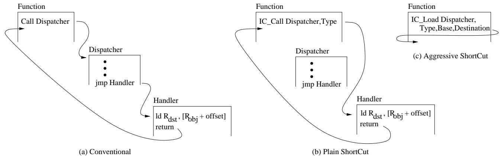
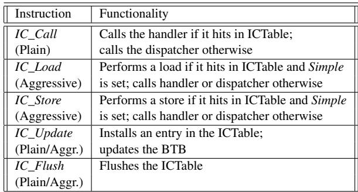

# ShortCut: Architectural Support for Fast Object Access in Scripting Languages 通俗讲解

### 0. 整体创新点通俗解读

**痛点直击 (The "Why")**

- 动态脚本语言（如 JavaScript）的灵活性是一把双刃剑。编译器无法在编译时确定对象的类型，因此每次访问对象属性（比如 `obj.x`）时，都必须执行一个叫 **Inline Cache (IC)** 的“调度员”。
- 这个调度员的工作方式很笨重：它会用一连串的 **if 语句**去比对当前对象的类型，直到找到匹配的处理函数（handler）。这个过程会产生两大问题：
    - **指令开销巨大**：论文指出，在 V8 引擎的基线编译器下，这个调度过程能占到程序总指令数的 **22%**。
    - **分支预测灾难**：这些 if 语句形成的间接跳转极难预测，导致 **分支错误预测率 (MPKI)** 几乎翻倍（从 5.8 暴涨到 10.8），严重拖慢 CPU 流水线。

**通俗比方 (The Analogy)**

- 想象你在一个巨大的图书馆（程序）里工作，需要频繁地从不同的书架（对象）上拿特定的书（属性）。但书架的布局（对象结构）随时可能变。
- 传统的做法是，每次你要拿书，都必须先跑到前台（dispatcher）去查一本厚厚的登记簿（IC Vector），看这次要找的书架是什么型号，然后根据登记簿的指示，再跑回对应的书架去拿书。
- **ShortCut 的思路是**：给你配一个智能手环（硬件 ICTable）。这个手环能记住你上次在哪个位置（access site）拿了哪种书架（type）的书，并且直接告诉你书的具体位置（handler 或 offset）。下次你再到同一个位置，手环就直接震动指引你，省去了跑前台查登记簿的麻烦。如果手环记错了（预测失败），你再跑一趟前台也不迟。

**关键一招 (The "How")**

- 作者没有试图在软件层面优化那个笨重的调度员，而是**在硬件和指令集层面做了一个巧妙的“劫持”**。
- 他们引入了一个新的硬件表 **ICTable** 和几条新的指令（如 **IC_Call**, **IC_Load**）。
- **核心逻辑转换在于**：将原来“调用调度员 -> 调度员查找 -> 跳转到 handler”的三步走流程，通过硬件预测直接“短路”成一步。
    - **Plain ShortCut**：硬件利用 **ICTable**，根据当前代码位置（PC）和对象类型（RType）直接预测出正确的 **handler 地址**，并让 CPU 直接跳过去执行，完全绕过了调度员的 if-else 链。
    - **Aggressive ShortCut**：更进一步，对于那些最简单的 handler（其实就是一次内存 load/store），硬件不仅预测地址，还能直接从 **ICTable** 里拿到内存偏移量（offset），并在 **IC_Load/IC_Store** 指令内部直接完成内存读写操作，连 handler 函数调用都省了。
- 这个设计的精妙之处在于，它将原本由软件承担的、高开销的动态分派任务，卸载给了一个专用的、低延迟的硬件结构，从而实现了质的性能飞跃。

 *Figure 2: Operations of a conventional IC (a), Plain ShortCut (b), and Aggressive ShortCut (c).*

最终效果非常显著：在 V8 基线编译器下，**Plain ShortCut 就能将平均执行时间减少 30%**，即使在高度优化的模式下，也能带来 **11%** 的提升。这证明了通过软硬件协同设计来解决动态语言的核心瓶颈，是一条极具价值的路径。

### 1. Inline Cache Table (ICTable) (ELI5)

**痛点直击 (The "Why")**

- 在 JavaScript 这类动态语言里，一个简单的 `obj.x` 访问，在运行时可能面对成百上千种不同结构的对象（即 **Object Type**）。
- 为了处理这种不确定性，编译器（如 V8）会在访问点（**Access Site**）生成一个 **Dispatcher**（调度器），它像一个“接线员”，拿着一个 if-else 的清单（**Inline Cache Vector**），挨个比对当前对象的类型，然后跳转到对应的 **Handler**（处理器）去执行真正的读写操作。
- 这个过程非常“难受”：
    - **指令开销巨大**：每次访问都要执行一长串比较和跳转指令。论文数据显示，在未优化的代码中，**Dispatcher 相关指令能占到总指令数的 26%**。
    - **分支预测灾难**：Dispatcher 末尾的那个间接跳转（`jmp handler_address`）目标极不稳定，导致 **BTB (Branch Target Buffer) 预测准确率极低（仅 42%-52%）**，频繁的 **Pipeline Flush** 严重拖慢速度。

**通俗比方 (The Analogy)**

- 想象你是一个快递分拣员（**CPU**），每天要处理成千上万的包裹（**Object Access**）。
- 以前的做法是：每个包裹上只写了一个模糊的收件人名字（**Access Site**）。你必须跑到中央查询台（**Dispatcher**），翻厚厚的电话簿（**IC Vector**），找到对应的名字、地址和派送方式（**Handler**），然后再跑回去按地址分拣。
- 这个过程太慢了！**ShortCut** 的思路是：给你配一个智能手环（**ICTable**）。这个手环会记住你最近处理过的“名字-地址”组合。下次再看到同一个名字的包裹，手环直接在你耳边告诉你地址，你一步到位完成分拣，根本不用去查询台。
- **Plain ShortCut** 就是手环告诉你去哪个具体的分拣站（**Handler**）。
- **Aggressive ShortCut** 更狠，对于最简单的包裹（比如只是从A箱搬到B箱），手环直接告诉你“左手第三个格子”，你当场就完成了，连分拣站都不用去。

**关键一招 (The "How")**

- 作者没有去修改复杂的软件调度逻辑，而是在硬件层面引入了一个新的、专用的缓存表——**Inline Cache Table (ICTable)**。
- 这个 ICTable 的核心巧妙之处在于它的 **索引方式** 和 **存储内容**：
    - **索引**：它使用 **Access Site 的 PC 地址** 和 **当前 Object 的 Type** 进行哈希，共同作为 key。这确保了不同位置的相同类型访问，或者同一位置的不同类型访问，都能被精确区分。
    - **存储**：每个表项直接存储了 `(Access_Site_PC, Object_Type) -> Handler_Address` 的映射（**Plain** 模式），或者更进一步，存储 `(Access_Site_PC, Object_Type) -> Property_Offset`（**Aggressive** 模式）。
- 通过引入新的 ISA 指令（如 **IC_Call**, **IC_Load**），原来的 `call dispatcher` 指令被替换。新指令在执行时：
    - 会立刻用 `(PC, Type)` 去查询 ICTable。
    - 如果命中（**Hit**），硬件就直接跳转到正确的 **Handler**，或者干脆自己执行一次 **Load/Store** 操作。
    - 如果未命中（**Miss**），才退回到传统的、慢速的 Dispatcher 路径，并由软件负责用 **IC_Update** 指令将新学到的映射关系填充回 ICTable。
- 这样，**98%** 的情况下（论文数据），CPU 都能绕过那个臃肿、难预测的 Dispatcher，直达目的地，从而大幅削减指令数和分支误预测。

 *Figure 3: Structures used in a conventional IC (a), Plain ShortCut (b), and Aggressive ShortCut (c).*

______________________________________________________________________

**性能收益与代价**

- **收益**：
    - 在 V8 基线编译器下，**Plain ShortCut 平均减少 30% 的执行时间**。
    - 即使在高度优化的场景下，依然能带来 **11%** 的性能提升。
    - 动态指令数和 **MPKI (Mispredictions Per Kilo Instruction)** 显著下降。
- **代价**：
    - 硬件上增加了一个 **~9KB** 大小的 ICTable（512 entries），开销很小。
    - 软件上需要对 JIT 编译器做少量修改，以插入新的 ISA 指令。
    - 需要在 **GC (Garbage Collection)** 或 **Context Switch** 时刷新 ICTable，以防使用过期的指针，但这些操作本身就很稀疏，影响微乎其微。

### 2. Plain ShortCut Design (ELI5)

**痛点直击 (The "Why")**

- 在 JavaScript 这类动态语言里，一个简单的 `obj.x` 访问，在底层可能要经历一个叫 **Inline Cache (IC)** 的“调度中心”。这个调度中心（dispatcher）会拿着 `obj` 的类型，挨个去比对它见过的类型列表，找到匹配的就跳转到对应的处理函数（handler）。
- 问题在于，这个调度过程本身开销巨大：
    - 它要执行**一连串的 if-else 比较和跳转指令**，这些指令本身就很费 CPU 周期。
    - 更糟的是，这些分支**极难预测**。因为同一个访问点（access site）可能会遇到多种不同类型的对象，导致分支预测器（BTB）经常猜错，引发 **pipeline flush**，性能雪上加霜。
- 论文数据显示，在 V8 的 baseline 编译器下，这套调度逻辑能吃掉程序 **22% 的总指令数**，并且让 **MPKI（每千条指令的分支误预测数）翻倍**。这就像每次拿快递都要先去一个巨大的、混乱的分拣中心排队，效率自然低下。

**通俗比方 (The Analogy)**

- 想象你住在一个大公寓楼里，每天回家都要去一楼大厅的**总服务台**（dispatcher）拿钥匙。服务台的工作人员（dispatcher code）会问你：“你是几零几的？”，然后翻他的记录本（IC Vector），找到你的名字，再从一大串钥匙里找出你的那把给你。
- **Plain ShortCut 的核心思想是**：既然你每天都回同一个家，为什么不直接在你家门口装一个**专属的智能门禁**（ICTable）呢？
- 这个门禁系统（硬件）会记住：“当住户 A（object type）走到公寓入口（access site）时，他要去 501（handler address）”。下次住户 A 再来，门禁系统直接给他指路去 501，他压根不用去总服务台排队了。只有当他带了个新朋友（新类型）来，门禁不认识，才会把他送去总服务台处理。

**关键一招 (The "How")**

- 作者没有去重写整个 JavaScript 引擎，而是在硬件层面做了一个非常巧妙的“劫持”和“加速”。
- **替换调用指令**：他们把原来在代码里调用 dispatcher 的那条 `call dispatcher` 指令，替换成了一个新的硬件指令 **`IC_Call`**。这条新指令除了知道 dispatcher 的地址，还额外带上了当前对象的**类型信息**（作为寄存器操作数）。
- **引入硬件加速表**：他们增加了一个新的硬件结构，叫做 **Inline Cache Table (ICTable)**。这个表就像是前面说的“智能门禁”的数据库，它的每一项都记录着 `(访问点地址, 对象类型) -> 正确的处理器地址` 的映射关系。
- **执行流程扭转**：
    - 当 `IC_Call` 指令执行时，CPU 不会傻乎乎地直接跳去 dispatcher。
    - 相反，它会立刻用 `(当前PC, 对象类型)` 去 **ICTable** 里查。
    - **如果命中（Hit）**：硬件直接拿到正确的 handler 地址，并将控制流导向那里，**完全绕过了 dispatcher 的所有 if-else 和跳转**。
    - **如果未命中（Miss）**：那就老老实实地像以前一样，去执行 dispatcher，让它来处理这个“新朋友”。但 dispatcher 在找到正确 handler 后，会通过一条特殊的 `IC_Update` 指令，把这个新学到的映射关系存进 ICTable，为下次加速做准备。
- 这个设计的精妙之处在于，它利用了 IC 本身的局部性（一个访问点短时间内倾向于看到相同类型的对象），用一个专用的、由软件维护的硬件表，将原本需要多条指令和多次分支才能完成的“查找-跳转”过程，压缩成一次硬件表查询和一次直接跳转。

 *Figure 2: Operations of a conventional IC (a), Plain ShortCut (b), and Aggressive ShortCut (c).*
 *Figure 3: Structures used in a conventional IC (a), Plain ShortCut (b), and Aggressive ShortCut (c).*

### 3. Aggressive ShortCut Design (ELI5)

**痛点直击**

- 传统的 **Inline Caching (IC)** 机制，即使是优化过的 **Shared Dispatcher** 设计，也存在显著的“仪式感”开销。每次访问对象属性，都必须：
    - 执行一个 **call** 指令跳转到调度器。
    - 在调度器里跑一堆 **if-else** 分支去匹配对象类型。
    - 最后再 **jump** 到具体的处理函数（handler）。
- 这个流程在现代CPU上非常难受，因为它制造了大量**难以预测的间接跳转**，导致**流水线频繁冲刷**。更讽刺的是，对于最常见的场景——访问一个普通对象的普通字段——这个handler本身可能就只是一条简单的 **load** 或 **store** 指令。为了执行这一条有用的指令，却要付出几十条无用指令和多次分支预测失败的代价。

**通俗比方**

- 想象你要从自家书架上拿一本书。最高效的方式当然是直接走过去，伸手就拿（**Aggressive ShortCut**）。
- 但现在的系统是怎么做的呢？它要求你先走到管家（**Dispatcher**）面前，告诉他：“我要拿《三体》”。管家翻看他的记录本（**IC Vector**），确认这本书在A区第三排，然后他再派一个专门的取书员（**Handler**）去帮你拿。取书员走到书架前，发现其实就一步之遥，但他还是得完成“被派遣”这个流程。
- **Plain ShortCut** 相当于你记住了上次拿《三体》时是哪个取书员，下次直接喊他的名字，省去了找管家的步骤。
- 而 **Aggressive ShortCut** 更彻底：它让你自己变成了“人形取书员”。当你脑子里一想“拿《三体》”，你的手就已经自动伸向了A区第三排，整个过程一气呵成，连“喊人”这个念头都省了。

**关键一招**

- 作者的核心洞察在于：**区分“控制流”和“数据流”**。对于简单的内存访问，我们根本不需要改变控制流（即跳转到另一个函数），只需要在当前指令流中完成一次数据搬运即可。
- 为实现这一点，他们做了两个关键扭转：
    - **硬件层面**：将原有的 **IC_Call** 指令升级为 **IC_Load/IC_Store**。这些新指令不仅携带了调度器地址和对象类型，还**隐式地绑定了基地址寄存器（Rbase）和目标/源寄存器（Rdst/Rsrc）**。
    - **数据结构层面**：扩充了 **ICTable**，增加了一个 **Simple** 标志位。当一个handler被识别为简单操作时，表项里存储的不再是handler的地址，而是**该字段在对象内的固定偏移量（offset）**。
- 当 **IC_Load/IC_Store** 指令执行时，硬件会查询 **ICTable**：
    - 如果命中且 **Simple=1**，硬件就**当场**执行 `ld Rdst, [Rbase + offset]` 或 `st Rsrc, [Rbase + offset]`，**完全不产生任何跳转**，就像执行一条原生的load/store指令一样。
    - 如果命中但 **Simple=0**，或者未命中，则退化到 **Plain ShortCut** 或传统路径。
- 这一招的精妙之处在于，它把原本需要**软件函数调用**才能完成的语义，通过**硬件指令的语义扩展**直接实现了，从而将动态语言中最常见的操作，其性能拉回到了接近静态语言的水平。

 *Figure 2: Operations of a conventional IC (a), Plain ShortCut (b), and Aggressive ShortCut (c).*
 *Figure 3: Structures used in a conventional IC (a), Plain ShortCut (b), and Aggressive ShortCut (c).*

### 4. ISA Extensions for ShortCut (ELI5)

**痛点直击**

- 传统动态语言（如 JavaScript）的 **Inline Caching (IC)** 机制，为了处理对象类型的不确定性，在每次属性访问时都要执行一个 **Dispatcher**。这个 Dispatcher 本质上是一串 if-else 比较和跳转。
- 这个过程非常“难受”：
    - **指令开销大**：即使是为了读取一个简单的字段，也要先执行十几条甚至更多的指令来跑 Dispatcher。
    - **分支预测灾难**：Dispatcher 里的间接跳转（jmp to handler）目标不固定，导致 **BTB (Branch Target Buffer)** 频繁预测失败，引发流水线冲刷，性能雪上加霜。
- 简单说，就是为了解决“灵活性”带来的问题，引入了一个笨重且难以预测的“中间商”，而这个中间商成了性能瓶颈。

**通俗比方**

- 想象你是一个图书管理员（CPU），读者（程序）经常来问：“《三体》在哪个书架？”
- **老方法（传统 IC）**：你不能直接回答，必须先跑到一个固定的查询台（Dispatcher），在那里翻一本厚厚的登记簿（IC Vector），找到《三体》对应的书架号，然后再告诉读者。这个查询台总是人满为患，而且登记簿的页码顺序混乱，你每次翻都容易翻错地方。
- **ShortCut 的新方法**：现在，你在自己的口袋里（硬件 **ICTable**）放了一张小抄。这张小抄记录着：“当有人问《三体》时，直接回答‘A3书架’”。这样，90%的情况下，读者一问，你就能脱口而出，根本不用去那个拥挤的查询台。
- **ISA 扩展的作用**：这五条新指令，就是教会你（CPU）如何使用这张“口袋小抄”的操作手册。
    - `IC_Call/Load/Store` 是“查询小抄并作答”的动作。
    - `IC_Update` 是“往小抄上记新内容”的动作。
    - `IC_Flush` 是“图书馆盘点，所有小抄作废重写”的动作。

**关键一招**

- 作者并没有试图在软件层面优化那个笨重的 Dispatcher，而是巧妙地在 **硬件和 ISA 层面** 引入了一个专用的、快速的旁路机制。
- 具体来说，他们把原来那个通用的 `call dispatcher` 指令，替换成了能与硬件 **ICTable** 直接对话的新指令。
- 这个逻辑转换的核心在于：**将原本在软件中通过多条指令完成的“查表-跳转”逻辑，下沉并固化到一条硬件指令的执行流程中**。
    - **`IC_Call` / `IC_Load` / `IC_Store`**:
        - 这些指令在执行时，会**自动**用当前指令地址（代表访问点）和对象类型（作为 key）去查询 **ICTable**。
        - 如果命中，硬件可以直接跳转到正确的 **handler**（Plain模式），或者更进一步，直接完成 **load/store** 操作（Aggressive模式），彻底绕过软件 Dispatcher。
        - 它们还负责与 BTB 协同工作，确保前端取指的预测尽可能准确。
    - **`IC_Update`**:
        - 当软件 Dispatcher 或 Miss Handler 最终确定了正确的处理方式后，它会调用这条指令。
        - 这条指令的作用是**将刚刚学到的知识（访问点、类型、处理方式）直接灌入 ICTable**，为下一次快速访问做准备。
        - 在 Aggressive 模式下，它还能标记这个 handler 是否是“简单”的，并存入偏移量。
    - **`IC_Flush`**:
        - 这是一个安全机制。在 **GC (Garbage Collection)** 或 **Context Switch** 等可能导致内存布局或对象类型信息失效的事件发生后，系统会调用此指令**清空整个 ICTable**，防止硬件使用过期的、错误的信息。

 *Table 2: Instructions added by ShortCut.*

### 5. Integration with Shared Dispatcher (ELI5)

**痛点直击**

- 传统的 **Shared Dispatcher** 设计虽然避免了频繁的代码重编译，但它引入了一个新的性能瓶颈：每次对象访问（比如 `obj.x`）都要先调用一个**共享的分发函数**。
- 这个分发函数内部会遍历一个 **IC Vector**（内联缓存向量），逐个比对对象类型，直到找到匹配的处理程序（handler）。这个过程涉及**多次内存访问**和**难以预测的间接跳转**。
- 论文数据显示，在 V8 的 baseline 编译器下，这套分发逻辑能吃掉 **26%** 的指令数，并且将分支错误预测率（MPKI）从 5.8 拉高到 10.8。这就像你每次去图书馆借书，都得先去一个中央问询台排队，让工作人员翻厚厚的登记簿帮你找书在哪个架子上，效率极低。

**通俗比方**

- 想象一下 **Shared Dispatcher** 就像公司里一个万能的前台。所有访客（对象访问请求）都必须先找她。前台有一本巨大的通讯录（IC Vector），她需要根据访客的名字（对象类型）一页页翻，找到对应的员工（handler）的工位号，然后告诉访客怎么走。
- **ShortCut** 的做法是，给每个经常来访的访客发一张“**快速通行证**”（IC_Call/IC_Load 指令）。这张通行证里不仅有访客自己的信息（对象类型），还直接印着目标员工的工位号（handler 地址）或者干脆就是目标办公室的门禁卡（属性偏移量）。
- 公司大楼的安保系统（硬件 **ICTable**）会记住这些通行证的有效组合。下次同一个访客再来，他直接刷卡（执行 IC_Call），安保系统瞬间验证并开门，完全绕过了前台，甚至不用去员工工位，直接进入目标办公室。

**关键一招**

- 作者并没有抛弃 **Shared Dispatcher** 这套成熟的软件机制，而是巧妙地在**硬件和指令集层面**为它增加了一个“**预检快车道**”。
- **编译器改造**：V8 JIT 编译器不再生成一个简单的 `call dispatcher` 指令。取而代之的是，它会：
    - 在调用点之前，提前将对象的类型加载到一个特定寄存器（`RType`）。
    - 插入一条全新的 **IC_Call**（或 **IC_Load/IC_Store**）指令，这条指令同时携带了调度器地址、对象类型、以及对象基地址等信息。
- **硬件协同**：当 **IC_Call** 指令执行时，处理器内部的 **ICTable**（一个小型硬件哈希表）会被触发。它用当前指令的 PC（即访问点地址）和 `RType`（对象类型）作为联合键进行查询。
    - 如果 **ICTable Hit**，硬件就能立刻拿到正确的 handler 地址（Plain 模式）或者属性偏移量（Aggressive 模式），从而**直接跳转**或**直接执行内存访问**，完全跳过共享调度器的代码。
    - 如果 **ICTable Miss**，才会回退到传统的路径，去执行共享调度器。但此时，调度器在找到正确 handler 后，会通过一条特殊的 **IC_Update** 指令，将这次成功的映射关系（访问点 + 类型 -> handler/offset）写回 **ICTable**，为下一次访问加速。
- 这个设计的精妙之处在于，它将原本在**软件循环中动态解析**的问题，通过硬件表的一次**静态查找**就解决了，把控制流的关键路径从 O(n) 的线性搜索变成了 O(1) 的哈希查找。

 *Figure 3: Structures used in a conventional IC (a), Plain ShortCut (b), and Aggressive ShortCut (c).*
