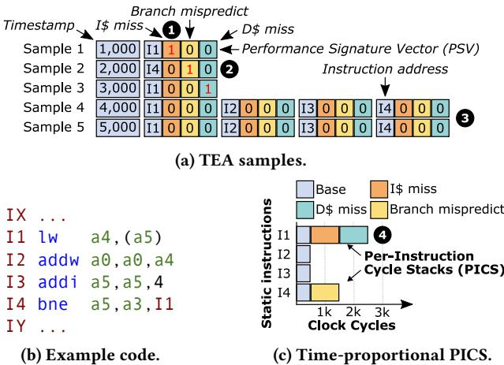
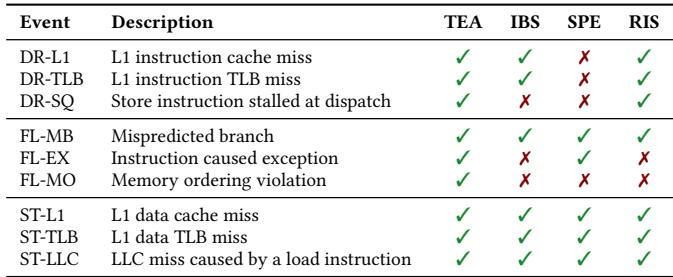
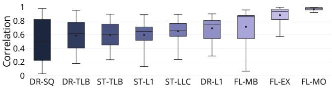
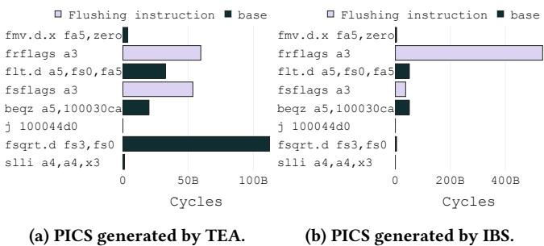

# TEA: Time-Proportional Event Analysis 图表详解

### Figure 1: Example explaining how TEA creates PICS. TEA explains how performance events cause performance loss.

- 图片展示了 **TEA** 如何通过采样和 **Performance Signature Vector (PSV)** 生成 **Per-Instruction Cycle Stacks (PICS)**，以解释性能损失的根源。
- 图中分为三个部分：(a) TEA 采样数据表、(b) 示例代码、(c) 最终生成的 PICS 图表。

- **图 (a) TEA samples**：
  - 表格记录了 5 次采样（Sample 1 至 Sample 5），每行包含：
    - **Timestamp**：采样发生的时间点（单位：时钟周期）。
    - **Instruction address**：被采样的指令地址（如 I1, I4 等）。
    - **PSV**：三位二进制向量，分别对应三种性能事件：
      - 第一位：**I$ miss**（指令缓存未命中）
      - 第二位：**D$ miss**（数据缓存未命中）
      - 第三位：**Branch mispredict**（分支预测错误）
  - PSV 中“1”表示该指令在采样时刻正受此事件影响，“0”表示无影响。
  - 示例：
    - Sample 1：I1 被采样，PSV 为 `1 0 0` → 仅受 **I$ miss** 影响。
    - Sample 2：I4 被采样，PSV 为 `0 1 0` → 仅受 **D$ miss** 影响。
    - Sample 3：I1 被采样，PSV 为 `0 0 1` → 仅受 **Branch mispredict** 影响。
    - Sample 4 & 5：I1–I4 并行提交，PSV 全为 `0 0 0` → 无性能事件，归入 **Base** 类别。

- **图 (b) Example code**：
  - 展示了一段简短循环代码，包含四条核心指令：
    - `I1 lw a4, (a5)`：加载指令，可能触发 **D$ miss**。
    - `I2 addw a0, a0, a4`：算术运算。
    - `I3 addi a5, a5, 4`：地址递增。
    - `I4 bne a5, a3, I1`：条件跳转，可能触发 **Branch mispredict**。
  - 代码结构说明了为何 I1 和 I4 是性能关键指令。

- **图 (c) Time-proportional PICS**：
  - 横轴为 **Clock Cycles**，纵轴为 **Static instructions**（I1–I4）。
  - 每个指令的柱状图按 PSV 分类，显示其贡献的周期数：
    - **Base**（浅蓝）：无性能事件，正常执行。
    - **I$ miss**（橙色）：I1 因指令缓存未命中消耗约 1k 周期。
    - **D$ miss**（青色）：I1 因数据缓存未命中消耗约 1k 周期。
    - **Branch mispredict**（黄色）：I4 因分支预测错误消耗约 1k 周期。
  - 总计：I1 占用约 3k 周期（含两次事件），I4 占用约 1k 周期，I2/I3 各占约 0.5k 周期（并行执行分摊）。
  - **关键结论**：TEA 准确将性能损失归因于具体指令及其触发的事件，实现时间比例分配。

- **核心机制总结**：
  - TEA 在 **commit stage** 采样，确保时间比例性。
  - 通过 **PSV** 记录每个动态指令所经历的性能事件组合。
  - 最终聚合所有采样，按静态指令和事件类型构建 **PICS**，直观揭示性能瓶颈。

- **对比传统方法**：
  - 若使用 **dispatch-tagging**（如 IBS/SPE/RIS），可能错误采样 I5 或 I8，而非实际阻塞提交的 I1。
  - TEA 避免此类偏差，提供更准确的性能归因。

### Figure 2: Example comparing TEA to dispatch-tagging. TEA is time-proportional whereas dispatch-tagging is not.

- 图片展示了 **TEA** 与 **Dispatch-tagging**（如 IBS）在性能事件追踪机制上的核心差异，旨在说明为何 TEA 是 **time-proportional** 而后者不是。
- 图中包含两个子图：(a) TEA 的工作流程；(b) Dispatch-tagging 的工作流程。两者均基于一个典型的乱序执行处理器流水线，包括 Fetch、Decode、Rename、Dispatch、Issue Buffers、Commit 等阶段。
- 在 (a) TEA 部分：
  - **Performance Signature Vector (PSV)** 格式位于顶部，包含多个性能事件位，如 ICACHE/TLB miss、L1I miss、ITLB miss、Branch mispredict、LLC miss、L1D miss、DTLB miss。
  - PSV 在指令进入流水线时被初始化并随指令流动，在不同阶段根据发生的事件更新相应位。
  - **Sampler** 位于 **Re-Order Buffer (ROB)** 头部之后，采样的是当前暴露延迟的指令（即 ROB 头部指令），确保采样点反映真实性能瓶颈。
  - 示例中，指令 I1 因 L1D miss 和 DTLB miss 被阻塞在 ROB 头部，Sampler 采样 I1 及其 PSV（1000000），正确归因于该指令。
- 在 (b) Dispatch-tagging 部分：
  - 采样器位于 **Dispatch** 阶段，标记的是当前被调度的指令（如 I5），而非 ROB 头部指令。
  - 尽管此时 I1 仍在 ROB 头部阻塞，但采样器却记录了 I5 的 PSV（1000000），这导致性能事件被错误归因到非关键指令。
  - 这种机制忽略了指令在 commit 阶段的实际影响，因此 **不具备 time-proportionality**。
- 关键对比表格：

| 特性 | TEA | Dispatch-tagging |
|------|-----|------------------|
| **采样点** | ROB 头部（commit 阶段） | Dispatch 阶段 |
| **采样对象** | 当前暴露延迟的指令 | 当前被调度的指令 |
| **Time-proportional** | 是 | 否 |
| **事件归因准确性** | 高（归因于实际造成延迟的指令） | 低（可能归因于无关指令） |
| **代表性示例** | I1（阻塞指令）被采样 | I5（调度指令）被采样 |

- 图中数字标注了关键步骤：
  - ①～⑤ 为 TEA 流程中的事件传播与采样；
  - ⑥～⑦ 为 Dispatch-tagging 中的错误采样点。
- 总结：该图通过直观对比揭示了 TEA 的核心优势——**在 commit 阶段采样以确保时间比例性**，从而准确识别性能瓶颈指令及其相关事件，而传统 dispatch-tagging 方法因采样点前置导致归因偏差，无法提供准确的性能分析。

### Figure 3: Performance event hierarchy for the Stalled (ST) commit state.

- 图片展示了 **Stalled (ST) commit state** 下的性能事件层级结构，旨在说明如何通过选择关键事件来平衡分析的可解释性与硬件开销。
- 该图分为三个主要层级（Level 1, Level 2, Level 3），从底层的通用事件逐步向上抽象为更具体的依赖或独立事件。
- **Level 1** 包含最基础的事件：**Data Load Stall (DLS)**，代表所有数据加载相关的停顿。
- **Level 2** 分为两类：
  - **Independent events**：如 **L1 data cache miss** 和 **L1 data TLB miss**，它们可独立发生，互不影响。
  - **Dependent events**：如 **L2 data TLB miss**，它依赖于 L1 TLB miss 的发生。
- **Level 3** 展示了更高层的依赖事件，例如 **LLC miss**，它依赖于 L1 数据缓存未命中。
- 图中用虚线框标出 **Dependent events**，强调其依赖关系；实线箭头表示事件之间的因果或依赖路径。
- 右侧部分展示了不同事件集合对应的 **PSV (Performance Signature Vector)** 格式，每个 PSV 由多个位组成，每位对应一个事件。
- PSV 示例包括：
  - 仅包含 DLS 的单一位 PSV。
  - 包含 L1D 和 L1TLB 的两位 PSV。
  - 包含 L1D、L1TLB 和 LLC 的三位 PSV。
  - 包含 L1D、L1TLB、LLC 和 L2TLB 的四位 PSV。
- 通过选择不同层级的事件组合，可以在保持低开销的同时提升分析的粒度和可解释性。
- 作者指出，保留根事件（如 L1 miss）对于避免丢失可解释性至关重要，即使捕获了更高级别的事件（如 LLC miss）。

### Table 1: The performance events of TEA, IBS, SPE, and RIS.

- 该图片为 **Table 1**，标题为 “The performance events of TEA, IBS, SPE, and RIS”，用于对比四种性能分析工具所支持的性能事件。
- 表格包含四列：**Event**（事件名称）、**Description**（事件描述）、以及三列分别对应 **TEA**、**IBS**、**SPE** 和 **RIS** 的支持情况（用勾号 √ 或叉号 × 表示）。
- 所有事件按其所属的 **commit state** 分组：
  - **DR-**（Drained 状态）：包括 DR-L1（L1 instruction cache miss）、DR-TLB（L1 instruction TLB miss）、DR-SQ（Store instruction stalled at dispatch）。
  - **FL-**（Flushed 状态）：包括 FL-MB（Mispredicted branch）、FL-EX（Instruction caused exception）、FL-MO（Memory ordering violation）。
  - **ST-**（Stalled 状态）：包括 ST-L1（L1 data cache miss）、ST-TLB（L1 data TLB miss）、ST-LLC（LLC miss caused by a load instruction）。

以下是各工具对事件的支持情况汇总：

| Event   | Description                          | TEA | IBS | SPE | RIS |
|---------|--------------------------------------|-----|-----|-----|-----|
| DR-L1   | L1 instruction cache miss            | √   | √   | ×   | √   |
| DR-TLB  | L1 instruction TLB miss              | √   | √   | ×   | √   |
| DR-SQ   | Store instruction stalled at dispatch| √   | ×   | ×   | √   |
| FL-MB   | Mispredicted branch                  | √   | √   | √   | √   |
| FL-EX   | Instruction caused exception         | √   | ×   | ×   | ×   |
| FL-MO   | Memory ordering violation            | √   | ×   | ×   | ×   |
| ST-L1   | L1 data cache miss                   | √   | √   | √   | √   |
| ST-TLB  | L1 data TLB miss                     | √   | √   | √   | √   |
| ST-LLC  | LLC miss caused by a load instruction| √   | √   | √   | √   |

- **TEA** 支持全部九个事件，是唯一覆盖所有三类 commit state（Drained, Flushed, Stalled）完整事件集的工具。
- **IBS** 缺少对 DR-SQ、FL-EX、FL-MO 的支持。
- **SPE** 缺少对 DR-L1、DR-TLB、FL-EX、FL-MO 的支持。
- **RIS** 缺少对 DR-SQ、FL-EX、FL-MO 的支持。
- 从表格可见，**TEA 在事件覆盖广度上显著优于其他三种工具**，尤其在解释 **Flushed 状态**（如异常和内存序违规）和 **Drained 状态中的存储队列阻塞**（DR-SQ）方面具有独特优势。
- 该表佐证了论文中关于 **TEA 通过精心选择事件实现高可解释性与低开销平衡** 的设计目标。

### Figure 4: TEA microarchitecture.

- 图片展示了 **TEA microarchitecture** 的完整数据流与硬件模块布局，核心目标是为每个动态指令构建 **Performance Signature Vector (PSV)** 并在 commit 阶段进行时间比例采样。
- 整个架构围绕 **Re-Order Buffer (ROB)** 展开，所有指令的 PSV 最终存储于 ROB 条目中，并通过 **Sample Selection** 单元在 commit 时触发采样。
- **Fetch & PreDecode** 阶段：从 I-Cache 和 I-TLB 获取指令包，同时检测 **DR-L1**（L1 指令缓存未命中）和 **DR-TLB**（L1 指令 TLB 未命中）事件。这些事件被编码进一个 **2b PSV**，并仅分配给 fetch packet 中的第一个指令，其余指令初始化为 0。
- **Fetch Buffer** 存储多个 fetch packet，每个指令携带其 PSV 向下传递至 Decode 阶段。
- **Decode** 阶段：将指令解码为 µops，PSV 被复制到每个 µop 的元数据中，继续向下游传递。
- **Dispatch** 阶段：µops 被插入 ROB 和功能单元队列。在此阶段，检测 **DR-SQ**（Store Queue 满导致 ROB drain）事件，并将其记录到 µop 的 PSV 中。同时，PSV 被写入 ROB 条目。
- **LSU (Load/Store Unit)** 阶段：在 load 执行前可检测 **ST-TLB**（数据 TLB 未命中），因此在 LSU 条目中预留一位用于记录该事件。**ST-L1** 和 **ST-LLC** 事件在 cache 响应后通过 Writeback 阶段更新到 PSV。
- **ALU / FPU** 阶段：不直接产生新事件，但执行结果可能影响后续状态。
- **Writeback** 阶段：将最终的 PSV 更新回 ROB 条目，确保在 commit 时 PSV 包含所有相关事件。
- **Re-Order Buffer (ROB)** 是 PSV 的最终存储位置，每个条目包含一个 **9b PSV**，对应 TEA 支持的九个性能事件：
  | 事件类型 | 事件名称 | 说明 |
  |----------|----------|------|
  | Drained (DR) | DR-L1 | L1 指令缓存未命中 |
  | Drained (DR) | DR-TLB | L1 指令 TLB 未命中 |
  | Drained (DR) | DR-SQ | Store Queue 满导致 ROB drain |
  | Flushed (FL) | FL-MB | 分支预测错误 |
  | Flushed (FL) | FL-EX | 异常发生 |
  | Flushed (FL) | FL-MO | 内存顺序违规 |
  | Stalled (ST) | ST-L1 | L1 数据缓存未命中 |
  | Stalled (ST) | ST-TLB | L1 数据 TLB 未命中 |
  | Stalled (ST) | ST-LLC | LLC 数据缓存未命中 |
- **Sample Selection** 单元连接 ROB 头部，根据当前 commit 状态（Compute, Stalled, Drained, Flushed）选择要采样的指令及其 PSV。它继承自 TIP [22] 的时间比例采样逻辑。
- **PMU (Performance Monitoring Unit)** 通过周期计数器触发采样事件，通知 Sample Selection 单元。
- **Control Status Registers (CSRs)** 存储采样结果，包括时间戳、标志位、指令地址和 PSV，随后触发中断供软件读取。
- **关键设计原则**：
  - **时间比例性**：采样点位于 commit 阶段，确保样本反映的是实际暴露延迟的指令。
  - **事件完整性**：PSV 跟踪所有在指令生命周期内发生的性能事件，而非仅前端事件。
  - **低开销**：通过精心选择事件集（仅 9 个）和复用现有结构（如 ROB 条目），将存储开销控制在 249 字节/核。
  - **非关键路径**：所有 TEA 逻辑均不在处理器的关键路径上，不影响时钟频率。
- **采样流程**：
  1. PMU 计数器达到阈值，触发采样事件。
  2. Sample Selection 根据 ROB 状态选择指令。
  3. 读取该指令的 PSV 和地址。
  4. 将样本写入 CSRs。
  5. 触发中断，软件读取并存储样本。
- **与传统方法对比**：不同于 IBS/SPE/RIS 在 fetch/dispatch 阶段标记指令，TEA 在 commit 阶段采样，避免了因前端阻塞导致的样本偏差，从而实现更高的准确性（平均误差 2.1%）。

### Table 2: Baseline architecture configuration.

- 该表格详细列出了用于评估 TEA 的基准架构配置，核心为 **OoO BOOM [58]**，运行在 **RV64IMAFDCSUX** 指令集架构上，主频为 **3.2 GHz**。
- 前端（Front-end）配置包括：
  - **8-wide fetch**，配备 **48-entry fetch buffer** 和 **4-wide decode**。
  - 使用 **28 KB TAGE branch predictor**，支持最多 **30 outstanding branches**。
  - 配备 **60-entry fetch target queue**。
- 执行单元（Execute）部分包含：
  - **192-entry ROB**（Reorder Buffer），以及 **192 integer/floating-point physical registers**。
  - **48-entry dual-issue memory queue**、**80-entry 4-issue integer queue** 和 **48-entry dual-issue floating-point queue**。
- 加载/存储单元（LSU）配置如下：
  - **64-entry load/store queue**。
  - L1 缓存：**32 KB 8-way I-cache** 和 **32 KB 8-way D-cache**，配备 **16 MSHRs**、**64 SDQ/RPQ entries** 及 **next-line prefetcher**。
  - LLC（Last Level Cache）：**2 MiB 16-way dual-bank**，配备 **12 MSHRs**。
  - TLB：采用 **Page Table Walker**，包含 **32-entry fully-assoc L1 D-TLB** 和 **32-entry fully-assoc L1 I-TLB**，以及 **1024-entry direct-mapped L2 TLB**。
- 内存子系统（Memory）配置为：
  - **16 GB DDR3 FR-FCFS quad-rank**，最大带宽 **16 GB/s**。
  - 内存延迟为 **14-14-14 (CAS-RCD-RP)** @ 1 GHz，支持 **8 queue depth** 和 **32 max reads/writes**。
- 操作系统（OS）为 **Buildroot, Linux 5.7.0**。

| Part       | Configuration                                                                 |
|------------|-------------------------------------------------------------------------------|
| Core       | OoO BOOM [58]: RV64IMAFDCSUX @ 3.2 GHz                                        |
| Front-end  | 8-wide fetch, 48-entry fetch buffer, 4-wide decode, 28 KB TAGE branch predictor, 60-entry fetch target queue, max. 30 outstanding branches |
| Execute    | 192-entry ROB, 192 integer/floating-point physical registers, 48-entry dual-issue memory queue, 80-entry 4-issue integer queue, 48-entry dual-issue floating-point queue |
| LSU        | 64-entry load/store queue                                                     |
| L1         | 32 KB 8-way I-cache, 32 KB 8-way D-cache w/ 16 MSHRs, 64 SDQ/RPQ entries, next-line prefetcher |
| LLC        | 2 MiB 16-way dual-bank w/ 12 MSHRs                                            |
| TLB        | Page Table Walker, 32-entry fully-assoc L1 D-TLB, 32-entry fully-assoc L1 I-TLB, 1024-entry direct-mapped L2 TLB |
| Memory     | 16 GB DDR3 FR-FCFS quad-rank, 16 GB/s maximum bandwidth, 14-14-14 (CAS-RCD-RP) latencies @ 1 GHz, 8 queue depth, 32 max reads/writes |
| OS         | Buildroot, Linux 5.7.0                                                        |

### Figure 5: Quantifying the error for the PICS obtained through IBS, SPE, RIS, NCI-TEA, and TEA. TEA achieves the highest accuracy within 2.1% (and at most 7.7%) compared to the golden reference.

- 图表标题为 Figure 5，旨在量化通过 IBS、SPE、RIS、NCI-TEA 和 TEA 五种方法生成的 Per-Instruction Cycle Stacks（PICS）相对于“黄金参考”（golden reference）的误差。
- **TEA 在所有基准测试中均表现出最低误差**，平均误差仅为 **2.1%**，最大误差不超过 **7.7%**，显著优于其他方法。
- 其他方法误差普遍较高：IBS、SPE、RIS 平均误差在 **55.5%–56.0%** 之间；NCI-TEA 平均误差为 **11.3%**，最高达 **22.0%**。
- 图表横轴列出 24 个 SPEC CPU2017 基准测试程序及一个“Average”汇总项，纵轴表示误差百分比（0%–80%）。
- 每个基准测试对应五个柱状图，分别代表 IBS（深蓝）、SPE（中蓝）、RIS（浅紫）、NCI-TEA（灰紫）、TEA（黑），颜色与图例一致。
- 多数基准测试中，TEA 的误差柱高度远低于其他方法，尤其在 lbm、omnetpp、nab 等程序中优势明显。
- NCI-TEA 虽优于 IBS/SPE/RIS，但仍显著劣于 TEA，说明仅采样“下一提交指令”不足以实现高精度。
- IBS、SPE、RIS 三者误差相近，证实其“前端标记”机制导致非时间比例性，系统性高估部分指令性能影响。
- 下表总结各方法在不同基准测试中的典型误差表现：

| Benchmark     | IBS Error | SPE Error | RIS Error | NCI-TEA Error | TEA Error |
|---------------|-----------|-----------|-----------|----------------|-----------|
| perlbanch     | ~58%      | ~58%      | ~60%      | ~15%           | ~5%       |
| gcc           | ~55%      | ~55%      | ~57%      | ~10%           | ~3%       |
| bwaves        | ~75%      | ~75%      | ~78%      | ~18%           | ~4%       |
| lbm           | ~78%      | ~78%      | ~79%      | ~10%           | **<1%**   |
| omnetpp       | ~70%      | ~70%      | ~72%      | ~12%           | ~3%       |
| nab           | ~70%      | ~70%      | ~72%      | ~15%           | ~2%       |
| Average       | 55.6%     | 55.5%     | 56.0%     | 11.3%          | **2.1%**  |

- **结论**：TEA 通过时间比例采样和完整事件追踪，实现了前所未有的 PICS 精度，是当前最可靠的指令级性能分析工具。

### Figure 6: PICS for the top-3 instructions as provided by IBS, TEA, and the golden reference (GR). The PICS provided by TEA are accurate compared to the golden reference, in contrast to IBS.

- 图片展示了四个基准测试（bwaves、omnetpp、fotonik3d、exchange2）中，**前三大耗时指令**的 Per-Instruction Cycle Stacks（PICS），分别由 IBS、TEA 和黄金参考（GR）生成，用于对比精度。
- **TEA 的 PICS 与 GR 高度一致**，而 IBS 的结果存在显著偏差，验证了 TEA 在时间比例性上的优势。
- 每个子图包含三个堆叠柱状图，分别对应 IBS、TEA、GR，横轴为指令地址，纵轴为周期数（Cycles），不同颜色代表不同性能事件组合。
- 事件分类包括：**base**（无事件）、**others**（其他未归类事件）、**ST-L1**（L1数据缓存缺失）、**ST-TLB**（L1数据TLB缺失）、**ST-LLC**（LLC缺失）、**FL-MB**（分支误预测）、**FL-MO**（内存顺序违规）、**DR-SQ**（存储队列满）、**DR-L1**（L1指令缓存缺失）、**DR-TLB**（L1指令TLB缺失）等。

以下是各子图的关键观察：

| 子图 | 基准测试 | 主要发现 |
|------|----------|----------|
| (a) bwaves | 指令 `fld fa2,(a4)`、`fld fa1,(a1)`、`fld fa5,(a2)` | TEA 与 GR 几乎重合；IBS 高估了 base 和 ST-L1 组件，低估了 ST-TLB 和 ST-LLC；**组合事件如 ST-L1,ST-TLB 被准确捕捉**。 |
| (b) omnetpp | 指令 `sw t1,120(a1)`、`ld a6,104(a1)`、`ld a7,104(t4)` | TEA 与 GR 高度匹配；IBS 错误地将大量周期归因于 base，而忽略了 FL-MB 和 ST-LLC 等关键事件；**FL-MO 事件在 GR 和 TEA 中均被识别**。 |
| (c) fotonik3d | 指令 `fld ft2,24(a5)`、`fld ft2,24(a3)`、`ld a5,48(sp)` | TEA 与 GR 几乎完全一致；IBS 完全未能捕捉到任何性能事件，所有周期均归为 base；**表明 IBS 在此场景下完全失效**。 |
| (d) exchange2 | 指令 `bgtz a2,b2ce`、`bgtz a4,a4f5a`、`lw a2,(s4)` | TEA 与 GR 接近；IBS 对 lw 指令的 DR-SQ 和 DR-L1 事件有部分捕捉，但整体仍不准确；**这是 IBS 表现最好的案例，但仍远逊于 TEA**。 |

- **综合结论**：TEA 能精确归因每个指令的执行周期至具体性能事件，尤其擅长处理**组合事件**和**非计算状态（Stalled/Flushed/Drained）**，而 IBS 因在前端标记指令，导致样本偏向非关键指令，造成严重误判。
- 此图有力支持论文核心主张：**只有时间比例性的分析方法（如 TEA）才能提供可信的性能归因**，从而指导有效优化。

### Figure 7: Quantifying the correlation between event count and its impact on performance. Some event counts correlate strongly with their impact on performance while others do not.

- 图片为箱线图，标题为“Figure 7: Quantifying the correlation between event count and its impact on performance”，旨在量化性能事件计数与其对性能实际影响之间的相关性。
- 横轴列出九种性能事件，按其所属的 commit state 分组：DR-SQ、DR-TLB、ST-TLB、ST-L1、ST-LLC、DR-L1 属于 Drained 或 Stalled 状态；FL-MB、FL-EX、FL-MO 属于 Flushed 状态。
- 纵轴为 Pearson 相关系数（Correlation），范围从 0 到 1，值越接近 1 表示事件计数与性能影响高度正相关。
- **Flushed 类事件（FL-MB, FL-EX, FL-MO）表现出最强的相关性**，中位数均高于 0.8，表明这些事件（如分支误预测、异常、内存序违规）一旦发生，几乎必然导致显著性能损失，且难以被隐藏。
- **Stalled 类事件中，ST-LLC 相关性较高**（中位数约 0.75），而 ST-L1 和 ST-TLB 相关性中等（中位数约 0.6–0.65），说明 LLC miss 更难被隐藏，L1 miss 和 TLB miss 则部分可被流水线隐藏。
- **Drained 类事件中，DR-L1 相关性较高**（中位数约 0.7），而 DR-TLB 和 DR-SQ 相关性较低（中位数约 0.5–0.6），尤其 DR-SQ（Store Queue stall）分布最广、离群值多，表明其对性能的影响高度依赖上下文，有时完全被隐藏，有时严重阻塞。
- 下表总结各事件的中位数相关系数：

| Event   | Commit State | Median Correlation |
|---------|--------------|--------------------|
| DR-SQ   | Drained      | ~0.5               |
| DR-TLB  | Drained      | ~0.55              |
| ST-TLB  | Stalled      | ~0.6               |
| ST-L1   | Stalled      | ~0.6               |
| ST-LLC  | Stalled      | ~0.75              |
| DR-L1   | Drained      | ~0.7               |
| FL-MB   | Flushed      | ~0.85              |
| FL-EX   | Flushed      | ~0.9               |
| FL-MO   | Flushed      | ~0.85              |

- **该图揭示了传统基于 PMC 计数的性能分析的局限性**：并非所有事件计数都能准确反映其对性能的实际贡献，尤其对于可被隐藏的事件（如 L1 cache miss、store queue stall），仅靠计数无法判断其是否真正造成性能瓶颈。
- TEA 的价值在于它能直接测量每个指令在 commit 阶段暴露的延迟，并将其归因于具体的性能事件组合，从而避免了事件计数与性能影响之间弱相关性带来的误导。

### Figure 8: Error versus sampling frequency.

- 图片展示了不同性能分析技术在不同采样频率下的误差表现，横轴为技术名称（IBS、SPE、RIS、NCI-TEA、TEA），纵轴为误差百分比，图例区分了四种采样频率：**100 Hz**、**1 kHz**、**4 kHz** 和 **8 kHz**。
- 从图中可见，**IBS、SPE 和 RIS** 的误差始终维持在较高水平（约 50%-80%），且随采样频率变化不明显，表明其误差主要源于非时间比例采样机制，而非采样稀疏性。
- **NCI-TEA** 在所有采样频率下均显著优于 IBS/SPE/RIS，误差范围约为 10%-20%，但其误差仍随采样频率增加而略有下降，说明采样频率对其精度有一定影响。
- **TEA** 表现出最佳的精度和稳定性，误差始终低于 5%，且在 4 kHz 及以上频率时误差稳定在约 2%-3%，进一步提升至 8 kHz 并未带来显著改善，表明 **4 kHz 是兼顾精度与开销的最优采样频率**。
- 下表总结各技术在不同采样频率下的典型误差范围：

| 技术     | 100 Hz       | 1 kHz        | 4 kHz        | 8 kHz        |
|----------|--------------|--------------|--------------|--------------|
| IBS      | ~70%-80%     | ~65%-75%     | ~60%-70%     | ~60%-70%     |
| SPE      | ~70%-80%     | ~65%-75%     | ~60%-70%     | ~60%-70%     |
| RIS      | ~70%-80%     | ~65%-75%     | ~60%-70%     | ~60%-70%     |
| NCI-TEA  | ~20%-30%     | ~15%-25%     | ~10%-20%     | ~10%-15%     |
| TEA      | ~5%-10%      | ~3%-7%       | **~2%-3%**   | **~2%-3%**   |

- 结论：**TEA 的高精度源于其时间比例采样机制，而非依赖高频采样；4 kHz 采样频率已足以实现接近理论极限的精度，继续提高频率收益甚微。**

### Figure 9: Errors at instruction and function granularity.

- 图片展示了在不同分析粒度下，多种性能分析技术的误差分布情况，具体分为 **(a) Instruction**（指令级）和 **(b) Function**（函数级）两个子图。
- 误差以箱线图形式呈现，纵轴为 **Error**（误差百分比），横轴为不同技术：**IBS**、**SPE**、**RIS**、**NCI-TEA** 和 **TEA**。
- 在 **Instruction 粒度**（图 a）中：
  - IBS、SPE、RIS 的误差中位数均在 **60% 左右**，且分布范围广，最大误差接近 **80%**。
  - NCI-TEA 显著优于前三者，中位数误差降至约 **20%**。
  - **TEA 表现最优**，中位数误差低于 **5%**，且分布极窄，最大误差不超过 **10%**。
- 在 **Function 粒度**（图 b）中：
  - 所有技术的误差均有所下降，但相对排名不变。
  - IBS、SPE、RIS 中位数误差仍高于 **40%**。
  - NCI-TEA 中位数误差约为 **15%**。
  - **TEA 依旧最精准**，中位数误差接近 **0%**，最大误差小于 **5%**。
- 误差数据对比表：

| 技术       | 指令级中位数误差 | 函数级中位数误差 |
|------------|------------------|------------------|
| IBS        | ~60%             | ~45%             |
| SPE        | ~60%             | ~45%             |
| RIS        | ~60%             | ~45%             |
| NCI-TEA    | ~20%             | ~15%             |
| **TEA**    | **<5%**          | **~0%**          |

- 结论：无论在指令级还是函数级，**TEA 均显著优于其他方法**，尤其在细粒度分析中优势更为突出，证明其时间比例采样机制能更准确归因性能开销。

### Figure 10: Lbm performance analysis. TEA identifies the performance-critical load whereas IBS does not.

- 图片展示了 **Figure 10**，用于对比 **TEA** 与 **IBS** 在分析 SPEC CPU2017 基准程序 **lbm** 时的性能剖析结果，核心目标是揭示哪种工具能准确识别性能瓶颈指令。
- 图 (a) 为 **TEA 生成的 PICS**，图 (b) 为 **IBS 生成的 PICS**。两者均以条形图形式展示各指令在执行周期中的分布，横轴为周期数（Cycles），纵轴为指令及其操作码。
- **TEA 的 PICS 显示**：
  - 最显著的性能瓶颈是 `lw t4,152(a0)` 指令，其贡献了约 **692B 周期**。
  - 该指令的性能损失主要归因于 **ST-LLC**（L3 缓存未命中）和 **ST-TLB**（数据 TLB 未命中）事件组合，表明其负载延迟无法被隐藏。
  - 其他指令如 `fld ft6,(a0)`、`andi t5,t4,1` 等贡献较小，且无显著性能事件标记。
- **IBS 的 PICS 显示**：
  - 性能热点被错误地归因于多个浮点运算指令，如 `fmul.d fs9,fs5,fs8`、`fdiv.d fs1,fs5,fs5` 等。
  - 这些指令在 IBS 下显示高周期消耗，但实际并非性能瓶颈，而是因为它们在前端被调度时，真正的瓶颈指令 `lw` 正处于 ROB 头部阻塞状态。
  - IBS 未能正确关联性能事件与真正导致停滞的指令，导致误导性结论。
- 两图对比凸显 **TEA 的时间比例特性**：它只在指令暴露延迟时采样（即 commit 阶段），从而准确归因性能损失；而 **IBS 在 dispatch 阶段采样**，捕获的是前端行为，而非实际影响执行时间的指令。
- 关键术语保留英文：**PICS**（Per-Instruction Cycle Stacks）、**TEA**（Time-Proportional Event Analysis）、**IBS**（Instruction-Based Sampling）、**ST-LLC**、**ST-TLB**。
- 数据对比表：

| 工具 | 主要性能瓶颈指令 | 主要性能事件 | 周期贡献 | 准确性 |
|------|------------------|--------------|----------|--------|
| TEA  | `lw t4,152(a0)`  | ST-LLC, ST-TLB | ~692B    | 高     |
| IBS  | `fmul.d fs9,fs5,fs8` 等 | 无明确事件 | >100B    | 低     |

- 结论：**TEA 能精准定位 lbm 中的性能关键负载指令及其根本原因（LLC 和 TLB 未命中）**，而 **IBS 因非时间比例采样机制产生误导性结果**，无法有效指导优化。

### Figure 11: PICS and speedup for the most performancecritical load instruction and store instruction of lbm across a range of prefetch distances.

- 图片展示了在不同预取距离（Prefetch Distance, Pf 1 至 Pf 8）下，lbm 基准程序中最关键的 load 和 store 指令的 **Per-Instruction Cycle Stacks (PICS)** 及其对应的 **Speedup**。
- 左侧 Y 轴为 **Cycles**，右侧 Y 轴为 **Speedup**，X 轴为预取距离配置，从原始版本（Orig.）到 Pf 8。
- 图中柱状图表示各事件类别对执行周期的贡献，颜色对应不同性能事件：
  - **base**: 无性能事件的基础执行周期。
  - **others**: 其他未分类事件。
  - **ST-TLB**: 数据 TLB 缺失导致的停滞。
  - **ST-TLB,DR-SQ**: TLB 缺失与存储队列满的组合事件。
  - **DR-SQ**: 存储队列满导致的前端排空。
  - **ST-L1**: L1 数据缓存缺失。
  - **ST-LLC**: LLC 缓存缺失。
- 红色折线表示相对于原始版本的 **Speedup**，随预取距离增加先上升后下降，在 Pf 4 达到峰值约 **1.28×**。
- 在原始版本中，load 指令（ld）主导周期消耗，主要归因于 **ST-LLC**（562B cycles），表明其工作集超出 LLC 容量。
- 随着预取距离增加，**ST-LLC** 周期显著减少，**ST-L1** 周期上升，说明预取成功将部分 LLC 缺失转化为 L1 命中。
- 当预取距离超过 4（如 Pf 5–8），**DR-SQ** 和 **ST-TLB,DR-SQ** 周期开始增长，表明预取引入了存储带宽瓶颈。
- 下表总结关键数据点：

| 配置 | Load 指令总周期 | Store 指令总周期 | Speedup |
|------|------------------|------------------|---------|
| Orig. | 692B             | —                | 1.00    |
| Pf 4  | ~50B (ST-L1为主) | 显著增加         | **1.28×** |

- TEA 的 PICS 清晰揭示了性能瓶颈从 **load latency** 向 **store bandwidth** 的转移，指导开发者选择最优预取距离（Pf 3 或 Pf 4）以平衡两者。

### Figure 12: Nab performance analysis. TEA identifies that the fsqrt.d instruction issues too late to hide its execution latency.

- 图片展示了在分析 SPEC CPU2017 基准测试程序 **nab** 时，**TEA** 与 **IBS** 生成的 Per-Instruction Cycle Stacks（PICS）对比，旨在说明 TEA 如何准确识别性能瓶颈。
- 左侧子图 (a) 为 **TEA 生成的 PICS**，右侧子图 (b) 为 **IBS 生成的 PICS**。两者均聚焦于包含关键指令 `fsqrt.d` 的代码区域。
- 两图中横轴均为 **Cycles**（周期数），纵轴列出各静态指令，包括 `fmv.d.x`, `frflags`, `flt.d`, `beqz`, `j`, `fsqrt.d`, `slli` 等。
- 图例显示两种分类：**Flushing instruction**（紫色）和 **base**（黑色）。前者指导致流水线冲刷的指令，后者指无性能事件影响的正常执行。
- 在 TEA 的 PICS 中，**`fsqrt.d` 指令**占据最长条形，其大部分周期归因于 **base** 类别，表明该指令本身未遭遇缓存缺失或 TLB 缺失等事件，但因其执行延迟未被隐藏而成为性能瓶颈。
- TEA 同时指出，**`frflags` 和 `flt.d`** 等前序指令属于 **Flushing instruction**，它们触发了流水线冲刷，导致 `fsqrt.d` 被延迟发射，从而无法隐藏其长执行延迟。
- 相比之下，IBS 生成的 PICS 显示 **`fsqrt.d` 的周期贡献被严重低估**，且其主要周期被错误归因于 **Flushing instruction** 类别，这与其实际行为不符。
- IBS 的误差源于其在 **dispatch 阶段标记指令**，而非在 commit 阶段采样。因此，它捕获的是在 `fsqrt.d` 被阻塞期间调度的指令，而非真正造成性能损失的指令。
- 下表总结了关键指令在 TEA 与 IBS 中的周期归类差异：

| 指令        | TEA 归类              | IBS 归类              | 说明                                     |
|-------------|------------------------|------------------------|------------------------------------------|
| `fsqrt.d`   | 主要为 **base**        | 主要为 **Flushing**    | TEA 正确反映其无事件但延迟未被隐藏       |
| `frflags`   | **Flushing**           | **Flushing**           | 两者均正确识别其冲刷行为                 |
| `flt.d`     | **Flushing**           | **Flushing**           | 两者均正确识别其冲刷行为                 |
| `beqz`      | **Flushing**           | **Flushing**           | 两者均正确识别其冲刷行为                 |

- 该图直观证明了 **TEA 的时间比例性**使其能准确归因性能损失，而 IBS 因非时间比例性导致对关键指令 `fsqrt.d` 的性能影响评估出现重大偏差。
- 最终结论：**TEA 能揭示 `fsqrt.d` 性能问题的根本原因——前序指令引发的流水线冲刷导致其发射过晚**，而 IBS 无法提供此洞察，凸显了 TEA 在性能分析中的优越性。

