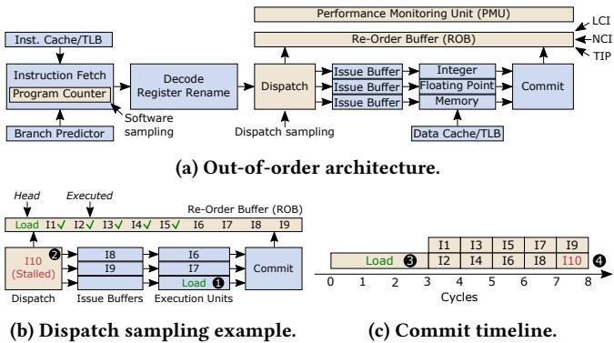

# TIP: Time-Proportional Instruction Profiling 图表详解

### Figure 1: Instruction-level profle error of state-of-the-art profilers compared to our Time-Proportional Instruction Profiler(TIP).Existing profilers are inaccurate due to lack of ILP support and systematic latency misattribution.

- 图片包含两个并列的柱状图，分别标记为 (a) Average error 和 (b) Imagick，用于对比不同性能分析器在指令级别上的错误率。
- 两个图表均以“Error”为纵轴，单位为百分比（%），范围从0%到60%；横轴列出五种分析器：Software、Dispatch、LCI、NCI 和 TIP。
- **图 (a) Average error** 展示了所有基准测试的平均错误率：
  - Software 分析器错误率最高，约为 **61.8%**。
  - Dispatch 分析器错误率为 **53.1%**。
  - LCI 分析器错误率为 **55.4%**。
  - NCI 分析器错误率为 **9.3%**。
  - TIP 分析器错误率最低，仅为 **1.6%**。
- **图 (b) Imagick** 展示了 SPEC CPU2017 基准测试 Imagick 的特定错误率：
  - Software 错误率仍最高，接近 **60%**。
  - Dispatch 错误率约为 **40%**。
  - LCI 错误率约为 **35%**。
  - NCI 错误率约为 **20%**。
  - TIP 错误率极低，几乎不可见，约为 **1.6%**。
- 从数据可见，TIP 在平均和特定场景下均显著优于现有分析器，其错误率仅为 NCI 的约六分之一。
- 所有现有分析器（Software、Dispatch、LCI、NCI）错误率较高，主要归因于 **缺乏 ILP 支持** 和 **系统性延迟归因错误**。
- TIP 的设计结合了 Oracle 分析器的时间归因策略与统计采样，从而在保持高精度的同时实现实际部署可行性。

### Figure 2: LCI, NCI and TIP sample instructions at commit whereas Dispatch(Software) samples at dispatch(fetch).Dispatch and Software are biased because (i) different instructions spend more time in some pipeline stages than others,and (i) the time an instruction spends at the head ofthe ROB directly impacts execution time.

- 图片标题为 Figure 2，旨在对比不同性能分析采样策略在处理器流水线中的采样位置及其带来的偏差。
- **核心结论**：LCI、NCI 和 TIP 在 **Commit 阶段**采样，而 Dispatch（及 Software）在 **Dispatch 或 Fetch 阶段**采样。后者因忽略指令在 ROB 中的阻塞时间，导致采样偏差。
- 图 (a) 展示了典型的 **Out-of-order 架构**流程：
  - 指令从 Inst. Cache/TLB 获取，经 Decode、Register Rename 后进入 Dispatch。
  - Dispatch 将指令分发至 Issue Buffer，再由 Execution Units 执行。
  - 最终指令按序提交至 Commit 阶段，同时更新 ROB。
  - PMU 可从 LCI、NCI、TIP 三种策略中选择采样点。
- 图 (b) 举例说明 **Dispatch 采样机制**：
  - Load 指令（I10）因数据未就绪，在 ROB 头部阻塞（Stalled），导致后续指令（如 I18, I19）无法被调度。
  - 此时 Dispatch 阶段因背压停滞，I10 被持续采样——尽管它并未真正“执行”，而是因等待资源被“卡住”。
  - 这种采样方式错误地将延迟归因于 I10，而非其根本原因（Load 依赖）。
- 图 (c) 展示 **Commit 时间线**：
  - 横轴为周期（Cycles），纵轴为指令编号。
  - Load 指令（I10）在第 3 周期才完成执行并提交，此前周期均处于阻塞状态。
  - 若在 Commit 阶段采样，则 Load 指令将在多个周期内被采样，真实反映其对执行时间的影响。
  - 若在 Dispatch 阶段采样，则可能在早期周期采样到 I10，造成误导性归因。
- 下表总结不同采样策略的特性：

| 采样策略 | 采样阶段 | 是否时间比例 | 主要偏差来源 |
|----------|----------|--------------|----------------|
| Software | Fetch    | ❌           | 中断延迟 + Skid，采样远离实际阻塞点 |
| Dispatch | Dispatch | ❌           | 指令在 Dispatch 阶段停留时间长 ≠ 实际执行耗时 |
| LCI      | Commit   | ❌           | 仅采样最后提交指令，忽略并行提交与阻塞指令 |
| NCI      | Commit   | ❌           | 采样下一提交指令，误将阻塞归因于后续指令 |
| TIP      | Commit   | ✅           | 精确归因每个周期给阻塞或并行提交的指令 |

- 关键术语保留英文：ROB（Re-Order Buffer）、LCI（Last Committed Instruction）、NCI（Next Committing Instruction）、PMU（Performance Monitoring Unit）、Dispatch、Commit。
- **视觉强调**：图中用数字标记关键事件（如① Load 提交、② I10 阻塞、③ Load 开始执行、④ Load 完成提交），强化因果关系。
- 该图直观揭示：**只有在 Commit 阶段采样，并正确处理 ILP 与阻塞归因，才能实现时间比例（time-proportional）的性能分析**。TIP 正是基于此原则设计。

### Figure 3: Oracle profiler clock cycle attribution overview.

- 图片展示了 Oracle Profiler 在每个时钟周期内如何对处理器状态进行分类并分配时间的逻辑流程图，其核心是基于 **ROB (Reorder Buffer)** 的状态判断。
- 流程始于“**Every clock cycle**”，首先判断“**One or more instructions in the ROB?**”：
  - 若为“**Yes**”，则进入下一判断：“**Committing one or more instructions?**”。
    - 若为“**Yes**”，则进入 **State 1: Computing**。在此状态下，该时钟周期的时间被**平均分配**给所有正在提交的指令（即 `1/n` 周期，其中 `n` 为提交的指令数）。
    - 若为“**No**”，则进入 **State 2: Stalled**。在此状态下，该时钟周期的时间被归因于**阻塞提交的指令**，即位于 ROB 头部的指令。
  - 若为“**No**”，则进入下一判断：“**Is the ROB empty due to a flush?**”。
    - 若为“**Yes**”，则进入 **State 3: Flushed**。在此状态下，该时钟周期的时间被归因于**导致流水线冲刷的指令**（例如，错误预测的分支指令）。
    - 若为“**No**”，则进入 **State 4: Drained**。在此状态下，该时钟周期的时间被归因于**清空 ROB 后第一个进入 ROB 的指令**，通常是由于前端停顿（如指令缓存未命中）造成的。

| 状态 | 条件 | 时间归因对象 |
| :--- | :--- | :--- |
| **State 1: Computing** | ROB 非空且正在提交指令 | **平均分配**给所有正在提交的指令 (`1/n`) |
| **State 2: Stalled** | ROB 非空但未提交指令 | **阻塞提交的指令**（ROB 头部指令） |
| **State 3: Flushed** | ROB 为空且由冲刷导致 | **导致冲刷的指令**（如错误预测的分支） |
| **State 4: Drained** | ROB 为空且非冲刷导致 | **清空后第一个进入 ROB 的指令** |

- 该图清晰地定义了 Oracle Profiler 的四个基本状态及其对应的时间归因策略，确保了其**时间比例性 (time-proportional)**，即每个时钟周期都精确地归因于当前处理器实际暴露延迟的指令或事件。
- 此设计是 Oracle Profiler 能够作为“黄金标准”的基础，因为它系统性地解决了现有分析器在处理 ILP、流水线停顿、冲刷和前端耗尽等问题上的归因错误。

### Figure4:Exampleillustrating theOracle,NC1,andLCIprofilersona2-wideout-of-orderprocessor.NCIandLCIfallhortbeuse they do not account for ILPat the commit stage and misattribute pipeline stall,flush and/ordrain latencies.

- 图片展示了在 **2-wide out-of-order processor** 上，**Oracle**、**NCI** 和 **LCI** 三种性能分析器在四种核心状态下的采样行为对比：**(a) Computing**、**(b) Stalled**、**(c) Flushed**、**(d) Drained**。
- 每个子图包含三部分：**ROB state**（重排序缓冲区状态随周期变化）、**Profile**（各分析器对指令的周期归因数值）、以及红色标注的错误说明。
(a) Computing 状态
- 处理器在每个周期提交两个指令（如 I1/I2, I3/I4...），处于正常计算状态。
- **Oracle** 正确将每个周期的 1 个时钟周期平均分配给两个提交指令（即每个指令 0.5 周期）。
- **NCI** 仅记录下一个提交指令（如周期1记录 I2），忽略另一个（I1），导致 **ILP 未被计入**。
- **LCI** 仅记录最后一个提交指令（如周期1记录 I1），同样忽略另一个（I2），也导致 **ILP 未被计入**。
- 表格总结：

| Cycle | Instruction | Oracle | NCI | LCI | Notes |
|-------|-------------|--------|-----|-----|-------|
| 1     | I1          | 0.5    | 0   | 1   | NCI 忽略 I1；LCI 忽略 I2 |
| 1     | I2          | 0.5    | 1   | 0   |       |
| 2     | I3          | 0.5    | 0   | 1   |       |
| 2     | I4          | 0.5    | 1   | 0   |       |
(b) Stalled 状态
- 周期2至41，处理器因 Load 指令未完成而停滞，仅在周期42恢复提交。
- **Oracle** 将40个停滞周期全部归因于阻塞提交的 Load 指令，并在周期42将0.5周期归因于 Load 和 I3。
- **NCI** 在周期42正确归因于 I3，但完全忽略 Load 的停滞贡献（归因0），**未能处理 ILP**。
- **LCI** 错误地将41个周期归因于 I1（最后提交指令），仅在周期42归因1周期给 Load，造成严重 **Stall misattribution**。
- 表格总结：

| Cycle Range | Instruction | Oracle | NCI | LCI | Notes |
|-------------|-------------|--------|-----|-----|-------|
| 2-41        | Load        | 40.5   | 0   | 1   | LCI 严重错误归因 |
| 42          | Load        | 0.5    | 0   | 0   |       |
| 42          | I3          | 0.5    | 1   | 0   | NCI 未处理 ILP |
(c) Flushed 状态
- 分支指令在周期1提交后被发现预测错误，导致后续指令（I3/I4）被清除（squashed），处理器空转至周期6才重新调度新指令。
- **Oracle** 将分支指令归因4.5周期（含其自身0.5 + 清除期间4周期），并归因1周期给 I5（首次调度指令）。
- **NCI** 完全忽略分支指令（归因0），并将清除期间的4周期归因于 I5（下一个提交指令），造成 **Flush misattribution**。
- **LCI** 正确归因分支指令4.5周期，但在周期6归因5周期给 I5，存在轻微偏差。
- 表格总结：

| Cycle | Instruction | Oracle | NCI | LCI | Notes |
|-------|-------------|--------|-----|-----|-------|
| 1     | Branch      | 4.5    | 0   | 4.5 | NCI 完全忽略分支 |
| 6     | I5          | 1      | 5   | 5   | NCI/LCI 过度归因 |
(d) Drained 状态
- 周期1提交 I1/I2 后，因指令缓存缺失导致 ROB 排空，直至周期42才重新调度 I3。
- **Oracle** 归因0.5周期给 I1/I2，41周期给 I3（含排空40周期 + 阻塞1周期）。
- **NCI** 正确归因 I3 41周期（下一个提交指令），表现良好。
- **LCI** 错误归因 I2 41周期（最后提交指令），完全忽略 I3，造成 **Drain misattribution**。
- 表格总结：

| Cycle | Instruction | Oracle | NCI | LCI | Notes |
|-------|-------------|--------|-----|-----|-------|
| 1     | I1          | 0.5    | 0   | 1   | LCI 错误归因给 I2 |
| 1     | I2          | 0.5    | 0   | 1   |       |
| 42    | I3          | 41     | 41  | 0   | LCI 完全忽略 I3 |

- 总体结论：**Oracle** 是唯一能准确归因所有周期的分析器，因为它考虑了 **ILP** 并正确处理 **Stall**、**Flush** 和 **Drain** 状态。**NCI** 和 **LCI** 因缺乏 ILP 支持和系统性归因错误，导致显著误差。

### Figure 5: Structural overview of our Time-Proportional Instruction Profiler (TIP). TIP is triggered by the PMU,collects a sample,and finally exposes the sample to software.

- 图片展示了 **Time-Proportional Instruction Profiler (TIP)** 的结构概览，其核心功能是响应 **PMU** 事件、采集样本并最终将样本暴露给软件层。
- TIP 位于 **PMU** 与 **CPU** 的 **ROB (Reorder Buffer)** 之间，通过紧密耦合 ROB 实现精确的指令级时间归因。
- **PMU** 模块包含两个关键寄存器：**Event** 和 **Cycle**。当满足采样条件时，**Event** 触发 TIP 开始工作，**Cycle** 记录当前周期数。
- **TIP** 模块由三个主要部分组成：
  - **OIR Update**：负责更新 **Offending Instruction Register (OIR)**，记录可能引发流水线刷新或异常的指令地址及标志。
  - **OIR**：存储最近提交或触发异常的指令信息，用于处理 ROB 为空（Flushed 或 Drained 状态）时的归因。
  - **Sample Selection**：根据当前处理器状态和 ROB 内容，选择正确的指令地址和状态标志进行采样。
- **CPU** 部分展示了 **ROB** 的结构，它由多个 **Bank** 组成，每个 Bank 可以存储一条指令。图中示例为 3 个 Bank，分别存储了 Inst.0 到 Inst.7。
- **ROB** 的状态由 **Bank Pointer** 和 **Column Pointer** 共同管理，用于定位 ROB 中最老的有效指令（即 Head of ROB）。
- **Sample Selection** 单元输出的样本数据存储在一组 **CSRs (Control Status Registers)** 中，包括：
  - **Cycle**：记录采样发生时的周期数。
  - **Flags**：记录采样时的状态标志，如 Stalled, Frontend, Exception, Flush, Mispredicted 等。
  - **Addr. 0, Addr. 1, ..., Addr. i**：存储被选中的指令地址，数量取决于处理器的提交宽度。
- **TIP Registers** 表格详细列出了所有 CSR 的内容及其含义：

| 寄存器名称 | 含义 |
|------------|------|
| Cycle      | 采样发生的周期数 |
| Flags      | 状态标志位集合 |
| Addr. 0    | 第一个被选中的指令地址 |
| Addr. 1    | 第二个被选中的指令地址 |
| ...        | ... |
| Addr. i    | 第 i 个被选中的指令地址 |

- **Valid** 标志位指示对应地址寄存器中的数据是否有效。
- **Oldest ID** 标志位指示哪个地址寄存器存储的是 ROB 中最老的指令地址。
- **Stalled** 标志位指示采样时处理器是否处于停滞状态。
- **Frontend** 标志位指示采样时 ROB 是否因前端停顿而为空。
- **Exception** 标志位指示采样时是否发生了异常。
- **Flush** 标志位指示采样时是否发生了流水线刷新。
- **Mispredicted** 标志位指示采样时是否发生了分支预测错误。
- 整个系统的工作流程是：**PMU** 触发采样 -> **TIP** 根据 ROB 状态和 OIR 信息选择样本 -> 将样本写入 **CSRs** -> 软件通过读取 CSRs 获取样本数据。
- 该设计确保了 TIP 能够实现 **time-proportional attribution**，即每个时钟周期都被准确归因到导致该周期延迟的指令上，从而提供高精度的性能分析。

### Figure 6: TIP sample selection logic.TIP classifies samples based on the the core state, ROB-flags,and OIR-flags.

- 图片展示了 **TIP sample selection logic** 的详细电路图，用于在处理器的 **ROB (Reorder Buffer)** 和 **OIR (Offending Instruction Register)** 之间进行采样选择。
- 该逻辑的核心功能是根据当前核心状态、ROB 标志和 OIR 标志对样本进行分类，并决定最终输出的地址和标志位。
- 输入信号包括来自 ROB 的多个条目（Address, Valid, Commits）以及 Bank Pointer，还有来自 OIR 的 Address、Exception、Flushes 和 Mispredicted 标志。
- 输出信号包括多个地址寄存器（Address 0 到 Address i）、Oldest ID、Valid 位、Stalled/Frontend 标志以及 Exception/Flush/Mispredicted 标志。

| 组件编号 | 功能描述 |
|----------|----------|
| 1        | 地址相关写使能控制，用于将 ROB 中的地址写入对应的 Address CSR。 |
| 2        | Oldest ID 寄存器，记录当前 ROB 中最老指令所在的 Bank ID。 |
| 3        | 多路选择器网络，用于在不同状态下选择正确的地址和有效位。 |
| 4        | Stalled 和 Frontend 标志生成逻辑，指示当前是否处于停滞或前端耗尽状态。 |
| 5        | 与门阵列，用于组合 ROB 条目的有效性和提交信号。 |
| 6        | 最终有效位生成逻辑，决定哪些地址寄存器应被标记为有效。 |
| 7        | 异或门和与门组合，用于处理 OIR 相关的异常、冲刷和预测错误标志。 |
| 8        | 标志写使能控制，用于更新 TIP 的状态标志寄存器。 |

- 当 ROB 不为空时，TIP 会复制头部 ROB 条目的地址到其地址寄存器中，并根据提交和有效信号设置相应的有效位。
- 如果所有头部 ROB 条目都无效，则 TIP 会使用 OIR 中的地址，并设置相应的异常、冲刷或预测错误标志。
- 在 ROB 耗尽的情况下，TIP 会立即设置 Frontend 标志，并在第一个指令调度时将其地址复制到相应的地址 CSR 中。
- 整个逻辑设计确保了 TIP 能够准确地根据 Oracle 的时间归因策略进行采样，同时保持硬件开销极低。
- 关键路径不位于 BOOM 核心的关键路径上，因此不会影响处理器性能；如有必要，可对其进行流水线化处理。

### Table 1: Simulated Configuration.

- 该图像为论文中的 **Table 1: Simulated Configuration**，详细列出了用于实验的模拟处理器架构与系统配置，是评估 TIP 与 Oracle 等性能分析器准确性的基础环境。

- 核心配置：
  - **Core**: 使用 **OoO BOOM**（Berkeley Out-of-Order Machine）核心，指令集为 **RV64IMAFDCSUX**，运行频率为 **3.2 GHz**。
  - **Front-end**: 前端支持 **8-wide fetch**，配备 **32-entry fetch buffer**、**4-wide decode**、**28 KB TAGE branch predictor**、**40-entry fetch target queue**，最多支持 **20 outstanding branches**。
  - **Execute**: 执行单元包含 **128-entry ROB**、**128 个整数/浮点物理寄存器**、**24-entry dual-issue MEM queue**、**40-entry 4-issue INT queue**、**32-entry dual-issue FP queue**，以及 **32-entry load/store queue**。
  - **LSU**: 加载存储单元配置为 **32 KB 8-way I-cache** 和 **32 KB 8-way D-cache**，均带 **8 MSHRs**，并启用 **next-line prefetcher from L2**。
  - **L2/LLC**: 二级缓存为 **512 KB 8-way**，带 **12 MSHRs**；最后一级缓存（LLC）为 **4 MB 8-way**，带 **8 MSHRs**。
  - **TLB**: 采用 **Page Table Walker**，**32-entry fully-assoc L1 D-TLB**、**32-entry fully-assoc L1 I-TLB**、**512-entry direct-mapped L2 TLB**。
  - **Memory**: 内存子系统为 **16 GB DDR3 FR-FCFS quad-rank**，最大带宽 **25.6 GB/s**，时序为 **14-14-14 (CAS-RCD-RP)** @ 1 GHz，支持 **8 queue depth** 和 **32 max reads/writes**。
  - **OS**: 操作系统为 **Buildroot, Linux 5.7.0**。

- 该配置代表一个典型的现代超标量乱序执行处理器，具备完整的前端、执行、缓存和内存子系统，确保了实验结果在真实硬件行为上的代表性。所有组件参数均精确设定，以支持对性能剖析器在不同场景下的误差量化分析。

### Figure 7: Normalized cycle stacks collected at commit.

- 图片展示了在 **commit** 阶段收集的归一化周期堆栈（Normalized cycle stacks），用于分析不同基准测试程序的执行时间分布。
- 每个柱状图代表一个 SPEC CPU2017 或 PARSEC 3.0 基准测试，按其主要性能瓶颈分类为三组：**Compute**、**Flush** 和 **Stall**。
- 堆栈从底部到顶部依次表示不同类型的周期开销：
  - **Execution**：指令提交阶段的正常执行周期。
  - **ALU stall**：算术逻辑单元（ALU）相关停顿。
  - **Load stall**：加载指令导致的停顿（如缓存未命中）。
  - **Store stall**：存储指令导致的停顿。
  - **Front-end**：前端停顿（如指令缓存或 TLB 未命中）。
  - **Mispredict**：分支预测错误导致的流水线冲刷。
  - **Misc. flush**：其他类型的流水线冲刷（如异常、同步指令等）。

| 基准测试 | 类别       | 主要开销特征                                                                 |
|----------|------------|------------------------------------------------------------------------------|
| x264     | Compute    | 执行周期占比高，少量前端和负载停顿                                           |
| namd     | Compute    | 执行周期为主，少量 ALU 和负载停顿                                            |
| leela    | Compute    | 执行周期占主导，少量负载和前端停顿                                           |
| imagick  | Flush      | 明显的 **Mispredict** 和 **Misc. flush** 占比高，执行周期次之                 |
| nab      | Flush      | **Mispredict** 和 **Misc. flush** 占比显著                                   |
| perlbench| Flush      | **Mispredict** 和 **Misc. flush** 占比较高                                   |
| fluidanimate| Flush   | **Mispredict** 和 **Misc. flush** 占比高                                     |
| blackscholes| Flush   | **Mispredict** 和 **Misc. flush** 占比高                                     |
| povray   | Flush      | **Mispredict** 和 **Misc. flush** 占比高                                     |
| bodytrack| Flush      | **Mispredict** 和 **Misc. flush** 占比高                                     |
| gcc      | Stall      | **Load stall** 和 **Front-end** 占比高                                       |
| canneal  | Stall      | **Load stall** 和 **Front-end** 占比高                                       |
| lbm      | Stall      | **Load stall** 占比极高，其次是 **ALU stall**                                |
| mcf      | Stall      | **Load stall** 和 **Front-end** 占比高                                       |
| fotonik3d| Stall      | **Load stall** 和 **Front-end** 占比高                                       |
| bwaves   | Stall      | **Load stall** 和 **Front-end** 占比高                                       |
| omnetpp  | Stall      | **Load stall** 和 **Front-end** 占比高                                       |
| roms     | Stall      | **Load stall** 和 **Front-end** 占比高                                       |
| streamcluster| Stall  | **Load stall** 和 **Front-end** 占比高                                       |
| xalancbmk| Stall      | **Load stall** 和 **Front-end** 占比高                                       |
| wrf      | Stall      | **Load stall** 和 **Front-end** 占比高                                       |
| parest   | Stall      | **Load stall** 和 **Front-end** 占比高                                       |
| cactuBSSN| Stall      | **Load stall** 和 **Front-end** 占比高                                       |

- **Compute** 类型基准测试（如 x264, namd, leela）主要消耗在指令执行上，表明其计算密集且流水线效率较高。
- **Flush** 类型基准测试（如 imagick, nab, perlbench）表现出较高的 **Mispredict** 和 **Misc. flush** 开销，说明其控制流复杂，分支预测失败频繁。
- **Stall** 类型基准测试（如 gcc, canneal, lbm）则以 **Load stall** 和 **Front-end** 为主要瓶颈，反映其内存访问密集或前端供给不足。
- 该图直观揭示了不同工作负载在处理器微架构层面的行为差异，为性能调优提供依据。例如，针对 **Flush** 类型应优化分支预测，而 **Stall** 类型则需关注内存子系统或指令预取策略。

### Figure8:Functio-elerorsfortederentprofs.-,NCI,ndecuateatthefuctioleliftar and Dispatch are largely inaccurate. Figure 9: Basic-block-levelerrorsforthe diferent profilers.(Softwareand Dispatcharenotshownbecauseoftheirhigherror TIP,TIP-ILP,and NCIare accurateat the basic block level, whereas LCI(and Softwareand Dispatch) arenot.

- 图片展示了不同性能分析器在**基本块级别**（Basic-block-level）的配置错误率，横轴按基准测试分类为 **Compute**、**Flush**、**Stall** 以及 **Average** 四组，纵轴为错误百分比（Error %），图例包含四种分析器：**LCI**、**NCI**、**TIP-ILP** 和 **TIP**。
- **TIP** 在所有类别中均表现最优，平均错误率最低，尤其在 **Stall** 类别中显著优于其他分析器，例如在 `lbm` 基准测试中，**TIP** 错误率接近 0%，而 **LCI** 高达 **56%**。
- **LCI** 在 **Stall** 类别中错误率极高，如 `lbm` 达到 **56%**，`streamcluster` 达到 **33%**，表明其在处理长延迟指令（如 LLC 缺失）时系统性地将时间归因于错误的基本块。
- **NCI** 表现稳定但不如 TIP，平均错误率约为 2.3%，在部分基准测试如 `gcc` 和 `xalancbmk` 中略高于 TIP-ILP。
- **TIP-ILP** 介于 NCI 与 TIP 之间，平均错误率为 1.2%，说明即使忽略 ILP（Instruction-Level Parallelism），其准确性仍优于传统方法。
- 下表总结各分析器在不同类别下的平均错误率：

| 分析器   | Compute 平均错误率 | Flush 平均错误率 | Stall 平均错误率 | Overall 平均错误率 |
|----------|---------------------|------------------|------------------|---------------------|
| LCI      | ~5%                 | ~8%              | ~25%             | **11.9%**           |
| NCI      | ~1%                 | ~2%              | ~4%              | **2.3%**            |
| TIP-ILP  | ~0.5%               | ~1%              | ~2%              | **1.2%**            |
| TIP      | ~0.3%               | ~0.5%            | ~0.8%            | **0.7%**            |

- **关键结论**：**TIP** 是唯一在基本块级别保持高准确性的分析器，**LCI** 因无法正确归因流水线停顿导致严重误差，**TIP-ILP** 和 **NCI** 虽可接受，但精度不及 TIP。该结果强化了细粒度分析对识别性能瓶颈的重要性。

### Figure 0:Instruction-levelerrorsforthe different profilers.(Software,Dispatch,andLCIareomitted becauseoftheirlarge errors.) TIP is the only accurate profiler at the instruction level.

- 图片展示了在指令级别上，三种不同性能分析器（NCI、TIP-ILP、TIP）的错误率对比，横轴按基准测试分类为 Compute、Flush、Stall 三类，以及总体平均值（Average），纵轴为错误率百分比。
- **TIP** 在所有类别中均表现出最低的错误率，是唯一在指令级别保持高精度的分析器，其平均错误率仅为 **1.6%**。
- **TIP-ILP** 虽然优于 NCI，但因未考虑指令级并行（ILP），在 Compute 类别中错误率显著上升，平均错误率为 **7.2%**。
- **NCI** 错误率最高，尤其在 Flush 类别中表现最差，平均错误率达 **9.3%**，说明其在处理流水线冲刷时存在系统性归因错误。
- 各类别的具体错误率数据如下表所示：

| 基准测试       | NCI 错误率 | TIP-ILP 错误率 | TIP 错误率 |
|----------------|------------|----------------|-----------|
| exchange2      | ~15%       | ~10%           | ~5%       |
| x264           | ~8%        | ~5%            | ~3%       |
| deepsjeng      | ~10%       | ~7%            | ~4%       |
| namd           | ~12%       | ~8%            | ~5%       |
| leela          | ~14%       | ~9%            | ~6%       |
| swaptions      | ~10%       | ~6%            | ~4%       |
| imagick        | ~18%       | ~10%           | ~6%       |
| nab            | ~12%       | ~8%            | ~5%       |
| perlbench      | ~14%       | ~9%            | ~6%       |
| fluidanimate   | ~10%       | ~7%            | ~4%       |
| blackscholes   | ~10%       | ~6%            | ~4%       |
| povray         | ~10%       | ~6%            | ~4%       |
| bodytrack      | ~10%       | ~6%            | ~4%       |
| gcc            | ~10%       | ~7%            | ~5%       |
| canneal        | ~5%        | ~4%            | ~2%       |
| lbm            | ~5%        | ~4%            | ~2%       |
| mcf            | ~5%        | ~4%            | ~2%       |
| fotonik3d      | ~5%        | ~4%            | ~2%       |
| bwaves         | ~5%        | ~4%            | ~2%       |
| omnetpp        | ~5%        | ~4%            | ~2%       |
| roms           | ~5%        | ~4%            | ~2%       |
| streamcluster  | ~10%       | ~7%            | ~4%       |
| xalancbmk      | ~5%        | ~4%            | ~2%       |
| wrf            | ~5%        | ~4%            | ~2%       |
| parest         | ~5%        | ~4%            | ~2%       |
| cam4           | ~5%        | ~4%            | ~2%       |
| cactuBSSN      | ~5%        | ~4%            | ~2%       |
| Compute 平均   | ~10%       | ~7%            | ~4%       |
| Flush 平均     | ~14%       | ~9%            | ~6%       |
| Stall 平均     | ~6%        | ~5%            | ~3%       |
| All 平均       | **9.3%**   | **7.2%**       | **1.6%**  |

- 图表右下角的 “All” 柱状图清晰显示：**TIP 的平均错误率远低于 NCI 和 TIP-ILP**，验证了其在指令级归因上的优越性。
- 该图省略了 Software、Dispatch 和 LCI 分析器，因其错误率过高（分别达 61.8%、53.1%、55.4%），无法在相同尺度下有效比较。

### Figure:Sensitivityanalyses.(a)T'sacuracycontinuestomeasurablyimprovebeyond4KHzunliketheotherproflers.(b)Perdic samplingisonlyslightlymoreinacuratethanrandomsamplingwhilebeingsimplertoimplementinhardware.(c)MakingNCIcommitparallelism-aware increases profile error,in contrast to TIP.

- 图片展示了三个子图，分别对应论文中关于 TIP 与现有 Profiler 的敏感性分析结果，旨在验证 TIP 在不同采样策略和设计变体下的表现。
- 子图 (a) 聚焦于**采样频率对误差的影响**。横轴为三种 Profiler：NCI、TIP-ILP 和 TIP；纵轴为 Profile Error（百分比）。不同颜色柱状图代表从 100 Hz 到 20 kHz 的采样频率。结果显示：
  - **TIP 的误差随采样频率提升持续下降**，尤其在 4 kHz 以上仍显著改善，例如 gcc 在 4 kHz 时误差为 5.0%，在 20 kHz 时降至 2.6%。
  - NCI 和 TIP-ILP 在 4 kHz 后误差趋于饱和，表明其无法从更高采样率中获益。
  - 此现象归因于 TIP 对 ILP 的正确处理——它将高并行提交周期的样本按比例分配给多个指令，而其他方法仅归因于单个指令。

- 子图 (b) 比较**周期性采样与随机采样的误差差异**。横轴列出 27 个 SPEC CPU2017 和 PARSEC 基准测试程序，并按执行特征分为 Compute、Flush、Stall 三类，最后是平均值。深色柱为周期性采样，浅色柱为随机采样。关键发现包括：
  - 大多数基准测试中，两种采样方式误差接近，**平均误差从周期性的 1.6% 降至随机的 1.1%**。
  - 少数 Stall-intensive 基准如 streamcluster、lbm、fotonik3d 显示更明显差异，因其具有重复性时间行为，易受周期采样偏差影响。
  - 论文指出，尽管随机采样略优，但硬件实现更复杂，故推荐使用周期性采样。

- 子图 (c) 展示**引入并行感知机制后 NCI 的误差变化**。采用箱线图形式，比较四种配置：NCI+ILP、NCI、TIP-ILP、TIP。数据显示：
  - **NCI+ILP 的平均误差高达 19.3%**，远高于原始 NCI 的 9.3%，也高于 TIP-ILP 的 7.2% 和 TIP 的 1.6%。
  - 误差上升的原因在于：NCI+ILP 在长延迟停顿（如 LLC miss）后错误地将样本均分给即将提交的 n 条指令，而非像 TIP 那样归因于导致停顿的指令本身。
  - 这一结果强调：**仅添加 ILP 支持不足以提升准确性，必须建立在正确的时序归因原则之上**，这正是 TIP 的核心优势。

| Profiler          | Avg Error (%) | Key Insight                                      |
|-------------------|---------------|--------------------------------------------------|
| NCI               | 9.3           | 未考虑 ILP，且错误归因 flush/stall              |
| TIP-ILP           | 7.2           | 正确归因 flush，但忽略 ILP 导致偏置             |
| TIP               | 1.6           | 同时支持 ILP 与正确时序归因，误差最低           |
| NCI+ILP           | 19.3          | 引入 ILP 但无正确归因逻辑，误差反而恶化         |

- 总结：该图通过三组实验有力支撑了论文核心主张——**TIP 的准确性源于其“时间比例归因”原则与 ILP 意识的结合**，而现有方法即使尝试改进（如增加 ILP 支持），若缺乏根本性归因机制，反而会加剧误差。

### Figure 12:Function and instruction-level profiles for lmagick for TIP and NCI compared to Oracle.

- 图片展示了在 SPEC CPU2017 基准测试程序 **Imagick** 中，针对 **ceil** 函数的性能剖析结果，对比了三种剖析器：**Oracle**（黄金标准）、**TIP**（本文提出）和 **NCI**（Intel PEBS 使用的启发式方法）。
- 分析分为两个层级：**函数级**（Function-Level Profile）和**指令级**（Instruction-Level Profile），旨在揭示不同剖析器在定位性能瓶颈时的准确性差异。
函数级剖析（图①）
- 此部分显示了 **Imagick** 应用中几个最热函数所占的运行时间百分比。
- 三个剖析器的结果高度一致，表明在函数粒度上，它们都能准确反映整体性能分布。
- 关键数据如下：

| 函数名       | Oracle (%) | TIP (%) | NCI (%) |
|--------------|------------|---------|---------|
| MeanSh..     | 25.25%     | 25.25%  | 25.16%  |
| floor        | 21.90%     | 21.95%  | 21.95%  |
| ceil         | 21.57%     | 21.63%  | 21.63%  |
| Morpho..     | 18.53%     | 18.56%  | 18.56%  |

- 结论：所有剖析器在函数级均表现良好，误差极小（平均约 0.3%-0.6%），无法帮助开发者识别具体性能问题。
指令级剖析（图②、③）
- 此部分深入到 **ceil** 函数内部，展示各指令所占该函数内执行时间的百分比。
- **Oracle** 和 **TIP** 的结果高度吻合，而 **NCI** 则出现显著偏差，尤其在关键指令上。
ceil 函数入口处指令（图②）
- **frflags** 和 **fsflags** 是浮点状态寄存器操作指令，用于屏蔽函数内的状态变更。
- **Oracle** 和 **TIP** 均正确指出这些指令消耗了约 **24.99%** 和 **24.91%** 的函数时间。
- **NCI** 却将大部分时间错误归因于后续指令 **feq.d**（28.80%），而低估了 **frflags/fsflags**（仅 11.51%/11.53%）。
- 这种错误归因会导致开发者误判为浮点比较单元（feq.d）或返回地址预测器（ret）是瓶颈。
ceil 函数出口处指令（图③）
- 在函数末尾，**ret** 指令的时间归因也存在巨大差异。
- **Oracle** 和 **TIP** 均将其归因为 **9.61%** 和 **9.63%**。
- **NCI** 则错误地将其归因为 **23.09%**，几乎翻倍。
- 这进一步说明 **NCI** 在处理流水线刷新（如由 frflags/fsflags 引发）后，会错误地将延迟归因给“下一个提交指令”。
核心发现
- **TIP** 能够精确识别出 **frflags** 和 **fsflags** 是性能瓶颈，而 **NCI** 会误导开发者关注错误的指令。
- 实际优化中，移除这些不必要的状态寄存器操作（替换为 nop），可带来 **1.93×** 的性能提升，验证了 **TIP** 的实用价值。
- 该案例凸显了**指令级剖析精度的重要性**：函数级剖析无法定位问题，而低精度的指令级剖析（如 NCI）会提供错误指引。

### Figure 13: Time breakdown for the four most runtimeintensive functions in lmagick comparing the original to our optimized version.The 1.93x speed-up is primarily due improved processor utilization.

- 图片展示了 SPEC CPU2017 基准测试 **Imagick** 中四个最耗时函数（MeanShiftImage、floor、ceil、MorphologyApply）在原始版本（Orig.）与优化版本（Opt.）下的时间分解对比，旨在说明 **TIP** 识别出的性能瓶颈及其优化效果。
- 该图采用堆叠柱状图形式，纵轴为执行时间（秒），横轴为函数名称。每个柱子按不同性能事件类型分层着色，右侧图例标明了各颜色对应的具体事件。
- **关键发现**：优化版本整体执行时间显著缩短，尤其在 **floor** 和 **ceil** 函数中表现最为突出，这直接验证了 TIP 指出的 **frflags/fsflags** 指令导致频繁 **Misc. flush** 是性能瓶颈。
- 优化后，**Misc. flush** 类别在 floor 和 ceil 中几乎消失，表明移除不必要的浮点状态寄存器操作有效消除了流水线冲刷开销。
- 在 **MeanShiftImage** 函数中，虽然未直接修改其代码，但因调用的 **ceil** 和 **floor** 被优化，其执行时间也大幅下降（从约 300s 降至 200s），体现了优化的**级联效应**。
- **ALU stall** 和 **Load stall** 在优化后也有所减少，说明处理器能更有效地隐藏延迟，**IPC** 从 1.2 提升至 2.3，进一步提升了整体效率。
- 下表总结了各函数在优化前后的执行时间变化：

| 函数名          | 原始版本时间 (s) | 优化版本时间 (s) | 时间减少比例 |
|-----------------|------------------|------------------|--------------|
| MeanShiftImage  | ~300             | ~200             | ~33%         |
| floor           | ~250             | ~50              | ~80%         |
| ceil            | ~200             | ~50              | ~75%         |
| MorphologyApply | ~200             | ~200             | 无明显变化   |

- 总体而言，该图直观证明了 **TIP** 的准确性——它不仅定位到具体指令级问题，还揭示了其对系统级性能的深远影响，最终实现了 **1.93×** 的整体性能提升。

