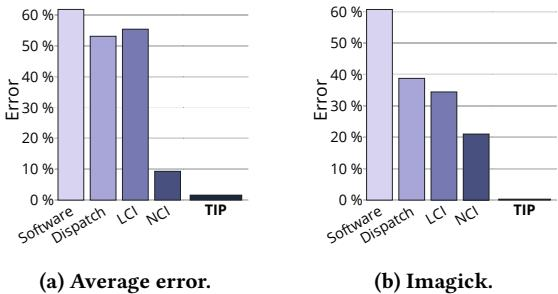

# TIP: Time-Proportional Instruction Profiling 论文解析

## 0. 论文基本信息

**作者 (Authors)**

- Bjorn Gottschall
- Lieven Eeckhout
- Magnus Jahre

**发表期刊/会议 (Journal/Conference)**

- MICRO-54: 54th Annual IEEE/ACM International Symposium on Microarchitecture (MICRO '21)

**发表年份 (Publication Year)**

- 2021

______________________________________________________________________

## 1. 摘要

**目的**

- 解决现代高性能处理器上性能分析的难题，即现有性能剖析器（profilers）无法**可靠地将执行时间归因于正确的指令**。
- 为性能剖析领域建立一个**黄金标准（golden reference）**，以量化现有剖析技术的误差。
- 提出一种新的、**高度准确且可实际部署**的指令级性能剖析方法。

**方法**

- **提出 Oracle 剖析器**：作为理论上的黄金标准，它通过\*\*时间比例归因（time-proportional attribution）\*\*原则，将每个时钟周期精确地归因于处理器暴露其延迟的指令。Oracle 考虑了四种核心状态：计算（Computing）、停滞（Stalled）、刷新（Flushed）和排空（Drained）。
- **量化现有剖析器的误差**：利用 Oracle 作为基准，评估了四种主流剖析策略：
    - **Software-level profiling** (如 Linux perf)
    - **Dispatch-tagging** (如 AMD IBS, Arm SPE)
    - **Last-Committing Instruction (LCI)**
    - **Next-Committing Instruction (NCI)** (如 Intel PEBS)
- **设计并实现 TIP (Time-Proportional Instruction Profiling)**：将 Oracle 的时间归因策略与**统计采样**相结合，在保持高精度的同时，将数据量从 Oracle 的 **179 GB/s** 降低到实用的 **192 KB/s**。
- **实验验证**：在 **Berkeley Out-of-Order Machine (BOOM)** 核心上实现了 TIP，并使用 **FireSim** 全系统模拟器对 **SPEC CPU2017** 和 **PARSEC** 基准测试套件进行了完整模拟，以评估其准确性。

*Figure 3: Oracle profiler clock cycle attribution overview.*

**结果**

- **现有剖析器存在显著系统性误差**，其根本原因在于它们不是时间比例的，既不考虑**指令级并行（ILP）**，又会**系统性地错误归因延迟**。
- **指令级剖析误差对比**如下表所示：

| 剖析器类型         | 平均指令级误差 |
| :----------------- | :------------- |
| Software           | **61.8%**      |
| Dispatch-tagging   | **53.1%**      |
| LCI                | **55.4%**      |
| NCI                | **9.3%**       |
| **TIP (本文提出)** | **1.6%**       |

- TIP 的精度远超现有技术，将平均误差分别降低了 **5.8× (vs NCI)**、**34.6× (vs LCI)**、**33.2× (vs Dispatch)** 和 **38.6× (vs Software)**。
- **案例研究**：在 SPEC CPU2017 的 **Imagick** 基准测试中，TIP 成功定位了由 **Control Status Register (CSR)** 指令引起的性能瓶颈，而 NCI 则错误地将时间归因于后续指令。
    - 通过将不必要的 CSR 指令替换为 `nop`，程序性能获得了 **1.93×** 的显著提升，这证明了 TIP 在实践中发现关键优化机会的能力。

*Figure 12:Function and instruction-level profiles for lmagick for TIP and NCI compared to Oracle.*

**结论**

- 现有硬件性能剖析器（包括最先进的 NCI）由于缺乏时间比例归因，在指令级粒度上存在**不可忽视的系统性误差**。
- **TIP** 通过结合 Oracle 的精确归因逻辑与统计采样，成功实现了**高精度**（平均误差仅 **1.6%**）与**实用性**的统一。
- TIP 的高精度对于指导开发者进行深层次的性能优化至关重要，能够揭示函数级或基本块级剖析无法发现的、由特定指令引发的性能问题，从而带来显著的实际性能收益。

______________________________________________________________________

## 2. 背景知识与核心贡献

**研究背景与动机**

- 现代高性能处理器采用高度并行的执行模型，使得将执行时间准确地归因于具体的指令变得极其困难。
- 传统的 **Software-level profiling**（如 Linux perf）存在严重的 **skid** 问题，即采样点与实际造成性能瓶颈的指令相距甚远。
- 现有的硬件辅助性能分析器（如 Intel **PEBS**、AMD **IBS**、Arm **SPE**）虽然通过在特定流水线阶段（如 Dispatch 或 Commit）采样来缓解 skid，但缺乏一个“黄金标准”来衡量其准确性。
- 作者指出，这些现有方法的根本缺陷在于它们不是 **time-proportional**（时间比例）的，即未能将每个时钟周期正确地归因于处理器暴露其延迟的指令。这导致了系统性的错误归因，例如：
    - 无法正确处理 **ILP**（Instruction-Level Parallelism），将并行提交的多条指令的执行时间错误地只归于其中一条。
    - 在处理器因长延迟操作（如缓存未命中）或 **pipeline flush**（流水线冲刷）而停顿时，错误地将时间归因于非根本原因的指令。

*Figure 1: Instruction-level profle error of state-of-the-art profilers compared to our Time-Proportional Instruction Profiler(TIP).Existing profilers are inaccurate due to lack of ILP support and systematic latency misattribution.*

**核心贡献**

- **提出了 Oracle profiler**：作为性能分析的 **golden reference**（黄金标准）。Oracle 通过在 **commit stage**（提交阶段）对每个时钟周期进行精确归因，确保了 **time-proportional attribution**。它定义了四种核心状态（Computing, Stalled, Flushed, Drained）来处理各种执行场景。
- **首次量化了现有分析器的误差**：利用 Oracle 作为基准，论文首次系统地评估了主流分析器的指令级精度，结果如下：

| Profiler Type    | Heuristic                                | Avg. Instruction-Level Error |
| :--------------- | :--------------------------------------- | :--------------------------- |
| Software         | Interrupt-based                          | **61.8%**                    |
| Dispatch-tagging | AMD IBS / Arm SPE                        | **53.1%**                    |
| LCI              | Last-Committing Instruction              | **55.4%**                    |
| NCI              | Next-Committing Instruction (Intel PEBS) | **9.3%**                     |

- \*\*提出了 TIP \*\*(Time-Proportional Instruction Profiling)：一种兼具高精度和实用性的新分析器。TIP 的核心思想是将 Oracle 的时间归因策略与 **statistical sampling**（统计采样）相结合。
    - TIP 能够正确处理 **ILP**，在多指令并行提交时将时间均分。
    - TIP 能够正确归因由 **stall**、**flush** 和 **drain** 引起的延迟到根本原因指令。
    - 实验表明，TIP 的平均指令级误差仅为 **1.6%**（最大 5.0%），远优于最先进的 NCI（9.3%）。
- **通过实际案例验证了 TIP 的价值**：在 SPEC CPU2017 的 **Imagick** 基准测试中，TIP 成功定位到因不必要的 \*\*Control Status Register \*\*(CSR) 操作导致的频繁流水线冲刷问题。通过优化（替换为 nop），性能提升了 **1.93×**，而 NCI 的分析结果则具有误导性。

*Figure 12:Function and instruction-level profiles for lmagick for TIP and NCI compared to Oracle.*

______________________________________________________________________

## 3. 核心技术和实现细节

### 0. 技术架构概览

**整体技术架构**

本文提出了一套完整的性能分析框架，其核心目标是实现**时间比例指令剖析 (Time-Proportional Instruction Profiling, TIP)**。该框架由一个理论上的黄金标准和一个可实际部署的剖析器构成。

- **Oracle Profiler (黄金标准)**
    - 这是一个**不可实际部署**但概念上完美的剖析器，用于为所有其他剖析技术提供准确度评估的基准。
    - 其核心原则是**时间比例归因 (time-proportional attribution)**：将执行过程中的**每一个时钟周期**都精确地归因于处理器在该周期内所暴露延迟的指令。
    - Oracle 通过监控处理器的 **Reorder Buffer (ROB)** 提交阶段来工作，并根据 ROB 的状态将每个周期划分为四种基本状态进行归因：
        - **Computing (计算中)**: 处理器正在提交指令。Oracle 将该周期平均分配给所有在该周期提交的指令（例如，在一个2-wide提交的处理器中，每个提交的指令获得0.5个周期）。
        - **Stalled (停滞)**: ROB 非空但无法提交，因为队首指令尚未执行完毕。Oracle 将整个周期归因于 ROB 队首的指令。
        - **Flushed (已冲刷)**: ROB 因错误预测（如分支预测错误）而变空。Oracle 将冲刷后 ROB 为空的周期归因于导致冲刷的指令（如错误预测的分支）。
        - **Drained (已排空)**: ROB 因前端停顿（如指令缓存未命中）而变空。Oracle 将排空期间的周期归因于第一个重新填充 ROB 的指令。
    - 

*Figure 3: Oracle profiler clock cycle attribution overview.*

- **TIP (Time-Proportional Instruction Profiler)**
    - TIP 是一个**可实际部署**的硬件剖析器，它将 Oracle 的时间归因策略与**统计采样 (statistical sampling)** 相结合，在保持高精度的同时大幅降低了数据开销。
    - TIP 的硬件架构位于 **Performance Monitoring Unit (PMU)** 和 **ROB** 之间，主要包含两个功能单元：
        - **Offending Instruction Register (OIR)**: 持续追踪最后一个提交的指令或导致异常/冲刷的指令。
        - **Sample Selection Unit**: 根据当前处理器核心的状态（通过检查 ROB 和 OIR 的标志位）来决定采样哪个或哪些指令。
    - 

*Figure 5: Structural overview of our Time-Proportional Instruction Profiler (TIP). TIP is triggered by the PMU,collects a sample,and finally exposes the sample to software.*

-

*Figure 6: TIP sample selection logic.TIP classifies samples based on the the core state, ROB-flags,and OIR-flags.*

- TIP 的采样逻辑严格遵循 Oracle 的四种状态分类：
    - 在 **Computing** 状态下，采样所有在该周期提交的指令。
    - 在 **Stalled** 状态下，采样 ROB 队首的指令。
    - 在 **Flushed/Drained** 状态下（ROB 为空），从 OIR 中采样相应的“罪魁祸首”指令。
- 软件层面（如 Linux `perf`）通过读取 TIP 暴露的 **Control and Status Registers (CSRs)** 来收集样本。后处理程序会根据样本中的指令数量（n）将采样间隔的周期数平均分配（1/n）给每个被采样的指令地址，从而构建出最终的性能剖析文件。

______________________________________________________________________

**关键创新与对比**

- **与现有剖析器的根本区别**：现有剖析器（如 Intel PEBS 的 **NCI**, Arm CoreSight 的 **LCI**, AMD IBS 的 **Dispatch-tagging**）均不满足时间比例归因原则，主要问题在于：
    - **缺乏 ILP (Instruction-Level Parallelism) 支持**：在多指令并行提交时，只归因于单个指令，造成系统性偏差。
    - **系统性延迟误归因**：例如，NCI 会将分支预测错误后的冲刷延迟归因于下一个提交的指令，而非错误的分支本身。
- **TIP 的优势**：通过同时解决 ILP 归因和系统性误归因问题，TIP 实现了远超现有技术的精度。

*Figure4:Exampleillustrating theOracle,NC1,andLCIprofilersona2-wideout-of-orderprocessor.NCIandLCIfallhortbeuse they do not account for ILPat the commit stage and misattribute pipeline stall,flush and/ordrain latencies.*

______________________________________________________________________

**实验验证与性能开销**

- **实验平台**：在 **Berkeley Out-of-Order Machine (BOOM)** RISC-V 核心上实现，并使用 **FireSim** FPGA 加速仿真器进行全系统评估。
- **精度结果**：在 SPEC CPU2017 和 PARSEC 基准测试集上，TIP 的**平均指令级剖析误差仅为 1.6%**，远低于 NCI (9.3%)、LCI (55.4%) 和 Dispatch (53.1%)。
- **硬件开销**：极其轻量，仅需约 **57 字节** 的额外存储（用于 OIR 和 CSRs）和少量组合逻辑，不在关键路径上。
- **数据速率**：在 4KHz 采样频率下，数据生成速率为 **352 KB/s**，相比 NCI 的 224 KB/s 仅有轻微增加，且带来的性能开销可忽略不计（约 1.1%）。

### 1. Oracle Profiler

**Oracle Profiler 的设计原理与核心机制**

- Oracle Profiler 被提出作为性能分析领域的 **黄金参考 (golden reference)**，其核心目标是实现 **时间比例归因 (time-proportional attribution)**。
- 其根本原则是：**每一个时钟周期**都必须被精确地归因于在该周期内 **处理器所暴露延迟 (exposes the latency of)** 的指令。
- 该设计聚焦于处理器的 **提交阶段 (commit stage)**，因为这是每条指令的延迟成本最终被解决并对外可见的地方。当指令无法被完全隐藏其执行延迟时，它会阻塞 **重排序缓冲区 (ROB)** 的头部，从而直接贡献于程序的总执行时间。

**算法流程与四种核心状态**

Oracle Profiler 通过监控每个时钟周期中 ROB 和处理器的状态，将其划分为四种互斥状态，并据此进行周期归因：

- **状态1: Computing (计算中)**

    - **条件**: ROB 非空，且处理器在该周期成功提交了 n 条指令。
    - **归因策略**: 将 **1/n 个时钟周期** 归因于每一条提交的指令。
    - **目的**: 正确处理 **指令级并行 (ILP)**，确保并行提交的指令公平地分担该周期的时间成本。

- **状态2: Stalled (停滞)**

    - **条件**: ROB 非空，但处理器在该周期未能提交任何指令（通常是因为 ROB 头部的指令尚未执行完毕）。
    - **归因策略**: 将 **整个时钟周期** 归因于 **ROB 头部的指令**，因为正是这条指令阻塞了提交流水线。
    - **目的**: 精确捕获由长延迟操作（如缓存未命中）引起的性能瓶颈。

- **状态3: Flushed (冲刷)**

    - **条件**: ROB 为空，原因是发生了 **推测错误 (misspeculation)**（如分支预测错误、内存顺序违规）或 **异常 (exception)**。
    - **归因策略**:
        - 对于推测错误，将 ROB 为空期间的所有周期归因于 **引发冲刷的指令**（如预测错误的分支）。
        - 对于异常，将从异常触发到操作系统异常处理程序第一条指令被调度之间的所有周期，归因于 **引发异常的指令**。
    - **目的**: 解决现有分析器（如 NCI）将冲刷后的空闲周期错误归因于后续指令的问题。

- **状态4: Drained (排空)**

    - **条件**: ROB 为空，原因是 **前端停顿 (front-end stall)**（如指令缓存或 iTLB 未命中），而非推测错误。
    - **归因策略**: 将 ROB 为空期间的所有周期，归因于 **在停顿结束后第一条进入 ROB 的指令**。因为正是这条指令的缺失导致了前端停顿。
    - **目的**: 区分由后端资源争用和前端供给不足导致的性能损失。

*Figure 3: Oracle profiler clock cycle attribution overview.*

**与现有启发式方法的对比**

*Figure4:Exampleillustrating theOracle,NC1,andLCIprofilersona2-wideout-of-orderprocessor.NCIandLCIfallhortbeuse they do not account for ILPat the commit stage and misattribute pipeline stall,flush and/ordrain latencies.*

- **NCI (Next-Committing Instruction)**:

    - 在 **Flushed** 状态下，会将空闲周期错误地归因于下一条将要提交的指令，而非引发冲刷的罪魁祸首。
    - 在 **Computing** 状态下，只选择一条指令进行归因，忽略了 ILP，导致归因偏差。

- **LCI (Last-Committed Instruction)**:

    - 在 **Stalled** 状态下，会持续将周期归因于上一条已提交的指令，而非当前阻塞 ROB 头部的指令。
    - 在 **Drained** 状态下，同样会错误地归因于最后提交的指令。

- **Dispatch-tagging (如 AMD IBS)**:

    - 在指令 **分发 (dispatch)** 阶段进行采样，而非提交阶段。这会导致指令因后端阻塞而堆积在分发队列时被过度采样，无法反映其对执行时间的真实影响。

**输入、输出及在整体研究中的作用**

- **输入**: 完整的、周期级的处理器微架构状态信息，包括 ROB 中每条指令的状态（有效、提交、异常、冲刷、预测错误等）、ROB 头尾指针以及前端状态。
- **输出**: 一个理想的、无误差的性能剖析文件，其中 **每一个动态指令** 都被精确地分配了其应得的执行时间（以时钟周期为单位）。
- **在整体研究中的作用**:
    - **提供评估基准**: Oracle 是衡量所有其他实际性能分析器（如 TIP, NCI, LCI）准确性的唯一可靠标准。
    - **量化现有方法的误差**: 通过与 Oracle 对比，论文首次量化了主流分析器的系统性误差，例如 NCI 平均误差为 **9.3%**，而软件分析高达 **61.8%**。
    - **指导新方法设计**: TIP 的设计直接继承了 Oracle 的时间归因策略，证明了其理论正确性。Oracle 揭示的问题（缺乏 ILP 支持、系统性延迟误归因）正是 TIP 旨在解决的核心痛点。

### 2. Time-Proportional Instruction Profiling (TIP)

**TIP的核心设计思想**

- TIP旨在解决现有硬件性能分析器（如Intel PEBS的NCI、AMD IBS的Dispatch-tagging等）因**非时间比例归因 (non-time-proportional attribution)** 而导致的系统性误差。
- 其核心是将**Oracle profiler**的理想化、精确到每个时钟周期的时间归因策略，与**统计采样 (statistical sampling)** 相结合，从而在保持极高精度的同时，将数据开销从Oracle的**179 GB/s**降低到实用的**192 KB/s**（在4KHz采样率下）。

**Oracle Profiler的时间归因策略详解**

Oracle作为黄金标准，其时间归因基于处理器Commit阶段的四种状态，确保每个时钟周期都被正确地归因于造成该周期延迟的指令。

- **State 1: Computing (计算状态)**

    - 当处理器在一个周期内提交 `n` 条指令时，Oracle将该周期平均分配，即每条指令获得 `1/n` 个周期。
    - 这种方式正确地处理了**指令级并行 (ILP)**，避免了像NCI/LCI那样只将整个周期归因于单条指令的偏差。

- **State 2: Stalled (停顿状态)**

    - 当ROB（Reorder Buffer）非空但无法提交指令时，说明ROB头部的指令尚未执行完毕，导致流水线停顿。
    - Oracle将该周期**全部归因于ROB头部的指令**，因为正是这条指令的长延迟（如缓存未命中）阻塞了后续提交。

- **State 3: Flushed (冲刷状态)**

    - 当ROB因错误预测（如分支预测错误）或异常而被清空时，处理器会有一段空闲期。
    - Oracle将这段空闲期的所有周期**归因于引发冲刷的那条指令**（如错误预测的分支指令）。

- **State 4: Drained (排空状态)**

    - 当ROB因前端停顿（如指令缓存未命中）而被排空时，处理器同样会空闲。
    - Oracle将这段空闲期的所有周期**归因于第一个因前端停顿而未能及时进入ROB的指令**。

*Figure 3: Oracle profiler clock cycle attribution overview.*

**TIP的实现原理与算法流程**

TIP通过硬件单元实现了Oracle策略的采样版本，其结构位于**Performance Monitoring Unit (PMU)** 和 **ROB** 之间。

- **核心硬件组件**:

    - **Offending Instruction Register (OIR)**: 持续追踪最后一个提交的指令（用于Flush/Drain状态）和最后一个触发异常的指令。
    - **Sample Selection Unit**: 根据当前处理器状态，决定采样哪些指令地址及其有效位。

- **采样逻辑流程**:

    - **当ROB非空时**:
        - TIP复制ROB头部（最多`b`条，`b`为提交宽度）的指令地址。
        - 如果当前周期有指令提交（Computing状态），则所有提交的指令地址均有效。
        - 如果当前周期无指令提交（Stalled状态），则只有ROB最老的那条指令地址有效。
    - **当ROB为空时**:
        - TIP从OIR中读取地址。根据OIR中的标志位（如`Exception`, `Flush`, `Mispredicted`），判断是Flush状态还是Drain状态。
        - 对于Drain状态，TIP会等待第一条新指令被分发，并将其地址作为采样目标。

*Figure 5: Structural overview of our Time-Proportional Instruction Profiler (TIP). TIP is triggered by the PMU,collects a sample,and finally exposes the sample to software.*

*Figure 6: TIP sample selection logic.TIP classifies samples based on the the core state, ROB-flags,and OIR-flags.*

**参数设置与硬件开销**

- **采样频率**: 默认采用Linux perf的**4 KHz**，这是一个业界通用的平衡点。
- **硬件存储开销**: 在一个4-wide的BOOM核心上，TIP仅需**57字节**的额外存储。
    - OIR: 64-bit地址 + 3-bit标志 = 9字节。
    - CSRs (Control and Status Registers): 包含cycle计数器、flags和4个地址寄存器，共48字节。
- **性能开销**: 由于采样数据量略大（88字节/样本 vs PEBS默认56字节/样本），在Intel Core i7-4770上的实测运行时开销仅为**1.1%**，与关闭分析器相比几乎可以忽略。

**输入输出关系及在性能分析中的作用**

- **输入**:
    - 来自PMU的周期性采样触发信号。
    - 来自ROB的头部指令地址、提交/有效信号、以及异常/冲刷等标志位。
- **输出**:
    - 一组CSRs，包含采样的指令地址（最多`b`个）、周期计数器、以及描述当前状态的标志位（如`Stalled`, `Flush`等）。
- **在整体性能分析流程中的作用**:
    - TIP的硬件单元负责在每个采样点**精确捕获**符合Oracle归因策略的指令信息。
    - 这些原始样本被Linux perf等软件工具收集。
    - 在后处理阶段，软件根据TIP提供的地址和标志位，结合应用程序二进制文件，**重建一个高度准确的性能剖析报告**。该报告不仅能指出热点指令，还能通过标志位解释性能瓶颈的类型（如前端停顿、后端执行停顿、分支错误预测等）。

**性能评估与关键指标**

下表总结了不同分析器在指令级剖析上的平均误差，凸显了TIP的优越性。

| Profiler           | 平均指令级误差 | 最大误差 | 相对于NCI的误差降低倍数 |
| :----------------- | :------------: | :------: | :---------------------: |
| Software           |     61.8%      |    -     |          38.6x          |
| Dispatch (IBS/SPE) |     53.1%      |    -     |          33.2x          |
| LCI                |     55.4%      |    -     |          34.6x          |
| NCI (PEBS)         |      9.3%      |  21.0%   |          1.0x           |
| **TIP**            |    **1.6%**    | **5.0%** |        **5.8x**         |

*Figure 1: Instruction-level profle error of state-of-the-art profilers compared to our Time-Proportional Instruction Profiler(TIP).Existing profilers are inaccurate due to lack of ILP support and systematic latency misattribution.*

**实际应用价值**

- TIP的高精度在实践中至关重要。在SPEC CPU2017的**Imagick**基准测试中：
    - NCI错误地将性能瓶颈归因于`feq.d`和`ret`指令。
    - **TIP**则正确地识别出问题根源是频繁执行的**CSR (Control Status Register)** 指令（`frflags`/`fsflags`），这些指令导致了代价高昂的**pipeline flushes**。
- 通过将这些不必要的CSR指令替换为`nop`，程序性能获得了**1.93倍**的显著提升，这充分证明了TIP能够发现并指导解决那些被传统分析器掩盖的关键性能问题。

*Figure 12:Function and instruction-level profiles for lmagick for TIP and NCI compared to Oracle.*

### 3. Offending Instruction Register (OIR)

**Offending Instruction Register (OIR) 的核心作用与实现原理**

- OIR 是 TIP 硬件 profiler 中的一个**关键寄存器**，其主要功能是在 **Reorder Buffer (ROB)** 为空（即处于 **Flushed** 或 **Drained** 状态）时，为那些无法直接从 ROB 头部获取的“罪魁祸首”指令提供一个临时的存储位置，从而确保 **时间归因的准确性**。
- 其设计动机源于 Oracle Profiler 的归因策略：当 ROB 因错误预测或前端停顿而变空时，空闲周期必须归因于导致该状态的**根本原因指令**（如 mispredicted branch）或**首个恢复指令**（如 cache miss 后的指令），而非一个不存在的指令。

**OIR 的算法流程与工作逻辑**

- **持续追踪机制**：

    - OIR Update 单元在每个时钟周期都处于激活状态。
    - 当处理器正常提交指令时，OIR 会**持续更新**，记录下当前周期中**最年轻**（youngest）的已提交指令的地址及其相关标志位。
    - 这些标志位至关重要，用于记录该指令是否是一个 **mispredicted branch** 或者是否触发了某种形式的 **pipeline flush**。

- **异常处理路径**：

    - 如果处理器检测到即将触发一个**异常**（exception），OIR Update 单元会立即将引发异常的指令地址和一个 **exception flag** 写入 OIR。
    - 这确保了在后续因处理异常而导致 ROB 为空的周期里，TIP 能够正确地将这些周期归因于该异常指令。

- **采样决策中的应用**：

    - 当 TIP 的 Sample Selection 逻辑检测到 ROB 头部的所有条目都无效（即 ROB 为空）时，它会转向 OIR 获取信息。
    - 此时，TIP 会将 OIR 中存储的地址放入采样输出的地址寄存器（Address 0 CSR）中。
    - 同时，TIP 会根据 OIR 中存储的标志位，设置其自身的状态标志（如 **Exception**, **Flush**, 或 **Mispredicted**），以明确指示当前采样所处的处理器状态（Flushed 状态）。
    - 

*Figure 6: TIP sample selection logic.TIP classifies samples based on the the core state, ROB-flags,and OIR-flags.*

**OIR 的输入、输出及硬件规格**

- **输入**：

    - 来自 ROB 的信息：每个提交槽位的指令地址、有效位、提交信号，以及关键的指令属性标志（如 mispredicted, flush, exception）。
    - 来自处理器核心的控制信号：用于判断是否即将发生异常。

- **输出**：

    - 一个 64 位的指令地址。
    - 一组状态标志位（论文中提到为 **3-bit flag**），用于编码指令类型（mispredicted, flush, exception）。

- **硬件开销**：

    - 根据论文 3.2 节的分析，OIR 的存储开销极小，仅为 **9 字节**（64-bit 地址 + 3-bit 标志，在 RISC-V CSR 的 64-bit 对齐要求下）。
    - 其逻辑复杂度也很低，主要涉及多路选择器（multiplexor）来选择最年轻的提交指令。

**OIR 在 TIP 整体架构中的定位**

- OIR 是连接 **Oracle 归因理论**与**实际硬件采样**的桥梁。它使得 TIP 能够在不记录每个周期所有信息（像 Oracle 那样产生 179 GB/s 数据）的前提下，依然能处理 ROB 为空这种复杂场景。
- 它与 Sample Selection 单元紧密协作，共同实现了 Oracle 定义的四种核心状态（Computing, Stalled, Flushed, Drained）下的精确时间归因。
- 

*Figure 5: Structural overview of our Time-Proportional Instruction Profiler (TIP). TIP is triggered by the PMU,collects a sample,and finally exposes the sample to software.*

### 4. Instruction-Level Parallelism (ILP) Aware Attribution

**核心观点**

TIP (Time-Proportional Instruction Profiling) 的 **ILP-Aware Attribution** 机制是其超越现有分析器（如 NCI、LCI）准确性的关键。该机制确保在处理器利用指令级并行性（Instruction-Level Parallelism, ILP）于单个周期内提交多条指令时，执行时间能被公平、准确地分配给所有参与提交的指令，而非武断地归因于其中某一条。

- **根本问题**: 现有硬件分析器（如 Intel PEBS 的 **NCI** 和外部监控器的 **LCI**）在采样时，即使一个周期内有 `n` 条指令同时提交，也只会选择其中一条（下一条或上一条）作为该周期的“代表”。这导致了严重的系统性偏差：

    - 被选中的指令被过度归因（over-attributed）。
    - 未被选中的指令则被完全忽略，即使它们消耗了相同的处理器资源和时间。
    - 在高度并行化的代码区域，这种偏差会累积，使得性能画像失真，误导开发者。

- **TIP 的解决方案**: TIP 严格遵循其 **Oracle** 黄金标准的指导原则，在“**Computing State**”（计算状态）下，将一个采样周期的时间平均分配给该周期内所有成功提交的指令。

    - 如果一个周期提交了 `n` 条指令，则每条指令被归因 `1/n` 个周期。
    - 这种做法直接反映了处理器的真实行为：`n` 条指令共享了同一个周期的执行带宽，因此对总执行时间的贡献也应均等。

*Figure4:Exampleillustrating theOracle,NC1,andLCIprofilersona2-wideout-of-orderprocessor.NCIandLCIfallhortbeuse they do not account for ILPat the commit stage and misattribute pipeline stall,flush and/ordrain latencies.*

**算法流程与实现细节**

TIP 的 ILP-Aware 归因逻辑紧密集成在其采样选择单元（Sample Selection Unit）中，具体流程如下：

- **状态检测**: TIP 首先通过检查处理器的 **Stalled** 标志位来判断当前周期的状态。
    - 如果 **Stalled == 0**，则处理器处于 **Computing State**，即正在提交指令。
- **指令地址捕获**: 在 **Computing State** 下，TIP 会从 **Reorder Buffer (ROB)** 的头部读取最多 `b` 个（`b` 为处理器提交宽度）指令地址，并将它们存入其内部的地址寄存器（Address CSRs）中。
- **有效位标记**: TIP 同时会根据实际提交的指令数量，设置对应地址寄存器的 **valid bits**。例如，在一个 4-wide 的 BOOM 核心中，如果某周期只提交了 2 条指令，则只有前两个地址寄存器的 valid bit 会被置为 1。
- **后处理归因**: 当性能分析软件（如 Linux perf）在应用结束后进行画像构建时，它会读取 TIP 的原始采样数据。
    - 对于每个采样点，软件会统计其中有效的指令地址数量 `n`。
    - 然后，将该采样点所代表的周期数（通常由 PMU 的周期计数器提供）平均分为 `n` 份，并分别累加到这 `n` 条指令各自的计数器中。

*Figure 6: TIP sample selection logic.TIP classifies samples based on the the core state, ROB-flags,and OIR-flags.*

**输入输出关系及整体作用**

- **输入**:
    - 处理器 ROB 在每个周期的提交信号（commit signals）和有效信号（valid signals）。
    - 性能监控单元（PMU）触发的采样事件。
- **输出**:
    - 一个包含多个指令地址、一个周期计数器值和状态标志位的复合采样记录。
- **在 TIP 整体架构中的作用**:
    - **消除 ILP 偏差**: 这是 TIP 实现 **time-proportional attribution**（时间比例归因）的核心支柱之一。它确保了画像的准确性，尤其是在 **Compute-Intensive**（计算密集型）的基准测试中，这类程序大量依赖 ILP 来提升性能。
    - **提供细粒度洞察**: 通过公平地归因时间，开发者可以清晰地看到哪些指令序列真正构成了性能瓶颈，而不是被分析器的启发式策略所误导。
    - **支撑高精度优化**: 如论文中的 **Imagick** 案例所示，准确的指令级画像能够揭示出函数级或基本块级画像无法发现的深层次性能问题。

**实证效果对比**

下表展示了不同分析器在指令级画像上的平均误差，突显了 ILP-Aware 归因的巨大价值。

| Profiler                     | 平均指令级画像误差 | 与 TIP 的误差倍数 |
| :--------------------------- | :----------------: | :---------------: |
| **TIP**                      |      **1.6%**      |     **1.0x**      |
| TIP-ILP (无 ILP 支持的 TIP)  |        7.2%        |       4.5x        |
| **NCI** (Intel PEBS)         |        9.3%        |       5.8x        |
| LCI                          |       55.4%        |       34.6x       |
| Dispatch (AMD IBS / Arm SPE) |       53.1%        |       33.2x       |
| Software                     |       61.8%        |       38.6x       |

该数据明确表明，仅通过引入 **ILP-Aware Attribution**（从 TIP-ILP 到 TIP），平均误差就从 **7.2%** 大幅降低至 **1.6%**，证明了此机制的有效性和必要性。相比之下，试图将 ILP 支持简单地嫁接到错误的归因策略上（如 NCI+ILP）不仅无效，反而会使误差恶化至 **19.3%**，进一步验证了 TIP 归因策略的正确性。

### 5. Four-State Commit Stage Model

**Four-State Commit Stage Model 的实现原理与算法流程**

Oracle Profiler 的核心在于其 **Four-State Commit Stage Model**，该模型通过精确识别处理器提交阶段（Commit Stage）的四种基本状态，为每个时钟周期提供**时间-指令**的精准归因。TIP 继承了这一原则性逻辑，并通过采样使其具备实用性。

- **State 1: Computing (计算状态)**
    - **触发条件**: Reorder Buffer (ROB) 非空，且在当前周期有指令被提交。
    - **归因逻辑**: 将当前周期的时间平均分配给所有在该周期提交的指令。例如，在一个 **2-wide commit** 的处理器中，若指令 I1 和 I2 同时提交，则各自被归因 **0.5 cycles**。
    - **关键洞察**: 此逻辑正确处理了 **Instruction-Level Parallelism (ILP)**，确保并行提交的指令都能获得公平的时间归因。相比之下，NCI 和 LCI 等启发式方法仅选择单个指令，导致系统性偏差。
    - 

*Figure4:Exampleillustrating theOracle,NC1,andLCIprofilersona2-wideout-of-orderprocessor.NCIandLCIfallhortbeuse they do not account for ILPat the commit stage and misattribute pipeline stall,flush and/ordrain latencies.*

- **State 2: Stalled (阻塞状态)**

    - **触发条件**: ROB 非空，但在当前周期没有指令被提交。
    - **归因逻辑**: 将整个周期的时间归因于 **ROB 头部（oldest entry）的指令**。该指令通常是长延迟操作（如 LLC miss 的 load 指令），它阻塞了后续指令的提交，是性能瓶颈的直接体现。
    - **关键洞察**: 这是时间归因的核心原则——将时间归因于“暴露延迟”的指令。LCI 在此状态下会错误地将持续归因于上一个已提交的指令，而 NCI 则会在 stall 结束后的第一个提交周期才开始归因，均无法准确反映 stall 的真实成本。

- **State 3: Flushed (冲刷状态)**

    - **触发条件**: ROB 为空，且是由于 **错误预测（misprediction）或异常（exception）** 导致的流水线冲刷。
    - **归因逻辑**:
        - 对于 **分支误预测**，将 ROB 为空期间的所有周期归因于 **导致冲刷的分支指令**。
        - 对于 **异常**（如 page fault），将从异常触发到操作系统异常处理程序第一条指令被分发之间的所有周期，归因于 **引发异常的指令**。
    - **关键洞察**: NCI 在此状态下表现极差，因为它会将冲刷后 ROB 为空的周期归因于下一个将要提交的指令（即冲刷后路径上的第一条指令），完全掩盖了冲刷的根本原因。

- **State 4: Drained (排空状态)**

    - **触发条件**: ROB 为空，且是由于 **前端停顿**（如 instruction cache miss 或 iTLB miss）导致，而非冲刷。
    - **归因逻辑**: 将 ROB 为空期间的所有周期归因于 **在停顿结束后第一个进入 ROB 的指令**。因为正是这条指令的缺失（或其所在代码块的缺失）导致了前端无法继续供应指令。
    - **关键洞察**: LCI 在此状态下会错误地将排空周期归因于最后一个提交的指令，而 NCI 的归因在此场景下相对准确，但依然不如 Oracle/TIP 的原则性方法清晰。

______________________________________________________________________

**输入输出关系及在整体架构中的作用**

- **输入**:
    - 处理器微架构的实时状态信号，主要包括：
        - ROB 的 **head/tail pointers** 和 **valid/commit flags**。
        - 指令的元数据，如是否为 **mispredicted branch**、是否触发 **flush** 或 **exception**。
- **输出**:
    - 一个**原则性的、逐周期的时间归因记录**，将每个周期精确地映射到一个或多个动态指令上。
    - 对于 TIP，输出是符合上述四态模型的**采样记录**，包含指令地址、周期计数器以及状态标志位（如 Stalled, Flush, Exception 等）。
- **在整体中的作用**:
    - **作为黄金标准 (Golden Reference)**: Oracle 的四态模型为评估所有现有和未来性能分析器的准确性提供了**理论基准**。论文首次量化了软件分析、Dispatch-tagging、LCI、NCI 等方法的系统性误差。
    - **指导实用设计**: TIP 的设计直接受此模型启发。TIP 的硬件单元（如 Offending Instruction Register - OIR）就是为了在采样时刻，能够根据当前状态（通过检查 ROB 和相关标志位）来决定应采样哪条（或哪些）指令，从而在统计采样的框架下逼近 Oracle 的准确性。
    - **赋能精准优化**: 正是这种基于四态模型的精准归因，使得 TIP 能够在 Imagick 案例中，将性能问题准确地定位到 `frflags`/`fsflags` 这类 CSR 指令上，而不是像 NCI 那样错误地指向 `feq.d` 或 `ret` 指令，从而揭示了真正的优化机会。

______________________________________________________________________

**关键参数与配置**

论文在 FireSim 中使用了基于 **Berkeley Out-of-Order Machine (BOOM)** 的 4-wide 超标量核心进行评估。该模型的关键配置如下：

| 组件                         | 参数                                      |
| :--------------------------- | :---------------------------------------- |
| **Core**                     | BOOM v2, 4-wide superscalar, out-of-order |
| **Fetch/Issue/Commit Width** | 4                                         |
| **Reorder Buffer (ROB)**     | 64 entries                                |
| **L1 I/D Cache**             | 32 KB, 8-way associative                  |
| **L2 Cache**                 | 512 KB, 8-way associative                 |
| **LLC**                      | 8 MB, 16-way associative                  |
| **Profiling Frequency**      | 4 KHz (default)                           |

该配置确保了实验环境既能体现现代处理器的复杂性（如 OoO, wide-issue），又能通过 FPGA 加速完成全系统、完整运行的模拟，从而验证四态模型的有效性和普适性。

______________________________________________________________________

## 4. 实验方法与实验结果

**实验设置**

- **仿真平台**: 使用 **FireSim**，这是一个基于 FPGA 的、周期精确的全系统模拟器。
- **处理器模型**: 采用 **Berkeley Out-of-Order Machine (BOOM)** 的 4-wide 超标量乱序核心。具体配置见下表。
- **评估方法**: 修改 FireSim 以在每个周期追踪 ROB（Reorder Buffer）头部条目的详细信息（指令地址、有效/提交/异常/刷新/误预测标志等）。这些追踪数据被发送到 CPU 端进行离线处理，从而在单次模拟运行中同时评估多种剖析器（包括 Oracle 和所有对比方案），确保了公平性。
- **基准测试集**: 运行了 27 个 **SPEC CPU2017** 和 **PARSEC 3.0** 基准测试程序（使用 x264），并根据其执行特征分为三类：
    - **Compute-Intensive**: 超过 50% 的时间用于提交指令。
    - **Flush-Intensive**: 不满足 Compute-Intensive 条件，且超过 3% 的时间用于流水线刷新。
    - **Stall-Intensive**: 其余大部分时间花在处理器停顿上的基准测试。
- **误差量化**: 定义了 profile error 为 `e = (Ctotal - Ccorrect) / Ctotal`，其中 `Ccorrect` 是被剖析器正确归因于符号（指令/基本块/函数）的周期数。该度量直接与 **Oracle** 剖析器的结果进行比较。

*Table 1: Simulated Configuration.*

*Figure 7: Normalized cycle stacks collected at commit.*

**结果数据分析**

- **函数级剖析**: 大多数硬件剖析器（NCI, LCI, TIP）都非常准确，平均误差低于 1.6%。**Software** (9.1%) 和 **Dispatch** (5.8%) 由于采样偏差而表现不佳。
- **基本块级剖析**: 准确度开始分化。**TIP** (0.7%) 和 **TIP-ILP** (1.2%) 依然优秀，**NCI** (2.3%) 尚可，但 **LCI** 的平均误差飙升至 **11.9%**，在 lbm 基准上甚至达到 **56.1%**，因为它将长延迟停顿错误地归因于停顿前最后提交的指令。
- **指令级剖析**: 这是区分剖析器准确性的关键层级。
    - **TIP** 表现出色，平均误差仅为 **1.6%**（最大 5.0%）。
    - **TIP-ILP**（忽略 ILP 的 TIP 变体）和 **NCI** 的误差显著更高，分别为 **7.2%** 和 **9.3%**。
    - **Software**, **Dispatch**, 和 **LCI** 的平均误差极高，分别为 **61.8%**, **53.1%**, 和 **55.4%**。
- **关键洞察**: TIP 的优势来源于两个方面：
    1. 对于 **Flush-Intensive** 基准，TIP 能正确地将流水线刷新的开销归因于导致刷新的指令（如误预测分支），而 NCI 则错误地归因于刷新后下一个提交的指令。
    1. 对于 **Compute-Intensive** 基准，TIP 通过 **ILP accounting**（将一个周期的开销平均分摊给所有并行提交的指令）避免了归因偏差，而 NCI 和 TIP-ILP 只归因于单个指令。

*Figure 0:Instruction-levelerrorsforthe different profilers.(Software,Dispatch,andLCIareomitted becauseoftheirlarge errors.) TIP is the only accurate profiler at the instruction level.*

**消融实验 (Ablation Studies)**

- **采样率敏感性分析**:
    - 所有剖析器的误差都随采样频率（从 100Hz 到 20KHz）的增加而降低。
    - **TIP** 的独特之处在于，即使在默认的 4KHz 以上，其准确度仍有**显著提升空间**（例如 gcc 的误差从 5.0% 降至 2.6%）。这是因为 TIP 的 ILP accounting 机制能从更高频率的采样中获益，更精细地刻画高 ILP 区域的行为。
    - 相比之下，NCI 和 TIP-ILP 的误差在 4KHz 后基本饱和。

*Figure:Sensitivityanalyses.(a)T'sacuracycontinuestomeasurablyimprovebeyond4KHzunliketheotherproflers.(b)Perdic samplingisonlyslightlymoreinacuratethanrandomsamplingwhilebeingsimplertoimplementinhardware.(c)MakingNCIcommitparallelism-aware increases profile error,in contrast to TIP.*

- **采样方法对比 (周期性 vs. 随机)**:

    - 默认使用**周期性采样**（每 250μs 一次）。
    - **随机采样**（在每个 250μs 间隔内随机选择一个点）可以略微降低平均误差（从 1.6% 降至 1.1%），尤其对具有重复性执行模式的 **Stall-Intensive** 基准（如 streamcluster, lbm）有益。
    - 由于随机采样在硬件上实现更复杂，论文选择了更简单的周期性采样。

- **对 NCI 应用 ILP Accounting 的反直觉结果**:

    - 为了验证 ILP accounting 的有效性是否依赖于正确的归因策略，作者创建了一个 **NCI+ILP** 变体，它将样本平均分给“下一个要提交”的 n 条指令。
    - 结果令人惊讶：**NCI+ILP 的平均误差从 9.3% 恶化到了 19.3%**。
    - **原因**: NCI 的根本问题在于其“下一个提交”的启发式规则本身就是错误的。在长延迟停顿（如 LLC miss）后，将开销分摊给紧接着提交的一批无关指令，比只归因于其中一个更糟糕。这证明了 **TIP 的成功不仅在于支持 ILP，更在于其基于 Oracle 的、原则性的归因逻辑**。

*Figure 12:Function and instruction-level profiles for lmagick for TIP and NCI compared to Oracle.*

______________________________________________________________________
