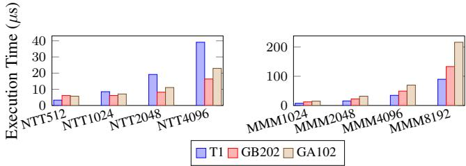
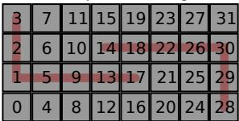
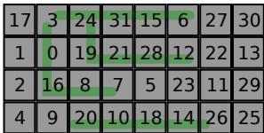
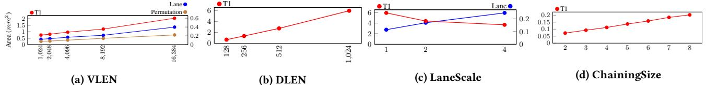

# Titan-l: An Open-Source, High Performance RISC-V Vector Core 通俗讲解

### 0. 整体创新点通俗解读

**痛点直击 (The "Why")**

- 传统的 **vector core** 设计陷入了两难境地：想通过加宽 **datapath**（DLEN）和增大 **vector register length**（VLEN）来提升性能，但会立刻撞上物理实现的“南墙”。
- 这个“南墙”主要有两块砖：
    - **路由拥堵**：当数据需要在不同的 **Lane** 之间移动（比如执行 `VRGATHER` 或 `VCOMPRESS` 这类 permutation 指令，或者使用全局 **mask register v0** 时），超宽 datapath 会导致芯片上布线距离过长、延迟剧增，甚至无法满足时序要求。这就像在一个巨大的仓库里，工人（Lane）之间传递工具（数据）要跑很远，效率极低。
    - **ILP 荒漠**：为了简化设计，很多 vector core（如 ETH 的 Ara）干脆放弃了 \*\*Instruction-Level Parallelism \*\*(ILP)，变成一个大号的 in-order 流水线。结果就是，即使硬件资源很宽，一条长指令也会独占整个核心，后面的指令只能干等着，硬件利用率极低。这好比你有一条10车道的高速公路，但规定所有车必须排成一列纵队行驶，完全浪费了道路资源。

**通俗比方 (The Analogy)**

- 想象你要组织一个大型交响乐团（代表 T1 的 vector core）。
    - **老派做法**（如 Saturn, Ara）就像是让所有乐手挤在一个大房间里（没有 Lane 划分），或者虽然分了声部（Lane），但指挥（控制逻辑）只能对整个乐团下统一指令，而且乐手之间传乐谱（数据）要穿过整个场地，混乱又低效。
    - **T1 的做法**更像是建立了一个现代化的音乐厅：每个声部（**Lane**）有自己的小隔间，可以独立练习（并行执行）。大厅中央有一个高效的**乐谱分发与调度中心**（**Permutation Unit**），任何乐手需要别人的乐谱，都通过这个中心快速获取，避免了全场乱跑。同时，指挥（**Sequencer**）非常聪明，他不仅能让不同声部同时演奏不同的段落（**DLP**），还能让同一个声部里的乐手在前一个音符还没完全结束时就准备好下一个音符（**fine-grained chaining**），甚至在等待某个声部从档案室（内存）取新乐谱时，让其他不相关的声部继续演奏（**Memory Delay Slot**），把整个乐团的效率榨干。

**关键一招 (The "How")**

- 作者并没有试图用更复杂的 speculative execution 来解决这个问题（那会带来巨大开销），而是围绕 **Lane-based** 架构，精准地在三个关键环节做了巧妙的“外科手术”：
    - **为了解决路由拥堵**：
        - 引入了一个 **coarse-grained floor-planning solver**，在芯片布局阶段就智能地安排各个 Lane 的物理位置，最小化它们之间最坏情况下的通信距离。
        - 专门设计了一个 **datapath-wide Permutation Unit** 作为中央枢纽，所有跨 Lane 的数据移动都通过它，而不是让 Lane 之间点对点乱连。
        - 为全局 **mask register v0** 增加了一个 **Shadow Mask cache**，避免了每次 predicated execution 都要在所有 Lane 间广播 mask bits。
    - **为了解决 ILP 荒漠**：
        - 提出了 **fine-grained chaining** 机制，将依赖追踪的粒度从整个 vector register 细化到 **ELEN × ScaleFactor** 的子字级别。这意味着，只要数据的一部分准备好了，后续依赖它的指令就可以开始执行，而不是傻等整条指令完成。
        - 设计了 **issue-as-commit** 策略，让 scalar core 和 vector core 能够在没有真实数据依赖的情况下各自独立推进，打破了二者之间的僵化耦合。
        - 通过 **memory interleaving** 和 **memory delay slot** 技术，让内存子系统也能跟上计算单元的步伐，隐藏了长延迟的 indexed memory access。

这些创新共同作用，使得 T1 能够在扩大 DLEN 和 VLEN 的同时，依然保持高性能和高能效，从而在 **cryptography** 和 **HPC** 等关键 workload 上实现了对 GP-GPU 和其他 vector core 的显著超越。其性能优势在论文的多个图表中得到了验证，例如在纯 DDR 模式下，T1 相比 SpacemiT X60 (K1) 实现了高达 **8.05×** 的性能提升。

 *Figure 8: Cryptographic Benchmarks of T1 (DLEN1K, VLEN16K,emulated with DDR4-3200) with GA102 (NVIDIA GTX 3090) and NVIDIA GB202 (GTX 5090)*
 *Figure 9: HPCbenchmark results: Figure 9a: PerformanceofT1(at2.45GHz) with local memoryand DDR4-3200,normalized to KP920; Figure 9b: Performancecomparison ilustrating T1's tolerance to memorylatency,showing results with DRAMand local SRAM,normalized to KP920,Ituses stripmining bydynamicallyset VLforcontinues DRAMaccessinSGEM workload.; Figure 9c: Performance of T1(at 1.6 GHz) using DDR4-3200, normalized to K1, where higher is better.*

### 1. Coarse-Grained Floor-Planning Solver

**痛点直击**

- 在传统的 **lane-based** 向量处理器里，当你把 **DLEN**（数据通路宽度）做得很大时，比如从 256-bit 扩到 1024-bit，意味着你有更多个 **Lane** 并行工作。
- 这些 **Lane** 物理上分布在芯片的不同位置。当执行 **Permutation Instructions**（如 `VRGATHER`, `VSLIDE`）时，一个 **Lane** 的数据经常需要被送到另一个很远的 **Lane**。
- 如果 **Lane** 是简单地按 0, 1, 2, 3... 的顺序排成一排（**trivial layout**），那么最坏情况下，数据要横跨整个芯片，造成巨大的 **routing latency**（布线延迟）和 **wire congestion**（布线拥塞）。
- 这个延迟会直接卡住整个向量指令的执行，让你花大价钱堆出来的宽 **DLEN** 性能大打折扣，甚至无法线性扩展，因为延迟增长得比面积还快。

**通俗比方**

- 想象你要设计一个大型物流仓库，里面有几十个分拣站（**Lane**）。你的核心业务是“重新打包”（**Permutation**），这需要频繁地把 A 站的包裹送到 B 站。
- 如果你把分拣站简单地排成一条长龙，那么 1 号站和 32 号站之间来回送包裹，叉车就要跑完整个仓库的长度，效率极低。
- **Coarse-Grained Floor-Planning Solver** 就像是一个聪明的仓库规划师。他不关心每个螺丝钉放哪（所以是 **Coarse-Grained**），但他知道哪些分拣站之间业务往来最频繁。于是，他会把这些“业务伙伴”站尽量安排在物理上靠近的位置。
- 结果就是，无论仓库多大（**DLEN** 多宽），任何两个需要频繁通信的站点之间的**最大距离**都被控制在一个很小的范围内，保证了整体物流效率的线性提升。

 *Titan-l:An Open-Source, High Performance RISC-V Vector Core*

**关键一招**

- 作者没有采用耗时且不可行的穷举法去寻找最优布局（因为这是 **NP-complete** 问题）。
- 而是设计了一个**启发式求解器**（heuristic solver），它通过一个简单的迭代规则来逼近最优解：
    - 随机打乱 **Lane** 的初始放置顺序。
    - 然后逐个放置 **Lane**：如果这个 **Lane** 有已经放置好的邻居，就把它放在能让**到这些邻居的最大距离最小**的位置；如果没有邻居，就随便找个空位放。
- 这个看似简单的策略，却能非常有效地将\*\*最坏情况下的跨 \*\*(worst-case routing distance) 从 7 个单位降低到 4 个单位（如图所示）。
- 通过控制这个关键瓶颈，整个 **Permutation Unit** 的延迟得以降低，从而让增大 **DLEN** 带来的性能收益能够真正兑现，实现了接近**线性的可扩展性**。

### 2. Datapath-Wide Permutation Unit with Shadow Mask Cache

**痛点直击**

- 在传统的 **Lane-based** 向量处理器里，当执行带 **mask** 的指令（比如 `vadd.vv v1, v2, v3, v0.t`）时，每个 **Lane** 都需要知道 **v0** 这个 **mask register** 里对应自己那部分的比特位是 0 还是 1。
- 问题在于，**v0** 是一个全局寄存器，它的比特位是**均匀分布**在所有 **Lane** 上的。这意味着，一个 **Lane** 要执行自己的计算，可能需要从**好几个甚至几十个其他 Lane** 那里去“拉取”它需要的 **mask bit**。
- 这种跨 **Lane** 的广播操作，在 **DLEN**（数据通路宽度）和 **Lane** 数量变得很大时，会变成一个灾难。它会产生巨大的**布线拥塞 (routing congestion)** 和**延迟**，就像一个小镇的所有车都挤在同一条主干道上，最终让整个芯片的性能被这个瓶颈卡死。

**通俗比方**

- 想象一下，你有一个由 **32 个工人 (Lane)** 组成的流水线工厂，每个人负责处理一批货物的一部分。现在老板（控制单元）发了一个总名单 **(v0 mask)**，上面标记了哪些货物需要处理。
- 在老办法里，每个工人要干活前，都得跑遍整个工厂，挨个问其他 31 个工人：“嘿，名单上第 X 行是不是归我管？是不是要处理？” 这效率极低，工厂里全是跑来跑去问话的人，而不是干活的人。
- **Titan-I** 的做法是：老板直接在工厂中央设一个**公告栏 (Permutation Unit)**，把完整的名单 **(v0)** 贴在上面。不仅如此，他还给每个工人的工作台上放了一份**只包含自己相关部分的小抄 (Shadow Mask Cache)**。这样，工人只需要看自己的小抄或者抬头看一眼中央公告栏就知道该干什么，完全不用再到处乱跑了。

**关键一招**

- 作者没有试图优化跨 **Lane** 广播的路径，而是从根本上**消除了这种广播的需求**。
- 具体来说，他们在核心的 **Permutation Unit** 里增加了一个专门存放 **v0** 的 **Shadow Mask Cache**。
    - 当任何 **Lane** 写入 **v0** 时，这个写入操作会通过一个专用的数据通道同步更新到 **Permutation Unit** 的 **Shadow Cache** 中。
    - 当一个 **predicated instruction**（带掩码的指令）到来时，**Sequencer**（调度器）会确保所有对 **v0** 的写入都完成后，才允许该指令使用 **v0**。
    - 指令执行时，各个 **Lane** 不再互相通信获取 **mask bit**，而是直接从 **Permutation Unit** 通过已有的、为数据重排设计的高效通道来获取自己需要的 **mask** 信息。
- 这一招将原本 **O(N²)** 复杂度的跨 **Lane** 通信问题，简化成了 **O(N)** 的集中式访问，从而解开了制约向量处理器扩展性的最大枷锁之一。论文中提到，这能将 **VRF** 的读操作开销降低 **4倍**，并带来约 **50%** 的带宽提升，而面积代价仅为 **8%**。

 *Titan-l:An Open-Source, High Performance RISC-V Vector Core*

### 3. Fine-Grained Chaining Microarchitecture

**痛点直击**

- 传统的 vector core 在处理超宽 datapath（比如 DLEN=1024）时，会遇到一个“大块头”的问题：一条 vector 指令动辄要处理成百上千个数据元素，如果必须等这条指令的所有元素都算完、写回寄存器文件（VRF）后，下一条依赖它的指令才能开始，那整个流水线就会被卡住，造成巨大的 **硬件资源浪费** 和 **性能瓶颈**。
- 现有的粗粒度 chaining（比如 Berkeley's Saturn 的 whole-datapath granularity）虽然能解决一点问题，但它还是把一整条指令当作一个不可分割的“黑盒”。这就像要求一辆满载的卡车必须把所有货物一次性卸完，后面的车才能进仓库，效率极低。它无法在 **element-wise** 的层面去挖掘并行性，导致 **ILP (Instruction-Level Parallelism)** 被严重压制。

**通俗比方**

- 想象一个大型装配流水线，生产的是由 **1024 个零件** 组成的复杂产品。传统做法是：工作站 A 必须把 1024 个零件全部加工完，放到传送带上，工作站 B 才能开始对这 1024 个零件进行下一步操作。
- Fine-grained chaining 就像是给这个流水线装上了 **智能分拣和即时传递系统**。工作站 A 每加工好一个零件（或者一小批，比如 ELEN×ScaleFactor=64 个），系统就立刻把这个零件直接“手递手”地传给工作站 B，而不需要等剩下的 960 个零件。这样，工作站 B 几乎可以和工作站 A **无缝并行工作**，整个流水线的吞吐量和效率就得到了质的飞跃。这本质上是在 **数据流** 层面实现了更细粒度的流水线重叠。

**关键一招**

- 作者没有沿用传统的、以整条指令为单位的依赖管理方式，而是在 microarchitecture 里引入了一个 **Chaining Scoreboard**。
- 这个 Scoreboard 的精妙之处在于，它不再跟踪“指令 X 是否完成”，而是跟踪“指令 X 的第 [0-63], [64-127], ..., [960-1023] 这些 **sub-word** 数据块是否已经产生并可以被下游使用”。
- 具体来说：
    - 每个 **ELEN × ScaleFactor-bit** 的 sub-word 在 Scoreboard 里都有一个独立的状态位。
    - 当一条新指令（消费者）进入流水线时，它的前端（FE）会查询这个 Scoreboard，精确地知道它所依赖的每一个 sub-word 何时 ready。
    - 一旦某个 sub-word ready，消费者指令就可以立即从 VRF 或 bypass path 获取这部分数据并开始计算，实现 **out-of-order writebacks** 和执行。
    - 这种机制将依赖解析的粒度从 **整条 vector 指令** 下沉到了 **寄存器内部的数据块**，从而在超宽 datapath 上成功解锁了被隐藏的 **fine-grained ILP**。

 *Figure 4: Linearly Area Scaling of T1 design parameters,evaluated at TSMC N28 SVT technology at 65% utilization.Four cases are examined:(1)when varying VLEN,DLEN is held at 128,y-asix on the left-hand represents the total area of T1,whereas the right-hand y-axis isolates the area of Lane and Permutation;(2)when varying DLEN,the ratio VLEN/DLEN remains 1; (3)when examining LaneScale,both VLEN and DLE are set to 1024,y-asix on the left-hand represents the total area of T1,whereas the right-hand y-axis isolates the area of Lane;and(4)when asesing ChainingSize,VLEN and DLEN are maintained at 1024.*

如上图所示，通过调整 **ChainingSize**（即 ScaleFactor），可以在 **Lane 面积开销** 和 **ILP 挖掘能力** 之间做权衡。对于 HPC 这类计算密集、依赖复杂的场景，增大 ChainingSize 能带来显著的性能提升（如 Table 1 所示，PACK 测试中 fine-grained chaining 带来了 **61%** 的性能提升）。

### 4. Issue-as-Commit for Scalar-Vector OoO Execution

之前的设计里，**Scalar（标量）** 和 **Vector（向量）** 两条流水线虽然物理上是分开的，但逻辑上却像被一根绳子拴着。只要向量单元开始干活，标量单元就得在旁边干等着，哪怕它们俩处理的数据八竿子打不着。这种“**虚假依赖**”导致了巨大的性能浪费——向量单元可能正吭哧吭哧处理一个超长的数组，而标量单元明明可以去干别的活，却被硬生生地卡住了。

______________________________________________________________________

想象一下厨房里有两个厨师：一个负责切菜（**Scalar**），一个负责炖一锅需要两小时的大骨汤（**Vector**）。在旧规矩下，只要炖汤师傅点火开始炖，切菜师傅就必须放下手里的活，站在旁边盯着汤锅，直到汤炖好才能继续切菜。这显然很蠢！他们完全可以各干各的，互不干扰。**Issue-as-Commit** 的核心思想就是废除这条愚蠢的规矩。

 *Figure 6: Different ILP Technology in T1. Chaining interleaves Vo,V1,and V2.Memory Interleaving mitigates the VSW-VLD dependency. Vector-Scalar OoO interleaves the vector and scalar pipelines until a true dependency v16-s64- v15 occurs.Memory Delay Slot parallelizes vector index load/store (VIDxo) with independent vector executions (VEX0).*

______________________________________________________________________

作者并没有让标量和向量单元完全脱钩（那会带来正确性问题），而是巧妙地在中间插了一个轻量级的“**Vector Scoreboard（向量记分牌）**”。这个记分牌就像一个智能的协调员：

- 当一条**纯向量指令**（比如 `vadd`，只读写向量寄存器，不影响标量状态）被发往向量单元时，协调员立刻在记分牌上登记：“这事我接了”，然后马上告诉标量单元：“你可以继续干你的活了，这事不用你操心”。
- 这个“登记即承诺”的动作，就是 **Issue-as-Commit**。它把向量指令的“提交”点从漫长的执行结束，提前到了刚刚“发出”（Issue）的那一刻。
- 只有当向量指令真的会影响标量世界时（比如写一个标量寄存器，或者可能抛出异常），协调员才会拉住标量单元，让它等一等。

通过这个简单的逻辑转换，系统在保证正确性的前提下，极大地释放了标量单元的生产力，让两条流水线真正实现了**并发执行**，从而显著提升了整体吞吐量。

### 5. Dual LSU with Memory Interleaving and Delay Slots

**痛点直击**

- 传统的向量处理器，哪怕是支持 OoO 的，其 **LSU (Load-Store Unit)** 往往是“单通道”的。这意味着 **load 和 store 操作必须串行化**，即使它们访问的是内存中完全不相干的区域。这直接浪费了一半的理论内存带宽。
- 更糟糕的是处理 **indexed memory access**（索引访存）。这类操作的地址是在向量寄存器里动态计算出来的，导致 LSU 必须发起大量、稀疏、不可预测的内存请求。在 DDR 这种高延迟内存上，一个 indexed load 可能卡住整个向量流水线成千上万个周期，后面的指令只能干等着，**硬件资源被严重闲置**。

**通俗比方**

想象你是一个高效的仓库管理员（向量核心），手下有两个专业团队：

- **HBLSU 就像你的“集装箱码头”**：专门处理大批量、连续的货物（unit-stride 访问）。它有独立的装卸区，可以同时进行卸货（load）和装货（store），互不干扰。
- **HOLSU 则像你的“快递分拣中心”**：专门处理那些地址零散、需要一个个找的包裹（indexed/constant-stride 访存）。它虽然慢，但有自己的工作台，不会去占用集装箱码头的宝贵资源。

而 **Memory Interleaving** 就像是给集装箱码头配备了 **双工装卸桥吊**，允许卸货和装货同时进行。**Delay Slots** 则像是一个聪明的调度员，他看到快递分拣中心要忙很久，就立刻安排其他不需要快递结果的工人（独立的计算指令）先去干活，而不是让所有人都在原地傻等。

 *Figure 6: Different ILP Technology in T1. Chaining interleaves Vo,V1,and V2.Memory Interleaving mitigates the VSW-VLD dependency. Vector-Scalar OoO interleaves the vector and scalar pipelines until a true dependency v16-s64- v15 occurs.Memory Delay Slot parallelizes vector index load/store (VIDxo) with independent vector executions (VEX0).*

**关键一招**

作者没有用一个“全能但笨重”的 LSU 去硬扛所有访存模式，而是做了两个精妙的拆分和协同：

- **拆分 LSU 职能**：

    - 引入 **High Bandwidth LSU (HBLSU)**：专精于 **unit-stride** 访问。它拥有 **DLEN-wide 的全宽数据通路**，并且最关键的是，它内部实现了 **Memory Interleaving**。通过一个 **Conflict Region Table (CRT)** 动态追踪内存冲突域，只要 load 和 store 的地址范围不重叠，它们就可以 **真正并发执行**，将内存带宽利用率拉满。
    - 引入 **High Outstanding LSU (HOLSU)**：专精于处理 **indexed** 和 **constant-stride** 这类非规则访存。它采用 **ELEN-wide 的窄通路**，但支持大量的 **in-flight transactions**，能够容忍高延迟。

- **扭转等待逻辑**：

    - 对于 HOLSU 处理的超长延迟 indexed 操作，作者引入了 **Memory Delay Slot** 机制。这本质上是一种 **软硬件协同设计**。
    - 编译器在生成代码时，会主动将 **不依赖于 indexed load 结果的后续指令**（如 VEX0-VEX63）**调度到 indexed 指令（如 VIDx0）之后立即执行**。
    - 硬件层面，通过一个 **CSR “chicken bit”** 允许软件在确保安全的前提下，**忽略 indexed 操作可能产生的精确异常**。这样一来，CPU 流水线就不会因为一个还在飞的 indexed 操作而被强制阻塞，从而让这些被调度进来的独立指令得以 **并行执行**，完美地“隐藏”了内存延迟。
