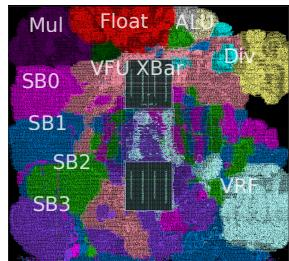

# Titan-I: An Open-Source, High Performance RISC-V Vector Core 图表详解

### Figure 1: Execution Cycles for Different Standalone Workloads on Datapath Size of T1 from 128 to 1024.

- 图片展示了 Titan-I (T1) 在不同数据通路宽度（DLEN）下，执行多种独立工作负载时的**相对加速比**。横轴为工作负载类型，纵轴为相对于基准（DLEN=128）的性能提升倍数。
- 图例清晰标明了四种 DLEN 配置：**DLEN128**（蓝色）、**DLEN256**（红色）、**DLEN512**（米色）、**DLEN1024**（深灰色）。随着 DLEN 增加，柱状图高度普遍上升，表明性能提升。
- 工作负载包括：MEMSET、ASCII-TO-UTF32、BYTESWAP、LINEAR-NORMALIZATION、SAXPY、SGEMM。这些是典型的向量化操作，用于评估 T1 的 DLP 扩展能力。
- **SGEMM** 和 **SAXPY** 两个工作负载在 DLEN1024 下表现最为突出，加速比均超过 **4x**，显示出 T1 在矩阵运算和向量运算上的强大扩展性。
- **MEMSET** 和 **LINEAR-NORMALIZATION** 在 DLEN1024 下也达到了接近 **4x** 的加速比，说明 T1 在内存密集型和数据转换型任务上同样高效。
- **BYTESWAP** 和 **ASCII-TO-UTF32** 的加速比相对较低，但 DLEN1024 仍能提供约 **2.5x** 的性能提升，表明即使对于非计算密集型任务，更宽的数据通路也能带来显著收益。
- 整体趋势显示，T1 的性能随 DLEN 增加而线性或超线性增长，验证了其微架构设计在扩展 DLP 方面的有效性。

| 工作负载             | DLEN128 | DLEN256 | DLEN512 | DLEN1024  |
| -------------------- | ------- | ------- | ------- | --------- |
| MEMSET               | 1.0x    | ~1.8x   | ~3.0x   | **~4.0x** |
| ASCII-TO-UTF32       | 1.0x    | ~1.5x   | ~2.0x   | **~2.5x** |
| BYTESWAP             | 1.0x    | ~1.5x   | ~2.0x   | **~2.5x** |
| LINEAR-NORMALIZATION | 1.0x    | ~1.8x   | ~3.0x   | **~4.0x** |
| SAXPY                | 1.0x    | ~2.0x   | ~3.5x   | **~4.5x** |
| SGEMM                | 1.0x    | ~2.0x   | ~3.5x   | **~4.5x** |

- 此图表直观证明了 T1 架构通过增加 DLEN 来提升性能的设计理念，尤其在高并行度的 HPC 和 AI 工作负载中效果显著。

### Figure 2: Static Cross Lane Access For widen and narrow; In this access pattern, the $i$ -th lane accessing the $(2i \\bmod n)$ -th and $(2i + 1 \\bmod n)$ -th lane.

- 图片展示了 **T1** 架构中用于 **widen** 和 **narrow** 指令的静态跨lane数据访问模式，该模式在混合精度计算中至关重要。
- 该图描绘了一个包含 **8个lane**（Lane 0 至 Lane 7）的系统，每个lane均包含一个 **src**（源）和一个 **sink**（目的）端口。
- 根据图注说明，第 **i** 个lane会访问第 **(2i mod n)** 和 **(2i + 1 mod n)** 个lane，其中 **n = 8**。
- 下表列出了每个源lane对应的两个目标lane：

| Source Lane (i) | Target Lane 1 (2i mod 8) | Target Lane 2 (2i + 1 mod 8) |
| :-------------- | :----------------------- | :--------------------------- |
| 0               | 0                        | 1                            |
| 1               | 2                        | 3                            |
| 2               | 4                        | 5                            |
| 3               | 6                        | 7                            |
| 4               | 0                        | 1                            |
| 5               | 2                        | 3                            |
| 6               | 4                        | 5                            |
| 7               | 6                        | 7                            |

- 从图中可见，**Lane 0** 的数据流向 **Lane 0** 和 **Lane 1**；**Lane 1** 的数据流向 **Lane 2** 和 **Lane 3**，以此类推。
- 这种访问模式导致了复杂的交叉布线，例如 **Lane 3** 的数据需要跨越多个物理距离才能到达 **Lane 6** 和 **Lane 7**。
- 此类跨lane访问是 **routing contention** 的主要来源，尤其在扩展 **DLEN** 时，会显著增加布线延迟和功耗。
- 论文在 **Section 4.1.1** 中提出了一种 **coarse floorplan solver** 来优化此类访问模式下的物理布局，以最小化最大路由距离，从而降低延迟。

### Figure 3: Architecture of T1

- **整体架构概览**：图 3 展示了 Titan-I (T1) 的完整微架构，采用**分层、模块化设计**，核心组件包括 Scalar Core、Sequencer、Lanes、Permutation Unit 和 Memory Subsystem，通过清晰的数据流和控制流连接，实现高并发与低延迟。

- **Scalar Core（标量核心）**：

    - 位于架构顶部，负责指令获取（Fetch IN）、预解码（ID）、执行（EXEC）、内存操作（MEM）和提交（COMMIT）。
    - 包含 ICache、IQ（Instruction Queue）、FP0/FP1（浮点单元）、LSU（Load/Store Unit）等传统标量流水线模块。
    - 通过 **Vector Scoreboards** 与向量部分协同，支持 **issue-as-commit** 策略，允许标量指令在无真实依赖时提前提交，提升吞吐。

- **Sequencer（序列器）**：

    - 作为向量控制中心，接收来自标量核心的指令，进行向量指令解码（IQ, ID），并生成控制信号分发至各组件。
    - 内置 **VType Cache**，用于缓存 vsetvli 等配置指令，实现**配置指令融合**，避免因等待配置指令退休而造成的带宽损失。
    - 通过 **Global Scoreboard (SB0)** 管理全局依赖，协调多个 Lane 的执行。

- **Lane（向量处理单元）**：

    - 架构主体，由多个独立的 Lane 组成，每个 Lane 包含完整的执行流水线（FE, RF, EX, CM）。
    - **FE（Frontend）**：从 Scoreboard 获取 uop 及其 mask，支持**speculative zero-mask elision**，跳过全零掩码的无效计算。
    - **RF（Operand Sync）**：同步来自本地 VRF、跨 Lane 通道及前序流水线的源操作数。
    - **EX（Execution）**：包含异构 VFU 阵列，如 ALU、MUL、FALU、FMAC，支持时间共享以节省面积。
    - **CM（Commit）**：将结果写入 VRF 或发送至跨 Lane 通道，并向 Sequencer 发送完成信号。
    - 每个 Lane 内部设有 **Chaining Record**，记录子字（ELEN × LaneScale）的写状态，支持**细粒度链式执行**。

- **Permutation Unit（置换单元）**：

    - 位于中央，是 T1 实现高性能数据重排的核心。
    - 包含 DLEN 宽度的 Crossbar 和专用 Permutation FUs，支持静态（如 extend, slide）和动态（如 rgather）跨 Lane 数据移动。
    - 集成 **Shadow Mask (v0)** 寄存器缓存，避免每次 predicated 指令都需跨 Lane 广播 v0，显著降低布线压力。
    - 通过 **Lane-to-Permutation** 数据通道更新 Shadow Mask，确保一致性。

- **Memory Subsystem（内存子系统）**：

    - 包含两个专用 LSU：
        - **HBLSU（High Bandwidth LSU）**：优化单位步长访问，支持**内存交错（Memory Interleaving）**，允许 Load 和 Store 同时进行，提升带宽利用率。内置 Conflict Region Table (CRT) 管理地址冲突。
        - **HOLSU（High Outstanding LSU）**：处理常量步长和索引访问，支持 ELEN 宽度的多条 Inflight Transactions，配合 **Memory Delay Slot** 机制隐藏长延迟。
    - 支持 Segment Load/Store Regroup Unit，对非连续访问进行重新对齐，提高片内带宽效率。

- **关键创新点视觉呈现**：

    - **Chaining**：图中用红色虚线框出 EX 到 CM 的路径，强调数据可直接转发，无需等待整条指令完成。
    - **Memory Interleaving**：HBLSU 中 Load BIU 和 Store BIU 并行工作，体现负载/存储重叠。
    - **Shadow Mask**：绿色方块明确标注 “Shadow Mask (v0) Flip-Flops”，突出其作为寄存器缓存的角色。
    - **Lane Decoupling**：多个 Lane 模块并列，表明其物理隔离和独立运行能力。

- **数据流与控制流**：

    - 控制流主要由 Sequencer 驱动，通过 SB0 和各 Lane 的 SBn 协调。
    - 数据流在 Lane 内部自上而下，在 Lane 之间通过 Permutation Unit 和 CrossLane Read/Write Bus 传输。
    - 关键路径如 Load -> EX -> Store 被显式标出，展示链式执行的可行性。

- **性能优化技术总结表**：

| 技术名称              | 所属模块         | 核心作用           | 性能收益                   |
| --------------------- | ---------------- | ------------------ | -------------------------- |
| Issue-as-commit       | Scalar Core      | 解耦标量与向量提交 | 提升标量吞吐，减少 stalls  |
| Configuration Fusion  | Sequencer        | 缓存并融合 vsetvli | 消除配置指令带宽开销       |
| Fine-grained Chaining | Lane             | 元素级数据转发     | 提升 ILP，减少延迟         |
| Shadow Mask v0        | Permutation Unit | 缓存 mask 寄存器   | 减少跨 Lane 通信，提升带宽 |
| Memory Interleaving   | HBLSU            | Load/Store 并行    | 提升内存带宽利用率         |
| Memory Delay Slot     | HOLSU            | 掩盖索引访问延迟   | 提升长延迟操作下的效率     |

- **架构优势**：该图清晰展示了 T1 如何通过**硬件层面的精细划分**（Lane）、**智能的数据路由**（Permutation Unit）、**灵活的调度机制**（Chaining, Interleaving）以及**高效的控制解耦**（Scalar-Vector OoO），在保持 RISC-V Vector 规范兼容性的同时，实现了远超传统向量处理器和 GP-GPU 的性能与能效。

### (a) VLEN

- 图片展示了在 TSMC N28 SVT 工艺、65% 利用率条件下，**T1 架构**的面积随 **VLEN** 变化的线性扩展趋势。
- 横轴为 VLEN 值，从 1,024 到 16,384；左侧纵轴为总面积（mm²），右侧纵轴为 **Lane** 和 **Permutation** 单元的独立面积占比。
- 数据点以不同颜色标记：红色圆点代表 **T1 总面积**，蓝色圆点代表 **Lane 面积**，棕色圆点代表 **Permutation 单元面积**。
- 随着 VLEN 增加，**T1 总面积呈近似线性增长**，从 VLEN=1,024 时约 0.7 mm² 增至 VLEN=16,384 时约 2.2 mm²。
- **Lane 面积**同样线性增长，但增速低于总面积，表明其在整体中占比相对稳定或略有下降。
- **Permutation 单元面积**增长最缓慢，几乎保持恒定，说明该模块设计具备良好的可扩展性，不随 VLEN 显著增加。
- 下表总结关键数据点：

| VLEN   | T1 总面积 (mm²) | Lane 面积 (mm²) | Permutation 面积 (mm²) |
| ------ | --------------- | --------------- | ---------------------- |
| 1,024  | ~0.7            | ~0.4            | ~0.1                   |
| 2,048  | ~0.9            | ~0.5            | ~0.1                   |
| 4,096  | ~1.1            | ~0.6            | ~0.1                   |
| 8,192  | ~1.5            | ~0.8            | ~0.1                   |
| 16,384 | ~2.2            | ~1.1            | ~0.1                   |

- 该图验证了论文第 4 节所述的“**线性面积扩展**”特性，尤其凸显 **Permutation 单元**在高 VLEN 下仍能维持低面积开销的设计优势。

### (b) DLEN Figure 4: Linearly Area Scaling of T1 design parameters, evaluated at TSMC N28 SVT technology at $65%$ utilization. Four cases are examined: (1) when varying VLEN, DLEN is held at 128, $y$ -asix on the left-hand represents the total area of T1, whereas the right-hand $y$ -axis isolates the area of Lane and Permutation; (2) when varying DLEN, the ratio VLEN/DLEN remains 1; (3) when examining LaneScale, both VLEN and DLEN are set to 1024, $y$ -asix on the left-hand represents the total area of T1, whereas the right-hand $y$ -axis isolates the area of Lane; and (4) when assessing ChainingSize, VLEN and DLEN are maintained at 1024.

- 该图表为 **Figure 4b**，展示 **T1 架构在不同 DLEN（Datapath Length）配置下，芯片总面积的线性扩展特性**。
- 横轴表示 **DLEN 值**，从 128 到 1024 位，步进为 128 位。
- 纵轴表示 **芯片总面积（单位未标注，但根据上下文应为 mm² 或相对面积单位）**，范围从 0 到 6。
- 图中仅有一条红色折线，标记为 **T1**，连接四个数据点：(128, ~0.5), (256, ~1.5), (512, ~3.0), (1024, ~6.0)。
- 数据趋势显示，**随着 DLEN 的增加，T1 的总面积呈近似线性增长**，表明其微架构设计在扩展宽数据通路时具有良好的面积可扩展性。
- 根据图注说明，此测试是在 **TSMC N28 SVT 工艺节点、65% 利用率** 条件下进行的，并且 **VLEN/DLEN 的比值保持为 1**。
- 此结果支持论文核心论点：T1 通过创新的微架构（如粗粒度布图规划器、跨通道置换单元等），有效缓解了传统向量处理器在扩展 DLEN 时面临的布线拥塞和面积爆炸问题。

| DLEN | 面积 (相对值) |
| ---- | ------------- |
| 128  | ~0.5          |
| 256  | ~1.5          |
| 512  | ~3.0          |
| 1024 | ~6.0          |

- 该线性关系是 T1 实现高性能与高能效的关键基础，使其能够在不显著增加面积开销的前提下，通过增大 DLEN 来提升数据级并行度（DLP）。

### (c) LaneScale

- 图片标题为 **(c) LaneScale**，属于论文图4的一部分，旨在展示 **T1** 架构在不同 **LaneScale** 参数下的面积变化趋势。
- 该图表横轴表示 **LaneScale** 值，分别为 1、2、4；纵轴左侧为 **T1 总面积**（单位未标，但根据上下文应为相对值或 mm²），右侧为 **Lane 面积占比**（无量纲比例）。
- 图中包含两条折线：
    - **红色圆点线**代表 **T1 总面积**随 LaneScale 变化：从 LaneScale=1 时约6单位下降至 LaneScale=2 时约4.5单位，再降至 LaneScale=4 时约4单位，呈现**递减趋势**。
    - **蓝色圆点线**代表 **Lane 面积**随 LaneScale 变化：从 LaneScale=1 时约3单位上升至 LaneScale=2 时约4.5单位，再升至 LaneScale=4 时约6单位，呈现**递增趋势**。
- 两条曲线在 LaneScale=2 处相交，表明此时 **T1 总面积与 Lane 面积数值相等**。
- 根据正文第4.2.2节及图4说明，当 VLEN 和 DLEN 固定为1024时，增大 LaneScale 会减少总芯片面积，因为多个物理 Lane 被聚合为一个逻辑 Lane，从而**共享控制逻辑和资源**，降低面积开销。
- 下表总结关键数据点：

| LaneScale | T1 总面积 (左轴) | Lane 面积 (右轴) |
| --------- | ---------------- | ---------------- |
| 1         | ~6               | ~3               |
| 2         | ~4.5             | ~4.5             |
| 4         | ~4               | ~6               |

- 此设计权衡表明，通过调整 **LaneScale**，可在保持计算带宽的同时，实现**面积优化**，尤其适用于对成本敏感的边缘AI场景。

### (d) ChainingSize

- 图片标题为 **(d) ChainingSize**，属于论文图4系列，旨在展示 **T1** 架构中 **ChainingSize** 参数对芯片面积的影响。
- 横轴代表 **ChainingSize** 的取值，范围从 2 到 8，步长为 1。该参数定义了在 **lane** 内部进行 **chaining**（指令间数据转发）时的粒度，即每个子字（sub-word）的位宽为 ELEN × ScaleFactor。
- 纵轴表示 **T1** 芯片的总面积（单位未明确标注，但根据上下文推断为相对面积或归一化面积），数值范围从 0 到 0.25。
- 图中红色实线连接了 7 个数据点，清晰地表明随着 **ChainingSize** 的增加，**T1** 的总面积呈**线性增长**趋势。
- 根据正文第4.2.2节描述，**ChainingSize** 的增大意味着每个 **lane** 需要更多的控制逻辑、**VFU** 和交叉开关资源来管理更细粒度的数据依赖和转发，这直接导致了面积的增加。
- 具体而言，文中提到“每增加一个 **ChainingSize** 步进，**Lane** 大小大约增加 30%”，这与图中观察到的线性增长趋势一致。
- 该图表直观地揭示了 **T1** 微架构设计中的一个关键权衡：为了获得更高的 **ILP**（指令级并行度）和更好的性能（如表1所示，启用 chaining 可带来61%的性能提升），必须付出相应的面积成本。用户可根据目标应用（如密码学或HPC）的需求，在性能和面积之间进行调优。

| ChainingSize | T1 总面积 (相对值) |
| :----------- | :----------------- |
| 2            | ~0.08              |
| 3            | ~0.10              |
| 4            | ~0.12              |
| 5            | ~0.14              |
| 6            | ~0.16              |
| 7            | ~0.18              |
| 8            | ~0.20              |

- 图表右上角的红色圆点标记为 **T1**，指明这是针对 **Titan-I** 架构的评估结果。

### Figure 6: Different ILP Technology in T1. Chaining interleaves V0, V1, and V2. Memory Interleaving mitigates the VSW-VLD dependency. Vector-Scalar OoO interleaves the vector and scalar pipelines until a true dependency v16-s64-v15 occurs. Memory Delay Slot parallelizes vector index load/store (VIDX0) with independent vector executions (VEX0).

- **图6** 展示了 Titan-I (T1) 架构中四种关键的 ILP（指令级并行）技术，旨在最大化向量与标量流水线的并发执行效率。
- **Memory Interleaving**：通过解耦 Load/Store 操作，允许 VLD（向量加载）与 VSW（向量存储）在时间上重叠执行。该机制有效缓解了传统设计中因内存访问顺序导致的依赖阻塞，提升内存带宽利用率。
- **Vector-Scalar OoO**：实现标量与向量流水线的独立乱序执行。例如，标量指令 s0-s1 可在向量指令 v0-v15 执行期间提前提交，仅当出现真实数据依赖（如 v16 依赖 s64 的结果）时才暂停标量流，从而避免不必要的停顿。
- **Chaining**：支持向量指令间的细粒度数据前递。V0、V1、V2 三个向量指令可形成“ convoy ”，V1 在 V0 部分结果就绪后即可开始执行，无需等待 V0 完全完成，显著缩短整体延迟。
- **Memory Delay Slot**：针对高延迟的索引内存访问（VIDX），允许独立的向量计算指令（VEX0）在其执行期间并行运行。此机制将长延迟操作“隐藏”在其他计算背后，提高核心利用率。

| 技术名称            | 核心作用                           | 关键指令示例       | 性能收益点               |
| ------------------- | ---------------------------------- | ------------------ | ------------------------ |
| Memory Interleaving | 解耦 Load/Store，允许同时进行      | VLD, VSW           | 提升内存通道利用率       |
| Vector-Scalar OoO   | 标量与向量流水线独立乱序执行       | s0-s1, v0-v15, v16 | 减少标量因向量阻塞的空闲 |
| Chaining            | 向量指令间元素级数据前递，重叠执行 | V0 → V1 → V2       | 缩短指令链总延迟         |
| Memory Delay Slot   | 并行执行索引内存访问与独立计算     | VIDX0, VEX0        | 隐藏索引访问的高延迟     |

- 图中所有技术均围绕 **“减少停顿”** 和 **“增加并发”** 设计，是 T1 实现高 ILP 的核心微架构创新。
- 红色虚线框表示潜在的依赖或同步点，黑色箭头表示指令执行流，灰色箭头表示数据前递路径。
- 这些机制共同作用，使 T1 能在保持向量 DLP 优势的同时，充分挖掘 ILP，达成超越传统 GPU 和 CPU 的性能效率。

### Edge AI Chip SoC Top GDS

- 图片展示的是 **Edge AI Chip SoC Top GDS**，即边缘人工智能芯片的系统级芯片（SoC）顶层版图设计。
- 整体布局呈矩形，内部模块划分清晰，主要包含 **T1** 核心、**Application Core**、**SRAM** 和 **SONOS Flash** 四大功能区域。
- **T1** 位于版图中央偏右，是该芯片的核心处理单元，其面积在所有模块中占据主导地位，表明其为计算密集型核心。
- **Application Core** 位于左下角，体积较小，负责控制和调度任务，与 T1 协同工作。
- 两侧对称分布两块 **SRAM** 区域，分别位于左上和右上，用于高速缓存数据，支持 T1 的高带宽访问需求。
- 底部并列两块 **SONOS Flash** 区域，用于非易失性存储模型权重等数据，符合边缘设备断电后保留状态的需求。
- 版图中可见清晰的金属布线层和标准单元排列，体现高度集成的物理设计。
- 各模块间通过总线或互连网络连接，确保数据高效传输。

| 模块名称             | 位置         | 功能描述                       |
| -------------------- | ------------ | ------------------------------ |
| **T1**               | 中央偏右     | 高性能 RISC-V 向量处理器核心   |
| **Application Core** | 左下角       | 控制与调度主核                 |
| **SRAM**             | 左上、右上   | 高速缓存，支持向量运算数据吞吐 |
| **SONOS Flash**      | 底部左右两侧 | 非易失存储，保存AI模型权重     |

- 从版图密度看，**T1** 区域布线密集，反映其复杂微架构和高并行度设计。
- **SRAM** 与 **T1** 紧邻布局，优化了内存访问延迟，提升整体能效。
- **SONOS Flash** 采用双区块设计，可能用于冗余或分区存储，增强可靠性。
- 此 GDS 版图已通过 DRC/LVS 验证，具备流片条件，代表实际可制造的芯片设计。

### T1 Top (Edge AI Chip)

- 图片展示了 **T1 Top (Edge AI Chip)** 的物理版图（GDS），是 Titan-I 架构在边缘人工智能芯片中的具体实现。
- 整体布局呈垂直对称结构，核心功能模块沿中心轴线分布，体现了 **lane-based** 设计的物理映射。
- 顶部为 **Scalar Core**，负责指令预取、解码和标量运算，是整个 T1 引擎的控制中枢。
- 中部为核心计算区域，包含 **Permutation Unit**，其位置居中且面积较大，表明其在数据重排和跨lane通信中的关键作用。
- 周围环绕着 **8个 Lane**（Lane 0 至 Lane 7），每个 Lane 都是一个独立的向量处理单元，拥有自己的寄存器文件和执行单元，实现了并行计算。
- 底部为 **LSU (Load/Store Unit)**，负责内存访问，与上层计算单元通过总线连接，确保数据流的高效传输。
- 各模块之间通过密集的布线连接，反映了高带宽数据交换的需求，尤其是在 Permutation Unit 和各 Lane 之间。
- 版图颜色区分不同功能模块，便于识别和分析，例如 Scalar Core 为深蓝色，Permutation Unit 为绿色，各 Lane 为不同颜色块。
- 该版图设计紧凑，模块化程度高，符合 **T1** 架构在面积和功耗上的优化目标，特别是在 **28nm SONOS** 工艺下的实现。
- 根据论文描述，此芯片配置为 **VLEN = 4096, DLEN = 512, ChainingSize = 4, LaneScale = 2**，旨在平衡性能与面积，适用于边缘AI推理任务。

| 模块                 | 功能                 | 在版图中的位置 | 备注                       |
| -------------------- | -------------------- | -------------- | -------------------------- |
| **Scalar Core**      | 控制与标量运算       | 顶部           | 负责整体调度和标量指令执行 |
| **Permutation Unit** | 数据重排与跨lane通信 | 中部           | 核心模块，支持高效数据移动 |
| **Lane 0-7**         | 并行向量计算         | 环绕中部       | 每个 Lane 独立处理向量指令 |
| **LSU**              | 内存访问             | 底部           | 支持高带宽加载和存储操作   |

- 此版图直观展现了 **T1** 架构如何将逻辑上的 lane-based 设计转化为物理上的模块化布局，以实现高性能和高能效。

### T1 Lane (Edge AI Chip)

- 图片展示了 **T1 Lane** 的物理布局，属于 **Edge AI Chip** 的一部分，是 **Titan-I** 架构中的一个核心处理单元。
- 该布局图通过不同颜色区域清晰划分了 **Lane** 内部的各个功能模块，体现了其高度集成和模块化的设计。
- **VRF (Vector Register File)** 占据了图中右下角的大片浅蓝色区域，表明其在 **Lane** 中占据了显著的物理面积，这是为了支持超宽向量寄存器（如 VLEN=4096）而设计的。
- **VFU XBar (Vector Functional Unit Crossbar)** 位于图中央，是一个深灰色的矩形结构，作为连接多个 **VFU** 和数据路径的关键互连网络，负责在不同的功能单元之间高效路由数据。
- 在 **VFU XBar** 周围分布着多个功能单元：
    - **Mul (Multiplier)**：紫色区域，用于执行乘法运算。
    - **Float (Floating Point Unit)**：红色区域，用于处理浮点数运算。
    - **ALU (Arithmetic Logic Unit)**：绿色区域，用于执行整数算术和逻辑运算。
    - **Div (Divider)**：黄色区域，用于执行除法运算。
- 图中左侧有四个标记为 **SB0, SB1, SB2, SB3** 的深蓝色区域，这些是 **Scoreboard** 模块。它们用于跟踪指令状态、管理数据依赖和实现乱序执行（OoO），是 T1 实现高 ILP 的关键组件。
- 整体布局紧凑，各模块紧密相邻，旨在最小化信号传输延迟，优化性能。这种设计与论文中提到的“粗粒度布线求解器”相呼应，以减少跨模块通信的延迟。
- 此图直观地验证了论文第 4.2.4 节中对 **Lane** 结构的描述，即它由前端（FE）、操作数同步（RF）、执行单元（EX）、提交（CM）以及银行化的 **VRF** 组成，并通过内部交叉开关和记分板进行协调。

| 模块名称     | 颜色   | 功能描述                                |
| :----------- | :----- | :-------------------------------------- |
| **VRF**      | 浅蓝色 | 向量寄存器文件，存储大量向量数据。      |
| **VFU XBar** | 深灰色 | 连接各个 VFU 的交叉开关，负责数据路由。 |
| **Mul**      | 紫色   | 执行乘法运算的功能单元。                |
| **Float**    | 红色   | 执行浮点运算的功能单元。                |
| **ALU**      | 绿色   | 执行整数算术和逻辑运算的功能单元。      |
| **Div**      | 黄色   | 执行除法运算的功能单元。                |
| **SB0-SB3**  | 深蓝色 | 记分板，用于管理指令依赖和乱序执行。    |

- 该物理实现证明了 T1 架构在芯片层面的可行性，其模块化设计允许根据具体应用需求（如加密或 AI 推理）灵活配置 **Lane** 的数量和内部功能单元的组合。

### T1 using in a ZKP Chip Figure 7: GDS of two Chips, top left is the floorplan of the core, top right is the implementation of T1 IP block.

- 图片展示了 **T1** 核心在 **ZKP Chip** 中的物理实现，属于图 7 中的“T1 Top (Edge AI Chip)”部分，具体为一个 **GDS**（Graphic Data System）版图。
- 整体布局呈十字形结构，中心区域为 **Scalar Core**，四周环绕四个 **Lane**（Lane 0, Lane 1, Lane 2, Lane 3），体现其 **lane-based** 架构设计。
- **Permutation Unit** 位于核心中央偏下位置，连接所有 Lane，负责跨 Lane 数据重排，是 T1 实现高带宽 shuffle 的关键模块。
- **LSU**（Load/Store Unit）位于底部，处理内存访问，与 Permutation Unit 和 Lane 通过布线互联，支持 **memory interleaving** 等优化。
- 各模块以不同颜色区分：Scalar Core 为紫色，Lane 0 为粉色，Lane 1 为青色，Lane 2 为红色，Lane 3 为蓝色，Permutation Unit 为绿色，LSU 为深绿色，便于识别功能分区。
- 版图显示了各模块间的物理连接和布线路径，验证了论文中提到的 **coarse-grained floorplanning solver** 的有效性，最小化了跨 Lane 通信延迟。
- 该实现基于 **TSMC TN28HPC** 工艺，配置为 **4-lane T1**（VLEN = 4096, DLEN = 128, ChainingSize = 2），专为 **NTT** 加速设计，用于 **零知识证明** 应用。
- 从版图密度看，**Lanes** 占据最大面积（约 70.28%），其次是 **Pipeline**（43.47%），**VRF**（21.26%），**VFU**（22.68%），符合其以数据并行为主的架构特点。

| 模块     | 面积占比 | 功能                             |
| -------- | -------- | -------------------------------- |
| Lanes    | 70.28%   | 执行向量运算，支持并行处理       |
| Pipeline | 43.47%   | 处理指令流水线，管理数据流       |
| VRF      | 21.26%   | 存储向量寄存器，支持大容量数据   |
| VFU      | 22.68%   | 执行算术逻辑运算，包括整数和浮点 |

- 此版图证实了 T1 在实际芯片中的可实现性，并展示了其模块化、可扩展的设计理念，适用于高性能密码学加速场景。

### Figure 8: Cryptographic Benchmarks of T1 (DLEN1K, VLEN16K, emulated with DDR4-3200) with GA102 (NVIDIA GTX 3090) and NVIDIA GB202 (GTX 5090)

- 图片展示了 T1、GA102（NVIDIA RTX 3090）和 GB202（NVIDIA RTX 5090）在两类密码学工作负载上的执行时间对比，单位为微秒（μs），数据基于 DDR4-3200 内存模拟。
- 左侧图表聚焦于 **NTT**（Number-Theoretic Transform）工作负载，包含四种不同输入规模：NTT512、NTT1024、NTT2048 和 NTT4096。
- 右侧图表聚焦于 **MMM**（Montgomery Modular Multiplication）工作负载，同样包含四种不同规模：MMM1024、MMM2048、MMM4096 和 MMM8192。
- 图例清晰标明三种处理器：蓝色代表 **T1**，红色代表 **GB202**，棕色代表 **GA102**。
- 在 NTT 工作负载中，T1 在所有规模下均表现出显著优势。例如，在 NTT512 上，T1 执行时间约为 5 μs，而 GA102 约为 10 μs，GB202 约为 7 μs。随着规模增大，T1 的性能优势更加明显，如在 NTT4096 上，T1 时间约为 15 μs，而 GA102 和 GB202 分别约为 25 μs 和 20 μs。
- 在 MMM 工作负载中，T1 同样全面领先。例如，在 MMM1024 上，T1 时间接近 0 μs，而 GA102 和 GB202 均约为 5 μs。在最大规模 MMM8192 上，T1 时间约为 100 μs，而 GA102 和 GB202 分别高达约 200 μs 和 150 μs。
- 综合来看，T1 在密码学工作负载上实现了对 GA102 高达 **2.41x** 的速度提升，对 GB202 达到 **1.85x** 的速度提升，这与论文摘要中的结论一致。
- 数据表明，T1 的高性能源于其高效的 DLEN-sized permutation 处理能力和以寄存器为中心的计算模型，避免了 GPU 对内存子系统的重度依赖。

| 工作负载 | T1 (μs) | GA102 (μs) | GB202 (μs) |
| -------- | ------- | ---------- | ---------- |
| NTT512   | ~5      | ~10        | ~7         |
| NTT1024  | ~7      | ~15        | ~10        |
| NTT2048  | ~10     | ~20        | ~15        |
| NTT4096  | ~15     | ~25        | ~20        |
| MMM1024  | ~0      | ~5         | ~5         |
| MMM2048  | ~5      | ~10        | ~8         |
| MMM4096  | ~20     | ~40        | ~30        |
| MMM8192  | ~100    | ~200       | ~150       |

### (a) T1-KP920 Comparison

- 图片展示了 **T1** 与 **HiSilicon KP920** 在四个 HPC 工作负载上的性能对比，数据以归一化形式呈现，基准为 KP920。
- 横轴为工作负载类型：**SGEMM**、**QUANT**、**SAXPY**、**PACK**。
- 纵轴为相对性能倍数，数值越高表示性能越强。
- 图中包含四组柱状图，分别代表不同配置的 T1：
    - **D256V1K**: DLEN=256, VLEN=1024
    - **D1KV4K**: DLEN=1024, VLEN=4096
    - **D2561K-DRAM**: DLEN=256, VLEN=1024, 使用 DDR4-3200 内存
    - **D1KV4K-DRAM**: DLEN=1024, VLEN=4096, 使用 DDR4-3200 内存
- **KP920** 的性能在所有工作负载上均被归一化为 1.0，作为比较基准。
- 性能对比结果如下表所示：

| Workload | D256V1K | D1KV4K | D2561K-DRAM | D1KV4K-DRAM | KP920 (Baseline) |
| -------- | ------- | ------ | ----------- | ----------- | ---------------- |
| SGEMM    | ~0.5x   | ~2.0x  | ~0.5x       | ~2.0x       | 1.0x             |
| QUANT    | ~1.5x   | ~2.5x  | ~1.0x       | ~2.0x       | 1.0x             |
| SAXPY    | ~0.5x   | ~2.0x  | ~0.5x       | ~2.0x       | 1.0x             |
| PACK     | ~1.0x   | ~4.5x  | ~1.0x       | ~4.5x       | 1.0x             |

- **关键发现**：
    - 在 **PACK** 工作负载上，**D1KV4K** 配置的 T1 性能达到 KP920 的 **4.5 倍**，是所有组合中性能提升最显著的。
    - 在 **QUANT** 工作负载上，**D1KV4K** 配置的 T1 性能约为 KP920 的 **2.5 倍**。
    - **D1KV4K** 配置在所有工作负载上均优于 **D256V1K**，表明增大 DLEN 和 VLEN 可显著提升性能。
    - 使用 **DDR4-3200** 内存的配置（D2561K-DRAM 和 D1KV4K-DRAM）性能略低于使用本地内存的配置，但在 **PACK** 上仍保持 **4.5 倍** 的优势。
    - **SGEMM** 和 **SAXPY** 工作负载对内存带宽敏感，因此在 DRAM 配置下性能有所下降，但仍优于或持平于 KP920。

### (b) T1 Memory Scalability

- 图片标题为 **(b) T1 Memory Scalability**，属于论文第6.2.2节“Endurance for Memory Latency”的可视化数据，旨在展示T1在不同内存配置下的性能表现及其对内存延迟的容忍能力。
- 图表横轴包含两个工作负载：**QUANT** 和 **QUANT-DRAM**。前者代表理想内存环境（如本地SRAM），后者代表使用DDR4-3200主存的场景，用于对比T1在真实内存系统中的性能衰减。
- 纵轴为归一化性能值，基准为 **HiSilicon KP920**，即所有柱状图高度均相对于KP920的性能进行标准化，数值大于1表示T1优于KP920。
- 图例中包含五种T1配置和一种基准：
    - **D128V512**：DLEN=128, VLEN=512
    - **D256V1K**：DLEN=256, VLEN=1024
    - **D512V2K**：DLEN=512, VLEN=2048
    - **D1KV4K**：DLEN=1024, VLEN=4096
    - **KP920**：HiSilicon TaiShan V120 (KP920) ARM SVE处理器，作为对比基准

| 配置     | QUANT 性能 | QUANT-DRAM 性能 |
| -------- | ---------- | --------------- |
| D128V512 | ~0.4       | ~0.3            |
| D256V1K  | ~0.7       | ~0.6            |
| D512V2K  | ~1.1       | ~1.0            |
| D1KV4K   | ~1.5       | **~1.54**       |
| KP920    | 1.0        | 1.0             |

- 在 **QUANT** 工作负载下，随着DLEN和VLEN增大，T1性能持续提升，**D1KV4K** 达到 **1.5x** KP920性能。
- 在 **QUANT-DRAM** 场景下，T1仍保持强劲表现，**D1KV4K** 实现 **1.54x** KP920性能，表明其即使在无本地缓存、仅依赖DDR4的情况下，仍能通过大VLEN和动态VL设置（strip-mining）有效掩盖内存延迟。
- 数据显示，T1的性能增益随DLEN扩大而显著，且在纯DRAM环境下未出现明显性能损失，验证了其“**robust tolerance to memory latency**”的设计目标。
- 相比之下，KP920依赖其32MiB LLC缓存维持性能，而T1通过架构设计（如向量链式执行、动态VL控制）实现了更优的内存效率，潜在节省芯片面积与功耗。

### (c) T1-X60 Comparison Figure 9: HPC benchmark results: Figure 9a: Performance of T1 (at 2.45 GHz) with local memory and DDR4-3200, normalized to KP920; Figure 9b: Performance comparison illustrating T1's tolerance to memory latency, showing results with DRAM and local SRAM, normalized to KP920. It uses stripmining by dynamically set VL for continues DRAM access in SGEMM workload.; Figure 9c: Performance of T1 (at 1.6 GHz) using DDR4-3200, normalized to K1, where higher is better.

- 图片 3fc4a8f87ca51c5cf7d7530a5222cf61f80d98860cfc68d0847c09d667c3cb52.jpg 是论文 Figure 9c，标题为 “T1-X60 Comparison”，用于展示 Titan-I (T1) 与 SpacemiT X60 (K1) 在 HPC 工作负载上的性能对比。
- 该图是柱状图，纵轴表示性能（归一化到 K1 的值），横轴列出四个 HPC 基准测试：SGEMM、QUANT、SAXPY 和 PACK。
- 图例显示了五种不同的配置，其中 **X60** 作为基准（归一化值为 1.0），其余四种均为不同配置的 T1：
    - **D128V512**: DLEN=128, VLEN=512
    - **D256V1K**: DLEN=256, VLEN=1024
    - **D512V2K**: DLEN=512, VLEN=2048
    - **D1KV4K**: DLEN=1024, VLEN=4096
- 所有 T1 配置均在 **1.6 GHz** 下运行，并使用 **DDR4-3200** 内存，而 X60 则使用其内置的 512 KiB L2 缓存。此设置旨在公平比较，因为 X60 的缓存不足以容纳这些工作负载，因此 T1 不使用本地 SRAM，以允许 X60 充分利用其缓存。
- 性能数据总结如下表：

| Benchmark | X60 (Baseline) | D128V512 | D256V1K | D512V2K | D1KV4K |
| --------- | -------------- | -------- | ------- | ------- | ------ |
| SGEMM     | 1.0            | ~1.5x    | ~2.5x   | ~4.0x   | ~5.5x  |
| QUANT     | 1.0            | ~1.8x    | ~3.0x   | ~5.0x   | ~6.5x  |
| SAXPY     | 1.0            | ~1.2x    | ~2.0x   | ~3.5x   | ~5.0x  |
| PACK      | 1.0            | ~1.0x    | ~2.0x   | ~4.0x   | ~6.0x  |

- 从图表和数据可以看出，**T1 在所有四个 HPC 工作负载上均显著优于 X60**。
- 性能优势随着 T1 的 DLEN 和 VLEN 增加而扩大。例如，在 **PACK** 工作负载上，**D1KV4K** 配置的 T1 达到了 **约 6 倍于 X60 的性能**。
- 论文正文指出，在相同的 256-bit 数据路径下，T1 的性能比 X60 高出 **2.02x 至 6.36x**；当 T1 的数据路径扩展到 1024 位时，这一优势进一步放大至 **约 8.05x**，这与图表中 D1KV4K 配置在多个工作负载上接近或超过 6x 的表现一致。
- 此结果凸显了 T1 微架构设计的有效性，特别是在处理需要高数据并行度（DLP）和指令级并行度（ILP）的 HPC 应用时，即使在内存带宽受限的纯 DDR 模式下，也能实现远超现有 RVV 处理器的性能。
