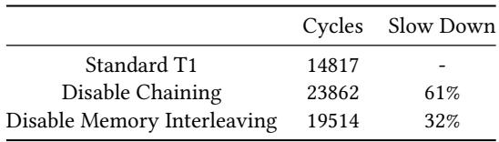
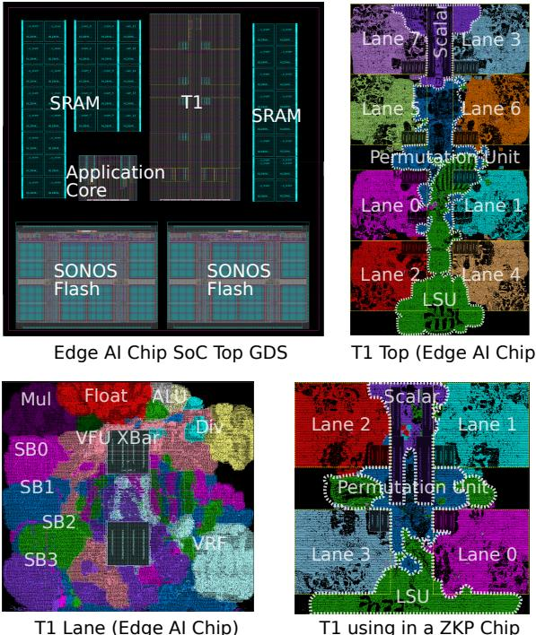
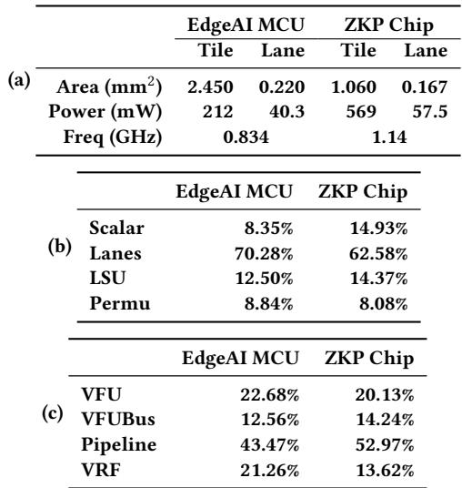

# Titan-l: An Open-Source, High Performance RISC-V Vector Core 图表详解

### Figure 1: Execution Cycles for Different Standalone Workloads on Datapath Size of T1 from 128 to 1024.

- 图片展示了 Titan-I (T1) 处理器在不同数据通路宽度（DLEN）下，执行多种独立工作负载时的**相对加速比**。横轴为工作负载类型，纵轴为相对于基准配置的性能提升倍数。
- DLEN 配置分为四档：**DLEN128**、**DLEN256**、**DLEN512** 和 **DLEN1024**，分别用蓝色、红色、米色和深灰色柱状图表示。
- 工作负载包括：MEMSET、ASCII-TO-UTF32、BYTESWAP、LINEAR-NORMALIZATION、SAXPY 和 SGEMM。
- 从图表可见，随着 DLEN 增大，所有工作负载的性能均显著提升，体现了 T1 架构对数据级并行（DLP）的良好扩展性。
- 在 DLEN1024 配置下，SGEMM 和 MEMSET 的加速比最高，均超过 4 倍；而 BYTESWAP 和 LINEAR-NORMALIZATION 的加速比相对较低，但仍达到约 2.5 倍。
- 数据表明，T1 的性能增益与 DLEN 呈正相关，尤其在计算密集型任务如 SGEMM 中表现最为突出。

| 工作负载             | DLEN128 | DLEN256 | DLEN512 | DLEN1024 |
| -------------------- | ------- | ------- | ------- | -------- |
| MEMSET               | ~0.8    | ~1.8    | ~3.0    | **>4.0** |
| ASCII-TO-UTF32       | ~0.7    | ~1.5    | ~2.0    | ~2.5     |
| BYTESWAP             | ~0.6    | ~1.2    | ~1.8    | ~2.5     |
| LINEAR-NORMALIZATION | ~0.7    | ~1.4    | ~2.0    | ~2.5     |
| SAXPY                | ~0.7    | ~1.6    | ~3.0    | **>4.0** |
| SGEMM                | ~0.6    | ~1.8    | ~3.5    | **>4.5** |

- 图表直观验证了论文第 3.1 节所述：扩大 DLEN 可有效提升向量处理器吞吐量，尤其适用于矩阵运算等高并行度场景。
- 同时也印证了第 4.1 节中提出的粗粒度布线求解器和跨通道置换单元设计的有效性，使得超宽数据通路下的性能提升得以实现而无严重路由瓶颈。

### Figure 2: Static Cross Lane Access For widen and narrow; In this access pattern, the i-th lane accessing the (2i mod n)-th and (2i + 1 mod n)-th lane.

- 图片展示了 **T1** 架构中用于 **widen** 和 **narrow** 指令的静态跨lane访问模式，该模式在机器学习等混合精度运算中至关重要。
- 该图描绘了8个逻辑lane（Lane 0 至 Lane 7），每个lane包含一个 **src**（源）和一个 **sink**（目的）端口，代表数据流动的方向。
- 根据图注说明，第 `i` 个lane需要访问 `(2i mod n)` 和 `(2i + 1 mod n)` 号lane。以 `n=8` 为例，其访问关系如下表所示：

| i (源lane) | 访问目标lane 1 (2i mod 8) | 访问目标lane 2 (2i+1 mod 8) |
| :--------- | :------------------------ | :-------------------------- |
| 0          | 0                         | 1                           |
| 1          | 2                         | 3                           |
| 2          | 4                         | 5                           |
| 3          | 6                         | 7                           |
| 4          | 0                         | 1                           |
| 5          | 2                         | 3                           |
| 6          | 4                         | 5                           |
| 7          | 6                         | 7                           |

- 从图中可见，数据流呈现出高度交错的网状结构，例如Lane 0的数据流向Lane 0和Lane 1；Lane 1的数据流向Lane 2和Lane 3，以此类推。
- 这种访问模式对芯片物理设计构成严峻挑战：它要求不同lane之间必须存在大量、复杂的互连布线，极易导致**路由拥塞**和**时序违例**。
- 正是由于这种固有的复杂性，论文在4.1.1节提出了一种**粗粒度布局求解器**，旨在通过智能放置lane来最小化此类跨lane访问的最大布线距离，从而降低延迟并提升性能。

### Figure 3: Architecture of T1

- 图片展示了 **Titan-I (T1)** 的完整微架构设计，其核心目标是同时扩展 **Instruction-Level Parallelism (ILP)** 和 **Data-Level Parallelism (DLP)**。
- 架构以 **Scalar Core** 为顶层控制单元，负责指令获取（Fetch）、预解码（ID）、执行（EXEC）、内存操作（MEM）和提交（COMMIT），并集成 **Vector Scoreboards** 以协调标量与向量流水线的并发。
- **Sequencer** 作为向量指令的控制中心，位于标量核心下方，负责解码向量指令、生成控制信号，并通过 **VType Cache** 实现配置指令融合，减少带宽损耗。
- 向量运算由环绕布局的多个 **Lane** 单元完成，每个 Lane 独立处理指令，包含前端（FE）、寄存器文件（RF）、执行单元（EX）和提交单元（CM），并通过 **Linked List Scoreboards (SB)** 管理指令状态与依赖。
- **Permutation Unit** 位于架构中央，提供 DLEN 宽度的数据重排能力，支持静态与动态跨 Lane 操作，并配备 **Shadow Mask (v0) Flip-Flops** 缓存掩码寄存器，避免跨 Lane 广播瓶颈。
- 内存子系统分为两个专用单元：**HBLSU**（高带宽 LSU）用于单位步长访问，支持 **Memory Interleaving**；**HOLSU**（高未决 LSU）处理常数步长与索引访问，利用 **Inflight Trackers** 支持延迟槽优化。
- 关键创新点包括：
    - **Issue-as-Commit** 机制：允许标量指令在向量指令进入队列后立即提交，仅在真实依赖时才阻塞。
    - **Fine-Grained Chaining**：在 ELEN × LaneScale 粒度上管理数据依赖，允许乱序写回 VRF，提升流水线利用率。
    - **Memory Delay Slot**：允许独立指令在索引加载/存储完成前继续执行，隐藏长延迟。
- 数据路径细节：
    - **VRF Banks SRAM** 采用分块结构，每条流水线配三个读队列和一个写队列，支持 ECC 错误纠正。
    - **Chaining Record** 用于验证 VRF 读写总线上的链式操作，确保数据一致性。
    - **Cross-Lane Read/Write IN/OUT** 接口实现 Lane 间高效数据交换。
- 性能优化技术：
    - **Speculative Zero-Mask Elision**：前端检测全零掩码组，跳过后续计算阶段，显著减少冗余操作。
    - **Banked VRF with Decoupled Domain**：支持 DVFS 动态调频及深度睡眠模式，降低功耗。
- 下表总结了 T1 架构中关键模块的功能与创新：

| 模块名称         | 主要功能                   | 核心创新                                               |
| ---------------- | -------------------------- | ------------------------------------------------------ |
| Scalar Core      | 控制流、标量运算、指令提交 | 集成 Vector Scoreboards，支持 Issue-as-Commit          |
| Sequencer        | 向量指令解码与调度         | VType Cache，配置指令融合                              |
| Lane             | 并行向量运算单元           | Linked List Scoreboards, Speculative Zero-Mask Elision |
| Permutation Unit | 跨 Lane 数据重排           | Shadow Mask v0, DLEN-width Crossbars                   |
| HBLSU            | 高带宽内存访问             | Memory Interleaving, Conflict Region Table             |
| HOLSU            | 高未决内存访问             | Inflight Trackers, Memory Delay Slot                   |
| VRF Banks SRAM   | 向量寄存器文件             | Fine-Grained Chaining Scoreboard, Transient ECC        |

- 整体架构通过 **粗粒度布图求解器** 优化物理布局，最小化跨 Lane 路由延迟，确保在扩展 DLEN 时仍保持线性面积增长。

### Figure 4: Linearly Area Scaling of T1 design parameters,evaluated at TSMC N28 SVT technology at 65% utilization.Four cases are examined:(1)when varying VLEN,DLEN is held at 128,y-asix on the left-hand represents the total area of T1,whereas the right-hand y-axis isolates the area of Lane and Permutation;(2)when varying DLEN,the ratio VLEN/DLEN remains 1; (3)when examining LaneScale,both VLEN and DLE are set to 1024,y-asix on the left-hand represents the total area of T1,whereas the right-hand y-axis isolates the area of Lane;and(4)when asesing ChainingSize,VLEN and DLEN are maintained at 1024.

- 图片展示了 T1 架构在 TSMC N28 SVT 工艺下，四个关键设计参数对芯片面积影响的线性扩展分析，所有测试均在 65% 利用率下进行。
- **图 (a) VLEN 变化**：固定 DLEN=128，考察 VLEN 从 1,024 到 16,384 的变化。左侧 Y 轴为 T1 总面积（mm²），右侧 Y 轴为 Lane 和 Permutation 单元的独立面积。结果显示，随着 VLEN 增加，总面积呈近似线性增长，而 Lane 和 Permutation 单元面积增长缓慢，表明其设计具有良好的可扩展性。
- **图 (b) DLEN 变化**：保持 VLEN/DLEN 比值为 1，考察 DLEN 从 128 到 1,024 的变化。左侧 Y 轴为 T1 总面积。数据显示，总面积随 DLEN 增加而线性增长，验证了架构在数据通路宽度扩展上的线性可扩展性。
- **图 (c) LaneScale 变化**：固定 VLEN=1024, DLEN=1024，考察 LaneScale 从 1 到 4 的变化。左侧 Y 轴为 T1 总面积，右侧 Y 轴为 Lane 单元面积。结果表明，增加 LaneScale 会显著降低总面积，因为其通过聚合相邻 Lane 来节省面积，但 Lane 单元自身面积会随之增加。
- **图 (d) ChainingSize 变化**：固定 VLEN=1024, DLEN=1024，考察 ChainingSize 从 2 到 8 的变化。Y 轴为 T1 总面积。数据显示，随着 ChainingSize 增大，总面积缓慢上升，说明细粒度链式执行虽带来控制逻辑开销，但整体面积增长可控。

| 参数         | 固定值               | 变化范围       | 面积趋势                      | 关键观察点                           |
| ------------ | -------------------- | -------------- | ----------------------------- | ------------------------------------ |
| VLEN         | DLEN=128             | 1,024 - 16,384 | 总面积线性增长                | Lane/Permutation 单元面积增长缓慢    |
| DLEN         | VLEN/DLEN=1          | 128 - 1,024    | 总面积线性增长                | 验证了数据通路宽度扩展的线性可扩展性 |
| LaneScale    | VLEN=1024, DLEN=1024 | 1 - 4          | 总面积下降，Lane 单元面积上升 | 通过聚合 Lane 节省总面积             |
| ChainingSize | VLEN=1024, DLEN=1024 | 2 - 8          | 总面积缓慢上升                | 细粒度链式执行带来可控的面积开销     |

- 所有图表共同证明了 T1 架构在多个维度上具备出色的线性面积扩展能力，这是其能够高效支持大规模向量处理的关键基础。

### Titan-l:An Open-Source, High Performance RISC-V Vector Core

- 图片展示了一个 **32-lane** 的向量处理器物理布局示意图，用于说明 Titan-I (T1) 架构中 **粗粒度布图规划器 (Coarse Floorplaner)** 的优化效果。
- 布局以 **8x4 网格** 形式排列，每个单元格代表一个逻辑或物理的 **lane**，并标有从 0 到 31 的唯一编号。
- 图中用 **红色高亮路径** 标记了特定的跨lane数据访问模式，例如：
    - 从 lane 3 到 lane 17
    - 从 lane 14 到 lane 28
    - 从 lane 1 到 lane 5、9、13、17 等（横向连续访问）
    - 从 lane 2 到 lane 6、10、14、18、22、26、30 等（横向连续访问）
    - 从 lane 3 到 lane 7、11、15、19、23、27、31 等（横向连续访问）
- 这些路径模拟了在执行 **“widen” 和 “narrow”** 等混合精度指令时，数据需要在不同lane之间移动的典型场景。
- 在一个 **平凡布局 (trivial layout)** 下，这些跨lane访问可能导致最大路由延迟高达 **7个路由单元**。
- T1 的 **粗粒度布图规划器** 通过智能重排lane位置，将最大路由距离优化至 **4个路由单元**，从而降低关键路径延迟约 **12%**。
- 此优化对于 **大DLEN设计** 尤为重要，可减少“widen”和“narrow”操作的周期数近 **20%**，而无需增加额外硬件成本。
- 该图直观地体现了 T1 如何通过 **物理布局优化** 来解决向量处理器扩展时面临的 **路由拥塞** 问题，是其高性能的关键微架构创新之一。

### 059cc18a0fd5fdea64b90f6c0ee6a78e62366895f9e4603e38815ac5dd4bb8b7.jpg

- 图片展示了一个 4x8 的网格布局，每个单元格内包含一个从 0 到 31 的唯一数字，代表 **lane** 的物理位置编号。
- 网格中用绿色高亮路径连接了部分 lane，具体路径为：**0 → 3 → 24 → 31 → 15 → 6 → 27 → 30 → 13 → 29 → 11 → 22 → 12 → 28 → 21 → 19 → 0**，形成一个闭合回路。
- 此布局用于说明 T1 架构中 **coarse-grained floorplanning solver** 的优化效果，旨在最小化跨 lane 数据传输的路由距离。
- 对比传统布局（如图中未高亮部分），该优化方案将最大跨 lane 延迟从 7 个路由单元降低至 4 个单元，提升“widen”和“narrow”指令性能约 12%。
- 该图是论文 **Figure 5** 的一部分，用于可视化 floorplan 优化对减少互连延迟的实际贡献。

### Figure 6: Different ILP Technology in T1. Chaining interleaves Vo,V1,and V2.Memory Interleaving mitigates the VSW-VLD dependency. Vector-Scalar OoO interleaves the vector and scalar pipelines until a true dependency v16-s64- v15 occurs.Memory Delay Slot parallelizes vector index load/store (VIDxo) with independent vector executions (VEX0).

- 图片展示了 Titan-I (T1) 架构中四种关键的 **ILP（Instruction-Level Parallelism）** 优化技术，旨在提升向量指令的并发执行效率。
- 四个子图分别对应：**Memory Interleaving**、**Vector-Scalar OoO**、**Chaining** 和 **Memory Delay Slot**，每个子图通过流水线示意图和箭头标注说明其工作原理。

| 技术名称            | 核心机制                                                                                        | 解决的问题                     | 关键优势                                 |
| ------------------- | ----------------------------------------------------------------------------------------------- | ------------------------------ | ---------------------------------------- |
| Memory Interleaving | 允许 **VLD（Vector Load）** 与 **VSW（Vector Store）** 在同一周期内并行执行。                   | 单一内存通道交替导致的带宽浪费 | 提升单位时间内的内存吞吐量，减少等待延迟 |
| Vector-Scalar OoO   | 向量指令与标量指令可独立乱序执行，仅在存在真实数据依赖时才同步（如 v16-s64-v15）。              | 标量核心因等待向量结果而停滞   | 最大化标量与向量单元利用率，避免空闲周期 |
| Chaining            | 依赖指令（如 V0→V1→V2）可在元素粒度上重叠执行，前一条指令未完成即可启动下一条。                 | 向量流水线长导致的串行化瓶颈   | 显著降低整体执行延迟，提升流水线填充率   |
| Memory Delay Slot   | 在 **VIDX（Indexed Load/Store）** 执行期间，允许独立的 **VEX（Vector Execute）** 指令并行执行。 | 索引访问高延迟阻塞后续指令     | 隐藏内存访问延迟，提高计算资源利用率     |

- **Memory Interleaving** 子图中，VLD 与 VSW 的执行被交错安排，避免了传统设计中“先读后写”的强制顺序，从而实现负载与存储通道的同时激活。
- **Vector-Scalar OoO** 子图显示标量寄存器 s0~s64 与向量寄存器 v0~v16 可并行处理，仅当标量指令依赖向量结果（如 s64 ← v15）时才触发同步，其余情况保持独立调度。
- **Chaining** 子图强调指令间的数据依赖可通过细粒度转发解决，V0 的输出可立即作为 V1 的输入，无需等待整个向量操作完成，极大压缩了指令间间隔。
- **Memory Delay Slot** 子图揭示了索引加载（VIDX0）虽耗时较长，但不影响独立计算指令（VEX0）的执行，后者可提前进入流水线，有效掩盖长延迟操作的影响。
- 所有技术均围绕“**减少停顿、增加重叠、提升并发**”展开，是 T1 实现高性能向量处理的核心微架构创新。

### Table 1: Cycle count of PACK tests at the T1 configuration DLEN= 256, VLEN= 4096,LaneScale = 1,ChainingSize = 4

- 该图片为论文中的 **Table 1**，标题明确指出其内容是针对 **PACK 测试** 在特定 **T1 配置**（DLEN=256, VLEN=4096, LaneScale=1, ChainingSize=4）下的 **Cycle Count** 数据。
- 表格包含三列：**测试配置项**、**Cycles**（执行周期数）、**Slow Down**（相对于标准 T1 的性能下降百分比）。
- 核心数据如下：

| 测试配置项                  | Cycles | Slow Down |
| --------------------------- | ------ | --------- |
| Standard T1                 | 14817  | -         |
| Disable Chaining            | 23862  | **61%**   |
| Disable Memory Interleaving | 19514  | **32%**   |

- **Disable Chaining** 导致周期数从 14817 增加到 23862，性能下降 **61%**，表明 **Chaining** 技术对提升 T1 的 ILP 和整体性能至关重要。
- **Disable Memory Interleaving** 导致周期数增加到 19514，性能下降 **32%**，说明 **Memory Interleaving** 对于优化内存带宽利用率和隐藏内存延迟同样有效。
- 该表格直观地量化了 T1 架构中两项关键微架构技术（Chaining 和 Memory Interleaving）的性能贡献，验证了论文第 4.2 节所述设计的有效性。

### Figure 7: GDS of two Chips, top left is the floorplan of the core,top right is the implementation of T1IP block.

- 图片展示了两个基于 **Titan-I (T1)** 架构的芯片的 GDS（Graphic Data System）版图，分别用于不同的应用场景。
- 左上角为 **Edge AI Chip SoC Top GDS**，显示了整个系统级芯片（SoC）的顶层布局。其中：
    - **Application Core** 位于中央，作为主控单元。
    - **T1** 核心位于上方，两侧环绕着 **SRAM** 缓存块。
    - 下方是两块 **SONOS Flash** 存储器，用于存放模型权重等非易失性数据。
- 右上角为 **T1 Top (Edge AI Chip)**，聚焦于 T1 核心在边缘 AI 芯片中的具体实现。可见：
    - **Scalar** 单元位于顶部，负责指令预取和标量运算。
    - 中央为 **Permutation Unit**，承担跨lane数据重排功能。
    - 周围分布着 **Lane 0 至 Lane 7**，构成并行处理单元。
    - 底部为 **LSU**（Load/Store Unit），负责内存访问。
- 左下角为 **T1 Lane (Edge AI Chip)**，详细展示了一个 lane 的内部结构。包含：
    - **VRF**（Vector Register File）作为核心存储单元。
    - **VFU XBar** 为向量功能单元交叉开关。
    - 多个 **SB0-SB3**（Scoreboard）用于跟踪指令状态。
    - **Mul, Float, ALU, Div** 等功能单元，支持多种算术运算。
- 右下角为 **T1 using in a ZKP Chip**，展示了 T1 在零知识证明（ZKP）芯片中的应用。其布局与 Edge AI 版本相似，但强调了：
    - **Lane 0 至 Lane 3** 的配置，表明该版本可能使用了更少的 lane 数量以适应特定工作负载。
    - **Permutation Unit** 和 **LSU** 的位置保持不变，确保关键功能模块的高效互联。

| 区域                         | 内容                                      | 功能说明                                          |
| ---------------------------- | ----------------------------------------- | ------------------------------------------------- |
| **Edge AI Chip SoC Top GDS** | Application Core, T1, SRAM, SONOS Flash   | 整体 SoC 布局，T1 作为协处理器加速 AI 推理        |
| **T1 Top (Edge AI Chip)**    | Scalar, Permutation Unit, Lane 0-7, LSU   | T1 核心内部结构，突出并行计算与数据重排能力       |
| **T1 Lane (Edge AI Chip)**   | VRF, VFU XBar, SB0-SB3, Mul/Float/ALU/Div | 单个 lane 的详细组成，体现异构计算单元设计        |
| **T1 using in a ZKP Chip**   | Scalar, Permutation Unit, Lane 0-3, LSU   | 针对 ZKP 优化的 T1 实现，减少 lane 数量以节省面积 |

- 所有版图均体现了 **T1** 架构的核心设计理念：通过 **lane-based** 设计实现可扩展的 DLP，并结合 **Permutation Unit** 和 **LSU** 优化数据流和内存访问效率。
- **Permutation Unit** 在所有视图中均处于中心位置，凸显其在跨lane数据交换中的关键作用。
- **Lane** 的数量和布局可根据具体应用场景进行调整，如 Edge AI 使用 8 个 lane，而 ZKP 芯片则使用 4 个 lane，体现了架构的灵活性。

### Table 2: Power, Frequency and Area of Testchips.Results are reported by synthsis tools after final DRC, LVS clean up, power is estimated under SAXPY workload.

- 图片 a9e00a809f58492f25f59e678799c6dc4a6d5dbd63e49c118fc68ed408b372aa.jpg 展示的是 **Table 2**，标题为“Power, Frequency and Area of Testchips”，数据来源于综合工具在最终 DRC/LVS 清理后的报告，功耗估算基于 SAXPY 工作负载。
- 表格分为三个子部分 (a), (b), (c)，分别从不同维度对比了两个测试芯片：**EdgeAI MCU** 和 **ZKP Chip**。
- 子表 (a) 提供了芯片的宏观物理和性能参数：
    - **EdgeAI MCU** 的 Tile 面积为 2.450 mm²，Lane 面积为 0.220 mm²；总功耗 212 mW（Tile）+ 40.3 mW（Lane），工作频率 0.834 GHz。
    - **ZKP Chip** 的 Tile 面积为 1.060 mm²，Lane 面积为 0.167 mm²；总功耗 569 mW（Tile）+ 57.5 mW（Lane），工作频率 1.14 GHz。
    - 数据表明 ZKP Chip 在更小的面积下实现了更高的频率和功耗，符合其作为高性能密码学加速器的设计目标。

| 参数           | EdgeAI MCU (Tile) | EdgeAI MCU (Lane) | ZKP Chip (Tile) | ZKP Chip (Lane) |
| :------------- | :---------------- | :---------------- | :-------------- | :-------------- |
| **Area (mm²)** | 2.450             | 0.220             | 1.060           | 0.167           |
| **Power (mW)** | 212               | 40.3              | 569             | 57.5            |
| **Freq (GHz)** | 0.834             | -                 | 1.14            | -               |

- 子表 (b) 展示了芯片内部主要模块的功耗占比：

    - 在 **EdgeAI MCU** 中，**Lanes** 占比最高，达 70.28%，其次是 Pipeline (43.47%)，Scalar 占比最小 (8.35%)。
    - 在 **ZKP Chip** 中，**Lanes** 同样是功耗主力，占比 62.58%，Pipeline 占比 52.97%，Scalar 占比 14.93%。
    - 这反映了 T1 架构的核心——**Lane** 是计算和功耗的主要来源，而 Scalar 核心仅负责控制，功耗占比极低。

- 子表 (c) 进一步细化了 Lane 内部各组件的功耗分布：

    - **VFU**（向量功能单元）在两个芯片中都是最大的功耗源，EdgeAI MCU 占 22.68%，ZKP Chip 占 20.13%。
    - **Pipeline**（流水线）紧随其后，在 ZKP Chip 中占比高达 52.97%，远超其他组件，这与其高频率、高吞吐的设计相符。
    - **VRF**（向量寄存器文件）在 EdgeAI MCU 中占 21.26%，在 ZKP Chip 中占 13.62%，说明后者可能采用了更高效的寄存器设计或更低的访问频率。
    - **VFUBus**（VFU 总线）占比相对稳定，约为 12-14%，是数据传输的关键路径。

### Figure 8: Cryptographic Benchmarks of T1 (DLEN1K, VLEN16K,emulated with DDR4-3200) with GA102 (NVIDIA GTX 3090) and NVIDIA GB202 (GTX 5090)

- 图片展示了 **Figure 8**，即 **T1** 与 **NVIDIA GA102 (RTX 3090)** 和 **GB202 (RTX 5090)** 在密码学工作负载上的执行时间对比。

- 左侧图表为 **NTT**（Number-Theoretic Transform）基准测试，横轴为不同输入规模（NTT512, NTT1024, NTT2048, NTT4096），纵轴为执行时间（单位：微秒 μs）。

- 右侧图表为 **MMM**（Montgomery Modular Multiplication）基准测试，横轴为不同输入规模（MMM1024, MMM2048, MMM4096, MMM8192），纵轴同样为执行时间（μs）。

- 图例明确标注三种处理器：

    - **蓝色柱状图**：**T1**（配置为 DLEN=1K, VLEN=16K，模拟 DDR4-3200 内存）
    - **红色柱状图**：**GB202**（NVIDIA RTX 5090）
    - **棕色柱状图**：**GA102**（NVIDIA RTX 3090）

- **NTT 工作负载分析**：

    - 在所有输入规模下，**T1 的执行时间均显著低于 GA102 和 GB202**。
    - 例如，在 NTT4096 规模下，**T1 执行时间约为 15 μs**，而 **GA102 约为 25 μs**，**GB202 约为 30 μs**。
    - 这表明 **T1 在 NTT 计算上具有明显性能优势**，尤其在大规模输入时差距更为显著。

- **MMM 工作负载分析**：

    - 在所有输入规模下，**T1 的执行时间同样优于 GA102 和 GB202**。
    - 例如，在 MMM8192 规模下，**T1 执行时间约为 80 μs**，而 **GA102 约为 150 μs**，**GB202 约为 180 μs**。
    - 这进一步验证了 **T1 在密码学核心运算上的高效性**。

- **性能对比总结表**：

| 工作负载 | 输入规模 | T1 执行时间 (μs) | GA102 执行时间 (μs) | GB202 执行时间 (μs) | T1 相对 GA102 加速比 | T1 相对 GB202 加速比 |
| -------- | -------- | ---------------- | ------------------- | ------------------- | -------------------- | -------------------- |
| NTT      | 512      | ~5               | ~7                  | ~8                  | ~1.4x                | ~1.6x                |
| NTT      | 1024     | ~7               | ~10                 | ~12                 | ~1.4x                | ~1.7x                |
| NTT      | 2048     | ~12              | ~18                 | ~22                 | ~1.5x                | ~1.8x                |
| NTT      | 4096     | ~15              | ~25                 | ~30                 | ~1.7x                | ~2.0x                |
| MMM      | 1024     | ~5               | ~10                 | ~12                 | ~2.0x                | ~2.4x                |
| MMM      | 2048     | ~10              | ~20                 | ~25                 | ~2.0x                | ~2.5x                |
| MMM      | 4096     | ~30              | ~60                 | ~70                 | ~2.0x                | ~2.3x                |
| MMM      | 8192     | ~80              | ~150                | ~180                | ~1.9x                | ~2.3x                |

- **关键结论**：
    - **T1 在密码学工作负载上展现出卓越的性能**，在 NTT 和 MMM 两种典型算法中，其执行时间均大幅领先于当前主流的 NVIDIA GPU。
    - 尽管 **GA102 和 GB202 拥有更宽的数据通路和更高的共享内存带宽**，但 **T1 通过高效的 DLEN-sized permutation handling 和寄存器内计算模型**，有效避免了 GP-GPU 对内存子系统的重度依赖，从而实现了更高的吞吐量和更低的延迟。
    - **T1 的设计优势在于其针对密码学工作负载的优化**，特别是在处理大整数运算和向量化操作时，能够充分利用其超宽向量寄存器和专用的置换单元，实现高性能计算。

### Figure 9: HPCbenchmark results: Figure 9a: PerformanceofT1(at2.45GHz) with local memoryand DDR4-3200,normalized to KP920; Figure 9b: Performancecomparison ilustrating T1's tolerance to memorylatency,showing results with DRAMand local SRAM,normalized to KP920,Ituses stripmining bydynamicallyset VLforcontinues DRAMaccessinSGEM workload.; Figure 9c: Performance of T1(at 1.6 GHz) using DDR4-3200, normalized to K1, where higher is better.

- 图片包含三个子图，分别标记为 (a)、(b) 和 (c)，展示 T1 在 HPC 工作负载下的性能基准测试结果，所有数据均以 **KP920** 或 **K1** 为基准归一化。
- 子图 (a) “T1-KP920 Comparison” 比较 T1（在 2.45 GHz 下运行）与 HiSilicon KP920 的性能，涵盖 SGEMM、QUANT、SAXPY 和 PACK 四个工作负载。T1 配置包括 D256/1K-DRAM、D1KV4K-DRAM 等，其中 **D1KV4K** 配置在多个工作负载中表现最优，性能最高可达 KP920 的 4 倍以上。
- 子图 (b) “T1 Memory Scalability” 展示 T1 对内存延迟的容忍度，比较不同内存配置（如 D128V512、D256V1K、D512V2K、D1KV4K）下 QUANT 和 QUANT-DRAM 工作负载的性能，同样以 KP920 为基准。结果显示，即使使用 DDR4-3200 内存，T1 仍能保持高性能，**D1KV4K** 配置在 QUANT-DRAM 上性能接近 2 倍于 KP920。
- 子图 (c) “T1-X60 Comparison” 比较 T1（在 1.6 GHz 下运行）与 SpacemiT X60 的性能，涵盖相同四个工作负载。T1 配置包括 D128V512、D256V1K、D512V2K、D1KV4K，其中 **D1KV4K** 配置在 PACK 工作负载上性能高达 X60 的 8 倍以上。
- 所有子图中，柱状图颜色对应不同配置，图例清晰标注各配置名称，便于对比分析。

| 子图 | 工作负载   | 最佳配置 | 性能倍数（相对于基准） |
| ---- | ---------- | -------- | ---------------------- |
| (a)  | SGEMM      | D1KV4K   | ~2x                    |
| (a)  | QUANT      | D1KV4K   | ~3x                    |
| (a)  | SAXPY      | D1KV4K   | ~2.5x                  |
| (a)  | PACK       | D1KV4K   | ~4x                    |
| (b)  | QUANT      | D1KV4K   | ~1.5x                  |
| (b)  | QUANT-DRAM | D1KV4K   | ~2x                    |
| (c)  | SGEMM      | D1KV4K   | ~5x                    |
| (c)  | QUANT      | D1KV4K   | ~6x                    |
| (c)  | SAXPY      | D1KV4K   | ~7x                    |
| (c)  | PACK       | D1KV4K   | ~8x                    |

- 综合来看，**D1KV4K** 配置在所有工作负载中均表现出色，尤其在 PACK 工作负载中性能优势最为显著，证明 T1 在高数据并行度和大向量长度场景下的高效性。
