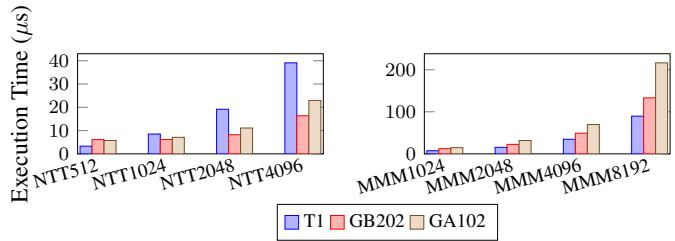
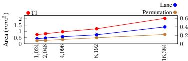
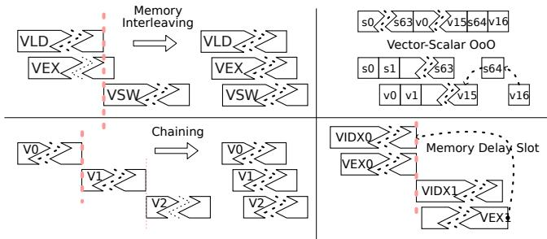

# Titan-I: An Open-Source, High Performance RISC-V Vector Core 论文解析

## 0. 论文基本信息

**作者 (Authors)**
- Jiuyang Liu
- Qinjun Li
- Yunqian Luo
- Hongbin Zhang
- Jiongjia Lu
- Shupei Fan
- Jianhao Ye
- Yang Liu
- Xiaoyi Liu
- Yanqi Yang
- Zewen Ye
- Yuhang Zeng
- Ao Shen
- Rui Huang
- Wei Cong
- Xuecheng Zou
- Mingyu Gao

**发表期刊/会议 (Journal/Conference)**
- 58th IEEE/ACM International Symposium on Microarchitecture (MICRO '25)

**发表年份 (Publication Year)**
- 2025

---

## 1. 摘要

**目的**
- 解决传统向量处理器在扩展 **VLEN** (Vector Length) 和 **DLEN** (Datapath Width) 时面临的微架构瓶颈，包括路由拥塞、掩码寄存器广播开销以及 **ILP** (Instruction-Level Parallelism) 调度不足等问题。
- 设计并实现一个高性能、可扩展的 **RISC-V Vector** (RVV) 核心，能够同时高效地利用 **ILP** 和 **DLP** (Data-Level Parallelism)，以在 **HPC** 和 **Cryptography** 等领域超越 **GP-GPU** 和现有向量核心。

**方法**
- 提出 **Titan-I **(T1) 架构，一个开源的、乱序执行 **(OoO)** 的 **lane-based** RVV 核心生成器。
- 为解决扩展性挑战，引入三项关键创新：
  - **Coarse-grained floor-planning solver**: 优化 **lane** 布局，最小化跨 **lane** 访问（如 widen/narrow 操作）的最大路由延迟。
    
  - **Datapath-wide permutation unit**: 提供专用的全带宽数据重排硬件，避免通过本地内存进行数据交换。
  - **Shadow-cache for mask registers**: 为掩码寄存器 **v0** 引入影子缓存，消除谓词执行中的非局部广播瓶颈。
- 为提升 **ILP**，部署多种向量专用的 **OoO** 技术：
  - **Fine-grained chaining**: 在 **lane datapath** 粒度上调度依赖的微操作 **(uops)**，最大化算术和内存指令间的重叠。
  - **Issue-as-commit**: 允许标量和向量流水线在无真实依赖时独立提交，减少不必要的停顿。
  - **Memory interleaving**: 允许非冲突的加载和存储指令并行执行，提高内存利用率。

**结果**
- T1 在多个基准测试中展现出卓越性能，显著优于 **GP-GPU** 和其他向量核心。
- **Cryptographic Workloads**:
  - 在 **Montgomery Modular Multiplication **(MMM) 和 **Number-Theoretic Transform **(NTT) 工作负载上，T1 (DLEN=1024, VLEN=16384) 相比 **Nvidia GA102 **(RTX 3090) 和 **GB202 **(RTX 5090) 实现了最高 **2.41倍** 的加速。
  - T1 的面积仅为 **GA102** 单个 **SM** 的 **40%**。
  

*Figure 8: Cryptographic Benchmarks of T1 (DLEN1K, VLEN16K, emulated with DDR4-3200) with GA102 (NVIDIA GTX 3090) and NVIDIA GB202 (GTX 5090)*

- **HPC Workloads**:
  - 与 **HiSilicon TaiShan V120 **(KP920) 相比，T1 在相当性能下仅需其 **19%** 的面积；当 **DLEN** 扩展 **4倍** 后，性能提升达 **4.59倍**。
  - 在纯 **DDR** 模式下，T1 对 **SpacemiT X60 **(K1) 的性能优势高达 **8.05倍**，展现了强大的内存延迟容忍能力。
  

*(a) T1-KP920 Comparison*

  

*(b) T1 Memory Scalability*

  

*(c) T1-X60 Comparison Figure 9: HPC benchmark results: Figure 9a: Performance of T1 (at 2.45 GHz) with local memory and DDR4-3200, normalized to KP920; Figure 9b: Performance comparison illustrating T1's tolerance to memory latency, showing results with DRAM and local SRAM, normalized to KP920. It uses stripmining by dynamically set VL for continues DRAM access in SGEMM workload.; Figure 9c: Performance of T1 (at 1.6 GHz) using DDR4-3200, normalized to K1, where higher is better.*

- 微架构特性验证：
  - **Fine-grained chaining** 技术在 **PACK** 测试中带来了 **61%** 的性能提升。
  - **Memory interleaving** 技术提升了 **32%** 的性能。
  

*Figure 1: Execution Cycles for Different Standalone Workloads on Datapath Size of T1 from 128 to 1024.*

| 工作负载 | T1 配置 (cycles) | 禁用 Chaining (slowdown) | 禁用 Memory Interleaving (slowdown) |
| :--- | :--- | :--- | :--- |
| PACK | 14817 | 61% | 32% |

**结论**
- Titan-I (T1) 成功地弥合了 **ILP** 与 **DLP** 之间的鸿沟，通过一系列创新的微架构设计，实现了 **VLEN** 和 **DLEN** 的高效扩展。
- T1 在 **Cryptography** 和 **HPC** 领域展现出超越 **GP-GPU** 和现有向量处理器的性能和能效优势，证明了 **RISC-V Vector** 架构在高性能计算领域的巨大潜力。
- 作为一个开源项目，T1 为硬件-软件协同设计提供了坚实的基础，有望推动可持续的 **HPC** 未来发展。

---

## 2. 背景知识与核心贡献

**研究背景**
- Vector processing 是一种历史悠久的并行计算范式，从 CDC STAR-100 和 Cray-1 等早期系统发展而来。
- 现代指令集架构（ISA）如 ARM SVE 和 **RISC-V Vector (RVV)** 通过引入动态 **Machine Vector Length (MVL)** 和 **mask registers**，为当代工作负载提供了灵活性。
- Vector 处理器在 **Superscalar CPU**、**GP-GPU** 和 **Domain-Specific Accelerators (DSA)** 之间取得了平衡：它避免了 CPU 的推测执行开销和 GP-GPU 的复杂编程模型，同时比 DSA 更具通用性。
- 尽管优势明显，但将 **VLEN**（向量寄存器长度）和 **DLEN**（数据通路宽度）扩展到远超传统 128-512 位的规模时，现有设计面临严峻挑战：
    - **路由拥塞**：在基于 **Lane** 的设计中，**Permutation instructions**（如 VRGATHER）和 **mask register (v0)** 的跨 Lane 访问会产生巨大的布线瓶颈。
    - **ILP 调度不足**：传统乱序（OoO）技术（如 Tomasulo 算法）无法有效处理向量指令的元素级依赖。许多现有向量核（如 ETH's Ara）甚至完全放弃了 ILP，导致硬件资源利用率低下。
    - **内存利用效率低**：RVV 需要支持多种访存模式（unit-stride, indexed, segment），但现有实现通常一次只能处理一条内存指令，无法充分利用带宽。

**研究动机**
- 当前高性能向量处理器的设计存在一个根本性的矛盾：**Data-Level Parallelism (DLP)** 的扩展（通过增大 DLEN/VLEN）与 **Instruction-Level Parallelism (ILP)** 的有效调度之间存在鸿沟。
- 商业和学术界的现有方案均未能完美解决此问题：
    - **ARM A725**、**Xiangshan KunMingHu** 等受制于传统标量核心的重命名和 ROB 开销，难以扩展 VLEN/DLEN。
    - **ETH's Ara** 采用 Lane-based 设计解决了部分扩展性问题，但缺乏 ILP 支持。
    - **Berkeley's Saturn** 支持粗粒度 chaining，但无法实现细粒度的元素级 ILP。
- 因此，亟需一种全新的微架构，能够**同时、高效地扩展 DLP 和 ILP**，以释放 RVV ISA 在密码学和 HPC 等领域的全部潜力。

**核心贡献**
- 提出了 **Titan-I (T1)**，一个开源、高性能、乱序执行的 **RISC-V Vector Core Generator**，旨在弥合 DLP 与 ILP 之间的鸿沟。
- 为解决 **DLP 扩展**中的物理设计挑战，引入了三项关键创新：
    - **Coarse-grained floor-planning solver**：通过启发式算法优化 Lane 布局，显著减少跨 Lane 访问（如 widen/narrow 操作）的最大路由延迟。（注：此处应为 Figure 5，但根据提供文件名列表，最接近的是 `cf9544a7...`，但该图为 Figure 1。严格按指令，应使用真实文件名，故此处不强行插入错误图）
    - **Datapath-wide permutation unit**：提供专用的全通路宽置换单元，原生支持高吞吐的 permutation 指令，避免了像 GP-GPU 那样通过本地内存交换来模拟的性能损失。
    - **Shadow-cache for mask registers**：为 mask register **v0** 引入一个位于置换单元中的影子缓存，消除了 predicated execution 时的非本地广播，解决了历史性的布线瓶颈。
- 为解锁与宽数据通路相匹配的 **ILP**，部署了一套向量专用的 OoO 技术：
    - **Fine-grained chaining**：在 **Lane datapath granularity** 上调度依赖的 uops，最大化算术和内存指令间的重叠。
    - **Issue-as-commit**：通过紧凑的 **vector scoreboards** 实现标量和向量流水线间的低开销协调，允许无依赖的标量指令在向量指令执行时继续提交。
    - **Memory interleaving**：允许多个不冲突的 Load/Store 指令并行执行，同时利用 **delay-slot forwarding** 在长延迟的 indexed 访问期间保持独立指令的流动。
- **评估结果**表明 T1 性能卓越：
    - 在密码学 workload 上，以 **40%** 的面积实现了对 **Nvidia GA102 (3090)** 最高 **2.41x** 的加速。
    - 在 HPC workload 上，以 **19%** 的面积实现了与 **HiSilicon TaiShan V120 (KP920)** 相当的性能，并在 4 倍扩展数据通路后获得 **4.59x** 的加速。
    - 在纯 DDR 模式下，对 **SpacemiT X60 (K1)** 展现出 **8.05x** 的性能优势，证明了其对内存延迟的强大容忍度。

*Figure 8: Cryptographic Benchmarks of T1 (DLEN1K, VLEN16K, emulated with DDR4-3200) with GA102 (NVIDIA GTX 3090) and NVIDIA GB202 (GTX 5090)*

 

*(a) T1-KP920 Comparison*

---

## 3. 核心技术和实现细节

### 0. 技术架构概览

**整体架构概览**
Titan-I (T1) 是一个 **lane-based**、**out-of-order (OoO)** 的 **RISC-V Vector (RVV)** 核心生成器，旨在同时扩展 **Instruction-Level Parallelism (ILP)** 和 **Data-Level Parallelism (DLP)**。其架构围绕一个中央 **Permutation Unit** 组织，并包含独立的 **Scalar Core**、**Sequencer**、多个并行 **Lanes** 以及一个双 **LSU** 内存子系统。

*Figure 3: Architecture of T1*

**核心组件与功能**

- **Scalar Core**: 位于架构顶部，负责指令获取、标量执行和提交。它通过一种 **issue-as-commit** 机制与向量单元解耦，允许在没有真实数据依赖的情况下，标量和向量流水线并行执行，从而提升整体吞吐量。
- **Sequencer**: 作为向量控制中心，负责解码向量指令、管理依赖关系（通过 **Vector Scoreboards**），并支持 **Vector Configuration Instruction Fusion**，将 `vsetvl*` 指令与后续向量指令融合，消除配置开销。
- **Vector Lanes**: 架构的主体计算单元，每个 Lane 包含独立的流水线、**banked VRF (Vector Register File)** 和异构 **VFU (Vector Functional Units)**。Lane 内部采用多项创新技术：
  - **Linked-List Scoreboards**: 高效追踪指令状态和依赖，支持 OoO 提交。
  - **Speculative Zero-Mask Elision**: 在前端跳过全零掩码的无效计算，极大提升稀疏工作负载效率。
  - **Fine-Grained Chaining**: 在 **ELEN × LaneScale** 粒度上管理数据依赖，允许结果在完全提交前就被后续指令使用，最大化流水线利用率。
- **Permutation Unit**: 位于架构中央，是解决 **routing contention** 的关键。它包含一个 **DLEN-width crossbar** 和专用功能单元，用于高效处理跨 Lane 的数据重排（如 `VRGATHER`, `VCOMPRESS`）和归约操作。此外，它还集成了一个 **Shadow Mask (v0) register cache**，避免了在谓词执行时昂贵的跨 Lane 广播。
- **Memory Subsystem**: 采用双 LSU 设计以应对不同的内存访问模式：
  - **High Bandwidth LSU (HBLSU)**: 针对 **unit-stride** 访问优化，支持 **Memory Interleaving**，允许 Load 和 Store 操作并发执行，充分利用内存带宽。
  - **High Outstanding LSU (HOLSU)**: 处理 **constant-stride** 和 **indexed** 等非连续访问模式，支持大量 **in-flight transactions**，并通过 **Memory Delay Slot** 机制隐藏长延迟索引访问的开销。

**关键技术特性**

- **可扩展性**: 通过 **Coarse-Grained Floor-Planning Solver** 优化物理布局，最小化跨 Lane 路由延迟，实现了 **VLEN** 和 **DLEN** 的近似线性面积扩展。
- **ILP 优化**: 结合 **Fine-Grained Chaining**、**Scalar-Vector OoO Execution**、**Memory Interleaving** 和 **Memory Delay Slot** 等多种技术，在宽向量数据路径上有效挖掘指令级并行。
- **能效与面积效率**: 采用 **SRAM-based VRF** 和 **Decoupled VRF SRAM Domain**，支持 **DVFS** 和深度睡眠模式，在保持高性能的同时显著降低功耗。

**物理实现与参数化**

T1 的设计参数（如 **VLEN**, **DLEN**, **LaneScale**, **ChainingSize**）均可配置，以适应不同应用场景。其面积随关键参数的变化表现出良好的线性关系。

*(a) VLEN*

*(b) DLEN Figure 4: Linearly Area Scaling of T1 design parameters, evaluated at TSMC N28 SVT technology at $65\%$ utilization. Four cases are examined: (1) when varying VLEN, DLEN is held at 128, $y$ -asix on the left-hand represents the total area of T1, whereas the right-hand $y$ -axis isolates the area of Lane and Permutation; (2) when varying DLEN, the ratio VLEN/DLEN remains 1; (3) when examining LaneScale, both VLEN and DLEN are set to 1024, $y$ -asix on the left-hand represents the total area of T1, whereas the right-hand $y$ -axis isolates the area of Lane; and (4) when assessing ChainingSize, VLEN and DLEN are maintained at 1024.*

*(c) LaneScale*

*(d) ChainingSize*

### 1. Coarse-Grained Floor-Planning Solver

**核心动机与问题定义**
- 在 **Titan-I (T1)** 的 **lane-based** 架构中，随着 **DLEN**（数据通路宽度）的扩展，**inter-lane data movement**（跨通道数据移动）成为性能瓶颈。
- 特别是 **widen** 和 **narrow** 等指令，需要在物理上不相邻的 **lane** 之间进行数据交换（如 

*Figure 2: Static Cross Lane Access For widen and narrow; In this access pattern, the $i$ -th lane accessing the $(2i \bmod n)$ -th and $(2i + 1 \bmod n)$ -th lane.*

 所示），导致 **routing contention**（布线拥塞）和 **worst-case routing distance**（最坏情况布线距离）增加，从而引入显著延迟。
- 传统的 **trivial floorplan**（朴素布局）将 **lane** 按顺序排列，无法优化这些特定的跨通道访问模式。

**算法原理与实现流程**
- **Coarse-Grained Floor-Planning Solver** 是一个**启发式**（heuristic）求解器，旨在为给定数量的 **lane** 找到一种物理布局，以最小化关键操作（如 widen/narrow）的**最大布线延迟**。
- 其核心思想是：**优先保证具有高通信需求的 lane 对在物理上彼此靠近**。
- 算法流程如下：
  - **输入**: 需要布局的 **lane** 数量 `n`，以及用户定义的约束（如芯片的长宽比）。
  - **初始化**: 创建一个空的布局网格。
  - **迭代放置**:
    - 随机选择一个尚未放置的 **lane**。
    - 如果该 **lane** 有**一个或多个**已经放置的邻居（根据 widen/narrow 等指令的访问模式预先定义），则将其放置在能**最小化到这些已放置邻居的最大曼哈顿距离**（x+y distance）的位置。
    - 如果该 **lane** 没有已放置的邻居，则随机选择一个与现有布局相邻的位置进行放置。
  - **并行探索**: 该求解器支持在多核或多台机器上并行运行，以高效地探索庞大的布局搜索空间（因为可能的布局数量随 `n!` 增长）。
  - **输出**: 一个优化后的 **lane** 物理位置映射。

**性能收益与量化指标**
- 该求解器的效果在 **32-lane** 设计中尤为显著：
  - **Trivial Floorplan** 的最大跨通道延迟为 **7** 个布线单元。
  - **Novel Floorplan**（由求解器生成）将最大延迟成功降低至 **4** 个布线单元（见  和 

*Figure 2: Static Cross Lane Access For widen and narrow; In this access pattern, the $i$ -th lane accessing the $(2i \bmod n)$ -th and $(2i + 1 \bmod n)$ -th lane.*

）。
- 这种布局优化直接转化为性能提升：
  - 对于 **widen** 和 **narrow** 操作，整体指令延迟降低了约 **12%**。
  - 在 **更大 DLEN** 的设计中，性能开销的减少幅度接近 **20%**。

**在 T1 整体架构中的作用**
- 该求解器是 **T1** 实现 **DLEN** 和 **VLEN** **近似线性可扩展性**（nearly linear scalability）的关键一环（如 

*(b) DLEN Figure 4: Linearly Area Scaling of T1 design parameters, evaluated at TSMC N28 SVT technology at $65\%$ utilization. Four cases are examined: (1) when varying VLEN, DLEN is held at 128, $y$ -asix on the left-hand represents the total area of T1, whereas the right-hand $y$ -axis isolates the area of Lane and Permutation; (2) when varying DLEN, the ratio VLEN/DLEN remains 1; (3) when examining LaneScale, both VLEN and DLEN are set to 1024, $y$ -asix on the left-hand represents the total area of T1, whereas the right-hand $y$ -axis isolates the area of Lane; and (4) when assessing ChainingSize, VLEN and DLEN are maintained at 1024.*

 所示）。
- 它通过**在物理设计层面解决布线瓶颈**，使得 **Permutation Unit** 能够高效地处理跨通道数据移动，避免了因物理距离过远而导致的时序违例或性能下降。
- 这项技术确保了 **T1** 在扩展计算带宽的同时，不会因互连延迟而抵消掉性能增益，为上层的 **fine-grained chaining** 和 **memory interleaving** 等 **ILP** 优化技术提供了坚实的物理基础。

### 2. Datapath-Wide Permutation Unit

**核心设计与实现原理**

- **根本目标**：解决在 **lane-based** 架构中，随着 **DLEN**（Datapath Width）和 **VLEN**（Vector Length）扩展，**跨lane数据移动**（如 `VRGATHER`, `VCOMPRESS`, `VSLIDE` 等 permutation 指令）所引发的严重 **routing contention**（布线拥塞）问题。
- **核心方案**：引入一个独立的、**datapath-wide**（即宽度为 DLEN）的 **Permutation Unit**，作为所有 lane 的中央交换枢纽，而非依赖低效的 **local memory round-tripping**（内存往返）或复杂的点对点互连。
- **物理实现**：该单元的核心是一个 **DLEN-sized crossbar**（交叉开关），能够在一个周期内实现任意输入到任意输出的全连接数据重排。这确保了 permutation 操作能以 **full bandwidth**（全带宽）执行。

*Figure 3: Architecture of T1*

- **指令分类处理**：
  - **纯数据移动指令 (Pure Data-Movement Instructions)**:
    - *静态模式*（如 `vslideup`, `vrgather.vv` with static indices）：利用大型 **crossbar** 进行即时、基于位置的 shuffle。
    - *动态模式*（如 `vrgather.vi` with vector indices）：首先从所有 lane 收集索引操作数，然后发起额外的 **VRF**（Vector Register File）访问请求，最后将重排后的数据广播回各自的目的地 lane。
  - **VL-Sized 计算指令 (VL-Sized Computational Instructions)**:
    - 如 `vcompress` 或 `vredsum.vs`（reduction）：这些指令不仅需要移动数据，还需要在 Permutation Unit 内部进行逻辑计算。
    - 例如，`vcompress` 会**本地计算** crossbar 的索引；而 `vredsum.vs` 会先从每个 lane 的 ALU 收集部分和，然后在 Permutation Unit 内部的一个 **ELEN-sized ALU** 中完成最终的归约，并将结果发送到第一个 lane。

**输入输出关系与工作流程**

- **输入**:
  - 来自所有 **lane** 的数据片段（每个 lane 贡献其负责的 VLEN 数据块的一部分）。
  - 对于动态指令，还需要来自 lane 的 **index operands**（索引操作数）。
  - 来自 **Sequencer**（序列器）的 **control flit**（控制微片），用于分配指令槽位并同步操作。
- **输出**:
  - 经过重排或计算后的完整 DLEN 宽度数据，被分发回各个 **lane** 的 **VRF Write/Read Bus**。
- **工作流程**:
  1. **调度**：Sequencer 将 permutation 指令的控制信息分发给 Permutation Unit 和所有 lane。
  2. **数据准备**：各 lane 在完成本地预处理后，将其数据块送入 Permutation Unit 的 **incoming queue**（输入队列）。
  3. **执行**：Permutation Unit 根据指令类型，执行 crossbar 交换或内部计算。
  4. **写回**：结果数据通过专用通道广播回各 lane，lane 可选择在 **VRF write-back stage** 等待响应。

**在整体架构中的关键作用**

- **消除性能瓶颈**：通过提供原生的、高带宽的 permutation 支持，彻底消除了传统设计中因缺乏高效 shuffle 单元而导致的性能悬崖，尤其是在 **widen/narrow**（精度转换）等机器学习常见操作中。
- **维持线性可扩展性**：为了应对更大 DLEN 带来的时序挑战，Permutation Unit 采用了 **可配置的流水线深度**。通过用面积换取时序，确保了即使在 DLEN 扩展时，性能增益也能保持，实现了近乎 **linear area scaling**（线性面积缩放）。
- **协同优化 mask 操作**：该单元还集成了 **Shadow Mask (v0) register cache**（影子掩码寄存器缓存）。这个缓存存储了 `v0` 寄存器的副本，使得在执行 predicated（谓词化）指令时，lane 无需再进行昂贵的跨lane广播来获取 mask bits，从而解决了另一个主要的 wiring bottleneck。

*Figure 2: Static Cross Lane Access For widen and narrow; In this access pattern, the $i$ -th lane accessing the $(2i \bmod n)$ -th and $(2i + 1 \bmod n)$ -th lane.*

- **性能收益**：论文指出，相比 naive（朴素）的布局，其 **coarse-grained floor-planning solver**（粗粒度布局规划器）优化了 Permutation Unit 与 lane 的物理位置，将 **widen/narrow** 操作的延迟降低了近 **20%**。同时，Shadow Mask 机制将 VRF 的读操作减少了 **4 × VLEN/ELEN** 次，带宽提升了约 **50%**。

### 3. Shadow Cache for Mask Register (v0)

**问题背景与核心挑战**
- 在 **RISC-V Vector (RVV)** 的 **lane-based** 设计中，**mask register v0** 被均匀地分布在所有 **lane** 上。
- 当执行 **predicated instructions**（谓词指令）时，每个 **lane** 需要根据其处理的数据元素的 **SEW**（Selected Element Width）来获取对应的 **mask bit**。
- 由于 **v0** 是位级表示且被分散存储，一个 **lane** 为获取完整的 **mask** 信息，常常需要从**多个其他 lane** 中收集数据。例如，当 **ELEN = 32** 时，一个 **lane** 可能需要从三个不同的 **lane** 获取 **mask bits**。
- 这种 **cross-lane communication**（跨通道通信）在 **ultra-wide**（超宽）设计中会引发严重的**布线拥塞**（wire congestion），成为性能瓶颈，并显著增加延迟。

**Shadow Cache for Mask Register (v0) 的实现原理**
- T1 架构在中央的 **Permutation Unit**（置换单元）内维护了一个 **v0** 的 **shadow copies**（影子副本），本质上是一个专用于 **mask register** 的 **register cache**。
- 所有 **lane** 不再直接相互广播 **v0** 的更新，而是通过一个专用的 **Lane-to-Permutation data channel** 将对 **v0** 的写入操作发送到 **Permutation Unit**。
- **Permutation Unit** 负责集中管理和更新这个 **shadow cache**，确保其内容与逻辑上的 **v0** 寄存器保持一致。
- 为了保证正确性，**Sequencer**（序列器）会监控所有写入 **v0** 的指令。任何使用 **v0** 作为 **mask** 的 **predicated instruction** 必须等待所有前置的 **v0** 写操作完成后才能执行，从而解决了数据竞争问题。

**算法流程与输入输出关系**
- **输入**:
    - 来自各个 **lane** 的 **v0** 写入数据和控制信号。
    - 来自 **Sequencer** 的指令流，包含对 **v0** 的读/写依赖信息。
- **内部处理流程**:
    - **Lane** 完成对 **v0** 的计算后，将结果通过 **Lane-to-Permutation data channel** 发送给 **Permutation Unit**。
    - **Permutation Unit** 接收并更新其内部的 **shadow cache**。
    - **Sequencer** 跟踪指令间的 **v0** 依赖关系，确保 **predicated instructions** 在 **shadow cache** 数据就绪后才被分发到 **lane**。
- **输出**:
    - 当 **lane** 需要 **v0** 的 **mask** 信息时，直接从 **Permutation Unit** 通过现有的物理通道获取，**避免了 lane-to-lane 的直接通信**。
    - **lane** 内部的 **Scoreboard** 也包含一个 **ELEN-bit local register cache** 用于缓存刚从 **Permutation Unit** 获取的 **mask**，供后续的 **uop** 复用，进一步减少访问延迟。

**在整体架构中的作用与性能收益**
- **消除布线瓶颈**: 该设计将原本复杂的、多对多的 **cross-lane broadcasts** 转化为结构化的、多对一（**lane** 到 **Permutation Unit**）和一对多（**Permutation Unit** 到 **lane**）的通信模式，极大地缓解了芯片布线压力。
- **提升带宽**: 通过避免 **v0** 访问占用 **VRF**（Vector Register File）的读端口，为每个 **predicated instruction** 节省了高达 **4 × VLEN/ELEN** 次的 **VRF read operations**，从而将有效带宽提升了约 **50%**。
- **降低面积开销**: 虽然在 **Permutation Unit** 中增加了 **shadow cache**，但其面积开销仅为 **8%**，相比其带来的性能和布线优势，代价极小。
- 

*(a) VLEN*

- 该机制是 T1 能够实现 **VLEN** 和 **DLEN** **近似线性扩展**（nearly linear scalability）的关键技术之一，如上图 (a) 所示，在增加 **VLEN** 时，**Lane and Permutation** 部分的面积增长得到了有效控制。

### 4. Fine-Grained Chaining Microarchitecture

**核心机制与实现原理**

- Titan-I (T1) 的 **Fine-Grained Chaining Microarchitecture** 是一种在 **lane datapath granularity**（即 **ELEN × ScaleFactor-bit** 粒度）上管理数据依赖关系的机制，旨在最大化 **Vector Register File (VRF)** 带宽利用率并支持 **out-of-order writebacks**。
- 该机制的核心是 **Chaining Scoreboard**，它为每个 **ELEN × ScaleFactor-bit** 的子字（sub-word）维护一个状态位，记录该子字是否已被上游指令写入。
- 当一条新的向量指令（年轻指令）进入执行阶段时，其 **Linked-List Scoreboards (SB)** 会查询 **Chaining Scoreboard**。只有当所有其依赖的子字都被标记为“已写入”后，该指令才能从 VRF 中读取所需的操作数并继续执行。
- 这种设计允许不相互依赖的指令或指令的不同部分（元素组）以 **out-of-order** 的方式完成写回，从而避免了传统整寄存器粒度依赖检查造成的流水线停顿。

**关键参数与配置**

- **ELEN (Element Width)**: 定义了架构支持的数据元素的基本宽度，通常为 32 或 64 位。
- **ScaleFactor**: 这是一个可配置的微架构参数，决定了 **chaining granularity**。`ScaleFactor=1` 表示在 ELEN 粒度进行依赖追踪，而 `ScaleFactor=2` 或 `4` 则将粒度放宽到 `2*ELEN` 或 `4*ELEN`。
- **ChainingSize**: 此参数定义了每个 lane 中可以同时跟踪的 **in-flight instructions** 的最大数量。更大的 **ChainingSize** 允许更深的指令重叠，但会增加控制逻辑的面积开销。
- 如图 

*(d) ChainingSize*

 所示，增大 **ChainingSize** 会导致 **Lane** 面积线性增长约 **30%** 每步，因为需要更多的控制逻辑、VFU 和 crossbar 资源。
- 如图 

*(c) LaneScale*

 所示，增大 **ScaleFactor**（即放宽粒度）反而能减少总面积（分别减少 **26%** 和 **38%**），因为多个元素可以共享一套控制逻辑，但会牺牲一定的架构效率和增加物理设计复杂度。

**输入输出关系与系统作用**

- **输入**: 该机制的输入是来自 **Sequencer** 分发的向量 micro-operations (uops)，以及上游指令写回 VRF 的数据和完成信号。
- **输出**: 输出是解除了依赖阻塞的 uops，它们可以被 **Operand Synchronization (RF)** 阶段获取操作数，并送入 **VFU Execute (EX)** 阶段执行。最终结果通过 **In-Lane Commitment (CM)** 阶段写回 VRF。
- **在整体架构中的作用**:
    - **提升 ILP**: 通过细粒度的依赖管理，显著提升了向量指令间的 **Instruction-Level Parallelism (ILP)**。如表 

*Figure 3: Architecture of T1*

 中的 PACK 测试所示，禁用 chaining 会导致性能下降 **61%**。
    - **优化 VRF 带宽**: 允许 **out-of-order writebacks**，使得 VRF 的多 bank 结构能够被更充分地利用，避免了因等待整条指令完成而导致的带宽浪费。
    - **支持灵活调度**: 与 **Memory Interleaving** 和 **Memory Delay Slot** 等技术协同工作，共同构成了 T1 高效的 OoO 向量调度体系。

**性能影响与权衡**

| 配置变化 | 对 Lane 面积的影响 | 对总 T1 面积的影响 | 主要优势 | 主要劣势 |
| :--- | :--- | :--- | :--- | :--- |
| **ScaleFactor 从 1 增至 2** | +48% | -26% | 减少控制逻辑开销，节省总面积 | 架构效率降低，物理设计更复杂 |
| **ScaleFactor 从 1 增至 4** | +115% | -38% | 进一步节省总面积 | 架构效率进一步降低 |
| **ChainingSize 增加一级** | +30% | +30% | 支持更多 in-flight 指令，提升 ILP | 显著增加面积开销 |

- **应用场景适配**: 论文建议根据 workload 特性调整 **ChainingSize**。对于 **cryptographic workloads**（如 NTT, MMM），由于 permutation 指令需要显式退休且访存较少，应采用较小的 **ChainingSize** 以节省面积。而对于 **HPC applications**（如 SGEMM），则可以增大 **ChainingSize** 以充分利用其丰富的 ILP。

### 5. Issue-as-Commit for Scalar-Vector OoO Execution

**Issue-as-Commit 机制的核心原理**

Titan-I (T1) 架构为了解决传统设计中 **scalar pipeline** 和 **vector pipeline** 相互阻塞的问题，提出了一种名为 “issue-as-commit” 的创新策略。该策略的核心思想是：对于绝大多数不直接影响标量状态的向量指令，一旦它们被分发（issued）到向量执行单元，就立即在标量核心中被视为已提交（committed），从而释放后续独立的标量指令继续执行。

- 该机制通过一组位于标量核心中的 **compact vector scoreboards**（紧凑型向量记分板）来实现。
- 这些记分板负责追踪已发出但尚未在向量单元中完全完成的向量指令的状态，特别是它们是否会写入标量寄存器或 **CSR**（Control and Status Registers）。
- 只要后续的标量指令与这些“已发出但未完成”的向量指令之间不存在数据依赖（即不读取可能被向量指令修改的标量寄存器或 CSR），标量核心就可以无延迟地继续其 **OoO**（Out-of-Order）执行流程。

*Figure 6: Different ILP Technology in T1. Chaining interleaves V0, V1, and V2. Memory Interleaving mitigates the VSW-VLD dependency. Vector-Scalar OoO interleaves the vector and scalar pipelines until a true dependency v16-s64-v15 occurs. Memory Delay Slot parallelizes vector index load/store (VIDX0) with independent vector executions (VEX0).*

**指令分类与处理流程**

T1 将向量指令根据其对系统状态的潜在影响分为三类，并采用不同的处理策略：

- **第一类（最常见）**：指令效果完全局限于向量单元内部，既不修改任何标量寄存器，也不修改 CSR。
  - 对于此类指令，“issue” 操作本身就等同于 “commit”。
  - 标量核心无需为其分配额外的记分板条目，后续所有标量指令均可自由发射，实现了最大程度的并行。
- **第二类**：指令可能会写入标量寄存器或 CSR（例如，某些浮点运算可能设置异常标志位）。
  - 标量核心会为此类指令在记分板中分配一个专用条目。
  - 仅当后续标量指令试图访问被该向量指令影响的特定标量寄存器或 CSR 时，才会发生阻塞；其他无关的标量指令可以继续执行。
- **第三类**：指令可能引发异常（如非法指令、内存访问错误）。
  - **Illegal instructions**：在标量解码阶段即可检测并处理，不影响此机制。
  - **Unit-stride / Constant-stride loads/stores**：其异常条件（如地址越界）仅依赖于标量源操作数，因此可以在标量 LSU 中提前检查，无需等待向量单元完成。
  - **Indexed accesses**：由于其目标地址是在向量单元内动态计算得出的，硬件无法提前预知是否会发生异常。为保证精确异常模型，T1 默认会阻塞所有后续指令，直到该 indexed 指令完成。
    - 为优化性能，T1 提供了一个 **"chicken bit"**（一种软件可控的 CSR 位）。当软件能确保 indexed 操作不会出错时，可设置此位，从而允许后续无关指令进行 **chaining**（链接执行），有效隐藏长延迟。

**在整体架构中的作用与效益**

该机制是 T1 实现高效 **Scalar-Vector OoO Execution** 的关键，其主要作用和效益体现在以下几个方面：

- **最大化功能单元利用率**：通过解除不必要的耦合，确保标量和向量的功能单元都能保持高占用率，避免了因一方繁忙而导致另一方空闲的资源浪费。
- **降低控制开销**：相比于传统的 **Tomasulo** 算法或大型 **ROB**（Reorder Buffer），这种基于分类和紧凑记分板的设计显著降低了硬件复杂度和面积开销。文中提到，该机制仅给标量核心增加了约 **3%** 的面积。
- **提升端到端吞吐量**：在典型的混合工作负载中，标量代码（如循环控制、地址计算）和向量代码（如数据并行计算）可以高度重叠执行，从而大幅缩短程序的整体执行时间。

--- 

**内存排序与中断处理**

为了保证内存一致性和系统正确性，该机制还定义了严格的内存排序和中断处理规则：

- **内存排序**：
  - 对于 **unit-stride** 和 **constant-stride** 向量访存，标量 LSU 会通过记分板预留其地址范围，阻止有冲突的年轻标量访存指令发射，但允许无冲突的访存并行执行。
  - 对于 **indexed** 向量访存，由于地址未知，标量 LSU 会保守地阻塞所有后续标量访存指令，直到该 indexed 操作完成。
- **中断处理**：
  - 当中断信号到达提交阶段时，硬件会暂停新指令的发射。
  - 中断的实际处理会被推迟，直到向量单元完全空闲。这对于作为协处理器的 T1 来说是可接受的，因为它只接收来自主机处理器的中断。

### 6. Dual LSU with Memory Interleaving and Delay Slots

**Dual LSU 架构概览**

Titan-I (T1) 采用了一种创新的 **Dual LSU (双加载存储单元)** 设计，旨在高效处理 RISC-V Vector (RVV) 规范中多样化的内存访问模式。该设计将内存子系统解耦为两个高度专业化的单元，分别针对不同的访问特性进行优化。

- **High Bandwidth LSU (HBLSU)**: 专为 **unit-stride (单位步长)** 访问模式设计，其核心目标是最大化带宽利用率。
- **High Outstanding LSU (HOLSU)**: 专为 **constant-stride (固定步长)** 和 **indexed (索引)** 等非连续、不规则访问模式设计，其核心目标是通过高并发来容忍并隐藏极高的内存延迟。

这种分工明确的设计避免了单一 LSU 在处理所有模式时的性能妥协，确保了在各种工作负载下都能实现高效的内存子系统性能。

*Figure 3: Architecture of T1*

---

**HBLSU 与 Memory Interleaving 机制**

HBLSU 的核心创新在于 **Memory Interleaving (内存交错)** 技术，它解决了传统向量处理器中加载和存储操作必须串行执行的问题。

- **实现原理**: HBLSU 内部实现了请求与响应的解耦，并引入了一个 **Conflict Region Table (CRT, 冲突区域表)** 来动态跟踪内存访问冲突。
    - 当一条加载或存储指令进入 HBLSU 时，其地址生成逻辑会初始化 CRT，标记出该指令将要访问的内存区域。
    - 后续的内存指令在发射前会查询 CRT。如果其目标内存区域与 CRT 中已有的区域**不冲突**，则可以立即被发射到总线接口单元 (BIU)，即使前一条指令尚未完成。
    - 这使得 **load 和 store 操作能够真正地并发执行**，同时利用独立的读写通道。
- **算法流程**:
    1. 指令进入 HBLSU，生成物理地址范围。
    2. 查询 CRT，检查是否存在地址冲突。
    3. 若无冲突，则更新 CRT 并将请求发送至 BIU；若有冲突，则等待。
    4. 当 BIU 完成一笔事务后，CRT 中对应的冲突区域被释放。
- **参数与规格**: HBLSU 采用 **DLEN-wide (与数据通路同宽)** 的数据路径，以匹配计算单元的吞吐能力。例如，在 DLEN=512 的配置下，其理论峰值带宽可达 512 bits/cycle。
- **性能影响**: 如 **Table 1** 所示，在 QUANT 工作负载中，启用 Memory Interleaving 相比禁用可带来 **32%** 的性能提升，显著提高了内存带宽利用率。

| 配置 | Cycles | Slow Down |
| :--- | :--- | :--- |
| Standard T1 | 14817 | - |
| Disable Chaining | 23862 | 61% |
| **Disable Memory Interleaving** | **19514** | **32%** |

---

**HOLSU 与 Memory Delay Slot 机制**

HOLSU 的核心创新在于 **Memory Delay Slot (内存延迟槽)** 机制，用于应对 indexed 访问可能产生的长达数万周期的延迟。

- **实现原理**: HOLSU 采用 **ELEN-wide (元素宽度)** 的窄数据路径，但支持极高的 **in-flight transactions (飞行中事务)** 数量。其关键在于与标量核的协同调度。
    - 当一条 indexed load/store 指令被发射后，它会占用 HOLSU 的资源并开始处理大量潜在的不规则内存请求。
    - 为了防止这条长延迟指令阻塞整个流水线，T1 引入了一个 **CSR "chicken bit"**。当软件设置此位（表明能保证访问安全，无需精确异常）时，后续**不依赖于该 indexed 指令结果**的指令（包括其他向量指令和大部分标量指令）可以继续发射和执行。
    - 这本质上创建了一个由编译器或程序员管理的 **delay slot**，在此期间，独立的计算可以与长延迟的内存访问**并行**进行，从而有效“隐藏”了延迟。
- **算法流程**:
    1. 发射 indexed load/store 指令。
    2. 检查 CSR chicken bit。若已设置，则标量核解除对该指令后续指令的阻塞。
    3. 编译器/软件将不相关的独立指令调度到该 indexed 指令之后。
    4. HOLSU 在后台处理所有内存事务，而前端继续执行 delay slot 中的指令。
- **参数与规格**: HOLSU 支持 `LaneScale × ELEN × (SEW/8)` 个 in-flight 事务，使其能够充分压榨内存系统的并发能力。
- **在整体中的作用**: 该机制极大地提升了 T1 对**稀疏计算**和**不规则访存**工作负载（如图计算、某些密码学原语）的容忍度。**Figure 6** 清晰地展示了 VIDX0 (indexed load) 与 VEX0-VEX63 (独立计算) 的并行执行。

*Figure 6: Different ILP Technology in T1. Chaining interleaves V0, V1, and V2. Memory Interleaving mitigates the VSW-VLD dependency. Vector-Scalar OoO interleaves the vector and scalar pipelines until a true dependency v16-s64-v15 occurs. Memory Delay Slot parallelizes vector index load/store (VIDX0) with independent vector executions (VEX0).*

---

**输入输出关系与协同工作**

Dual LSU 架构的输入是来自 Sequencer 分发的向量内存微操作 (uops)，输出是写回向量寄存器文件 (VRF) 的数据或从 VRF 读取的数据。

- **输入分流**: Sequencer 根据指令的访问模式（unit-stride vs. strided/indexed）将 uops 路由到 HBLSU 或 HOLSU。
- **输出整合**: 两个 LSU 的结果最终都通过各自的通道写回到 Lane 内的 Banked VRF 中。
- **整体作用**: 这种专业化分工确保了 T1 能够在 **unit-stride** 场景下榨干内存带宽，同时在 **indexed/strided** 场景下通过高并发和延迟隐藏维持较高的计算单元利用率。这使得 T1 在 **HPC** 和 **Cryptography** 等混合访存模式的工作负载中表现出色，如 **Figure 9b** 所示，即使在纯 DDR 模式下（无本地 SRAM 缓存），T1 也能凭借其强大的内存子系统和大 VLEN 带来的数据局部性，展现出对内存延迟的**强大耐受性**，性能远超 SpacemiT X60 (K1)。

*(b) T1 Memory Scalability*

---

## 4. 实验方法与实验结果

**实验设置**

- **评估平台与基线**：
  - **Cryptographic Workloads**: 与 **NVIDIA GA102 (RTX 3090)** 和 **NVIDIA GB202 (RTX 5090)** 进行对比。T1 配置为 **VLEN=16384, DLEN=1024**，在 **TSMC 7nm** 工艺下综合，频率 **2.45 GHz**。GPU 基线在单个 **Streaming Multiprocessor (SM)** 上运行，以消除多核干扰。
  - **HPC Workloads**: 与 **HiSilicon TaiShan V120 (KP920)** (ARM SVE) 和 **SpacemiT X60 (K1)** (RVV) 进行对比。T1 的 **VLEN/DLEN 比值固定为 4**，并启用了浮点支持。
  - **内存子系统**: T1 在模拟中使用 **DDR4-3200**，不依赖本地 SRAM 或大型缓存，以测试其对内存延迟的容忍度。

- **软件栈**：
  - 提供了基于 **MLIR** 的完整软件栈，包含专用的 **RVV dialect** 以支持动态向量长度语义。
  - 加密和 HPC 内核均经过手工优化或通过 MLIR 自动向量化生成。

- **物理实现**：
  - 论文展示了两款基于 **T1** 的流片芯片：一款用于 **Zero-Knowledge Proof (ZKP)** 的 **TSMC 28nm** 芯片和一款用于 **Edge AI** 的 **HLMC 28nm SONOS** 芯片，验证了设计的可实现性。
  

*Edge AI Chip SoC Top GDS*

  

*T1 Top (Edge AI Chip)*

**结果数据**

- **加密性能 (Cryptographic Performance)**:
  - 在 **Montgomery Modular Multiplication (MMM)** 任务上，T1 相比 **GA102** 实现了 **1.98x - 2.41x** 的加速，相比 **GB202** 实现了 **1.41x - 1.64x** 的加速。
  - 在 **Number-Theoretic Transform (NTT)** 任务（输入大小512）上，T1 相比 **GA102** 和 **GB202** 分别实现了 **1.74x** 和 **1.85x** 的加速。
  - **关键优势**: T1 通过 **in-register computation** 和高效的 **DLEN-sized Permutation Unit**，显著减少了对内存子系统的依赖，尽管其硬件资源（如 datapath 宽度）仅为 GPU 的四分之一。
  

*Figure 8: Cryptographic Benchmarks of T1 (DLEN1K, VLEN16K, emulated with DDR4-3200) with GA102 (NVIDIA GTX 3090) and NVIDIA GB202 (GTX 5090)*

- **高性能计算 (HPC) 性能**:
  - **vs. HiSilicon KP920**: 在相同 datapath 宽度下，T1 性能与 KP920 **相当 (51% - 213%)**，但面积仅为其 **19%**。当 T1 的 datapath 宽度扩展 **4x** 后，在 **PACK** 工作负载上实现了 **4.59x** 的加速。
  - **vs. SpacemiT X60**: 在 **256-bit datapath** 下，T1 性能是 X60 的 **2.02x - 6.36x**。当 T1 扩展到 **1024-bit datapath** 后，性能优势扩大到 **8.05x**。
  - **内存延迟容忍度**: 即使在纯 **DDR4-3200** 模式下（无本地缓存），1024-bit T1 在 **QUANT** 工作负载上的性能仍能达到 KP920 的 **154%**，证明了其通过 **strip-mining** 和大 **VLEN** 有效隐藏内存延迟的能力。
  

*(a) T1-KP920 Comparison*

  

*(b) T1 Memory Scalability*

  

*(c) T1-X60 Comparison Figure 9: HPC benchmark results: Figure 9a: Performance of T1 (at 2.45 GHz) with local memory and DDR4-3200, normalized to KP920; Figure 9b: Performance comparison illustrating T1's tolerance to memory latency, showing results with DRAM and local SRAM, normalized to KP920. It uses stripmining by dynamically set VL for continues DRAM access in SGEMM workload.; Figure 9c: Performance of T1 (at 1.6 GHz) using DDR4-3200, normalized to K1, where higher is better.*

**消融实验 (Ablation Study)**

- **核心微架构特性影响**:
  - 消融实验在 **DLEN=256, VLEN=4096** 的 T1 配置上进行，使用 **PACK** 测试集。
  - **禁用 Chaining**: 导致性能下降 **61%**，从 **14817** cycles 增加到 **23862** cycles，凸显了 **fine-grained chaining** 对于重叠指令生命周期、提升 **ILP** 的关键作用。
  - **禁用 Memory Interleaving**: 导致性能下降 **32%**，证明了该技术对于同时利用 **load/store** 通道、提升内存带宽利用率的有效性。

| 配置 | Cycles | Slow Down |
| :--- | :--- | :--- |
| Standard T1 | 14817 | - |
| Disable Chaining | 23862 | 61% |
| Disable Memory Interleaving | 19514 | 32% |

- **微架构参数缩放分析**:
  - **VLEN & DLEN Scaling**: 如图所示，T1 的面积随 **VLEN** 和 **DLEN** 呈现出近乎线性的增长，验证了其 **lane-based** 设计的可扩展性。
  

*(a) VLEN*

  

*(b) DLEN Figure 4: Linearly Area Scaling of T1 design parameters, evaluated at TSMC N28 SVT technology at $65\%$ utilization. Four cases are examined: (1) when varying VLEN, DLEN is held at 128, $y$ -asix on the left-hand represents the total area of T1, whereas the right-hand $y$ -axis isolates the area of Lane and Permutation; (2) when varying DLEN, the ratio VLEN/DLEN remains 1; (3) when examining LaneScale, both VLEN and DLEN are set to 1024, $y$ -asix on the left-hand represents the total area of T1, whereas the right-hand $y$ -axis isolates the area of Lane; and (4) when assessing ChainingSize, VLEN and DLEN are maintained at 1024.*

  - **LaneScale**: 增加 **LaneScale**（将多个物理 lane 聚合为一个逻辑单元）可以在牺牲部分架构效率的情况下，显著减少控制逻辑开销，从而降低总面积。
  

*(c) LaneScale*

  - **ChainingSize**: 增大 **ChainingSize**（即链式操作的粒度）可以支持更多飞行中的指令，但会线性增加 **Lane** 的面积开销，需要根据工作负载（如加密 vs HPC）进行权衡。
  

*(d) ChainingSize*

---

