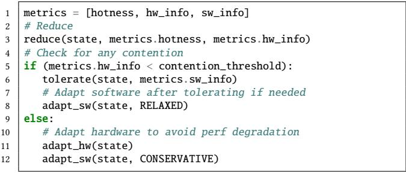

# Tolerate It if You Cannot Reduce It: Handling Latency in Tiered Memory 图表详解

### Figure 1: Current tiering systems are trying to optimize load time (3) by demoting (1) and promoting (2) between the nodes. However not each load equally created, there is an opportunity to (3) prefetch into the cache before accessing to hide the access latency of slower tier.

- 图片展示了当前 **tiered memory** 系统的核心操作流程，包含三个关键步骤：**demote**、**promote** 和 **load/prefetch**。
- **Fast Tier** 与 **Slow Tier** 分别代表高性能与高容量但低带宽的内存层级，如 DRAM 与 CXL 内存。
- 步骤① **demote**：将访问频率低（cold）的数据页从 Fast Tier 移动到 Slow Tier，释放高速资源。
- 步骤② **promote**：将访问频繁（hot）的数据页从 Slow Tier 提升至 Fast Tier，提升局部性。
- 步骤③ **load / prefetch**：CPU Cache 从任一内存层级加载数据；图中特别指出，**prefetch** 可在实际 load 前预取数据，以隐藏 Slow Tier 的高延迟。
- 图注强调：并非所有 load 都同等重要，存在通过 **prefetch** 隐藏慢速层级访问延迟的机会，这正是本文提出“容忍延迟”策略的视觉基础。
- 该图直观揭示了当前系统仅依赖迁移（reduce latency）的局限，而未充分利用 **prefetching** 来容忍延迟，为论文核心论点提供可视化支撑。

| 步骤编号 | 操作名称      | 方向             | 目的                         |
| -------- | ------------- | ---------------- | ---------------------------- |
| ①        | demote        | Fast → Slow      | 释放快存空间，优化资源分配   |
| ②        | promote       | Slow → Fast      | 提升热点数据访问速度         |
| ③        | load/prefetch | Tier → CPU Cache | 实际加载或预取，隐藏访问延迟 |

- 关键术语保留英文：**Fast Tier**, **Slow Tier**, **CPU Cache**, **demote**, **promote**, **prefetch**。
- 核心洞察：**prefetch** 是隐藏慢速层级延迟的关键手段，应与迁移策略协同使用，而非被忽略。

### Figure 2: When the number of threads increases the prefetching effectiveness of CXL decreases while DRAM being constant, and for high number of threads prefetching hurts the performance on CXL.

- 图片展示了两个应用（BC with twitter graph 和 XSBench）在不同线程数下，启用硬件预取（prefetching）时相对于禁用预取的性能比值（Speedup），对比了 **DRAM** 与 **CXL** 两种内存配置。
- 性能比值以 1.0 为基准：高于 1.0 表示预取带来加速，低于 1.0 表示预取导致性能下降。
- 在 **DRAM** 配置下，无论线程数如何增加，性能比值基本稳定在 1.0–1.1 之间，说明预取对 DRAM 的影响较小且稳定。
- 在 **CXL** 配置下，随着线程数增加，性能比值显著下降：
    - 当线程数较低（如 5–10）时，CXL 上预取仍带来轻微加速（比值 >1.0）。
    - 当线程数超过 15 后，性能比值持续下滑，至 25 线程时已降至约 0.75–0.85，表明预取开始**损害性能**。
- 数据趋势表明：CXL 的高延迟虽在低并发时可被预取掩盖，但其**带宽受限**特性在多线程高负载下引发资源争用，导致预取请求加剧链路拥塞，最终拉低整体性能。
- 对比两图可见，XSBench 的性能衰减略缓于 BC，但整体趋势一致，验证了该现象在不同工作负载下的普适性。

| 应用名称        | 内存类型 | 线程数 5 | 线程数 25 | 趋势描述           |
| --------------- | -------- | -------- | --------- | ------------------ |
| BC with twitter | DRAM     | ~1.1     | ~1.1      | 基本恒定           |
|                 | CXL      | ~1.1     | ~0.75     | 显著下降，性能受损 |
| XSBench         | DRAM     | ~1.1     | ~1.1      | 基本恒定           |
|                 | CXL      | ~1.1     | ~0.85     | 下降，但衰减较缓   |

- 核心结论：在 CXL 内存系统中，**硬件预取的有效性随线程数增加而急剧降低**，高并发场景下应动态关闭或限制预取，以避免因带宽争用导致的性能退化。

### Figure 3: Under high load, prefetching causes latency to increase dramatically at lower loads compared to when prefetching is disabled, resulting in up to 6.3× higher latency.

- 图表标题为“Loaded latency on memory tiers”，横轴为“Load”，纵轴为“Latency (ns)”，展示在不同负载下启用与禁用预取（Prefetch）对内存延迟的影响。
- **红色实线带十字标记**代表“Prefetch enabled”，**绿色虚线带叉号标记**代表“Prefetch disabled”，用于对比两种状态下的延迟表现。
- 在低负载区间（Load 0–70），两条曲线基本重合，延迟稳定在约200 ns，表明此时预取未引入额外开销。
- 当负载超过70后，启用预取的延迟急剧上升，在Load=95附近达到峰值约1500 ns，而禁用预取仍维持在约300 ns。
- 根据图注，预取在高负载下导致延迟最高可达禁用时的**6.3倍**，凸显其在CXL等带宽受限系统中的潜在危害。
- 数据趋势显示：预取在轻载时无害甚至有益，但在重载时因争抢带宽引发严重延迟恶化，尤其在CXL这类低带宽内存层级中更为显著。

| Load Range | Prefetch Enabled Latency (ns) | Prefetch Disabled Latency (ns) | Performance Impact |
| ---------- | ----------------------------- | ------------------------------ | ------------------ |
| 0–70       | ~200                          | ~200                           | 无明显影响         |
| 70–95      | 200 → 1500                    | ~300                           | 延迟激增，达6.3×   |
| >95        | 下降但仍高于禁用状态          | 稳定略升                       | 持续性能劣化       |

- 此图支撑论文核心论点：在tiered memory系统中，仅依赖预取可能适得其反，需结合运行时监控与策略调控以避免带宽争用。

### Figure 4: DRAM and CXL have different optimal prefetch distances. For example, in the scan microbenchmark, DRAM performs best with a prefetch distance of 4, while CXL requires a longer distance of 7 due to its higher latency.

- 图表展示了在 **scan microbenchmark** 中，**DRAM** 与 **CXL** 内存的完成时间（Time to completion）随 **prefetch distance** 变化的趋势。
- **DRAM**（红色实线+十字标记）在 prefetch distance = 4 时达到最低完成时间（约 1100 ms），之后趋于平稳，表明其最优预取距离为 **4**。
- **CXL**（绿色虚线+叉号标记）在 prefetch distance = 7 时达到最低完成时间（约 1100 ms），在此之前下降明显，之后略有回升，表明其最优预取距离为 **7**。
- 两者在 prefetch distance 较小时（如 1–3）性能差异显著：CXL 完成时间远高于 DRAM，说明高延迟内存更依赖提前预取。
- 当 prefetch distance 超过最优值后，两者性能均轻微上升，反映“预取过早”导致缓存污染或无效预取。
- 数据对比清晰揭示：**CXL 因更高访问延迟，需更大预取距离才能有效隐藏延迟**，而 DRAM 延迟低，较小距离即可满足。

| Prefetch Distance | DRAM Completion Time (ms) | CXL Completion Time (ms) |
| ----------------- | ------------------------- | ------------------------ |
| 1                 | ~1300                     | ~1300                    |
| 2                 | ~1150                     | ~1200                    |
| 3                 | ~1110                     | ~1190                    |
| 4                 | **~1100 (optimal)**       | ~1160                    |
| 5                 | ~1100                     | ~1140                    |
| 6                 | ~1100                     | ~1120                    |
| 7                 | ~1100                     | **~1100 (optimal)**      |
| 8                 | ~1100                     | ~1110                    |
| 9                 | ~1100                     | ~1105                    |
| 10                | ~1100                     | ~1105                    |

- 结论：**预取距离必须根据内存层级特性动态调整**，否则无法最大化性能。该图支撑论文核心观点——**tiered memory 系统中，软件预取需感知层级延迟差异**。

### Figure 5: Linden consists of a compiler and runtime. Compiler takes a program and finds the prefetchable regions in the program. Runtime is responsible for detecting hotness, hardware monitoring, and compiler hints to enforce different policies. Runtime able to migrate pages between the tiers, enable/disable hardware prefetchers and change the software behavior in terms prefetchability.

- 图片展示了 **Linden** 系统的架构，分为 **Linden Compiler** 和 **Linden Runtime** 两大模块，旨在协同优化 tiered memory 中的数据访问延迟。
- **Linden Compiler** 模块：
    - 输入为原始应用程序（App）。
    - 通过 **Program Analyzer** 与 **Backend** 组合分析程序，识别出可预取的内存区域（prefetchable regions）。
    - 输出为经过插桩的程序（Instrumented App），该程序在运行时能向 runtime 提供关键信息，如线程 ID、内存区域标识符和访问模式类型。
- **Linden Runtime** 模块：
    - 包含三个核心部分：**Metrics**、**Policy Enforcer** 和 **Mechanisms**。
    - **Metrics** 收集三类数据：
        - **Hotness**：用于判断页面访问频率。
        - **Hardware Monitoring**：监控硬件性能计数器，如 L2 硬件预取命中率和无用预取数量。
        - **Compiler Hints**：接收来自编译器插桩代码的提示，用于构建 prefetchability 表。
    - **Policy Enforcer** 是决策中心，根据 Metrics 数据动态调整策略，目标是 **Reduce**（减少延迟）和 **Tolerate**（容忍延迟）。
    - **Mechanisms** 执行具体操作：
        - **Page Migration**：在不同内存层级间迁移页面，提升局部性。
        - **Hardware Adaptation**：通过 MSR 寄存器控制硬件预取器的启用/禁用，避免带宽争用。
        - **Software Adaptation**：动态调整软件预取指令的距离或插入新指令，以适应当前内存层级的延迟特性。

| 组件                           | 功能描述                                                         |
| ------------------------------ | ---------------------------------------------------------------- |
| **Linden Compiler**            | 分析源码，识别 prefetchable regions，并生成插桩后的二进制文件。  |
| **Program Analyzer + Backend** | 使用编译器 passes 或机器学习等技术检测访问模式。                 |
| **Instrumented App**           | 运行时向 runtime 报告内存区域的访问特征。                        |
| **Metrics**                    | 收集 hotness、硬件状态、编译器提示，作为策略决策依据。           |
| **Policy Enforcer**            | 根据当前系统状态，决定是否迁移页面、启用预取器或调整预取距离。   |
| **Page Migration**             | 将热数据迁移到快速层级，冷数据迁移到慢速层级。                   |
| **Hardware Adaptation**        | 动态开关硬件预取器，防止在 CXL 层级因带宽不足导致性能下降。      |
| **Software Adaptation**        | 调整软件预取指令的时间点（prefetch distance），确保 timeliness。 |

- 关键设计思想是：当无法通过迁移减少延迟时，就利用预取来容忍延迟。例如，对于热点且可预测的区域，即使将其放在慢速 CXL 层级，也可通过预取隐藏其高延迟，从而节省昂贵的 DRAM 空间。
- 系统强调 **动态适应性**：随着页面在不同层级间迁移，runtime 会实时更新预取距离，确保预取指令始终在最优时机发出。
- 整体架构体现了 **编译期分析** 与 **运行时监控** 的紧密结合，使系统能针对不同应用和负载做出细粒度优化。

### Table 1: An example of a prefetchability table.

- 该图片展示的是 **Table 1**，标题为“An example of a prefetchability table”，用于说明 **Linden 系统**中如何记录和管理内存区域的预取能力。
- 表格包含六列：**Thread**、**region**、**ratio**、**type**、**freshness** 和 **target**，分别描述线程、内存区域、预取潜力比率、访问模式类型、数据新鲜度及目标预取指令。
- 表格内容以三行数据为例，对应三个线程（T₀, T₁, T₂）对不同内存区域（A, B）的访问行为：

| Thread | region | ratio | type       | freshness | target |
| ------ | ------ | ----- | ---------- | --------- | ------ |
| T₀     | A      | 0.9   | Sequential | 200       | l₁, d₁ |
| T₁     | A      | 0.05  | None       | 1         | None   |
| T₂     | B      | 0.7   | Chase      | 50        | l₂, d₂ |

- **T₀** 对区域 A 执行顺序访问，具有高 **prefetchability ratio (0.9)**，表明其访问模式高度可预测，适合预取；目标为 **l₁, d₁**，表示预取地址与距离。
- **T₁** 同样访问区域 A，但访问模式为 **None**，**ratio 仅 0.05**，说明其随机或不可预测，预取无效；目标为空。
- **T₂** 访问区域 B，采用指针追逐（Chase）模式，**ratio 为 0.7**，虽非顺序但仍具一定可预测性，需软件预取支持；目标为 **l₂, d₂**。
- **freshness** 列反映该区域信息更新后的时长，数值越大表示越“陈旧”，影响运行时策略决策。
- 此表是 **Linden runtime** 的核心数据结构之一，用于动态调整预取策略，实现“Reduce”与“Tolerate”双目标。

### Listing 1: Algorithm for policy enforcement in the Linden runtime.

- 图片展示的是 **Listing 1**，即 **Linden runtime** 中用于策略执行的算法伪代码，核心目标是动态协调“减少延迟”与“容忍延迟”两种机制。
- 算法首先收集三类关键指标：**hotness**（页面热度）、**hw_info**（硬件状态，如预取器效率、带宽争用）、**sw_info**（软件预取信息）。
- 执行流程分为两个主要阶段：
    - **Reduce 阶段**：调用 `reduce(state, metrics.hotness, metrics.hw_info)`，基于热度和硬件状态进行页面迁移，提升数据局部性。
    - **Tolerate 阶段**：根据硬件争用情况决定如何调整预取行为。
        - 若硬件争用低于阈值（`metrics.hw_info < contention_threshold`），则启用更激进的软件预取（`adapt_sw(state, RELAXED)`），最大化隐藏延迟的机会。
        - 否则，为避免性能退化，禁用或限制硬件预取（`adapt_hw(state)`），并采用保守型软件预取（`adapt_sw(state, CONSERVATIVE)`）。

| 行号 | 代码片段                                          | 功能说明                             |
| ---- | ------------------------------------------------- | ------------------------------------ |
| 1    | `metrics = [hotness, hw_info, sw_info]`           | 初始化监控指标集合                   |
| 2    | `# Reduce`                                        | 标记进入“减少延迟”阶段               |
| 3    | `reduce(state, metrics.hotness, metrics.hw_info)` | 执行页面迁移等操作以优化局部性       |
| 4    | `# Check for any contention`                      | 检查是否存在硬件资源争用             |
| 5    | `if (metrics.hw_info < contention_threshold):`    | 判断是否低争用环境                   |
| 6    | `tolerate(state, metrics.sw_info)`                | 在低争用下启动容忍策略               |
| 7    | `# Adapt software after tolerating if needed`     | 可选调整软件预取行为                 |
| 8    | `adapt_sw(state, RELAXED)`                        | 设置软件预取为宽松模式（提前量更大） |
| 9    | `else:`                                           | 进入高争用分支                       |
| 10   | `# Adapt hardware to avoid perf degradation`      | 调整硬件预取以防止性能下降           |
| 11   | `adapt_hw(state)`                                 | 关闭或降级硬件预取器                 |
| 12   | `adapt_sw(state, CONSERVATIVE)`                   | 设置软件预取为保守模式（提前量更小） |

- 该算法体现了 **Linden** 的核心设计理念：**不盲目依赖单一策略**，而是根据实时系统状态（尤其是硬件争用）在“减少”与“容忍”之间动态切换。
- **RELAXED** 和 **CONSERVATIVE** 是预取行为的两种模式，分别对应高/低系统负载下的不同激进程度，确保在CXL等带宽受限场景下不会因过度预取引发性能恶化。
- 此策略执行逻辑是 **Linden runtime** 实现智能内存管理的关键组件，支撑其在多层内存架构中实现高效延迟控制。
