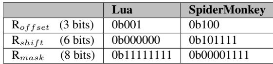
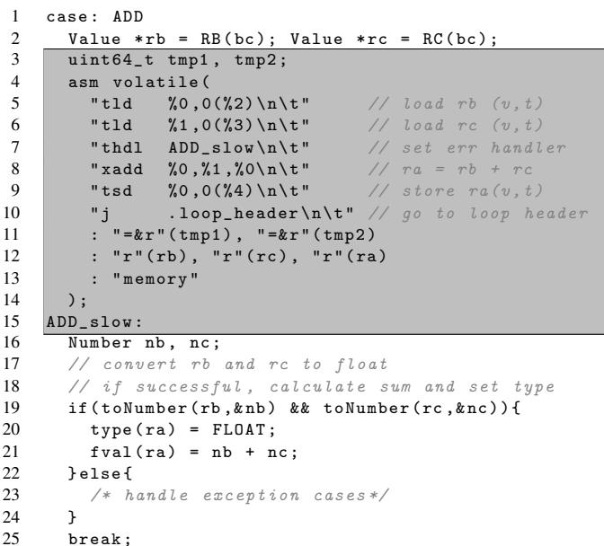

# Typed Architectures: Architectural Support for Lightweight Scripting 通俗讲解

### 0. 整体创新点通俗解读

**痛点直击 (The "Why")**

动态脚本语言（如 **JavaScript** 和 **Lua**）之所以在开发上如此高效，核心在于其**动态类型**特性——你不用提前声明变量类型，同一个变量今天可以是整数，明天就能变成字符串。但这种灵活性在硬件执行层面却是个“灾难”。想象一下，每次执行一个简单的 `+` 操作，CPU 都不能直接加，而必须先停下来：

- **提取**两个操作数的**类型标签**（tag extraction）。
- **检查**这两个类型是否能相加，以及应该调用哪个版本的加法（整数加？浮点加？还是字符串拼接？），这通常涉及多次比较和**条件分支**（tag checking）。
- 计算完结果后，还得把新的**类型标签**和结果值打包存回去（tag insertion）。

这个过程在软件解释器里会产生大量冗余指令。论文指出，在 **V8 引擎**中，这类动态类型检查能吃掉 **25%** 的总执行时间。对于资源极其有限的 **IoT 设备**（通常是单核、小内存、跑解释器而非 JIT），这种开销是致命的。以前的硬件加速方案要么只针对单一语言（比如古老的 LISP 机），要么只优化了类型检查中的某一个环节（比如只加速 tag 提取），无法提供一套**低成本、通用、全覆盖**的解决方案。

______________________________________________________________________

**通俗比方 (The Analogy)**

可以把传统的 CPU 和脚本解释器的关系，想象成一个只会说**普通话**的工人（CPU）和一本写满**方言操作手册**（字节码）的工头（解释器）。

- 工头每念一句方言指令（比如“把那俩东西加起来”），工人都得先让工头翻译成普通话（执行一堆 tag 提取、检查、分支的指令），然后才能干活。
- 这个翻译过程又慢又啰嗦。

**Typed Architectures** 的核心思想就是：给这个工人配一副**智能眼镜**。这副眼镜能直接“看懂”方言手册里的隐含信息。

- 现在，工头可以直接把方言指令（比如一个新的 `xadd` 指令）交给工人。
- 工人戴上眼镜，一眼就看出操作数的“方言类型”（类型标签），并立刻知道该用哪种方式干活（走整数加法流水线还是浮点加法流水线）。
- 如果遇到眼镜也看不懂的生僻方言（类型组合不被支持），他再去找工头要详细翻译（跳转到软件慢路径）。

这副“智能眼镜”就是论文提出的**新型指令集架构 (ISA)**，它让硬件本身具备了理解高级语言类型语义的能力，从而省去了大部分繁琐的“翻译”工作。

______________________________________________________________________

**关键一招 (The "How")**

作者并没有去设计一个复杂的协处理器或者改变整个编程模型，而是非常巧妙地在现有的 **RISC-V** 流水线基础上，做了三个精妙的“嫁接”：

- **统一寄存器文件 (Unified Register File)**：

    - 在每个寄存器里，除了存数据 **value**，还额外增加了 **8-bit type** 字段和 **1-bit F/Ī**（浮点/整数）标志位。
    - 这样，**类型信息就和数据本身绑定在一起，在硬件内部流动**，无需每次都从内存里费劲地提取。

- **多态指令 (Polymorphic Instructions)**：

    - 引入了像 **xadd**, **xsub**, **xmul** 这样的新指令。它们不是具体的加法或浮点加法，而是一个“占位符”。
    - 当 `xadd` 进入流水线时，硬件会**并行地**做两件事：
        1. 根据两个源操作数的 **F/Ī** 位，**动态绑定**到真正的 `add` 或 `fadd` 执行单元。
        1. 同时查询一个小型的 **Type Rule Table**（类型规则表），用 `(src1.type, src2.type, opcode)` 作为键去查找结果的类型。
    - 如果查表命中，整个计算和类型推导就在**一个硬件周期内**完成了；如果未命中，则跳转到软件慢路径处理复杂情况。

- **灵活的带标记访存 (Tagged Memory Instructions)**：

    - 不同的脚本引擎（如 Lua 和 SpiderMonkey）存储 **tag-value** 对的方式千奇百怪（有的 tag 在 value 前面，有的在后面，有的甚至塞在 NaN 里）。
    - 作者没有硬编码一种格式，而是引入了 **tld** (tagged load) / **tsd** (tagged store) 指令，并配合三个**特殊用途寄存器** (`Roffset`, `Rshift`, `Rmask`) 来**动态配置** tag 的提取和插入逻辑。
    - 这使得同一套硬件 ISA 能够灵活适配多种脚本引擎的数据布局，极大地提升了方案的**通用性**。

通过这三招，作者成功地将原本由软件显式执行的、繁重的动态类型管理任务，**隐式地卸载到了硬件流水线中**，以仅 **1.6%** 的面积开销，换来了接近 **10%-11%** 的平均性能提升和显著的能效改善。 *Figure 5: Overall speedups for Lua and JavaScript interpreters (the higher, the better)*

### 1. 统一寄存器文件 (Unified Register File) (ELI5)

**痛点直击 (The "Why")**

- 传统的处理器寄存器只存**原始数据值**（比如一个64位的整数或浮点数）。在运行像 **JavaScript** 或 **Lua** 这样的动态脚本语言时，每个变量都必须附带一个**类型标签**（type tag），用来说明这个值到底是整数、字符串还是对象。
- 这个类型标签通常和数据值一起存在内存里。每次做运算前，解释器都得先从内存里把标签**加载出来**，然后用一堆**比较和跳转指令**（也就是所谓的“类型守卫”）来检查类型是否匹配。这个过程非常**繁琐且低效**，产生了大量的额外指令。
- 更糟的是，如果数据布局不同（比如 **Lua** 把标签放在数据后面，而 **SpiderMonkey** 把标签藏在 NaN 的 payload 里），这套软件逻辑就得为每种语言重写一遍，**无法通用**。

**通俗比方 (The Analogy)**

- 想象你是个图书管理员（处理器），你的工作台（寄存器）上只能放书（数据值）。以前，每本书的类别（类型标签）都写在书后面的借阅卡上，放在远处的档案柜（内存）里。
- 每次你要处理一本书（比如给它盖章），你都得先跑回档案柜，翻出借阅卡看一眼类别，确认是“小说”才能盖章。这来回跑腿（内存访问）和翻找（指令执行）浪费了大量时间。
- **统一寄存器文件**的做法，就像是直接给你换了一张**智能工作台**。这张新桌子自带一个小夹子，可以把书和它的类别卡片**永远夹在一起**。你一拿到书，就立刻知道它的类别，省去了所有跑腿和翻找的麻烦。

**关键一招 (The "How")**

- 作者并没有改变整个处理器的核心逻辑，而是巧妙地对最基础的**寄存器文件**（Register File）动了手术。
- 具体来说，他们把原来只存一个**值**（value）的寄存器条目，扩展成了能同时存三个东西的结构：
    - **R.v**: 原始的数据值（不变）。
    - **R.t**: 一个**8-bit的类型标签**（type tag），直接从内存里和数据一起加载进来。
    - **R.f**: 一个**1-bit的F/Ī标志**，用来快速区分这个值是**Floating-point**（浮点）还是**Integer**（整数）子类型，这对后续选择正确的ALU至关重要。
- 这个改动看似简单，但它把**类型信息从内存空间提升到了寄存器状态**。从此以后，任何需要类型信息的操作（比如 `xadd` 指令）都可以直接从寄存器里读取 `R.t` 和 `R.f`，在**硬件流水线内部并行完成**类型检查和数值计算，彻底绕开了软件层面那些冗长的类型守卫代码。 *Figure 4: Pipeline structure augmented with Typed Architecture*

### 2. 多态指令 (Polymorphic Instructions) (ELI5)

**痛点直击 (The "Why")**

- 传统的动态脚本语言（如 JavaScript、Lua）解释器在执行像 `+` 这样的操作符时，必须先检查操作数的类型。因为 `+` 可以是整数加法、浮点加法，甚至是字符串拼接。
- 这个检查过程在软件层面实现，需要一系列指令：**加载类型标签**、**比较标签**、**根据结果跳转**到对应的处理函数（慢路径）。这个过程非常**冗长且低效**。
- 即使在最常见的情况下（比如两个整数相加），也必须走完这套完整的检查流程，造成了巨大的**指令开销**和**分支预测压力**。这在资源受限的 IoT 设备上尤其致命。

**通俗比方 (The Analogy)**

- 想象一个老式的电话总机接线员。每次你想打电话（执行 `xadd`），都必须先告诉接线员（CPU）你要打给谁（操作数类型）。接线员会翻开一本厚厚的电话簿（软件中的类型检查代码），找到对应的号码（正确的原生指令，如 `add` 或 `fadd`），然后手动插线连接。
- **多态指令**就像是给接线员配备了一个**智能交换机**。当你拨号（发出 `xadd` 指令）的同时，你的电话机（寄存器）已经自动把你要呼叫的“区域码”（类型标签）附在了信号里。交换机（CPU 流水线）看到这个区域码，**瞬间**就知道该把你接到哪个线路（`add` 或 `fadd` 的硬件单元），完全省去了翻电话簿和人工插线的过程。

**关键一招 (The "How")**

- 作者并没有重写整个解释器，而是巧妙地在 ISA 和微架构层面做了一个根本性的改变：**让数据本身携带类型信息，并让硬件能直接“读懂”它**。
- 具体来说，他们做了三件事：
    - **扩展寄存器文件**：每个寄存器不再只存一个值（value），而是同时存储 **value**、**type tag**（8位类型标签）和 **F/Ī bit**（1位标识是整数还是浮点数）。这为硬件感知类型提供了基础。
    - **引入多态指令**：定义了新的指令，如 **xadd**, **xsub**, **xmul**。这些指令本身不指定计算类型，它们是“占位符”。
    - **在流水线中动态绑定**：当 `xadd` 指令进入流水线的**译码或执行阶段**时，硬件会立即读取两个源操作数寄存器中的 **type tag** 和 **F/Ī bit**。
        - 如果两个操作数都是整数，流水线就**直接激活整数 ALU** 执行 `add`。
        - 如果两个操作数都是浮点数，流水线就**直接激活浮点 FPU** 执行 `fadd`。
        - 这个决策过程是**并行于**值的计算进行的，并且由一个小型的 **Type Rule Table**（类型规则表）硬件模块来加速查找，速度极快。
        - 如果操作数类型不匹配（比如一个整数加一个字符串），或者遇到了不支持的类型组合，硬件会**立即触发一个“类型误判”异常**，将 PC 重定向到软件中的慢路径去处理。这保证了功能的正确性。
- 这个设计的核心扭转在于：**将原本在软件中串行、显式的“检查-分发”逻辑，转变为在硬件中并行、隐式的“感知-执行”逻辑**。对于最常见的同类型操作，几乎消除了所有类型检查的开销。

 *Figure 4: Pipeline structure augmented with Typed Architecture*

### 3. 带标签的内存指令 (Tagged Memory Instructions) (ELI5)

**痛点直击 (The "Why")**

- 传统的动态脚本语言（如 Lua, JavaScript）在内存中存储一个变量时，不仅要存它的值（value），还要存它的类型标签（tag）。这个 **tag-value pair** 的布局在不同引擎里千奇百怪。
- 有的引擎（比如 Lua）把 8 字节的值和 1 字节的标签分开存放，标签紧跟在值后面；而另一些引擎（比如 SpiderMonkey）则更“狡猾”，把标签直接塞进 IEEE 754 **NaN** 的保留位里，让一个 64 位的 double 同时承载值和类型信息。
- 在软件层面处理这种差异非常痛苦：每次从内存加载一个变量，都需要一串 **shift-and-mask** 指令来提取标签；每次存回去，又需要一串指令来重新打包。这不仅增加了 **instruction count**，还占用了宝贵的 CPU 周期和能耗，对于资源受限的 **IoT** 设备来说是致命伤。

**通俗比方 (The Analogy)**

- 想象你要从世界各地不同规格的快递盒子里取出里面的商品和说明书。有的盒子把说明书放在商品上面（Lua），有的则把说明书信息直接印在商品的防伪标签上（SpiderMonkey）。
- 以前的做法是，你（CPU）每次拆一个新盒子，都得先看一眼说明书（配置信息），然后手动用剪刀（shift）和胶带（mask）把说明书和商品分开或粘好。效率极低。
- **Typed Architectures** 的做法是，给你配了一个 **万能开箱机器人**。你只需要提前告诉它三种规则：“说明书在商品上方”、“在下方”还是“印在商品上”（通过 **Roffset**），以及“从哪个位置开始读”（**Rshift**）和“读多长”（**Rmask**）。之后，机器人就能全自动、一步到位地把商品和说明书分好交给你。

**关键一招 (The "How")**

- 作者没有让软件去处理繁琐的标签提取/插入逻辑，而是巧妙地在 ISA 层面引入了两条新指令：**tld** (tagged load) 和 **tsd** (tagged store)。
- 为了支持不同引擎的任意布局，他们没有硬编码任何一种格式，而是设计了一套 **可配置的硬件逻辑**，由三个专用寄存器驱动：
    - **Roffset**: 一个 3-bit 寄存器，决定了标签相对于值的位置。它支持三种模式：在同一个双字（double-word）、在下一个双字、或在上一个双字。这覆盖了绝大多数脚本引擎的布局习惯。
    - **Rshift**: 一个 6-bit 寄存器，指定了标签在目标双字中的起始位偏移。
    - **Rmask**: 一个 8-bit 掩码寄存器，用于精确地抠出标签位。
- 这样，当执行 **tld** 指令时，硬件会自动根据这三个寄存器的配置，完成一次内存访问，并在内部通过 **shift-and-mask** 电路一次性将值和标签分别送入统一寄存器文件的 **value** 和 **type** 字段。**tsd** 则执行完全相反的操作。
- 这个设计的关键在于，它用极小的硬件代价（只增加了几个专用寄存器和简单的位操作逻辑），就将原本需要多条软件指令才能完成的工作，压缩成了一条硬件指令，从而极大地提升了效率和灵活性。

 *Table 4: Special-purpose register settings*
 *Figure 4: Pipeline structure augmented with Typed Architecture*

### 4. 类型规则表 (Type Rule Table) (ELI5)

**痛点直击 (The "Why")**

- 传统的动态脚本语言（如 JavaScript, Lua）在执行像 `+` 这样的**多态操作符**时，必须在软件层面做大量工作：先从内存里把两个操作数的**类型标签 (type tag)** 挖出来，然后用一堆 `if-else` 或 `switch-case` 来判断组合（比如 int+int, int+float, string+string），最后才能决定调用哪个具体的加法函数。这个过程会产生大量的**动态指令**，对性能、功耗和内存都是巨大负担。
- 更难受的是，这些类型检查代码是**解释器循环**的一部分，会被反复执行。即使硬件有强大的整数或浮点单元，CPU 的大部分时间也花在了这些“查户口”式的分支跳转上，而不是真正的计算上。

**通俗比方 (The Analogy)**

- 想象一个非常繁忙的**海关检查站**。以前的做法是，每来一辆车（代表一次 `xadd` 操作），工作人员都要：
    1. 先下车（**Tag extraction**），跑到车里翻找司机的护照（**type tag**）。
    1. 然后回到岗亭，翻开一本厚厚的政策手册（**软件中的 if-else 逻辑**），逐条比对两个司机的国籍（**operand types**）和他们要办的业务（**opcode**），看是否允许通行以及应该走哪个通道。
    1. 最后才放行或指引到特殊处理窗口（**slow path**）。
- **类型规则表 (Type Rule Table)** 就像是给这个检查站装了一个**智能预检系统**。它是一个小型的、超高速的查询终端（**CAM, Content-Addressable Memory**）。工作人员只需要把两个护照信息和业务类型输入进去，系统瞬间就能告诉你结果：是直接放行（并告诉你目的地通道，即**输出类型**），还是需要转到人工处理窗口。

**关键一招 (The "How")**

- 作者并没有试图在软件层面优化那些繁琐的 `if-else` 分支，而是巧妙地将整个**类型决策逻辑**下沉到了**硬件流水线**中，并用一张预先配置好的小表来实现。
- 具体来说，在执行 `xadd`, `xsub`, `xmul` 这类**多态指令**时：
    - 硬件会自动将两个源操作数寄存器中的 **8-bit type tag** 和当前的 **opcode** 拼成一个联合键（key）。
    - 这个键被送入 **Type Rule Table** 进行**并行查找**。
    - **如果命中 (Hit)**：查找结果直接给出了**输出值的类型标签**。硬件流水线可以无缝地继续执行对应的原生计算（如 `add` 或 `fadd`），并在写回阶段将计算出的值和新的类型标签一并存入目标寄存器。整个过程对软件透明，且没有额外的分支开销。
    - **如果未命中 (Miss)**：说明遇到了一个不被“快路径”支持的类型组合（比如 string + number）。此时，硬件会立即触发一个**类型误预测 (type misprediction)**，将程序计数器 **PC** 重定向到由 **Rhdl (Handler Register)** 指向的**慢速路径 (slow path)**。这个慢速路径就是原有的、完备的软件解释逻辑，可以处理所有复杂情况。
- 这张表之所以能做得很小（论文中提到只有 **8 个条目**），是因为它只缓存了**最常见、最热**的类型组合规则。这完美契合了动态语言中“少数类型组合占据大部分运算”的特性，用极小的硬件代价（**1.6% 面积开销**）换取了巨大的性能收益。

 *Table 5: Type Rule Table settings for Lua and SpiderMonkey*
这张图展示了为 **Lua** 和 **SpiderMonkey** 配置的 Type Rule Table 内容。可以看到，它清晰地定义了哪些输入类型组合（Input Type A/B）在特定操作（Op）下是合法的，并直接映射到输出类型（Output Type）。这就是那个“智能预检系统”的核心数据库。

### 5. 类型检查与慢速路径处理 (ELI5)

**痛点直击 (The "Why")**

- 在动态脚本语言（如 **JavaScript**、**Lua**）的解释器中，一个简单的 `+` 操作背后可能隐藏着巨大的开销。因为 `+` 是**多态**的：它既可以加两个整数，也可以拼接两个字符串，甚至可以处理浮点数。
- 为了安全执行，解释器必须在每次操作前，先检查两个操作数的**类型标签 (type tag)**，这个过程叫**类型守卫 (type guard)**。
- 这个检查在软件层面实现非常“难受”：
    - 它需要额外的 **load** 指令从内存或寄存器中提取类型标签。
    - 需要 **compare & branch** 指令来判断类型组合是否合法。
    - 如果类型不匹配（比如一个整数加一个字符串），还得跳转到复杂的**慢速路径 (slow path)** 去做类型转换或抛出异常。
- 这些看似微小的检查，在热点代码（如循环中的算术运算或表访问）里会被放大成**巨大的指令开销**，论文提到这能占到 V8 引擎总执行时间的 **25%**。对于资源受限的 **IoT** 设备，这种开销是致命的。

**通俗比方 (The Analogy)**

- 想象一个超级高效的快递分拣中心（**硬件流水线**）。正常情况下，包裹（**数据**）上贴着清晰的条形码（**类型标签**），分拣机器人（**ALU**）扫一眼就能立刻知道该把它扔进哪个滑道（**执行整数加法还是浮点加法**）。
- 但传统的做法是，每个包裹到了分拣口，都得先停下来，由一个专门的工人（**软件解释器**）手动撕开包装，拿出里面的纸质清单（**执行 load 指令**），再对照一本厚厚的规则手册（**执行 compare & branch**）来决定怎么处理。这不仅慢，还占地方（**消耗指令缓存和分支预测器资源**）。
- **Typed Architectures** 的做法是，让包裹在进入分拣中心之前，就把关键信息（**类型**）直接印在了显眼的外包装上，并且给分拣机器人升级了智能扫描仪。机器人一边搬运包裹（**计算数值**），一边就完成了信息核对（**类型检查**）。只有当遇到一个完全没见过的、无法处理的奇怪包裹（**类型组合未命中**）时，才把它踢到旁边一个特殊的人工处理窗口（**慢速路径**）去解决。

**关键一招 (The "How")**

作者并没有试图用硬件去模拟整个复杂的软件类型系统，而是巧妙地在 **ISA** 和 **Microarchitecture** 层面做了一个精准的“外科手术”，将类型检查中最核心、最高频的部分硬件化，并优雅地与原有的软件慢速路径衔接。

- **统一寄存器文件**：这是基础。每个寄存器不再只是一个64位的值，而是变成了一个三元组 `(value, type_tag, F/I_flag)`。这样，类型信息就像影子一样跟着数据走，随时可供硬件访问，省去了反复从内存加载标签的开销。

- **引入多态指令 (`xadd`, `xsub`, `xmul`)**：这些不是普通的加法指令。当 `xadd` 进入流水线时，硬件会**并行**做两件事：

    1. 根据 `F/I_flag` 位，立刻决定是走**整数 ALU** 还是 **FP ALU** 的计算通路。
    1. 同时，拿着两个源操作数的 `type_tag` 和当前指令的操作码（`ADD`），去查询一个小型的 **Type Rule Table**（类型规则表）。

- **硬件化的类型规则表 (Type Rule Table)**：这个表就像是分拣机器人的内置规则手册。它预先加载了像 `(Int, Int) -> Int` 或 `(Float, Float) -> Float` 这样的合法规则。如果查询命中，硬件就直接把计算结果和查到的输出类型标签一起写回目标寄存器，整个过程在流水线里一气呵成。

- **`thdl` 和 `tchk` 指令：搭建通往慢速路径的桥梁**：这才是处理“意外情况”的精妙之处。

    - **`thdl` 指令**：在执行任何可能失败的多态操作（如 `xadd`）**之前**，软件解释器会先用 `thdl` 指令，将对应字节码（如 `ADD`）的**慢速路径入口地址**写入一个特殊的 **Handler Register (Rhdl)**。
    - **`tchk` 指令**：对于更复杂的操作（如表访问 `GETTABLE`），硬件可能只负责做最简单的类型检查（比如检查是不是 `(Table, Int)`）。`tchk` 指令会查询 Type Rule Table，如果命中就继续；如果不命中，就触发跳转。
    - **无缝重定向**：一旦 Type Rule Table **未命中**，硬件不会产生一个需要操作系统介入的异常，而是**直接将 PC（程序计数器）重定向到 `Rhdl` 寄存器里存的地址**。这个地址指向的正是原来解释器里那段完整的、用 C 写的慢速处理逻辑。执行完后，程序自然地回到主循环，就像什么都没发生过一样。

 *Figure 3: Transformed bytecode ADD*

这张图清晰地展示了这个流程：通过 `thdl` 设置好退路，然后大胆地用 `xadd` 走快速通道。成功了，效率极高；失败了，毫秒级切换到软件兜底，保证了功能的完整性和灵活性。这种设计以极低的硬件成本（**仅 1.6% 的面积开销**），换取了显著的性能提升。
