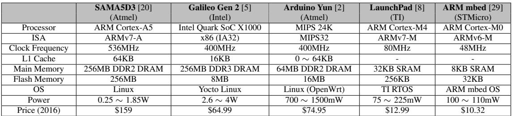
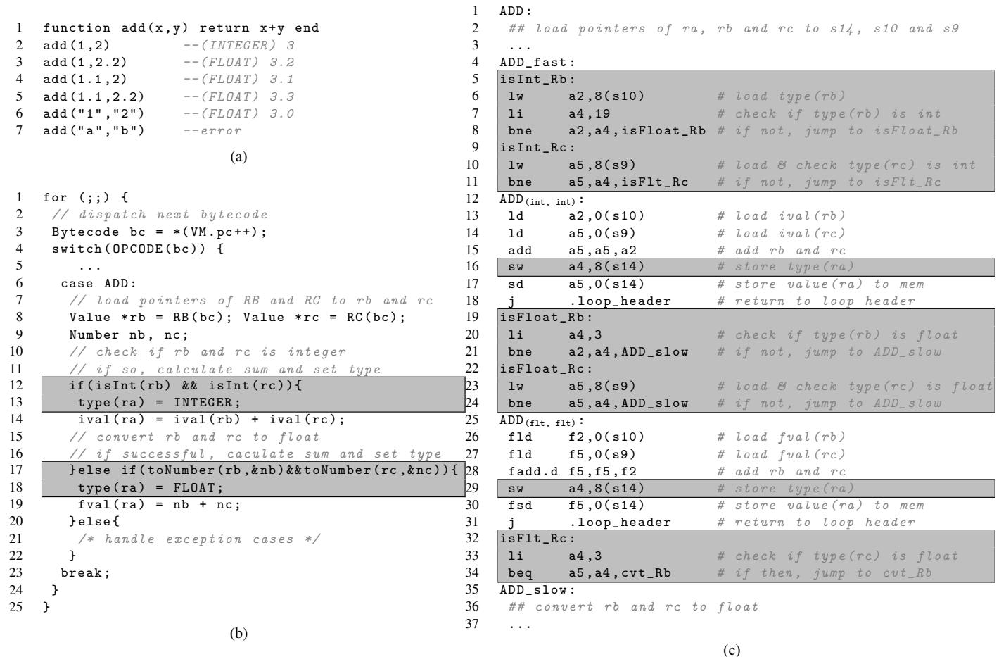
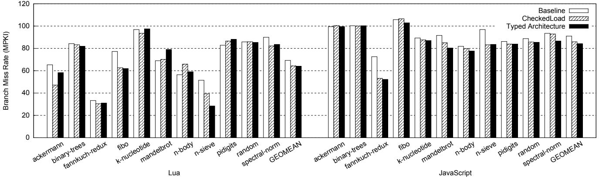

# Typed Architectures: Architectural Support for Lightweight Scripting 图表详解

### Table 1: IoT device platforms

- 该图片为论文中的 **Table 1: IoT device platforms**，列出了五款主流物联网（IoT）单板计算机平台的关键硬件与软件规格。
- 表格横向对比了 **SAMA5D3**、**Galileo Gen 2**、**Arduino Yun**、**LaunchPad** 和 **ARM mbed** 五个平台。
- 各平台核心参数如下：

| 平台名称            | SAMA5D3 [20]    | Galileo Gen 2 [5]     | Arduino Yun [2] | LaunchPad [8] | ARM mbed [29] |
| ------------------- | --------------- | --------------------- | --------------- | ------------- | ------------- |
| **Processor**       | ARM Cortex-A5   | Intel Quark SoC X1000 | MIPS 24K        | ARM Cortex-M4 | ARM Cortex-M0 |
| **ISA**             | ARMv7-A         | x86 (IA32)            | MIPS32          | ARMv7-M       | ARMv6-M       |
| **Clock Frequency** | 536MHz          | 400MHz                | 400MHz          | 80MHz         | 48MHz         |
| **L1 Cache**        | 64KB            | 16KB                  | 0 ~ 64KB        | -             | -             |
| **Main Memory**     | 256MB DDR2 DRAM | 256MB DDR3 DRAM       | 64MB DDR2 DRAM  | 32KB SRAM     | 8KB SRAM      |
| **Flash Memory**    | 256MB           | 8MB                   | 16MB            | 256KB         | 32KB          |
| **OS**              | Linux           | Yocto Linux           | Linux (OpenWrt) | TI RTOS       | ARM mbed OS   |
| **Power**           | 0.25 ~ 1.85W    | 2.6 ~ 4W              | 700 ~ 1500mW    | 75 ~ 225mW    | 100 ~ 110mW   |
| **Price (2016)**    | $159            | $64.99                | $74.95          | $12.99        | $10.32        |

- 所有平台均采用低功耗、低成本设计，适用于 **DIY电子** 和 **IoT应用**。
- 处理器架构多样，涵盖 **ARM**、**x86** 和 **MIPS**，反映市场对异构计算的需求。
- 主存容量从 **8KB SRAM** 到 **256MB DRAM** 不等，体现不同应用场景的资源约束。
- 操作系统包括 **Linux**、**RTOS** 和专用嵌入式系统，支持脚本语言运行环境。
- 功耗范围从 **100mW** 到 **4W**，价格从 **$10.32** 到 **$159**，满足不同预算和性能需求。
- 论文引用此表说明：在这些资源受限设备上，传统脚本语言因动态类型检查开销大而性能不佳，亟需如 **Typed Architectures** 的硬件加速方案。

### Figure 1: (a) Usages of polymorphic ”+” (add) operator in Lua; (b) Bytecode ADD in C; (c) RISC-V assembly code

- 图片展示了动态脚本语言中 **polymorphic “+” operator** 的实现开销，以 Lua 为例，分为三个部分：(a) 语义用法，(b) C 语言字节码解释器实现，(c) RISC-V 汇编代码。

- **图 (a)** 展示了 `add(x,y)` 函数在不同输入类型下的行为：

    - 输入 `(1,2)` → 返回整数 `3`
    - 输入 `(1,2.2)` → 返回浮点数 `3.2`
    - 输入 `(1.1,2.2)` → 返回浮点数 `3.3`
    - 输入 `("1","2")` → 返回字符串 `"3.0"`（隐式转换）
    - 输入 `("a","b")` → 报错
    - 这体现了动态类型语言的灵活性与运行时类型检查的必要性。

- **图 (b)** 是 Lua 字节码解释器中 ADD 操作的 C 语言伪代码实现：

    - 核心逻辑是先加载操作数指针 `rb` 和 `rc`。
    - 然后通过 `isInt()` 和 `toNumber()` 等函数进行 **type guard** 检查。
    - 若两个操作数均为整数，则执行整数加法并设置结果类型为 INTEGER。
    - 否则尝试转换为浮点数再相加，设置类型为 FLOAT。
    - 最后处理异常情况。
    - 关键路径被灰色背景高亮，突显了 **类型检查和分支判断** 是性能瓶颈。

- **图 (c)** 是由 GCC 编译生成的 RISC-V 汇编代码，对应图 (b) 的 ADD 实现：

    - 代码结构清晰地反映了类型检查流程：
        - 首先加载操作数 `rb` 和 `rc` 的类型标签（`lw a2,8(s10)`）。
        - 使用条件跳转（`bne`, `beq`）根据类型标签分发到不同处理路径。
        - 分支包括：整数加法路径 (`ADD(int,int)`)、浮点加法路径 (`ADD(flt,flt)`)、慢速路径 (`ADD_slow`)。
    - 关键指令如 `sw a4,8(s14)` 用于存储结果类型标签，`j .loop_header` 用于循环调度。
    - 灰色背景区域再次强调了 **类型提取、比较、分支** 所占的指令比例，说明其开销巨大。

- 下表总结了三部分的核心关注点：

| 部分            | 内容                          | 关键问题                       |
| --------------- | ----------------------------- | ------------------------------ |
| (a) 语义用法    | `add(x,y)` 在不同输入下的输出 | **动态类型导致的行为不确定性** |
| (b) C 伪代码    | 字节码解释器中的类型检查逻辑  | **软件层面的类型守卫开销大**   |
| (c) RISC-V 汇编 | 编译后的机器指令序列          | **硬件执行效率受类型检查拖累** |

- 综上，该图直观揭示了动态脚本语言中 **类型检查** 如何在软件层面转化为大量额外的指令和分支，成为性能瓶颈。这正是论文提出 **Typed Architectures** 的动机——将类型信息和检查机制下沉到硬件层，以减少软件开销。

### Figure 2: (a) Breakdown of dynamic bytecodes in Lua; (b) Dynamic instruction count per bytecode for top five bytecodes

- 图片 293e2cbf5f5811b389cb89315acfebfdf6603211795695bae4a61ea758f93c4a.jpg 包含两个子图，分别标记为 (a) 和 (b)，共同构成 Figure 2，用于展示 Lua 脚本引擎中动态字节码的分布及其执行开销。
- 子图 (a) 是一个堆叠条形图，显示了 11 个不同 Lua 基准测试程序（如 ackermann, binary-trees, fannkuch-redux 等）中各类动态字节码的占比。横轴为百分比，纵轴列出各基准测试名称。图例说明了不同字节码类型，包括 **ADD**, **SUB**, **MUL**, **GETTABLE**, **SETTABLE**, **FORLOOP**, **CALL**, **RETURN**, **MOVE**, **GETUPVAL** 及 **OTHERS**。
- 从图 (a) 可见，尽管 Lua 定义了 47 种字节码，但实际运行中，**ADD**, **SUB**, **MUL**, **GETTABLE**, **SETTABLE** 这五种字节码在多数基准测试中占据主导地位，合计占比常超过 50%，甚至在某些程序（如 n-sieve）中接近 80%。这表明这些操作是 Lua 性能优化的关键目标。
- 子图 (b) 是一个分组柱状图，详细展示了上述五种最频繁使用的字节码（**ADD**, **SUB**, **MUL**, **GETTABLE**, **SETTABLE**）在不同操作数类型组合下的动态指令计数。每个柱子分为两部分：深色代表“Non-Guard”指令（即核心计算或访问指令），浅色代表“Guard”指令（即用于类型检查和分派的额外开销）。
- 图 (b) 的横轴按字节码类型分组，每组内又按操作数类型对划分，例如 (int,int), (Flt,Flt), (Tab,int), (Tab,Str) 等。纵轴表示指令数量。
- 关键观察：
    - 对于算术操作（**ADD**, **SUB**, **MUL**），当操作数类型匹配时（如 (int,int) 或 (Flt,Flt)），Guard 指令占比相对较小；而当类型不匹配时，Guard 开销显著增加。
    - 对于表操作（**GETTABLE**, **SETTABLE**），特别是使用字符串作为键（(Tab,Str)）时，Guard 指令的开销远大于非 Guard 指令，有时甚至占总指令数的 50% 以上。这凸显了动态类型系统在处理多态操作时的巨大性能代价。
- 综上，该图直观地证明了论文的核心论点：动态类型检查（Guard）是脚本语言性能瓶颈的主要来源，尤其是在处理多态字节码时。这也为引入 Typed Architectures 提供了充分的数据支持。

| 字节码   | 操作数类型 | Non-Guard 指令数 | Guard 指令数 | 总指令数 |
| -------- | ---------- | ---------------- | ------------ | -------- |
| ADD      | (int,int)  | ~6               | ~4           | ~10      |
| ADD      | (Flt,Flt)  | ~6               | ~4           | ~10      |
| GETTABLE | (Tab,int)  | ~28              | ~8           | ~36      |
| GETTABLE | (Tab,Str)  | ~35              | ~15          | ~50      |
| SETTABLE | (Tab,Str)  | ~35              | ~15          | ~50      |

*注：表中数据为根据图 (b) 视觉估算的近似值，用于说明趋势。*

### Table 2: Description of Extended ISA (64-bit)

- 该图是论文中 **Table 2: Description of Extended ISA (64-bit)**，详细列出了为支持动态脚本语言而扩展的指令集架构（ISA）。
- 表格按功能划分为四类：**Memory Instructions**、**Arithmetic and Logical Instructions**、**Configuration Instructions** 和 **Miscellaneous**。
- 每条指令包含三列信息：**Instruction**（指令名称）、**Operation**（操作语义）、**Type Tag Handling**（类型标签处理逻辑）和 **Description**（简要说明）。

以下是各指令分类的详细分析：

| Instruction         | Operation              | Type Tag Handling                        | Description                                      |
| ------------------- | ---------------------- | ---------------------------------------- | ------------------------------------------------ |
| **tld Rc, imm(Ra)** | `Rc.v ← Mem[Ra.v+imm]` | `Rc.t ← extract(Mem[Ra.v+imm+R_offset])` | 从内存加载双字值，并提取其关联的类型标签。       |
| **tsd Rc, imm(Ra)** | `Mem[Ra.v+imm] ← Rc.v` | `Mem[Ra.v+imm+R_offset] ← insert(Rc.t)`  | 将寄存器中的值存储到内存，并插入对应的类型标签。 |

- **关键机制**：通过 **R_offset** 寄存器控制标签在内存中的相对位置（如前/后双字或同双字），实现对不同脚本引擎数据布局的灵活适配。

| Instruction       | Operation                              | Type Tag Handling                                                      | Description                                            |
| ----------------- | -------------------------------------- | ---------------------------------------------------------------------- | ------------------------------------------------------ |
| **xadd Ra,Rb,Rc** | `Ra.v[63:0] ← Rb.v[63:0] + Rc.v[63:0]` | `if (type hits) Ra.t ← OutputType(op, Ra.t, Rb.t) else NextPC ← R_hdl` | 执行加法，若类型匹配则写入输出类型；否则跳转至慢路径。 |
| **xsub Ra,Rb,Rc** | `Ra.v[63:0] ← Rb.v[63:0] - Rc.v[63:0]` | 同上                                                                   | 执行减法，支持类型检查与分支。                         |
| **xmul Ra,Rb,Rc** | `Ra.v[63:0] ← Rb.v[63:0] × Rc.v[63:0]` | 同上                                                                   | 执行乘法，支持类型检查与分支。                         |

- **核心创新**：**xadd/xsub/xmul** 是**多态指令**，在硬件流水线内并行完成运算与类型检查，避免软件显式判断。
- **类型规则表（TRT）**：根据源操作数类型和操作码查表，决定是否命中及输出类型。
- **慢路径机制**：未命中时跳转至由 **R_hdl** 指向的软件处理代码。

| Instruction      | Operation                       | Type Tag Handling | Description              |
| ---------------- | ------------------------------- | ----------------- | ------------------------ |
| **setoffset Ra** | `R_offset ← Ra.v`               | -                 | 设置标签偏移寄存器。     |
| **setmask Ra**   | `R_mask ← Ra.v`                 | -                 | 设置标签掩码寄存器。     |
| **setshift Ra**  | `R_shift ← Ra.v`                | -                 | 设置标签位移寄存器。     |
| **set_trt Ra**   | `TypeRuleTable.push.data(Ra.v)` | -                 | 向类型规则表推送新条目。 |
| **flush_trt**    | `TypeRuleTable.flush()`         | -                 | 清空类型规则表。         |

- **灵活性保障**：通过 **R_offset**、**R_mask**、**R_shift** 三个特殊寄存器，支持不同脚本引擎自定义标签提取/插入方式。
- **TRT 动态配置**：允许运行时加载特定于脚本引擎的类型转换规则。

| Instruction    | Operation                      | Type Tag Handling                       | Description                                   |
| -------------- | ------------------------------ | --------------------------------------- | --------------------------------------------- |
| **thdl label** | `R_hdl ← NextPC + (disp << 2)` | -                                       | 设置慢路径入口地址。                          |
| **tchk Rb,Rc** | -                              | `NextPC ← (type hits) ? PC + 4 : R_hdl` | 仅执行类型检查，不计算数值。                  |
| **tget Ra,Rb** | `Ra.v ← ZeroExt64(Rb.t)`       | -                                       | 读取寄存器 B 的类型标签到寄存器 A。           |
| **tset Ra,Rb** | `Rb.t ← Ra.v[7:0]`             | -                                       | 将寄存器 A 的低 8 位写入寄存器 B 的类型字段。 |

- **辅助功能完备**：提供设置慢路径、纯类型检查、标签读写等指令，增强编程灵活性。

- **类型标签管理**：**tget/tset** 允许软件直接操作寄存器内的类型字段，用于调试或特殊场景。

- 该扩展 ISA 的设计目标明确：**降低动态类型检查开销**，同时保持**跨脚本引擎的兼容性**。

- 核心机制包括：**统一寄存器文件**（含 type/F/I 字段）、**多态 ALU 指令**、**可配置标签提取/插入逻辑**、**类型规则表**。

- 所有指令均围绕“**隐式硬件类型检查**”展开，显著减少软件层面的类型守卫指令，从而提升性能与能效。

### Figure 3: Transformed bytecode ADD

- 图片展示了在 **Typed Architecture** 的 ISA 扩展下，原始 Lua 字节码 `ADD` 指令被转换后的 C 语言内联汇编实现。
- 该代码段位于一个 `case: ADD` 分支中，用于处理虚拟机中的加法操作。
- 核心逻辑通过内联汇编（`asm volatile`）实现，其中包含对新引入的 **tagged instructions** 的调用：
    - 第5行：`tld %0,0(%2)\n\t` —— 使用 `tld` 指令从内存加载寄存器 `rb` 的值和类型标签到临时变量 `tmp1`。
    - 第6行：`tld %1,0(%3)\n\t` —— 同样使用 `tld` 加载寄存器 `rc` 的值和类型标签到 `tmp2`。
    - 第7行：`thdl ADD_slow\n\t` —— 设置 Handler Register (`Rhdl`) 指向慢路径入口 `ADD_slow`，用于处理类型不匹配或溢出情况。
    - 第8行：`xadd %0,%1,%0\n\t` —— 执行 **polymorphic instruction** `xadd`，硬件根据操作数类型自动选择整数加法或浮点加法，并在 Type Rule Table 命中时写回结果及输出类型。
    - 第9行：`tsd %0,0(%4)\n\t` —— 使用 `tsd` 指令将结果值和类型标签存储回目标寄存器 `ra` 对应的内存位置。
    - 第10行：`j .loop_header\n\t` —— 跳转回主解释器循环头部，继续执行下一条字节码。
- 内联汇编的输入/输出约束部分（第11–13行）指定了寄存器与 C 变量的映射关系：
    - `"=r"(tmp1)` 和 `"=r"(tmp2)` 表示 `tmp1` 和 `tmp2` 是输出寄存器。
    - `"r"(rb)`, `"r"(rc)`, `"r"(ra)` 表示 `rb`, `rc`, `ra` 是输入寄存器。
    - `"memory"` 约束表示内存可能被修改，防止编译器优化重排。
- 下方定义了慢路径 `ADD_slow`，当 `xadd` 发生类型不匹配或溢出时跳转至此：
    - 第16–17行：声明局部变量 `nb`, `nc` 用于存储转换后的数值。
    - 第18–22行：调用 `toNumber` 尝试将操作数转换为浮点数，若成功则执行浮点加法并设置结果类型为 `FLOAT`。
    - 第23–24行：否则进入异常处理分支（注释为 `/* handle exception cases*/`），实际代码未展开。
    - 第25行：`break;` 结束当前 case。
- 整体流程体现了 Typed Architecture 的核心思想：**硬件隐式处理类型检查与分派**，仅在类型不匹配时才退回到软件慢路径，从而显著减少动态指令数。

| 行号  | 指令/语句            | 功能描述                                 |
| ----- | -------------------- | ---------------------------------------- |
| 5     | `tld %0,0(%2)\n\t`   | 加载 `rb` 的值和类型标签                 |
| 6     | `tld %1,0(%3)\n\t`   | 加载 `rc` 的值和类型标签                 |
| 7     | `thdl ADD_slow\n\t`  | 设置慢路径处理器地址                     |
| 8     | `xadd %0,%1,%0\n\t`  | 执行多态加法，硬件自动分派并检查类型     |
| 9     | `tsd %0,0(%4)\n\t`   | 存储结果值和类型标签                     |
| 10    | `j .loop_header\n\t` | 跳转回主循环                             |
| 16–25 | `ADD_slow` 分支      | 软件慢路径：类型转换、浮点运算、异常处理 |

- 关键术语保留英文：`tld`, `thdl`, `xadd`, `tsd`, `ADD_slow`, `Type Rule Table`, `polymorphic instruction`。
- 此转换使原本需要多条显式类型检查和分支的代码，压缩为几条硬件加速指令，是性能提升的核心机制。

### Figure 4: Pipeline structure augmented with Typed Architecture

- 图片展示了 **Typed Architecture** 增强后的处理器流水线结构，核心目标是硬件级动态类型检查与多态指令执行。
- 流水线从左至右依次为：**PC Gen.** → 指令寄存器（Inst $）→ **Unified RF** → 执行单元（ALU/FPU）→ 数据存储器（Data $）→ 写回阶段。
- **Unified RF** 是关键扩展，每个寄存器条目包含三字段：**Value**、**Tag**（8位）、**F/I bit**（1位），支持整数与浮点值统一存储。
- **Type Rule Table** 位于解码/执行阶段，接收两个源操作数的 Tag 和 Opcode，输出目标寄存器的 Type Tag。若无匹配项，则触发“类型预测失败”，跳转至慢路径。
- **Tag extraction / insertion logic** 与 Data $ 协同工作，负责从内存中提取或插入类型标签，其行为由三个配置寄存器控制：**Roffset**、**Rshift**、**Rmask**。
- 多态 ALU 指令（如 xadd）在执行时根据 F/I bit 自动选择 **ALU** 或 **FPU** 路径，实现运行时绑定。
- 写回阶段将计算结果（Ra.v）和对应的类型信息（Ra.t, Ra.f）同时写入 Unified RF，确保类型状态同步更新。
- 整体设计强调**硬件隐式类型检查**，避免软件显式类型守卫带来的指令开销，提升脚本语言执行效率。

| 组件                                 | 功能描述                                                       |
| ------------------------------------ | -------------------------------------------------------------- |
| **Unified RF**                       | 存储带类型标签的值，支持整数/浮点混合运算                      |
| **Type Rule Table**                  | 硬件查找表，决定多态操作的输出类型及是否触发慢路径             |
| **Tag extraction / insertion logic** | 根据 Roffset/Rshift/Rmask 配置，灵活处理不同脚本引擎的数据布局 |
| **ALU/FPU**                          | 根据 F/I bit 选择执行路径，实现多态指令的硬件绑定              |
| **Data $**                           | 支持带标签的加载/存储（tld/tsd），与标签逻辑协同               |

- 该架构通过**并行化类型检查与数值计算**，显著减少动态指令数，尤其适用于 Lua 和 JavaScript 等脚本引擎。
- 流水线未增加关键路径延迟，因**Type Rule Table 查找与 ALU/FPU 计算并行进行**，且最终写回阶段仅需额外传输类型字段。
- 设计兼顾**灵活性与低开销**，通过可配置寄存器适配不同脚本引擎的标签布局，硬件面积仅增加 1.6%。

### Table 3: Modified bytecodes in Lua and SpiderMonkey

- 该图片为论文中的 **Table 3**，标题为 “Modified bytecodes in Lua and SpiderMonkey”，用于展示在 Typed Architectures 中被重点优化的字节码指令。
- 表格结构清晰，包含三列：**VM**（虚拟机）、**Bytecode**（字节码指令）和 **Description**（描述）。
- 表格内容分为两部分，分别对应 **Lua** 和 **SpiderMonkey** 两个脚本引擎。

| VM           | Bytecode | Description                |
| ------------ | -------- | -------------------------- |
| Lua          | ADD      | R(A) := R(B) + R(C)        |
|              | SUB      | R(A) := R(B) - R(C)        |
|              | MUL      | R(A) := R(B) × R(C)        |
|              | GETTABLE | R(A) := R(B)[R(C)]         |
|              | SETTABLE | R(A)[R(B)] := R(C)         |
| SpiderMonkey | ADD      | St[-2] := St[-1] + St[-2]  |
|              | SUB      | St[-2] := St[-1] - St[-2]  |
|              | MUL      | St[-2] := St[-1] × St[-2]  |
|              | GETELEM  | St[-2] := St[-2]\[St[-1]\] |
|              | SETELEM  | St[-2]\[St[-1]\] := St[-2] |

- **Lua** 使用寄存器式虚拟机，其字节码操作基于寄存器（如 R(A), R(B), R(C)），其中 A、B、C 为寄存器编号。
- **SpiderMonkey** 使用栈式虚拟机，其字节码操作基于栈顶元素（如 St[-1], St[-2]），其中 St[-1] 代表栈顶，St[-2] 代表次栈顶。
- 所有列出的字节码均为 **多态操作**，需在执行前进行类型检查，是动态类型语言性能瓶颈的主要来源。
- 这些字节码被选中是因为它们在实际工作负载中出现频率高，且涉及频繁的类型判断与分派，是 Typed Architectures 优化的重点对象。
- 在 Typed Architectures 中，这些字节码被重写为使用 **xadd, xsub, xmul** 等多态指令，并结合硬件支持的类型标签管理，以减少软件层面的类型检查开销。

### Table 4: Special-purpose register settings

- 该图片为 **Table 4: Special-purpose register settings**，展示了在 **Typed Architectures** 中，针对 **Lua** 和 **SpiderMonkey** 两个脚本引擎，用于控制类型标签提取与插入的三个特殊寄存器的配置值。
- 这三个寄存器分别是：**Roffset**（3位）、**Rshift**（6位）和 **Rmask**（8位），它们共同决定了如何从内存中定位、提取和重构类型标签。
- 配置值以二进制形式给出，具体如下：

| 寄存器      | Lua        | SpiderMonkey |
| ----------- | ---------- | ------------ |
| **Roffset** | 0b001      | 0b100        |
| **Rshift**  | 0b000000   | 0b101111     |
| **Rmask**   | 0b11111111 | 0b00001111   |

- **Roffset** 的设置反映了两种引擎对类型标签存储位置的不同约定：

    - 在 **Lua** 中，值为 `0b001`，表示类型标签位于“下一个双字”（next double-word），即紧跟在8字节数据值之后的字节。
    - 在 **SpiderMonkey** 中，值为 `0b100`，表示类型标签与数据值位于“同一个双字”（same double-word），且启用了 NaN 检测机制。

- **Rshift** 的设置指定了类型标签在目标双字中的起始位偏移量：

    - **Lua** 使用 `0b000000`，意味着标签从最低位开始提取。
    - **SpiderMonkey** 使用 `0b101111`（即十进制47），意味着对于非浮点数（NaN值），类型标签位于双字的第47位至第50位之间。

- **Rmask** 的设置定义了用于提取类型标签的掩码：

    - **Lua** 使用全1掩码 `0b11111111`，表明其8位类型标签占据整个字节。
    - **SpiderMonkey** 使用 `0b00001111`，表明其仅使用低4位来编码类型信息。

- 这些配置值是引擎初始化时一次性设定的，体现了 **Typed Architectures** 的灵活性，能够适应不同脚本引擎的数据布局差异。

### Table 5: Type Rule Table settings for Lua and SpiderMonkey

- 该图片展示了 **Table 5: Type Rule Table settings for Lua and SpiderMonkey**，用于定义 Typed Architectures 中 **Type Rule Table** 的内容。
- 表格包含四列：**Opcode**、**Type_in1**、**Type_in2** 和 **Type_out**，描述了在执行特定操作码时，输入类型如何映射到输出类型。
- 所有条目均基于 **Lua** 引擎的类型系统设计，未包含 SpiderMonkey 的具体设置，表明该表是为 Lua 定制的。
- **xadd** 指令支持两种合法组合：
    - 输入均为 **Int**，输出为 **Int**。
    - 输入均为 **Float**，输出为 **Float**。
- **xsub** 指令同样支持两种组合：
    - 输入均为 **Int**，输出为 **Int**。
    - 输入均为 **Float**，输出为 **Float**。
- **xmul** 指令也支持相同组合：
    - 输入均为 **Int**，输出为 **Int**。
    - 输入均为 **Float**，输出为 **Float**。
- **tchk** 指令用于类型检查，不进行计算，支持两种组合：
    - 输入为 **Table** 和 **Int**，输出为 **Table**。
    - 输入为 **Int** 和 **Table**，输出为 **Table**。
- 这些规则确保了在硬件中执行多态指令时，能根据操作数类型自动选择正确的原生指令（如 add 或 fadd），并在类型不匹配时跳转至慢路径。
- 表格结构简洁，仅列出有效组合，未涵盖所有可能类型对，体现了 **Type Rule Table** 的紧凑性和高效性。

### Table 6: Evaluation parameters

- **实验平台参数**：该表格详细列出了用于评估 Typed Architectures 性能的硬件和软件配置，为后续性能对比提供基准。
- **ISA 与架构**：
    - 采用 **64-bit RISC-V v2** 指令集架构。
    - 处理器为 **Single-Issue In-Order** 设计，主频 **50MHz**，基于可综合的 RTL 模型。
- **流水线结构**：
    - 采用经典的五级流水线：**Fetch/Decode/Execute/Memory/Writeback**。
- **分支预测器**：
    - 配备 **32B** 的分支预测器，包含 **128-entry gshare** 表。
    - **62-entry** 全相联 BTB（Branch Target Buffer）。
    - **2-entry RAS**（Return Address Stack），分支未命中惩罚为 **2-cycle**。
- **缓存系统**：
    - **L1 I-cache**：**16KB**，**4-way** 组相联，**1-cycle** 访问延迟。
    - **L1 D-cache**：**16KB**，**4-way** 组相联，**1-cycle** 访问延迟。
    - **TLB**：**8-entry I-TLB** 和 **8-entry D-TLB**。
    - 块大小为 **64B**，替换策略为 **LRU**。
- **内存子系统**：
    - 主存容量为 **1GB**，使用 **DDR3-1066** 内存。
    - 内存时序参数为 **tCL/tRCD/tRP = 7/7/7**。
- **工作负载**：
    - 使用两个主流脚本引擎作为测试基准：
        - **Lua-5.3.0**
        - **JavaScript (SpiderMonkey-17.0.0)**

| 参数类别         | 具体配置                                                                                   |
| ---------------- | ------------------------------------------------------------------------------------------ |
| ISA              | 64-bit RISC-V v2                                                                           |
| Architecture     | Single-Issue In-Order, 50MHz (Synthesized)                                                 |
| Pipeline         | Fetch/Decode/Execute/Memory/Writeback (5 stages)                                           |
| Branch Predictor | 32B predictor (128-entry gshare), 62-entry BTB, 2-entry RAS, 2-cycle penalty               |
| Caches           | 16KB I-cache (4-way, 1-cycle), 16KB D-cache (4-way, 1-cycle), 8-entry TLBs, 64B block, LRU |
| Memory           | 1GB, DDR3-1066, tCL/tRCD/tRP = 7/7/7                                                       |
| Workloads        | Lua-5.3.0, JavaScript (SpiderMonkey-17.0.0)                                                |

- **关键设计点**：
    - 所有参数均针对在 **FPGA** 上进行仿真和性能计数而设定，确保了实验结果的可复现性和准确性。
    - 选择 **In-Order** 架构是为了模拟资源受限的 IoT 设备，突出 Typed Architectures 在此类场景下的优势。
    - 使用 **RISC-V Rocket Core** 作为基础，便于集成自定义扩展并进行面积/功耗评估。

### Table 7: Benchmarks

- 该图片为论文中的 **Table 7: Benchmarks**，用于说明实验所使用的基准测试程序及其输入参数和功能描述。
- 表格包含三列：**Input script**、**Input parameter** 和 **Description**，共列出10个基准测试程序。
- 所有基准测试均来自 **Computer Language Benchmarks Game**，部分替换自原研究 [47] 中无法在目标引擎上运行的程序（如 fasta, meteor, reverse-complement）或开销过大的程序（如 regex-dna）。

| Input script   | Input parameter | Description                                                                    |
| -------------- | --------------- | ------------------------------------------------------------------------------ |
| ackermann      | 7               | Use of the Ackermann function to provide a benchmark for computer performance. |
| binary-trees   | 12              | Allocate and deallocate many binary trees.                                     |
| fannkuch-redux | 9               | Indexed-access to tiny integer-sequence.                                       |
| fibo           | 32              | Calculate fibonacci number.                                                    |
| k-nucleotide   | 250,000         | Hash table update and k-nucleotide strings.                                    |
| mandelbrot     | 250             | Generate Mandelbrot set portable bitmap file.                                  |
| n-body         | 500,000         | Double-precision N-body simulation.                                            |
| n-sieve        | 7               | Count the prime numbers from 2 to M (Sieve of Eratosthenes algorithm).         |
| pidigits       | 500             | Streaming arbitrary-precision arithmetic.                                      |
| random         | 300,000         | Generate random number.                                                        |
| spectral-norm  | 500             | Eigenvalue using the power method.                                             |

- 这些基准测试覆盖了多种计算模式，包括递归（ackermann, fibo）、数据结构操作（binary-trees, k-nucleotide）、数值计算（n-body, spectral-norm）、素数筛选（n-sieve）和随机数生成（random），旨在全面评估 **Typed Architectures** 在不同工作负载下的性能提升。
- 输入参数值反映了各程序的规模或迭代次数，例如 **k-nucleotide** 使用 250,000 作为输入以模拟大规模哈希表更新，而 **n-sieve** 仅使用 7 以测试小规模素数筛选。
- 描述中明确指出各程序的核心功能，如 **fannkuch-redux** 用于“tiny integer-sequence”的索引访问，**pidigits** 用于“arbitrary-precision arithmetic”，表明其对类型系统和算术运算的敏感性，适合作为动态类型语言优化效果的评估对象。

### Figure 5: Overall speedups for Lua and JavaScript interpreters (the higher, the better)

- 图片展示了 **Typed Architecture** 与 **Checked Load** 两种硬件加速方案在 Lua 和 JavaScript 解释器上的整体性能提升对比，基准为未优化的 RISC-V Rocket Core。
- 性能提升以 **Speedup over Baseline (%)** 表示，数值越高代表加速效果越显著。
- 数据按语言分为两组：左侧为 **Lua**，右侧为 **JavaScript**，每组包含多个基准测试程序及一个 **GEOMEAN**（几何平均值）汇总项。
- **Typed Architecture** 使用黑色实心柱状图表示，**Checked Load** 使用斜线填充柱状图表示。

以下是各基准测试的具体性能数据：

| Benchmark      | Lua - Typed Architecture (%) | Lua - Checked Load (%) | JavaScript - Typed Architecture (%) | JavaScript - Checked Load (%) |
| -------------- | ---------------------------- | ---------------------- | ----------------------------------- | ----------------------------- |
| ackermann      | ~3%                          | ~0%                    | ~12%                                | ~5%                           |
| binary-trees   | ~8%                          | ~7%                    | ~14%                                | ~6%                           |
| fannkuch-redux | **43.5%**                    | **40.8%**              | **32.6%**                           | **32.4%**                     |
| fibo           | ~5%                          | ~5%                    | ~5%                                 | ~0%                           |
| k-nucleotide   | ~5%                          | ~5%                    | ~8%                                 | ~5%                           |
| mandelbrot     | ~7%                          | ~0%                    | ~8%                                 | ~0%                           |
| n-body         | ~3%                          | ~-5%                   | ~14%                                | ~-5%                          |
| n-sieve        | **32.9%**                    | **33.0%**              | **21.8%**                           | **20.0%**                     |
| pidigits       | ~13%                         | ~10%                   | ~10%                                | ~5%                           |
| random         | ~5%                          | ~0%                    | ~10%                                | ~5%                           |
| spectral-norm  | ~10%                         | ~8%                    | **18.6%**                           | **15.0%**                     |
| GEOMEAN        | **9.9%**                     | **7.3%**               | **11.2%**                           | **5.4%**                      |

- **关键观察**：
    - 在 **Lua** 上，**Typed Architecture** 的 **GEOMEAN** 为 **9.9%**，优于 **Checked Load** 的 **7.3%**；在 **JavaScript** 上，**Typed Architecture** 达到 **11.2%**，远超 **Checked Load** 的 **5.4%**。
    - **fannkuch-redux** 是两个语言中加速最显著的基准，**Typed Architecture** 分别达到 **43.5%**（Lua）和 **32.6%**（JavaScript），均略高于 **Checked Load**。
    - **n-body** 在 **Checked Load** 下表现负加速（约 -5%），而 **Typed Architecture** 保持正向加速（Lua 约 3%，JavaScript 约 14%），显示其对复杂类型场景的鲁棒性更强。
    - **Typed Architecture** 在多数基准上表现稳定且优于 **Checked Load**，尤其在 JavaScript 上优势明显，说明其设计更适应多语言、多数据布局的动态脚本环境。

### Figure 6: Reduction of dynamic instruction count (the higher, the better)

- 图表标题为“Figure 6: Reduction of dynamic instruction count (the higher, the better)”，展示的是 **Typed Architecture** 与 **Checked Load** 两种方案在 Lua 和 JavaScript 引擎上对动态指令数的减少效果，数值越高代表优化越显著。
- 横轴按语言分组：左侧为 **Lua**，右侧为 **JavaScript**，每个语言下包含多个基准测试程序（benchmark），如 `fannkuch-redux`、`n-sieve`、`binary-trees` 等，最后以 **GEOMEAN** 表示几何平均值。
- 纵轴为“Normalized Instruction Count Reduction (%)”，即归一化的指令数减少百分比，正值表示优化有效，负值表示性能退化。
- 图例中，斜线填充柱状图代表 **Checked Load**，黑色实心柱状图代表 **Typed Architecture**。

以下是各基准测试的指令数减少百分比数据摘要：

| Benchmark            | Checked Load (%) | Typed Architecture (%) |
| -------------------- | ---------------- | ---------------------- |
| ackermann (Lua)      | ~1%              | ~10%                   |
| binary-trees (Lua)   | ~9%              | ~10%                   |
| fannkuch-redux (Lua) | ~31%             | **~33%**               |
| fibo (Lua)           | ~0%              | ~1%                    |
| k-nucleotide (Lua)   | ~-2%             | ~-5%                   |
| mandelbrot (Lua)     | ~-5%             | ~13%                   |
| n-body (Lua)         | ~-2%             | ~5%                    |
| n-sieve (Lua)        | ~30%             | **~32%**               |
| pidigits (Lua)       | ~12%             | **~15%**               |
| random (Lua)         | ~1%              | ~2%                    |
| spectral-norm (Lua)  | ~7%              | ~11%                   |
| GEOMEAN (Lua)        | 7.3%             | **9.9%**               |
| ackermann (JS)       | ~3%              | ~5%                    |
| binary-trees (JS)    | ~8%              | **~10%**               |
| fannkuch-redux (JS)  | ~9%              | **~9%**                |
| fibo (JS)            | ~1%              | ~4%                    |
| k-nucleotide (JS)    | ~3%              | ~5%                    |
| mandelbrot (JS)      | ~1%              | ~4%                    |
| n-body (JS)          | ~1%              | ~4%                    |
| n-sieve (JS)         | ~6%              | **~12%**               |
| pidigits (JS)        | ~1%              | ~5%                    |
| random (JS)          | ~1%              | ~2%                    |
| spectral-norm (JS)   | ~6%              | **~19%**               |
| GEOMEAN (JS)         | 5.4%             | **11.2%**              |

- 在 **Lua** 上，**Typed Architecture** 在多数基准测试中优于 **Checked Load**，尤其在 `fannkuch-redux`、`n-sieve`、`pidigits` 和 `spectral-norm` 中表现突出；`mandelbrot` 和 `n-body` 也实现正向优化，而 Checked Load 在这些程序中出现负优化。
- 在 **JavaScript** 上，**Typed Architecture** 同样全面领先，特别是在 `n-sieve` 和 `spectral-norm` 中取得显著优势，几何平均值达到 **11.2%**，远超 Checked Load 的 5.4%。
- **GEOMEAN** 显示，**Typed Architecture** 在 Lua 和 JavaScript 上分别实现 **9.9%** 和 **11.2%** 的指令数减少，证明其在多语言、多工作负载下的稳定性和高效性。
- 部分程序如 `k-nucleotide` 和 `fibo` 优化幅度较小甚至为负，主要因频繁调用系统函数或类型不匹配导致慢路径执行增多，符合 Amdahl 定律限制。

### Figure 7: Branch miss rates in misses per kilo-instructions (MPKI) (the lower, the better)

- 图片展示了 **Figure 7**，即不同架构下 **Branch Miss Rate (MPKI)** 的对比，单位为每千条指令的分支错误预测次数，数值越低越好。
- 数据分为两组：左侧为 **Lua** 引擎结果，右侧为 **JavaScript (SpiderMonkey)** 引擎结果。
- 每个基准测试（benchmark）下有三组柱状图，分别代表：
    - **Baseline**：原始 RISC-V Rocket Core 架构。
    - **CheckedLoad**：基于 Anderson 等人提出的硬件类型检查扩展。
    - **Typed Architecture**：本文提出的架构。

| Benchmark      | Lua - Baseline MPKI | Lua - CheckedLoad MPKI | Lua - Typed Architecture MPKI | JavaScript - Baseline MPKI | JavaScript - CheckedLoad MPKI | JavaScript - Typed Architecture MPKI |
| -------------- | ------------------- | ---------------------- | ----------------------------- | -------------------------- | ----------------------------- | ------------------------------------ |
| ackermann      | ~65                 | ~48                    | ~60                           | ~102                       | ~100                          | ~98                                  |
| binary-trees   | ~85                 | ~83                    | ~82                           | ~100                       | ~100                          | ~98                                  |
| fannkuch-redux | ~35                 | ~30                    | ~30                           | ~75                        | ~70                           | ~55                                  |
| fibo           | ~75                 | ~65                    | ~65                           | ~100                       | ~100                          | ~95                                  |
| k-nucleotide   | ~100                | ~95                    | ~95                           | ~100                       | ~100                          | ~98                                  |
| mandelbrot     | ~70                 | ~68                    | ~68                           | ~90                        | ~88                           | ~85                                  |
| n-body         | ~65                 | ~60                    | ~60                           | ~85                        | ~80                           | ~78                                  |
| n-sieve        | ~50                 | ~40                    | ~30                           | ~70                        | ~65                           | ~50                                  |
| pidigits       | ~85                 | ~85                    | ~85                           | ~90                        | ~88                           | ~85                                  |
| random         | ~85                 | ~85                    | ~85                           | ~90                        | ~85                           | ~80                                  |
| spectral-norm  | ~85                 | ~85                    | ~85                           | ~90                        | ~88                           | ~85                                  |
| GEOMEAN        | ~75                 | ~70                    | ~65                           | ~90                        | ~88                           | ~82                                  |

- **关键观察**：
    - 在 **Lua** 中，**Typed Architecture** 在多个基准上显著降低分支错误率，尤其在 **n-sieve** 和 **fannkuch-redux** 上表现突出，分别降至约 **30 MPKI** 和 **30 MPKI**，远低于 Baseline。
    - 在 **JavaScript** 中，**Typed Architecture** 同样在 **fannkuch-redux** 和 **n-sieve** 上取得最大改进，分别降至 **55 MPKI** 和 **50 MPKI**。
    - **CheckedLoad** 在部分基准上略优于 Baseline，但整体提升幅度小于 **Typed Architecture**。
    - **GEOMEAN** 显示，**Typed Architecture** 在 Lua 和 JavaScript 上均实现最低平均分支错误率，分别为 **65 MPKI** 和 **82 MPKI**，证明其在减少控制流开销方面的有效性。
    - 部分基准如 **ackermann**、**binary-trees**、**pidigits** 等，三种架构差异较小，表明这些程序对分支预测优化不敏感或受其他因素主导。

### Figure 8: Instruction cache miss rates in misses per kilo-instructions (MPKI) (the lower, the better)

- 图片展示了 **Figure 8**，即指令缓存未命中率（I-Cache Miss Rate），单位为每千条指令未命中次数（MPKI），数值越低越好。

- 图表横向分为两组：左侧为 **Lua** 引擎的测试结果，右侧为 **JavaScript** 引擎的测试结果。

- 纵轴范围从 0 到 16 MPKI，以虚线网格辅助读数。

- 图例包含三种架构配置：

    - **Baseline**：基准架构（白色柱）
    - **Checked Load**：硬件支持类型检查的优化方案（斜线填充柱）
    - **Typed Architecture**：本文提出的带类型信息的架构（黑色实心柱）

- 对于 **Lua** 引擎：

    - 多数基准测试中，**Typed Architecture** 的 I-Cache Miss Rate 显著低于 Baseline 和 Checked Load。
    - 特别在 **n-sieve**、**fannkuch-redux**、**spectral-norm** 等程序上，性能提升明显。
    - **GEOMEAN**（几何平均值）显示 Typed Architecture 达到约 2.5 MPKI，优于 Baseline（约 4.5 MPKI）和 Checked Load（约 3.5 MPKI）。

- 对于 **JavaScript** 引擎：

    - **binary-trees**、**k-nucleotide**、**random** 等程序中，**Typed Architecture** 表现出显著优势。
    - 在 **random** 测试中，Typed Architecture 的 I-Cache Miss Rate 降至接近 0，而 Baseline 高达约 14 MPKI。
    - **GEOMEAN** 显示 Typed Architecture 约为 2.0 MPKI，远优于 Baseline（约 7.0 MPKI）和 Checked Load（约 5.0 MPKI）。

- 关键数据对比（近似值）：

| Benchmark      | Lua - Baseline | Lua - Checked Load | Lua - Typed Arch | JS - Baseline | JS - Checked Load | JS - Typed Arch |
| -------------- | -------------- | ------------------ | ---------------- | ------------- | ----------------- | --------------- |
| ackermann      | ~3.5           | ~2.5               | ~2.5             | ~3.5          | ~2.5              | ~2.5            |
| binary-trees   | ~2.5           | ~2.5               | ~2.5             | ~14.5         | ~10.5             | ~7.5            |
| fannkuch-redux | ~14.5          | ~13.5              | ~11.5            | ~14.5         | ~13.5             | ~11.5           |
| fibo           | ~2.5           | ~2.5               | ~2.5             | ~2.5          | ~2.5              | ~2.5            |
| k-nucleotide   | ~2.5           | ~2.5               | ~2.5             | ~15.0         | ~10.0             | ~7.5            |
| mandelbrot     | ~0.5           | ~0.5               | ~0.5             | ~1.5          | ~1.0              | ~0.5            |
| n-body         | ~3.5           | ~3.5               | ~2.5             | ~3.5          | ~3.5              | ~2.5            |
| n-sieve        | ~14.5          | ~13.5              | ~11.5            | ~14.5         | ~13.5             | ~11.5           |
| pidigits       | ~4.0           | ~3.5               | ~3.0             | ~4.0          | ~3.5              | ~3.0            |
| random         | ~2.5           | ~2.5               | ~2.5             | ~14.5         | ~10.5             | ~0.5            |
| spectral-norm  | ~7.5           | ~6.5               | ~5.5             | ~7.5          | ~6.5              | ~5.5            |
| GEOMEAN        | ~4.5           | ~3.5               | ~2.5             | ~7.0          | ~5.0              | ~2.0            |

- 总体趋势表明，**Typed Architecture** 在降低指令缓存未命中率方面表现最优，尤其在 JavaScript 引擎中效果更为突出。
- 这一改进源于其硬件级类型管理减少了动态类型检查带来的额外指令开销，从而降低了代码密度和缓存压力。

### Figure 9: Type hit and miss rates normalized to dynamic bytecode count for (a) Lua and (b) SpiderMonkey

- 图片 9e399789f7bd42938699e018bb3e5558de3587d372f0c6d750c6c581614bb549.jpg 包含两个子图 (a) 和 (b)，分别展示 **Lua** 和 **SpiderMonkey** 引擎在不同基准测试程序中的 **Type Hit**、**Type Miss** 和 **Not Applicable** 的比例，数据已归一化至动态字节码总数。
- 子图 (a) 对应 **Lua** 引擎，其性能表现与类型命中率高度相关。例如：
    - **fannkuch-redux** 和 **n-sieve** 的 Type Hits 超过 50%，分别达到约 60% 和 45%，这与其在实验中获得的高指令数减少（32.9% 和 31.8%）和显著加速（>30%）相吻合。
    - **mandelbrot** 和 **n-body** 虽然 Type Hits 较高（约 75% 和 50%），但因频繁调用系统函数（如 printf）或使用字符串键进行表查找，导致整体加速受限。
    - **random** 和 **spectral-norm** 的 Type Hits 约为 40%-50%，但因分支预测压力降低，仍获得可观加速。

| Benchmark      | Type Hits (%) | Type Misses (%) | Not Applicable (%) |
| -------------- | ------------- | --------------- | ------------------ |
| ackermann      | ~25           | ~25             | ~50                |
| binary-trees   | ~30           | ~30             | ~40                |
| fannkuch-redux | ~60           | ~30             | ~10                |
| fibo           | ~25           | ~25             | ~50                |
| k-nucleotide   | ~20           | ~20             | ~60                |
| mandelbrot     | ~75           | ~15             | ~10                |
| n-body         | ~50           | ~35             | ~15                |
| n-sieve        | ~45           | ~15             | ~40                |
| pidigits       | ~45           | ~15             | ~40                |
| random         | ~40           | ~20             | ~40                |
| spectral-norm  | ~45           | ~15             | ~40                |

- 子图 (b) 对应 **SpiderMonkey** 引擎，其类型命中率普遍低于 Lua，且部分程序存在大量 “Not Applicable” 情况。
    - **fannkuch-redux** 和 **n-sieve** 的 Type Hits 分别约为 20% 和 15%，但它们仍实现了 32.6% 和 21.8% 的加速，主要得益于指令缓存命中率提升和分支预测改善。
    - **binary-trees**、**k-nucleotide** 和 **random** 的 Type Hits 极低（\<20%），但通过降低指令缓存缺失率（最高达 50.8%）实现了显著加速。
    - **n-body** 的 Type Misses 高达 20%，导致性能劣于基线，因为其溢出检测机制强制进入慢路径。
    - **spectral-norm** 的 Type Hits 约为 20%，是 SpiderMonkey 中表现最好的程序之一。

| Benchmark      | Type Hits (%) | Type Misses (%) | Not Applicable (%) |
| -------------- | ------------- | --------------- | ------------------ |
| ackermann      | ~10           | ~10             | ~80                |
| binary-trees   | ~10           | ~10             | ~80                |
| fannkuch-redux | ~20           | ~10             | ~70                |
| fibo           | ~15           | ~15             | ~70                |
| k-nucleotide   | ~10           | ~10             | ~80                |
| mandelbrot     | ~15           | ~15             | ~70                |
| n-body         | ~15           | ~20             | ~65                |
| n-sieve        | ~15           | ~10             | ~75                |
| pidigits       | ~10           | ~10             | ~80                |
| random         | ~10           | ~10             | ~80                |
| spectral-norm  | ~20           | ~10             | ~70                |

- 总体而言，**Typed Architecture** 的加速效果不仅取决于 Type Hits，还受制于其他因素，如分支预测、指令缓存效率及程序结构（如系统调用频率）。对于 **SpiderMonkey**，即使 Type Hits 较低，通过优化缓存行为也能获得显著收益。而 **Lua** 则更依赖于高 Type Hits 来实现最大加速。

### Table 8: Hardware overhead breakdown (area, power)

- **Table 8** 展示了在 RISC-V Rocket Core 上实现 Typed Architecture 后，芯片各模块的面积与功耗开销分解。数据基于 TSMC 40nm 工艺节点的综合结果。

- 总体来看，Typed Architecture 引入后，芯片总面积从 **0.684 mm²** 增加到 **0.695 mm²**，增幅为 **1.6%**；总功耗从 **18.72 mW** 增至 **19.41 mW**，增幅为 **3.7%**。

- 核心模块（Core）是主要开销来源：

    - 面积从 **0.038 mm²** 增至 **0.047 mm²**，增长 **23.7%**，占总芯片面积比例从 **5.5%** 提升至 **6.7%**。
    - 功耗从 **2.22 mW** 增至 **2.74 mW**，增长 **23.4%**，占总功耗比例从 **11.8%** 提升至 **14.1%**。
    - 此增长源于寄存器文件扩展（增加 8-bit type 和 F/¯I 位）、Type Rule Table（8项）及标签传播路径。

- 其他模块如 CSR、Div、FPU、ICache、DCache、Uncore 和 Wrapping 的面积和功耗变化极小，表明 Typed Architecture 的改动高度集中于核心执行路径，对其他子系统影响微弱。

- 下表总结关键模块对比：

| 模块层级 | Baseline 面积 (mm²) | Typed Architecture 面积 (mm²) | 面积增幅 | Baseline 功耗 (mW) | Typed Architecture 功耗 (mW) | 功耗增幅 |
| -------- | ------------------- | ----------------------------- | -------- | ------------------ | ---------------------------- | -------- |
| Top      | 0.684               | 0.695                         | +1.6%    | 18.72              | 19.41                        | +3.7%    |
| Core     | 0.038               | 0.047                         | +23.7%   | 2.22               | 2.74                         | +23.4%   |
| FPU      | 0.089               | 0.089                         | 0%       | 3.18               | 3.23                         | +1.6%    |
| ICache   | 0.251               | 0.251                         | 0%       | 3.49               | 3.50                         | +0.3%    |
| DCache   | 0.249               | 0.250                         | +0.4%    | 3.71               | 3.82                         | +3.0%    |

- **关键结论**：Typed Architecture 以极低硬件成本（**1.6% 面积开销**）实现了显著性能提升（Lua 9.9%，JavaScript 11.2%），其能效比（EDP）分别优化 **16.5%** 和 **19.3%**，证明其设计高度适合资源受限的 IoT 平台。
