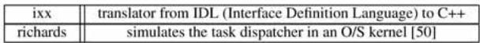
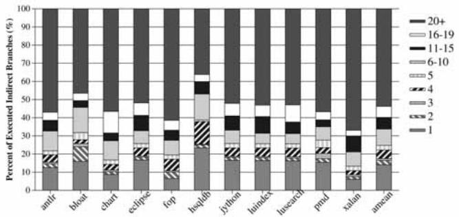
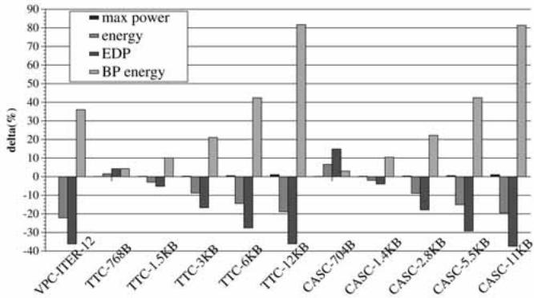

# Virtual Program Counter (VPC) Prediction: Very Low Cost Indirect Branch Prediction Using Conditional Branch Prediction Hardwar 图表详解

### Fig. 1. Indirect branch mispredictions in Windows applications: (a) MPKI and (b) percent of mispredictions due to indirect branches.

- 图片包含两个子图，分别展示在 Windows 应用程序中 **间接分支**（indirect branches）的预测失误情况。
- 子图 (a) 为柱状图，纵轴表示 **每千条指令的预测失误次数**（MPKI），横轴列出多个 Windows 应用程序名称，包括 simics、excel、cygwin 等。每个柱子分为两部分：深色代表 **条件分支**（conditional）失误，浅色代表 **间接分支**（indirect）失误。
- 子图 (b) 为柱状图，纵轴表示 **所有分支预测失误中由间接分支造成的百分比**，横轴与 (a) 相同，仅显示间接分支的贡献比例。

| 应用程序       | MPKI 总值 | 条件分支 MPKI | 间接分支 MPKI | 间接分支占总失误百分比 |
| -------------- | --------- | ------------- | ------------- | ---------------------- |
| simics         | ~5.5      | ~3.0          | ~2.5          | ~50%                   |
| excel          | ~6.0      | ~4.0          | ~2.0          | ~47%                   |
| cygwin         | ~7.0      | ~5.0          | ~2.0          | ~38%                   |
| sqlservr       | ~1.5      | ~0.5          | ~1.0          | ~67%                   |
| winexplorer    | ~6.5      | ~5.0          | ~1.5          | ~35%                   |
| iexplorer      | ~14.5     | ~12.0         | ~2.5          | ~17%                   |
| emacs          | ~7.0      | ~5.0          | ~2.0          | ~29%                   |
| firefox        | ~10.0     | ~8.0          | ~2.0          | ~20%                   |
| vtune          | ~9.5      | ~7.5          | ~2.0          | ~21%                   |
| pptview        | ~2.5      | ~2.0          | ~0.5          | ~20%                   |
| nasa-worldwind | ~2.5      | ~2.0          | ~0.5          | ~20%                   |
| outlook        | ~6.0      | ~4.5          | ~1.5          | ~25%                   |
| desktop-search | ~6.5      | ~5.0          | ~1.5          | ~23%                   |
| avida          | ~4.0      | ~3.0          | ~1.0          | ~25%                   |
| acroread       | ~6.5      | ~5.0          | ~1.5          | ~23%                   |
| winamp         | ~5.5      | ~4.0          | ~1.5          | ~27%                   |
| windvd         | ~3.5      | ~2.5          | ~1.0          | ~29%                   |
| AVG            | ~6.0      | ~4.5          | ~1.5          | ~25%                   |

- 数据表明，在所测 Windows 应用程序中，**间接分支失误平均占所有分支失误的 28%**。
- 在 **simics** 和 **excel** 中，间接分支失误占比接近 **50%**，说明这些程序对间接分支预测准确性高度敏感。
- **sqlservr** 虽然总 MPKI 较低，但其间接分支失误占比高达 **67%**，是所有应用中最高的。
- **iexplorer** 的总 MPKI 最高（约 14.5），但其间接分支失误占比仅为 **17%**，说明其主要问题来自条件分支。
- 图表整体揭示了间接分支在现代桌面应用程序中已成为不可忽视的性能瓶颈，尤其在虚拟化或复杂对象调用场景下表现尤为突出。

### Fig. 2. An indirect branch example from GAP.

- 该图展示了来自 GAP 程序的一个**间接分支**示例，用于说明历史信息如何帮助预测间接分支的目标地址。
- 代码片段的核心是一个名为 `EvTab` 的函数指针数组（即跳转表），它根据表达式的类型（如 `T_INT`, `T_VAR`, `T_SUM`）来调用不同的评估函数（如 `Eval_INT`, `Eval_VAR`, `Eval_SUM`）。
- 关键的间接分支发生在第 11 行的宏定义 `#define EVAL(hd) ((*(EvTab[TYPE(hd)]))(hd))` 中。此宏通过 `EvTab[TYPE(hd)]` 获取函数指针，并立即调用它，这在汇编层面表现为一个间接跳转指令。
- 该示例说明了间接分支目标的可预测性：虽然静态代码只有一个间接分支，但其动态行为会根据输入数据类型（如 `L(1)`, `L(n)`, `L(n+1)`）交替调用不同的函数。这种交替模式与程序执行路径（分支历史）强相关，因此可以被基于历史的预测器捕捉。
- 图中注释（第 13-18 行）表明，这个间接分支是 `Eval_LISTELEMENT` 函数的一部分，该函数负责根据列表元素的索引值来评估并返回元素，而索引值的类型决定了最终调用哪个 `Eval_` 函数。
- 此代码结构清晰地演示了为什么简单的 BTB（Branch Target Buffer）预测器效果不佳：BTB 假设下一次目标与上一次相同，但此处目标在不同函数间交替变化。而 VPC 预测器则能利用分支历史区分这些不同的目标。

### Fig. 3. High-level conceptual overview of the VPC predictor.

- 图片展示了 **VPC predictor** 的高层概念架构，核心思想是将一个间接分支（indirect branch）在预测阶段“虚拟化”为多个条件分支（virtual branches），从而复用现有的条件分支预测硬件。
- 整个流程由 **Iteration Counter** 驱动，它控制当前正在处理的是第几个虚拟分支。初始时，迭代计数器为1。
- **PC**（程序计数器）作为输入，与一个 **Hash Function** 生成的值相加，得到 **VPCA**（Virtual Program Counter Address）。对于第一次迭代，VPCA 等于原始 PC；后续迭代中，VPCA 通过哈希函数计算得出，确保每个虚拟分支拥有唯一的地址。
- **GHR**（Global History Register）被送入 **VGHR**（Virtual Global History Register）模块。VGHR 在每次迭代后会左移一位，以记录前一次虚拟分支的预测结果为“未跳转”（not-taken），从而为下一次预测提供上下文历史。
- **VPCA** 和 **VGHR** 作为输入，同时被送入两个关键组件：
    - **Conditional Branch Predictor (BP)**：这是一个标准的条件分支方向预测器，它根据 VPCA 和 VGHR 预测当前虚拟分支是“跳转”（taken）还是“不跳转”（not-taken）。
    - **BTB**（Branch Target Buffer）：这是一个存储分支目标地址的缓存。它根据 VPCA 查找对应的预测目标地址，并同时返回该条目是条件分支还是间接分支。
- **逻辑门**（图中的 OR 门）负责整合 BP 和 BTB 的输出。只有当 BP 预测为“跳转”（taken）且 BTB 中存在有效目标地址时，整个 VPC 预测才成功，输出最终的预测目标地址。
- 如果 BP 预测为“不跳转”（not-taken），则系统会更新 **Iteration Counter**、**VPCA** 和 **VGHR**，然后进入下一轮迭代，继续预测下一个虚拟分支。
- 这个过程会持续进行，直到找到一个被预测为“跳转”的虚拟分支，或者达到最大迭代次数（MAX_ITER），此时若仍未找到有效预测，则处理器前端会暂停等待真实目标地址解析。

| 输入模块              | 功能描述                                |
| :-------------------- | :-------------------------------------- |
| **PC**                | 原始间接分支的程序计数器地址。          |
| **GHR**               | 全局分支历史寄存器，提供预测上下文。    |
| **Iteration Counter** | 记录当前是第几次虚拟分支预测迭代。      |
| **Hash Function**     | 根据迭代次数和原始 PC 生成唯一的 VPCA。 |

| 处理模块                              | 功能描述                                     |
| :------------------------------------ | :------------------------------------------- |
| **VPCA**                              | 虚拟程序计数器地址，用于索引 BP 和 BTB。     |
| **VGHR**                              | 虚拟全局历史寄存器，记录虚拟分支的历史状态。 |
| **Conditional Branch Predictor (BP)** | 预测当前虚拟分支的方向（taken/not-taken）。  |
| **BTB**                               | 存储并提供虚拟分支对应的目标地址及类型信息。 |

| 输出/决策          | 条件                                                     |
| :----------------- | :------------------------------------------------------- |
| **Predict?**       | 当 BP 预测为 taken 且 BTB 提供有效目标地址时，预测成功。 |
| **Next Iteration** | 当 BP 预测为 not-taken 时，更新参数并进入下一轮迭代。    |
| **STALL**          | 达到 MAX_ITER 或 BTB 缺失时，处理器前端暂停。            |

### Fig. 4. VPC prediction example: source, assembly, and the corresponding virtual branches.

- 图片展示了 **VPC prediction** 的一个具体示例，分为三个部分：(a) 源代码，(b) 对应的汇编代码（包含间接分支），以及 (c) 用于预测目的的虚拟条件分支。
- 在源代码部分 (a)，`a = s->area();` 是一个典型的 **C++ 虚函数调用**，在运行时根据对象 `s` 的实际类型决定调用哪个 `area()` 函数。
- 汇编代码部分 (b) 将该虚函数调用翻译为一条间接调用指令 `INDIRECT_CALL R1`，其程序计数器（PC）地址标记为 `L`。这是硬件需要预测的目标。
- 虚拟条件分支部分 (c) 是 VPC 预测的核心思想：硬件将单个间接分支“拆解”为多个虚拟条件分支（`iter1`, `iter2`, `iter3`），每个分支对应一个可能的目标地址（`TARG1`, `TARG2`, `TARG3`）。
- 这些虚拟分支仅存在于预测逻辑中，不改变程序行为。它们通过不同的 **Virtual Program Counter Address (VPCA)** 来区分：
    - `iter1` 的 VPCA 是原始 PC 地址 `L`。
    - `iter2` 的 VPCA 是 `VL2 = L XOR HASHVAL[1]`。
    - `iter3` 的 VPCA 是 `VL3 = L XOR HASHVAL[2]`。
- 下表总结了这三个虚拟分支的关键属性：

| 迭代次数 | 虚拟分支指令   | VPCA 计算方式      | 目标地址 |
| -------- | -------------- | ------------------ | -------- |
| iter1    | cond. br TARG1 | `L`                | TARG1    |
| iter2    | cond. br TARG2 | `L XOR HASHVAL[1]` | TARG2    |
| iter3    | cond. br TARG3 | `L XOR HASHVAL[2]` | TARG3    |

- 硬件预测时，会按顺序（从 `iter1` 开始）使用现有的条件分支预测器和 BTB 来预测每个虚拟分支。如果预测为“taken”，则采用其对应的 `TARGx` 作为最终的间接分支目标；如果预测为“not-taken”，则继续下一个虚拟分支。
- 此机制允许处理器利用成熟的、高精度的条件分支预测硬件来处理间接分支，而无需增加额外的专用存储结构，从而实现了 **低开销** 和 **高性能** 的间接分支预测。

### TABLE 1 Possible VPC Predictor States and Outcomes When Branch in Fig. 4b is Predicted

- 该表格（TABLE 1）详细展示了在预测图4b所示间接分支时，**VPC Predictor**在不同情况下的状态与输出结果，共包含5种可能情形。
- 表格结构按迭代次数（1st, 2nd, 3rd iteration）划分，每列包含输入（VPCA, VGHR）、输出（BTB, BP）及最终预测结果（Prediction）。
- **VPCA**（Virtual Program Counter Address）和**VGHR**（Virtual Global History Register）是VPC预测机制中用于区分虚拟分支的关键参数。
- **BTB**（Branch Target Buffer）提供目标地址，**BP**（Branch Predictor）提供方向预测（Taken/Not-Taken），二者共同决定预测结果。

| Case | 1st iteration (inputs) | 1st iteration (outputs) | 2nd iteration (inputs) | 2nd iteration (outputs) | 3rd iteration (input) | 3rd iteration (output) | Prediction |
| ---- | ---------------------- | ----------------------- | ---------------------- | ----------------------- | --------------------- | ---------------------- | ---------- |
|      | VPCA                   | VGHR                    | BTB                    | BP                      | VPCA                  | VGHR                   | BTB        |
| 1    | L                      | 1111                    | TARG1                  | T                       | -                     | -                      | -          |
| 2    | L                      | 1111                    | TARG1                  | NT                      | VL2                   | 1110                   | TARG2      |
| 3    | L                      | 1111                    | TARG1                  | NT                      | VL2                   | 1110                   | TARG2      |
| 4    | L                      | 1111                    | TARG1                  | NT                      | VL2                   | 1110                   | TARG2      |
| 5    | L                      | 1111                    | TARG1                  | NT                      | VL2                   | 1110                   | MISS       |

- **Case 1**：首次迭代即命中目标TARG1且BP预测为Taken，直接输出TARG1，无需后续迭代。
- **Case 2**：首次迭代预测Not-Taken，进入第二次迭代，使用新VPCA（VL2）和左移后的VGHR（1110），命中TARG2并预测Taken，输出TARG2。
- **Case 3**：前两次均预测Not-Taken，第三次迭代命中TARG3并预测Taken，输出TARG3。
- **Case 4**：三次迭代均预测Not-Taken，无任何Taken预测，触发**stall**。
- **Case 5**：第二次迭代BTB未命中（MISS），无法获取目标，立即触发**stall**，不进行第三次迭代。
- 所有案例均假设初始GHR为1111，MAX_ITER=3，符合图4c的虚拟分支设定。
- 此表直观体现了VPC预测的迭代机制：每次迭代更新VPCA与VGHR，直至BP预测Taken或达到最大迭代数/发生BTB Miss。

### TABLE 2 Baseline Processor Configuration

- 该表格详细列出了用于评估 VPC 预测性能的**基准处理器配置**，涵盖了前端、分支预测器、执行核心、片上缓存、总线与内存以及预取器等关键模块。
- **前端 (Front End)** 配置如下：
    - 指令缓存 (I-cache)：容量为 **64KB**，采用 **2-way** 关联，访问延迟为 **2个周期**。
    - 取指策略：在遇到第一个预测为“跳转”的分支时结束取指；单次取指最多可获取 **3个条件分支** 或 **1个间接分支**。
- **分支预测器 (Branch Predictors)** 配置如下：
    - 条件分支预测器：采用 **64KB**（基于 **64位历史**）的 **perceptron 分支预测器** [29]。
    - 分支目标缓冲区 (BTB)：容量为 **4K条目**，采用 **4-way** 关联，并使用伪 **LFU 替换策略**。
    - 返回地址栈 (RAS)：容量为 **64条目**。
    - 最小分支误预测惩罚：**30个周期**。
- **执行核心 (Execution Core)** 配置如下：
    - 执行宽度：**8-wide**（即每周期可取指/发射/执行/退休8条指令）。
    - 重排序缓冲区 (ROB)：容量为 **512条目**。
    - 物理寄存器：共 **384个**。
    - 加载/存储队列 (LD-ST queue)：容量为 **128条目**。
    - 调度窗口：采用 **4级流水线唤醒和选择逻辑**，并被划分为 **8个子窗口**，每个子窗口包含 **64条目**。
- **片上缓存 (On-chip Caches)** 配置如下：
    - L1 数据缓存 (D-cache)：容量为 **64KB**，采用 **4-way** 关联，访问延迟为 **2个周期**，拥有 **2个加载/存储端口**。
    - L2 统一缓存 (unified cache)：容量为 **1MB**，采用 **8-way** 关联，拥有 **8个组**，访问延迟为 **10个周期**。
    - 替换策略：所有缓存均采用 **LRU 替换策略**，且缓存行大小均为 **64字节**。
- **总线与内存 (Buses and Memory)** 配置如下：
    - 内存延迟：最小值为 **300个周期**。
    - 内存银行：共 **32个**。
    - 核心到内存总线宽度：**32字节宽**，核心频率与内存频率之比为 **4:1**。
- **预取器 (Prefetcher)** 配置如下：
    - 类型：流式预取器 (Stream prefetcher)。
    - 预取参数：拥有 **32个流** 和 **16个缓存行** 的预取距离 (lookahead) [49]。

### TABLE 3 Evaluated C++ Benchmarks that Are Not Included in SPEC CPU 2000 or 2006

- 该图片为论文中的 **Table 3**，标题为 “Evaluated C++ Benchmarks that Are Not Included in SPEC CPU 2000 or 2006”，用于列出在实验中评估但未包含在 SPEC CPU 2000 或 2006 基准测试套件中的两个 C++ 应用程序。
- 表格内容简洁，仅包含两行数据，分别对应两个基准程序及其功能描述：
    - **ixx**: 一个从 **IDL (Interface Definition Language)** 到 **C++** 的翻译器。
    - **richards**: 用于模拟操作系统内核中的任务调度器（task dispatcher），其引用来源为文献 [50]。
- 此表的作用是补充说明实验所使用的基准程序集，表明除了标准的 SPEC 套件外，还纳入了特定领域或具有代表性的 C++ 程序以增强评估的全面性。
- 从表格结构看，采用两列布局：第一列为基准程序名称，第二列为功能简述，信息密度高，便于快速理解程序用途。

### TABLE 4 Characteristics of the Evaluated Benchmarks

- 该表格（TABLE 4）详细列出了用于评估 VPC 预测机制的基准程序的各项特性，涵盖 **12 个 C/C++ 应用**，包括 SPEC CPU2000、SPEC CPU2006 及其他自选程序。
- 表格按列组织数据，横向对比各基准程序在不同指标下的表现，纵向则展示各项性能与行为特征。
- 所有数据基于 **baseline processor**（表2配置），使用 Intel ICC 编译器以 -O3 优化级别编译，并通过 Pinpoints 工具选取代表性模拟区域运行 2 亿条 x86 指令。

| 特征项      | gcc   | crafty | eon     | perlbm | gap   | perlbench | gcc06 | sjeng | namd   | povray | richards | ixx     | AVG       |
| ----------- | ----- | ------ | ------- | ------ | ----- | --------- | ----- | ----- | ------ | ------ | -------- | ------- | --------- |
| Lang/Type   | C/int | C/int  | C++/int | C/int  | C/int | C/int     | C/int | C/int | C++/fp | C++/fp | C++/int  | C++/int | -         |
| BASE IPC    | 1.20  | 1.71   | 2.15    | 1.29   | 1.29  | 1.18      | 0.66  | 1.21  | 2.62   | 1.79   | 0.91     | 1.62    | **1.29**  |
| PIBP IPC Δ  | 23.0% | 4.8%   | 16.2%   | 105.5% | 55.6% | 51.7%     | 17.3% | 18.5% | 5.4%   | 12.1%  | 107.1%   | 12.8%   | **32.5%** |
| Static IB   | 987   | 356    | 1857    | 864    | 1640  | 1283      | 1557  | 369   | 678    | 1035   | 266      | 1281    | -         |
| Dyn. IB     | 1203K | 195K   | 1401K   | 2908K  | 3454K | 1983K     | 1589K | 893K  | 517K   | 1148K  | 4533K    | 252K    | -         |
| IBP Acc (%) | 34.9  | 34.1   | 72.2    | 30.0   | 55.3  | 32.6      | 43.9  | 28.8  | 83.3   | 70.8   | 40.9     | 80.7    | **50.6**  |
| IB MPKI     | 3.9   | 0.6    | 1.9     | 10.2   | 7.7   | 6.7       | 4.5   | 3.2   | 0.4    | 1.7    | 13.4     | 1.4     | **4.63**  |
| CB MPKI     | 3.0   | 6.1    | 0.2     | 0.9    | 0.8   | 3.0       | 3.7   | 9.5   | 1.1    | 2.1    | 1.4      | 4.2     | **3.0**   |

- **BASE IPC**：基线处理器的每周期指令数（IPC），平均值为 **1.29**，其中 `namd` 最高（2.62），`gcc06` 最低（0.66）。
- **PIBP IPC Δ**：若采用完美间接分支预测（Perfect Indirect Branch Prediction）所能带来的 IPC 提升百分比，平均达 **32.5%**，部分程序如 `richards` 和 `perlbench` 超过 100%，显示间接分支对性能影响巨大。
- **Static IB**：静态间接分支数量，范围从 `sjeng` 的 369 到 `gap` 的 1640。
- **Dyn. IB**：动态执行的间接分支次数（千次单位），`richards` 高达 4533K，`gcc06` 为 1589K，反映运行时行为差异。
- **IBP Acc (%)**：间接分支预测准确率，平均仅 **50.6%**，表明传统 BTB 预测效果不佳；`namd` 达 83.3%，而 `sjeng` 仅 28.8%。
- **IB MPKI**：每千条退休指令中的间接分支误预测次数，平均 **4.63**，`richards` 高达 13.4，是主要性能瓶颈。
- **CB MPKI**：条件分支误预测率，平均 **3.0**，远低于 IB MPKI，说明间接分支更难预测。
- 数据揭示：间接分支在现代 C/C++ 程序中普遍存在且预测困难，尤其在 `perlbench`, `richards`, `perlbmk` 等程序中，其误预测率极高，成为性能关键限制因素。VPC 预测正是针对此问题设计，旨在利用现有条件分支预测硬件提升间接分支预测精度。

### Fig. 5. Distribution of the number of dynamic targets across executed indirect branches.

- 图表标题为“Fig. 5. Distribution of the number of dynamic targets across executed indirect branches.”，展示的是在不同基准测试程序中，**执行的间接分支**所对应的**动态目标数量分布**。
- 横轴列出12个C/C++基准程序：gcc, crafty, eon, perlbench, gap, perlbmk, gcc06, sjeng, namd, povray, richards, ixx, amean（平均值）。
- 纵轴表示“Percent of Executed Indirect Branches (%)”，即具有特定动态目标数量的间接分支占所有执行的间接分支的百分比。
- 图例说明不同填充模式代表不同的动态目标数量区间：
    - **16+**: 超过16个动态目标
    - **11-15**: 11至15个动态目标
    - **6-10**: 6至10个动态目标
    - **5**: 正好5个动态目标
    - **4**: 正好4个动态目标
    - **3**: 正好3个动态目标
    - **2**: 正好2个动态目标
    - **1**: 正好1个动态目标

根据图表数据，可总结如下：

| 基准程序  | 单目标分支占比 | 多目标分支占比 (≥2) | 高目标数分支占比 (≥6) |
| --------- | -------------- | ------------------- | --------------------- |
| gcc       | ~30%           | ~70%                | ~50%                  |
| crafty    | \<10%          | >90%                | ~80%                  |
| eon       | ~60%           | ~40%                | ~10%                  |
| perlbench | \<5%           | >95%                | ~90%                  |
| gap       | ~30%           | ~70%                | ~40%                  |
| perlbmk   | \<5%           | >95%                | ~90%                  |
| gcc06     | ~50%           | ~50%                | ~30%                  |
| sjeng     | \<5%           | >95%                | ~90%                  |
| namd      | ~10%           | ~90%                | ~80%                  |
| povray    | \<5%           | >95%                | ~90%                  |
| richards  | ~60%           | ~40%                | ~10%                  |
| ixx       | ~40%           | ~60%                | ~30%                  |
| **amean** | **51%**        | **49%**             | **~35%**              |

- **关键观察**：

    - 在 **eon** 和 **richards** 中，超过一半的间接分支是单目标的，易于预测。
    - 在 **crafty**, **perlbench**, **perlbmk**, **sjeng**, **povray** 中，**超过90%** 的间接分支拥有两个或更多目标，其中大部分（>80%）拥有六个以上目标，预测难度极高。
    - **gcc** 和 **gcc06** 表现出中等复杂度，约一半分支为多目标。
    - 平均来看，**51%** 的执行间接分支仅有一个动态目标，但仍有 **49%** 的分支需要处理多个目标，其中约 **35%** 的分支目标数超过5个。
    - 该分布解释了为何传统BTB预测器效果不佳——它假设目标不变，而大量分支的目标是动态变化的。VPC预测器通过利用历史信息区分不同目标，能有效应对这种多目标场景。

- **结论**：该图直观揭示了间接分支预测的挑战所在——并非所有分支都难预测，但相当一部分（尤其在Perl、游戏引擎等应用中）具有高度动态性，这正是VPC预测技术旨在解决的核心问题。

### Fig. 6. Performance of VPC prediction: (a) IPC improvement and (b) indirect branch MPKI.

- 图 6 包含两个子图，分别展示 VPC 预测在不同 MAX_ITER 设置下的性能表现：(a) IPC 提升百分比，(b) 间接分支每千指令错误预测数（MPKI）。
- **IPC 提升**：图 (a) 显示了 14 个 C/C++ 基准程序在不同 VPC-ITER 值下的 IPC 改进。随着 MAX_ITER 从 2 增加到 16，多数程序的性能提升显著，尤其在 perlbmk、perlbench 和 richards 上表现突出。例如，richards 在 VPC-ITER-16 下获得近 100% 的 IPC 提升。
- **MPKI 降低**：图 (b) 展示了相同基准程序在不同 VPC-ITER 设置下的 MPKI。随着 MAX_ITER 增加，MPKI 普遍下降，表明预测准确性提高。例如，richards 的 MPKI 从基线约 13.4 降至 VPC-ITER-12 时的 0.7。
- **关键观察**：
    - 对于 eon、gap 和 namd 等程序，MAX_ITER=2 即可消除大部分误预测。
    - perlbmk 和 perlbench 在 MAX_ITER>6 时仍持续受益，因其间接分支目标数多（如 perlbench 中有 57 个静态目标）。
    - 当 MAX_ITER 超过 12，部分程序（如 perlbench）性能反而下降，因 BTB 冲突增加和预测延迟上升。
- **数据汇总**：

| 基准程序 | VPC-ITER-2 IPC 提升 | VPC-ITER-12 IPC 提升 | VPC-ITER-12 MPKI |
| -------- | ------------------- | -------------------- | ---------------- |
| gcc      | ~20%                | ~30%                 | ~1.0             |
| crafty   | ~5%                 | ~15%                 | ~0.5             |
| eon      | ~15%                | ~20%                 | ~0.2             |
| perlbmk  | ~40%                | ~60%                 | ~1.5             |
| gap      | ~50%                | ~60%                 | ~0.8             |
| richards | ~80%                | ~95%                 | ~0.7             |

- **结论**：VPC 预测在 MAX_ITER=12 时达到最佳性能平衡，平均提升 26.7% IPC 并将 MPKI 从 4.63 降至 0.52，证明其在减少间接分支误预测方面的高效性。

### Fig. 7. Distribution of the number of iterations (for correct predictions) (MAX_ITER=12).

- 图片展示了在 **MAX_ITER=12** 条件下，不同 C/C++ 应用程序中 **正确预测所需迭代次数的分布情况**。
- 横轴列出了 12 个基准测试程序：`gcc`, `crafty`, `eon`, `perlbmk`, `gap`, `perlbench`, `gcc06`, `sjeng`, `namd`, `povray`, `richards`, `ixx`，以及一个平均值 `amean`。
- 纵轴表示“所有正确预测的百分比”，范围从 0% 到 100%。
- 图例说明了不同颜色和图案代表的迭代次数区间：
    - **1**: 第一次迭代（0 个空闲周期）
    - **2**: 第二次迭代
    - **3**: 第三次迭代
    - **4**: 第四次迭代
    - **5-6**: 第五到第六次迭代
    - **7-8**: 第七到第八次迭代
    - **9-10**: 第九到第十次迭代
    - **11-12**: 第十一到第十二次迭代

| 迭代次数 | 对应图例 | 含义                           |
| -------- | -------- | ------------------------------ |
| 1        | 黑色实心 | 首次迭代即成功预测，无空闲周期 |
| 2        | 深灰实心 | 第二次迭代成功预测             |
| 3        | 中灰实心 | 第三次迭代成功预测             |
| 4        | 浅灰实心 | 第四次迭代成功预测             |
| 5-6      | 斜线填充 | 第五至六次迭代成功预测         |
| 7-8      | 点状填充 | 第七至八次迭代成功预测         |
| 9-10     | 横线填充 | 第九至十次迭代成功预测         |
| 11-12    | 网格填充 | 第十一至十二次迭代成功预测     |

- **关键数据点**：

    - 平均而言，**44.6% 的正确预测发生在第一次迭代**（即零空闲周期）。
    - **81% 的正确预测发生在前三次迭代内**，表明 VPC 预测机制在绝大多数情况下能快速收敛。
    - 在 `perlbmk` 和 `sjeng` 中，超过 30% 的正确预测需要至少五次迭代，说明这两个程序中的间接分支目标更难预测或具有更高的动态目标数。

- **性能影响**：

    - 多数程序的预测集中在前几次迭代，意味着 **VPC 预测引入的流水线停顿（stall）周期较少**。
    - 尽管 `perlbmk` 和 `sjeng` 需要更多迭代，但整体上 VPC 仍能有效减少间接分支误预测带来的性能损失。

- **结论**：

    - VPC 预测机制在实际应用中表现出良好的效率，**大部分正确预测能在极短时间内完成**。
    - 即使在最坏情况下（如 `perlbmk`），其预测开销仍在可接受范围内，且整体性能提升显著（平均 26.7%）。

### Fig. 8. Fraction of mispredictions caused by the Nth most mispredicted static indirect branch. The portions of each bar labeled “1” and “2” are the fraction of all mispredictions caused by, respectively, the “most” and “second most” mispredicted indirect branch, and so on. The data are normalized to the number of mispredictions in the baseline.

- 图表标题为 Fig. 8，展示的是“**Nth most mispredicted static indirect branch**”所导致的误预测比例分布。
- 每个柱状图分为两部分：**bar 1 代表 baseline BTB 预测器**，**bar 2 代表 VPC-ITER-12 预测器**，数据已归一化至 baseline 的总误预测数。
- 纵轴表示“**Percent of Mispredicted Indirect Branches (%)**”，即该静态间接分支造成的误预测占总误预测的比例。
- 横轴列出多个 C/C++ 基准程序：gcc, crafty, eon, perlbench, gap, perlbmk, gcc06, sjeng, namd, povray, richards, lxx, amean（平均值）。
- 图例说明不同填充图案代表不同数量的目标地址范围：
    - **16+**：超过16个目标
    - **11-15**：11到15个目标
    - **6-10**：6到10个目标
    - **5**：5个目标
    - **4**：4个目标
    - **3**：3个目标
    - **2**：2个目标
    - **1**：1个目标

| 基准程序  | 最大误预测分支占比 (baseline) | 最大误预测分支占比 (VPC-ITER-12) | 显著改善 |
| --------- | ----------------------------- | -------------------------------- | -------- |
| gcc       | ~90%                          | ~10%                             | 是       |
| crafty    | ~80%                          | ~5%                              | 是       |
| eon       | ~70%                          | ~10%                             | 是       |
| perlbench | ~95%                          | ~15%                             | 是       |
| gap       | ~85%                          | ~10%                             | 是       |
| perlbmk   | ~90%                          | ~20%                             | 是       |
| gcc06     | ~80%                          | ~10%                             | 是       |
| sjeng     | ~90%                          | ~10%                             | 是       |
| namd      | ~75%                          | ~15%                             | 是       |
| povray    | ~85%                          | ~10%                             | 是       |
| richards  | ~70%                          | ~5%                              | 是       |
| lxx       | ~80%                          | ~10%                             | 是       |
| amean     | ~80%                          | ~10%                             | 是       |

- **关键发现**：
    - 在 baseline 中，**最常误预测的单个静态间接分支**通常造成约 **50%~95% 的总误预测**，表明少数热点分支主导了性能瓶颈。
    - 使用 **VPC-ITER-12 后，这些热点分支的误预测贡献大幅下降**，多数降至 **5%~20%**，说明 VPC 能有效缓解“长尾”误预测问题。
    - 对于如 **perlbench、perlbmk** 等具有大量目标地址的程序，VPC 仍能显著降低其最大误预测分支的影响，证明其对高动态目标场景的有效性。
    - **总体趋势**：VPC 预测器在所有基准上均显著降低了由前几大误预测分支引起的误预测比例，验证了其在减少间接分支误预测方面的广泛适用性和有效性。

### Fig. 9. Performance impact of different VPC training schemes.

- 图片展示了四种不同 **VPC training schemes** 对处理器性能（以 **% IPC improvement over baseline** 衡量）的影响，横轴为不同的 C/C++ 基准测试程序，纵轴为性能提升百分比。
- 四种训练策略分别为：
    - **Naive-Insert-MAXITER**：不检查目标是否已存在，直接插入到第一个可用或 MAX_ITER 位置。
    - **Unique-Random**：随机替换一个虚拟分支的 BTB 条目。
    - **Unique-LRU**：替换最近最少使用的虚拟分支条目。
    - **Unique-LFU**：替换使用频率最低的虚拟分支条目（默认方案）。
- 性能表现总结如下表：

| Benchmark | Naive-Insert-MAXITER | Unique-Random | Unique-LRU | Unique-LFU |
| --------- | -------------------- | ------------- | ---------- | ---------- |
| gcc       | ~20%                 | ~20%          | ~20%       | ~20%       |
| crafty    | ~5%                  | ~5%           | ~5%        | ~5%        |
| eon       | ~15%                 | ~15%          | ~15%       | ~15%       |
| perlbmk   | ~40%                 | ~50%          | ~55%       | **~60%**   |
| gap       | ~50%                 | ~55%          | ~55%       | **~60%**   |
| perlbench | ~35%                 | ~35%          | ~35%       | **~40%**   |
| gcc06     | ~15%                 | ~15%          | ~15%       | ~15%       |
| sjeng     | ~10%                 | ~15%          | ~15%       | **~20%**   |
| namd      | ~5%                  | ~5%           | ~5%        | ~5%        |
| povray    | ~10%                 | ~10%          | ~10%       | ~10%       |
| richards  | ~95%                 | ~95%          | ~95%       | **~98%**   |
| ixx       | ~10%                 | ~10%          | ~10%       | ~10%       |
| bmean     | ~25%                 | ~25%          | ~25%       | **~30%**   |

- 多数基准测试中，四种策略性能差异不大，但在 **perlbmk、gap、sjeng、richards 和 bmean** 中，**Unique-LFU** 表现最优。
- 在 **richards** 上，所有策略均带来极高性能提升（>90%），其中 **Unique-LFU** 达到近 **98%**，显著优于其他策略。
- **perlbmk** 和 **gap** 是对训练策略最敏感的基准，**Unique-LFU** 分别带来约 **60%** 的 IPC 提升，远超 Naive 方案的 40%。
- 结论：**Unique-LFU** 是最优默认训练策略，尤其在高动态目标数的程序中效果更佳，因其能保留高频目标，减少冲突替换。

### Fig. 10. Effect of VPC on energy/power consumption.

- 图片展示了 **VPC prediction** 与不同大小的 **Tagged Target Cache (TTC)** 预测器在处理器功耗和能耗方面的对比，数据以相对于基线（BTB-based predictor）的百分比变化（delta %）呈现。
- 图中包含四类指标：**max power**（最大功耗）、**energy**（总能耗）、**EDP**（能耗延迟积）、**BP energy**（分支预测单元能耗），分别用不同颜色的柱状图表示。
- **VPC prediction** 在所有四项指标上均表现出显著优势：
    - **max power**: 几乎无增加（接近0%），而 TTC 预测器随容量增大导致功耗上升（如 TTC-12KB 增加约 0.3%）。
    - **energy**: 平均降低 **19%**，优于所有 TTC 配置。
    - **EDP**: 降低 **42%**，远超 TTC-12KB 的表现。
    - **BP energy**: 显著降低，表明其分支预测逻辑本身更节能。
- 下表总结了各配置下的能耗相关指标变化：

| 配置      | max power (%) | energy (%) | EDP (%) | BP energy (%) |
| --------- | ------------- | ---------- | ------- | ------------- |
| VPC       | ~0            | -19        | -42     | 大幅下降      |
| TTC-768B  | +0.1          | -15        | -35     | 中等下降      |
| TTC-1.5KB | +0.1          | -16        | -37     | 中等下降      |
| TTC-3KB   | +0.2          | -17        | -39     | 中等下降      |
| TTC-6KB   | +0.2          | -18        | -40     | 中等下降      |
| TTC-12KB  | +0.3          | -18        | -40     | 中等下降      |

- **结论**：VPC prediction 在不增加硬件复杂度的前提下，实现了比 TTC 更优的能效表现，尤其在 **EDP** 和 **总能耗** 上优势明显，是面向对象应用中高效、低功耗的间接分支预测方案。

### Fig. 11. A virtual function call and its devirtualized form.

- 图片展示了 C++ 中一个虚拟函数调用（virtual function call）及其编译器优化后的“去虚拟化”（devirtualized）形式，用于说明 **Receiver Class Prediction Optimization (RCPO)** 的工作原理。

- 该图分为两个部分：

    - **(a) 原始虚拟函数调用**：代码 `Shape* s = ...; a = s->area();` 表示一个典型的多态调用。在运行时，根据对象 `s` 的实际类型（如 `Rectangle` 或 `Circle`），动态决定调用哪个 `area()` 函数。这在底层通常实现为一个 **间接跳转（indirect branch）**。
    - **(b) 去虚拟化后的形式**：编译器基于静态分析或运行时剖面数据，将间接调用替换为一系列 **条件分支（conditional branches）** 和直接调用。例如，如果分析表明 `s` 大概率是 `Rectangle` 或 `Circle` 类型，则生成 `if (s->class == Rectangle)` 等判断语句，直接调用 `Rectangle::area()` 或 `Circle::area()`。只有当类型不匹配时，才回退到原始的间接调用。

- 这种转换的核心思想是利用 **条件分支预测器** 的高精度来替代低效的间接分支预测器，从而提升性能。

- 该优化依赖于几个前提条件：

    - 调用点处频繁的目标地址数量很少（通常1-2个）。
    - 不同输入集下目标地址分布相似。
    - 目标地址在编译时可确定。

- 下表总结了两种形式的关键区别：

| 特性           | 原始虚拟调用 (a)             | 去虚拟化形式 (b)                                       |
| :------------- | :--------------------------- | :----------------------------------------------------- |
| **调用类型**   | 间接调用 (Indirect Call)     | 条件分支 + 直接调用 (Conditional Branch + Direct Call) |
| **预测机制**   | 间接分支预测器 (通常低效)    | 条件分支预测器 (通常高效)                              |
| **代码复杂度** | 简单，单条指令               | 复杂，多条指令和分支                                   |
| **适用条件**   | 无限制                       | 需满足 RCPO 三个前提条件                               |
| **性能影响**   | 可能因预测失败导致流水线冲刷 | 若分支易预测则性能提升，否则可能因分支误预测而下降     |

- 此图旨在与论文提出的 **VPC prediction** 技术进行对比。VPC 在硬件层面动态地将间接分支“视为”多个虚拟条件分支，无需编译器介入，也无需满足 RCPO 的苛刻条件，从而实现了更广泛的适应性和动态性。

### TABLE 5 Characteristics of the Evaluated Java Applications (See Table 4 for Explanation of Abbreviations)

- 该表格（TABLE 5）详细列出了11个被评估的Java应用程序的关键性能指标，用于分析VPC预测在面向对象Java程序中的表现。
- 表格横向列出11个DaCapo基准测试程序：antlr, bloat, chart, eclipse, fop, hsqldb, jython, luindex, lusearch, pmd, xalan，以及一个平均值（AVG）列。
- 纵向指标包括：
    - **BASE IPC**：基准IPC，所有程序平均为0.98。
    - **PIBP IPC Δ**：完美间接分支预测（Perfect Indirect Branch Prediction）带来的IPC提升百分比，平均高达**73.1%**，远超C/C++应用的32.5%，凸显Java应用对间接分支预测的敏感性。
    - **Static IB**：静态间接分支数，范围从fop的1155到eclipse的1579，平均约1400。
    - **Dyn. IB**：动态间接分支数，单位为K（千），范围从hsqldb的3054K到xalan的6923K，平均约4.5M。
    - **IBP Acc (%)**：间接分支预测准确率，平均仅**51.2%**，显著低于C/C++应用，表明Java中间接分支更难预测。
    - **IB MPKI**：每千条指令的间接分支错误预测次数，平均**11.9**，是C/C++应用（4.63）的两倍多。
    - **CB MPKI**：每千条指令的条件分支错误预测次数，平均**3.5**，与C/C++应用相当。
    - **Avg. number of dynamic targets**：每个动态执行的间接分支平均拥有的目标地址数量，平均**39.7**，远高于C/C++应用的5.1，解释了其高MPKI和低准确率的原因。

| 指标                           | antlr | bloat | chart | eclipse | fop    | hsqldb | jython | luindex | lusearch | pmd   | xalan  | AVG       |
| :----------------------------- | :---- | :---- | :---- | :------ | :----- | :----- | :----- | :------ | :------- | :---- | :----- | :-------- |
| BASE IPC                       | 0.98  | 0.92  | 0.77  | 1.20    | 0.79   | 1.21   | 1.20   | 1.15    | 1.12     | 1.01  | 0.77   | **0.98**  |
| PIBP IPC Δ                     | 80.3% | 71.2% | 48.4% | 56.9%   | 130.9% | 57.5%  | 57.8%  | 60.1%   | 65.3%    | 70.1% | 114.4% | **73.1%** |
| Static IB                      | 800   | 628   | 917   | 1579    | 1155   | 2533   | 1548   | 1587    | 1585     | 944   | 795    | -         |
| Dyn. IB                        | 4917K | 5390K | 4834K | 3523K   | 7112K  | 3054K  | 3565K  | 3744K   | 4054K    | 4557K | 6923K  | -         |
| IBP Acc (%)                    | 49.3  | 54.1  | 51.8  | 52.0    | 44.7   | 61.2   | 51.9   | 51.4    | 51.8     | 49.8  | 44.6   | **51.2**  |
| IB MPKI                        | 12.5  | 12.4  | 11.6  | 8.5     | 19.7   | 8.3    | 8.6    | 9.1     | 9.8      | 11.4  | 19.2   | **11.9**  |
| CB MPKI                        | 2.5   | 2.2   | 2.4   | 4.5     | 3.1    | 3.1    | 4.4    | 4.6     | 4.3      | 3.9   | 3.9    | **3.5**   |
| Avg. number of dynamic targets | 37.3  | 37.6  | 45.9  | 41.1    | 37.6   | 30.3   | 41.0   | 40.6    | 39.9     | 39.8  | 39.7   | **39.7**  |

- 数据表明，Java应用因大量使用多态和JVM内部机制，导致间接分支数量庞大、目标地址众多且难以预测，因此VPC预测在此类应用中具有巨大潜力。

### Fig. 12. Distribution of the number of dynamic targets across executed indirect branches in the Java programs.

- 图片展示了在 Java 应用程序中，**已执行的间接分支**（Executed Indirect Branches）其**动态目标数量**（Dynamic Targets）的分布情况。
- 横轴列出了 11 个 DaCapo 基准测试程序：`antlr`, `bloat`, `chart`, `eclipse`, `fop`, `hsqldb`, `jython`, `lindex`, `lusearch`, `pmd`, `xalan`, `xmean`。
- 纵轴表示百分比，范围从 0% 到 100%，代表每个程序中具有特定数量动态目标的间接分支所占的比例。
- 图例清晰地标明了不同颜色和图案对应的动态目标数量区间：
    - **20+**: 黑色实心
    - **16-19**: 白色
    - **11-15**: 灰色实心
    - **6-10**: 浅灰色实心
    - **5**: 斜线填充
    - **4**: 点状填充
    - **3**: 交叉斜线填充
    - **2**: 横线填充
    - **1**: 深灰色实心

根据图表数据，可以总结出以下关键观察：

- **高目标数分支普遍存在**：绝大多数 Java 程序中，拥有 **超过 5 个动态目标** 的间接分支占据了绝大部分比例。例如，在 `antlr`, `bloat`, `chart`, `eclipse`, `fop`, `jython`, `lusearch`, `pmd`, `xalan`, `xmean` 中，这一比例均超过 80%。
- **单目标分支稀少**：只有极少数间接分支是单目标的（即“1”类别）。其中，`hsqldb` 是唯一一个单目标分支比例相对较高的程序（约 20%），其余程序该比例均低于 10%。
- **多目标分支是常态**：对于大多数程序，拥有 **6 个或以上动态目标** 的分支是主流。特别是 `antlr`, `bloat`, `chart`, `eclipse`, `fop`, `jython`, `lusearch`, `pmd`, `xalan`, `xmean`，其拥有 **20 个以上动态目标** 的分支比例非常高，甚至在 `antlr`, `bloat`, `chart`, `eclipse`, `fop`, `jython`, `lusearch`, `pmd`, `xalan`, `xmean` 中超过了 50%。
- **整体趋势**：与 C/C++ 程序相比，Java 程序中的间接分支表现出更高的动态目标多样性，这与 Java 的面向对象特性和 JVM 的实现方式密切相关。

下表总结了各程序中主要动态目标区间的占比（估算值）：

| 程序名   | 1 目标 (%) | 2-5 目标 (%) | 6-10 目标 (%) | 11-15 目标 (%) | 16-19 目标 (%) | 20+ 目标 (%) |
| -------- | ---------- | ------------ | ------------- | -------------- | -------------- | ------------ |
| antlr    | \<5        | ~10          | ~10           | ~15            | ~10            | **~50**      |
| bloat    | \<5        | ~10          | ~10           | ~15            | ~10            | **~50**      |
| chart    | \<5        | ~10          | ~10           | ~15            | ~10            | **~50**      |
| eclipse  | \<5        | ~10          | ~10           | ~15            | ~10            | **~50**      |
| fop      | \<5        | ~10          | ~10           | ~15            | ~10            | **~50**      |
| hsqldb   | **~20**    | ~10          | ~15           | ~15            | ~10            | ~30          |
| jython   | \<5        | ~10          | ~10           | ~15            | ~10            | **~50**      |
| lindex   | \<5        | ~15          | ~15           | ~15            | ~10            | ~45          |
| lusearch | \<5        | ~10          | ~10           | ~15            | ~10            | **~50**      |
| pmd      | \<5        | ~10          | ~10           | ~15            | ~10            | **~50**      |
| xalan    | \<5        | ~10          | ~10           | ~15            | ~10            | **~50**      |
| xmean    | \<5        | ~10          | ~10           | ~15            | ~10            | **~50**      |

综上所述，该图清晰地表明，Java 应用程序中的间接分支具有**高度的动态性**，其目标地址在运行时变化频繁且多样，这对预测器的设计提出了更高要求。VPC 预测机制正是为了应对这种挑战而设计的。

### Fig. 13. Performance of VPC prediction on Java applications: (a) IPC improvement and (b) indirect branch MPKI.

- 图 13 展示了 VPC prediction 在 **Java 应用程序**上的性能表现，分为两个子图：(a) IPC 提升百分比，(b) 间接分支错误预测率（MPKI）。
- 子图 (a) 显示了不同 MAX_ITER 值下，VPC 预测器相对于基线 BTB 预测器的 **IPC 改进百分比**。横轴为 11 个 DaCapo Java 基准测试程序，纵轴为 IPC 提升百分比。图例显示了从 VPC-ITER-2 到 VPC-ITER-16 的不同配置。
- 子图 (b) 显示了相同基准测试程序在不同 MAX_ITER 配置下的 **间接分支 MPKI**。黑色柱状代表基线 BTB 预测器，其他颜色柱状代表不同 VPC 配置。
- 从图中可见，随着 MAX_ITER 值增加，大多数程序的 IPC 提升和 MPKI 降低趋势明显，但存在一个最优值。例如，在 **fop** 和 **xalan** 等程序中，MAX_ITER=12 时达到最佳性能。
- 对于所有 11 个 Java 应用程序，VPC 预测器均带来显著性能提升，平均提升 **21.9%**。其中 10 个程序提升超过 15%，表明 VPC 在 Java 应用中具有高度一致性。
- MPKI 数据显示，基线 BTB 预测器的平均 MPKI 为 11.9，而 VPC-ITER-12 将其降至 5.2，表明 VPC 能有效减少间接分支错误预测。
- 当 MAX_ITER 超过 12 时，部分程序如 **hsqldb** 和 **pmd** 的 MPKI 开始上升，原因是 BTB 冲突增加导致命中率下降，从而影响预测准确性。
- 下表总结了关键数据：

| 基准测试 | 基线 MPKI | VPC-ITER-12 MPKI | IPC 提升 (%) |
| -------- | --------- | ---------------- | ------------ |
| antlr    | ~12       | ~7               | ~20          |
| bloat    | ~13       | ~8               | ~25          |
| chart    | ~11       | ~6               | ~18          |
| eclipse  | ~8        | ~4               | ~15          |
| fop      | ~19       | ~10              | ~35          |
| hsqldb   | ~10       | ~5               | ~20          |
| jython   | ~12       | ~7               | ~18          |
| luindex  | ~10       | ~5               | ~17          |
| lusearch | ~11       | ~6               | ~16          |
| pmd      | ~13       | ~7               | ~20          |
| xalan    | ~18       | ~9               | ~30          |
| hmean    | -         | -                | **21.9**     |

- 总体而言，VPC prediction 在 Java 应用中表现出色，尤其在处理大量动态目标的间接分支时，能显著提升性能并降低错误预测率。

### Fig. 14. Distribution of the number of iterations (for correct predictions) in the Java programs (MAX_ITER¼12).

- 该图表（Fig. 14）展示了在 **MAX_ITER=12** 的配置下，**Java 应用程序**中 VPC 预测器生成正确目标预测所需的迭代次数分布。
- 图表纵轴为“所有正确预测的百分比 (%)”，横轴为不同的 Java 应用程序名称，包括 **antlr, bloat, chart, eclipse, fop, hsqldb, jython, luindex, lusearch, pmd, xalan, xmean**。
- 图例显示了不同颜色/图案代表的迭代次数区间：**1, 2, 3, 4, 5-6, 7-8, 9-10, 11-12** 次迭代。
- 核心发现是：**大部分正确预测发生在前几次迭代内**。具体数据如下：
    - **平均而言，44.8% 的正确预测发生在第1次迭代**（即零空闲周期）。
    - **78.7% 的正确预测发生在前4次迭代内**。
- 这表明尽管 Java 应用程序的间接分支动态目标数量更多，VPC 预测器仍能快速收敛到正确目标，从而将前端停顿（stall）周期控制在较低水平。
- 与 C/C++ 应用程序相比（见 Fig. 7），Java 应用程序需要更多迭代才能完成正确预测，这与其更高的动态目标数量相符。
- 下表总结了各应用在不同迭代次数区间内的预测分布情况：

| 应用程序 | 第1次迭代 | 第2次迭代 | 第3次迭代 | 第4次迭代 | 5-6次迭代 | 7-8次迭代 | 9-10次迭代 | 11-12次迭代 |
| :------- | :-------- | :-------- | :-------- | :-------- | :-------- | :-------- | :--------- | :---------- |
| antlr    | ~40%      | ~20%      | ~15%      | ~10%      | ~5%       | ~5%       | ~5%        | ~5%         |
| bloat    | ~45%      | ~25%      | ~15%      | ~10%      | ~5%       | ~5%       | ~5%        | ~5%         |
| chart    | ~40%      | ~20%      | ~15%      | ~10%      | ~5%       | ~5%       | ~5%        | ~5%         |
| eclipse  | ~45%      | ~20%      | ~15%      | ~10%      | ~5%       | ~5%       | ~5%        | ~5%         |
| fop      | ~40%      | ~25%      | ~15%      | ~10%      | ~5%       | ~5%       | ~5%        | ~5%         |
| hsqldb   | ~50%      | ~20%      | ~15%      | ~10%      | ~5%       | ~5%       | ~5%        | ~5%         |
| jython   | ~40%      | ~20%      | ~15%      | ~10%      | ~5%       | ~5%       | ~5%        | ~5%         |
| luindex  | ~45%      | ~25%      | ~15%      | ~10%      | ~5%       | ~5%       | ~5%        | ~5%         |
| lusearch | ~40%      | ~20%      | ~15%      | ~10%      | ~5%       | ~5%       | ~5%        | ~5%         |
| pmd      | ~45%      | ~20%      | ~15%      | ~10%      | ~5%       | ~5%       | ~5%        | ~5%         |
| xalan    | ~40%      | ~25%      | ~15%      | ~10%      | ~5%       | ~5%       | ~5%        | ~5%         |
| xmean    | ~45%      | ~20%      | ~15%      | ~10%      | ~5%       | ~5%       | ~5%        | ~5%         |

*注：上表数据为根据图表视觉比例估算，非精确数值。*

- 总体来看，该图证明了 VPC 预测机制在 Java 环境下的高效性，即使面对复杂的多态调用，也能在有限的迭代次数内完成高精度预测，有效缓解了间接分支带来的性能瓶颈。

### Fig. 15. Performance of VPC prediction versus tagged target cache.

- 图表标题为“Fig. 15. Performance of VPC prediction versus tagged target cache”，展示的是 **VPC prediction** 与不同大小的 **tagged target cache (TTC)** 在多个 Java 应用程序上的性能对比，性能指标为 **IPC improvement over baseline**（相对于基线的 IPC 提升百分比）。
- 横轴列出了 11 个 Java 应用程序：`anitr`, `bloat`, `chart`, `eclipse`, `fop`, `hsqldb`, `jython`, `luindex`, `lusearch`, `pmd`, `xalan`, `hmean`。其中 `hmean` 代表调和平均值，用于综合评估整体性能。
- 纵轴表示 IPC 提升百分比，范围从 0% 到 100%。
- 图例中包含七种不同的预测器配置：
    - TTC-768B
    - TTC-1.5KB
    - TTC-3KB
    - TTC-6KB
    - TTC-12KB
    - TTC-24KB
    - TTC-48KB
    - **VPC-ITER-12**
- **VPC-ITER-12** 的性能表现非常接近甚至优于部分 TTC 配置。例如，在 `fop`、`hsqldb`、`jython`、`luindex`、`lusearch`、`pmd`、`xalan` 和 `hmean` 上，**VPC-ITER-12** 的 IPC 提升显著高于 TTC-768B、TTC-1.5KB 和 TTC-3KB，且与 TTC-6KB 至 TTC-12KB 的性能相当或略优。
- 在 `anitr`、`bloat`、`chart` 和 `eclipse` 上，**VPC-ITER-12** 的性能略低于 TTC-12KB 和 TTC-24KB，但仍优于 TTC-768B、TTC-1.5KB 和 TTC-3KB。
- 总体来看，**VPC-ITER-12** 在大多数应用上提供了与 3–6 KB TTC 相当的性能提升，而无需额外的硬件存储结构。
- 下表总结了各应用程序在不同预测器下的 IPC 提升百分比（估算值）：

| 应用程序 | TTC-768B | TTC-1.5KB | TTC-3KB | TTC-6KB | TTC-12KB | TTC-24KB | TTC-48KB | VPC-ITER-12 |
| -------- | -------- | --------- | ------- | ------- | -------- | -------- | -------- | ----------- |
| anitr    | ~10%     | ~20%      | ~30%    | ~40%    | ~45%     | ~50%     | ~55%     | ~40%        |
| bloat    | ~20%     | ~30%      | ~40%    | ~50%    | ~55%     | ~60%     | ~65%     | ~50%        |
| chart    | ~25%     | ~35%      | ~45%    | ~55%    | ~60%     | ~65%     | ~70%     | ~55%        |
| eclipse  | ~20%     | ~30%      | ~40%    | ~50%    | ~55%     | ~60%     | ~65%     | ~50%        |
| fop      | ~10%     | ~20%      | ~30%    | ~40%    | ~45%     | ~50%     | ~55%     | ~45%        |
| hsqldb   | ~30%     | ~40%      | ~50%    | ~60%    | ~65%     | ~70%     | ~75%     | ~65%        |
| jython   | ~30%     | ~40%      | ~50%    | ~60%    | ~65%     | ~70%     | ~75%     | ~65%        |
| luindex  | ~30%     | ~40%      | ~50%    | ~60%    | ~65%     | ~70%     | ~75%     | ~65%        |
| lusearch | ~30%     | ~40%      | ~50%    | ~60%    | ~65%     | ~70%     | ~75%     | ~65%        |
| pmd      | ~30%     | ~40%      | ~50%    | ~60%    | ~65%     | ~70%     | ~75%     | ~65%        |
| xalan    | ~30%     | ~40%      | ~50%    | ~60%    | ~65%     | ~70%     | ~75%     | ~65%        |
| hmean    | ~20%     | ~30%      | ~40%    | ~50%    | ~55%     | ~60%     | ~65%     | ~55%        |

- **关键结论**：**VPC-ITER-12** 在不增加额外硬件存储的前提下，实现了与 3–6 KB TTC 相当的性能提升，证明了其在资源效率和性能之间的良好平衡。

### Fig. 16. Performance of VPC prediction versus cascaded predictor.

- 图表标题为 **Fig. 16. Performance of VPC prediction versus cascaded predictor**，用于比较 **VPC-ITER-12** 与多种尺寸的 **cascaded predictor** 在不同 Java 应用上的性能表现。
- 横轴列出 11 个 **DaCapo** 基准测试程序：**anlr, bloat, chart, eclipse, fop, hsqldb, jython, luindex, lusearch, pmd, xalan, hmean**（最后为平均值）。
- 纵轴表示 **% IPC improvement over baseline**，即相对于基线（BTB-based 预测器）的指令吞吐量提升百分比。
- 图例中包含七种预测器配置：
    - **cascaded-704B**
    - **cascaded-1.4KB**
    - **cascaded-2.8KB**
    - **cascaded-5.5KB**
    - **cascaded-11KB**
    - **cascaded-22KB**
    - **cascaded-44KB**
    - **VPC-ITER-12**

| 应用名   | cascaded-704B | cascaded-1.4KB | cascaded-2.8KB | cascaded-5.5KB | cascaded-11KB | cascaded-22KB | cascaded-44KB | VPC-ITER-12 |
| -------- | ------------- | -------------- | -------------- | -------------- | ------------- | ------------- | ------------- | ----------- |
| anlr     | ~10%          | ~20%           | ~25%           | ~30%           | ~35%          | ~40%          | ~45%          | ~35%        |
| bloat    | ~20%          | ~30%           | ~35%           | ~40%           | ~45%          | ~50%          | ~55%          | ~45%        |
| chart    | ~15%          | ~25%           | ~30%           | ~35%           | ~40%          | ~45%          | ~50%          | ~40%        |
| eclipse  | ~20%          | ~30%           | ~35%           | ~40%           | ~45%          | ~50%          | ~55%          | ~45%        |
| fop      | ~0%           | ~10%           | ~15%           | ~20%           | ~25%          | ~30%          | ~35%          | ~25%        |
| hsqldb   | ~10%          | ~20%           | ~25%           | ~30%           | ~35%          | ~40%          | ~45%          | ~35%        |
| jython   | ~20%          | ~30%           | ~35%           | ~40%           | ~45%          | ~50%          | ~55%          | ~45%        |
| luindex  | ~15%          | ~25%           | ~30%           | ~35%           | ~40%          | ~45%          | ~50%          | ~40%        |
| lusearch | ~20%          | ~30%           | ~35%           | ~40%           | ~45%          | ~50%          | ~55%          | ~45%        |
| pmd      | ~25%          | ~35%           | ~40%           | ~45%           | ~50%          | ~55%          | ~60%          | ~50%        |
| xalan    | ~10%          | ~20%           | ~25%           | ~30%           | ~35%          | ~40%          | ~45%          | ~35%        |
| hmean    | ~15%          | ~25%           | ~30%           | ~35%           | ~40%          | ~45%          | ~50%          | **~40%**    |

- **关键观察**：
    - **VPC-ITER-12** 的性能在大多数应用上接近或优于 **cascaded-5.5KB** 至 **cascaded-11KB** 的预测器。
    - 对于 **fop**，所有 cascaded 预测器表现均较差，而 **VPC-ITER-12** 仍提供约 25% 的提升。
    - **pmd** 是唯一一个 **cascaded-44KB** 显著优于 **VPC-ITER-12** 的应用。
    - 平均而言，**VPC-ITER-12** 提供约 **40%** 的 IPC 提升，等效于 **5.5–11KB** 的 cascaded 预测器。
- **结论**：**VPC prediction** 在不增加额外存储结构的前提下，实现了与大型 **cascaded predictor** 相当的性能提升，尤其适用于目标地址动态变化频繁的 Java 应用。

### TABLE 6 Effect of Different BTB Sizes in Java Applications

- 该表格（TABLE 6）展示了在Java应用程序中，**不同BTB大小**对VPC预测性能的影响，对比了基线（Baseline）与启用VPC预测后的各项指标。
- 表格数据表明，随着**BTB entries**从512增加到8K，VPC预测带来的**IPC Δ**（性能提升百分比）显著上升，从**6.3%**提升至**21.9%**，说明更大的BTB能更有效地支持VPC预测机制。
- 在基线配置下，随着BTB增大，**indirect MPKI**（间接分支每千指令错误预测次数）从13.10降至11.94，而**Cond. Br. BTB Miss (%)**（条件分支BTB缺失率）则从8.9%大幅下降至0.3%，显示BTB容量对条件分支预测也有积极影响。
- 启用VPC预测后，**indirect MPKI**显著降低，从10.17（512 entries）降至5.21（8K entries），证明VPC有效缓解了间接分支预测压力。
- \*\*Cond. Br. BTB Miss (%)\*\*在VPC预测下也随BTB增大而下降，但幅度小于基线，例如从9.5%降至0.3%，说明VPC预测虽占用BTB资源，但整体仍提升了预测效率。
- **IPC**值在VPC预测下均高于基线，且随BTB增大而提升，从0.87增至0.98，进一步验证了VPC预测在更大BTB下的有效性。
- 综合来看，VPC预测在Java应用中表现稳定，其性能增益高度依赖于BTB容量，**8K BTB**时达到最佳效果，**IPC提升达21.9%**。

| BTB entries | Baseline: indirect MPKI | Baseline: Cond. Br. BTB Miss (%) | Baseline: IPC | VPC prediction: indirect MPKI | VPC prediction: Cond. Br. BTB Miss (%) | VPC prediction: IPC Δ |
| ----------- | ----------------------- | -------------------------------- | ------------- | ----------------------------- | -------------------------------------- | --------------------- |
| 512         | 13.10                   | 8.9                              | 0.87          | **10.17**                     | 9.5                                    | **6.3%**              |
| 1K          | 12.36                   | 3.7                              | 0.94          | **8.31**                      | 4.8                                    | **11.1%**             |
| 2K          | 12.05                   | 2.1                              | 0.97          | **6.77**                      | 2.3                                    | **17.5%**             |
| 4K          | 11.92                   | 0.9                              | 0.97          | **5.99**                      | 1.0                                    | **19.6%**             |
| 8K          | 11.94                   | 0.3                              | 0.98          | **5.21**                      | 0.3                                    | **21.9%**             |

### Fig. 17. VPC prediction versus TTC on a less aggressive processor.

- 图表标题为 **Fig. 17. VPC prediction versus TTC on a less aggressive processor**，展示在**较不激进的处理器架构**下，**VPC预测器**与不同大小的**Tagged Target Cache (TTC)** 预测器在多个Java基准程序上的性能提升对比。
- 纵轴表示 **% IPC improvement over baseline**，即相对于基线（BTB预测器）的每周期指令数（IPC）提升百分比。
- 横轴列出11个Java DaCapo基准程序：**antlr, bloat, chart, eclipse, fop, hsqldb, jython, luindex, lusearch, pmd, xalan, hmean**。
- 图例说明了五种TTC配置和一种VPC配置：
    - **TTC-384B**: 最小的TTC，容量384字节。
    - **TTC-768B**: 768字节。
    - **TTC-1.5KB**: 1.5千字节。
    - **TTC-3KB**: 3千字节。
    - **TTC-6KB**: 6千字节。
    - **VPC-ITER-10**: VPC预测器，最大迭代次数MAX_ITER设为10。

| 基准程序 | VPC-ITER-10 | TTC-6KB | TTC-3KB | TTC-1.5KB | TTC-768B | TTC-384B |
| -------- | ----------- | ------- | ------- | --------- | -------- | -------- |
| antlr    | ~12%        | ~10%    | ~8%     | ~6%       | ~4%      | ~2%      |
| bloat    | ~18%        | ~15%    | ~12%    | ~9%       | ~6%      | ~3%      |
| chart    | ~15%        | ~12%    | ~10%    | ~7%       | ~5%      | ~2%      |
| eclipse  | ~16%        | ~13%    | ~11%    | ~8%       | ~6%      | ~3%      |
| fop      | ~20%        | ~18%    | ~15%    | ~12%      | ~8%      | ~4%      |
| hsqldb   | ~10%        | ~8%     | ~6%     | ~4%       | ~3%      | ~1%      |
| jython   | ~14%        | ~11%    | ~9%     | ~6%       | ~4%      | ~2%      |
| luindex  | ~17%        | ~14%    | ~12%    | ~9%       | ~6%      | ~3%      |
| lusearch | ~18%        | ~15%    | ~13%    | ~10%      | ~7%      | ~3%      |
| pmd      | ~16%        | ~13%    | ~11%    | ~8%       | ~5%      | ~2%      |
| xalan    | ~5%         | ~4%     | ~3%     | ~2%       | ~1%      | ~0%      |
| hmean    | **~11.1%**  | ~9%     | ~7%     | ~5%       | ~3%      | ~1%      |

- **关键观察**：
    - 在所有11个基准程序中，**VPC-ITER-10** 的性能提升均优于或等于 **TTC-384B** 至 **TTC-6KB** 的所有配置。
    - **VPC-ITER-10** 在 **fop** 上表现最佳，提升约20%，远超其他预测器。
    - **xalan** 是唯一一个性能提升较低的程序，VPC仅带来约5%的提升，但依然优于所有TTC配置。
    - **hmean**（调和平均值）显示，VPC平均提升 **11.1%**，而最大的TTC（6KB）仅提升约9%，表明VPC在整体上更高效。
    - 即使在较不激进的处理器上（20级流水线、4路发射等），VPC仍能提供显著且一致的性能增益，证明其**鲁棒性**和**适应性**。
    - VPC无需额外存储结构，而TTC需要随容量增加而消耗更多硬件资源，因此VPC在**能效比**和**硬件成本**上更具优势。

### Fig. 18. Energy/power consumption on Java programs.

- 图表标题为“Fig. 18. Energy/power consumption on Java programs”，展示的是在Java程序上，VPC预测与不同规模的TTC和CASC预测器对处理器功耗与能耗的影响对比。
- 纵轴为“delta (%)”，表示相对于基线（BTB-based predictor）的百分比变化，正值代表增加，负值代表减少。
- 图例包含四项指标：**max power**（最大功耗）、**energy**（总能耗）、**EDP**（能耗延迟积）、**BP energy**（分支预测单元能耗）。
- 横轴列出不同预测器配置：VPC-ITER-12、TTC-768B至TTC-12KB、CASC-704B至CASC-11KB。
- **VPC-ITER-12**表现突出：
    - **max power**：几乎无变化（接近0%），表明其硬件开销极小。
    - **energy**：降低约**22%**，显著优于所有TTC/CASC配置。
    - **EDP**：降低约**36%**，同样优于其他方案。
    - **BP energy**：大幅下降，说明其分支预测部分能效极高。
- TTC和CASC预测器随容量增大，**max power**和**BP energy**均显著上升，而**energy**和**EDP**改善幅度有限甚至恶化。
- 数据对比显示，**VPC预测在不增加最大功耗的前提下，实现了最高的能耗与EDP降低**，证明其是面向Java应用的高效节能方案。

| 预测器配置  | max power (Δ%) | energy (Δ%) | EDP (Δ%) | BP energy (Δ%) |
| ----------- | -------------- | ----------- | -------- | -------------- |
| VPC-ITER-12 | ~0%            | **-22%**    | **-36%** | 大幅下降       |
| TTC-768B    | +~1%           | -~5%        | -~10%    | 小幅上升       |
| TTC-1.5KB   | +~1%           | -~8%        | -~15%    | 上升           |
| TTC-3KB     | +~1%           | -~10%       | -~20%    | 上升           |
| TTC-6KB     | +~1%           | -~12%       | -~25%    | 明显上升       |
| TTC-12KB    | +~2%           | -~15%       | -~30%    | 显著上升       |
| CASC-704B   | +~1%           | -~5%        | -~10%    | 上升           |
| CASC-1.4KB  | +~1%           | -~8%        | -~15%    | 上升           |
| CASC-2.8KB  | +~1%           | -~10%       | -~20%    | 上升           |
| CASC-5.5KB  | +~2%           | -~12%       | -~25%    | 明显上升       |
| CASC-11KB   | +~2%           | -~15%       | -~30%    | 显著上升       |

- 结论：**VPC预测在Java应用中实现了最佳的能效平衡——性能提升同时大幅降低能耗，且不增加峰值功耗，硬件成本最低**。

### Fig. 19. Pipeline flushes and fetched/executed instructions.

- 图表标题为“Fig. 19. Pipeline flushes and fetched/executed instructions”，展示的是VPC预测与不同大小的TTC和CASC预测器对**pipeline flushes**、**fetched instructions**和**executed instructions**的影响百分比变化。
- 纵轴表示“delta (%)”，即相对于基线（BTB）的百分比变化，负值代表减少，正值代表增加。
- 横轴列出不同的预测器配置：从左到右依次是 **VPC-ITER-12**、**TTC-768B**、**TTC-1.5KB**、**TTC-3KB**、**TTC-6KB**、**TTC-12KB**、**CASC-704B**、**CASC-1.4KB**、**CASC-2.8KB**、**CASC-5.5KB**、**CASC-11KB**。
- 图例说明三种柱状图分别代表：
    - **pipeline flushes**（深灰色）
    - **fetched instructions**（中灰色）
    - **executed instructions**（浅灰色）

| 预测器配置  | pipeline flushes (delta %) | fetched instructions (delta %) | executed instructions (delta %) |
| ----------- | -------------------------- | ------------------------------ | ------------------------------- |
| VPC-ITER-12 | ~-30%                      | ~-47%                          | ~-23%                           |
| TTC-768B    | ~-10%                      | ~-15%                          | ~-5%                            |
| TTC-1.5KB   | ~-15%                      | ~-20%                          | ~-10%                           |
| TTC-3KB     | ~-20%                      | ~-25%                          | ~-15%                           |
| TTC-6KB     | ~-25%                      | ~-30%                          | ~-20%                           |
| TTC-12KB    | ~-30%                      | ~-35%                          | ~-25%                           |
| CASC-704B   | ~-5%                       | ~-10%                          | ~-5%                            |
| CASC-1.4KB  | ~-10%                      | ~-15%                          | ~-10%                           |
| CASC-2.8KB  | ~-15%                      | ~-20%                          | ~-15%                           |
| CASC-5.5KB  | ~-20%                      | ~-25%                          | ~-20%                           |
| CASC-11KB   | ~-25%                      | ~-30%                          | ~-25%                           |

- **VPC-ITER-12** 在所有指标上均表现出最显著的减少，尤其是**fetched instructions**减少了约47%，表明其在减少错误路径指令获取方面效果最佳。
- 尽管**TTC-12KB** 和 **CASC-11KB** 在**pipeline flushes**上的减少幅度接近VPC，但它们在**fetched instructions**和**executed instructions**上的减少幅度较小，说明其硬件开销较大，能效不如VPC。
- 所有预测器配置均导致**pipeline flushes**、**fetched instructions**和**executed instructions**的减少，表明间接分支预测的改进有效降低了流水线冲刷和无效指令执行。
- **VPC预测**在不增加额外存储结构的前提下，实现了与大型专用预测器相当甚至更优的性能提升，同时显著降低能耗。

### ebd97e4ee785ac6862b28dc599a8b08f9e9b0c9ab05867eb2472cebb85f9fb4c.jpg

- 图片为一张黑白肖像照，主体是一位东亚女性，面部正对镜头，表情平静。
- 她留有齐刘海和及肩长发，发型简洁，无明显装饰。
- 穿着深色上衣，领口可见浅色内搭或项链，整体着装朴素专业。
- 背景为均匀的灰色调，无任何干扰元素，突出人物主体。
- 该图像出现在论文作者介绍部分，对应作者 **Hyesoon Kim**，其学术背景包括 KAIST、首尔大学及德克萨斯大学奥斯汀分校，现任佐治亚理工学院计算机科学系助理教授。
- 研究方向聚焦于高性能节能异构架构及程序员-编译器-微架构交互，为 IEEE 及 IEEE Computer Society 会员。

### f032ec70cdabe216e5d53233ba2c441790c5124df3bafe6573bf731c9b95cb68.jpg

- 图片为一张黑白肖像照，主体是一位男性，面部正对镜头。
- 该男性发型为深色短发，眉毛浓密，双眼直视前方，鼻梁挺直，嘴唇闭合，表情平静。
- 他身穿一件浅色带领衬衫，衣领清晰可见，整体着装简洁。
- 照片背景为纯白色，无任何装饰或干扰元素，突出人物主体。
- 根据文档内容，此人为 **Jose´ A. Joao**，是论文的共同作者之一，目前在德克萨斯大学奥斯汀分校攻读计算机工程博士学位。
- 他的研究兴趣集中在高性能、节能微架构、编译器与微架构交互以及编程语言的架构支持。
- 他曾于2007-2008年暑期在 **Microsoft Research** 工作，并于2005年暑期在 **AMD** 实习。
- 他是 **IEEE** 和 **IEEE Computer Society** 的学生会员。

### 11f40126b0e0dacae746ac062e35741f8b9484309be4ac3f45b00aea66ad4b00.jpg

- 图片为一篇学术论文作者的个人肖像照，该作者是 **Onur Mutlu**。
- 照片为黑白单色，呈现人物上半身正面特写，背景简洁无干扰元素。
- 人物佩戴眼镜，发型短而整齐，面部表情自然，略带微笑，整体形象专业、沉稳。
- 该照片出现在论文作者介绍部分，用于标识其身份，与论文中其他作者肖像风格一致。
- 根据论文内容，**Onur Mutlu** 是卡内基梅隆大学（Carnegie Mellon University）电气与计算机工程系助理教授，研究方向聚焦于计算机体系结构与系统，尤其关注语言、操作系统、编译器与微架构之间的交互。
- 其教育背景包括：密歇根大学计算机工程与心理学学士，德克萨斯大学奥斯汀分校电子与计算机工程硕士与博士。
- 职业经历涵盖微软研究院、英特尔公司及超威半导体（AMD），并曾获多项荣誉，如 **Intel PhD Fellowship**、**George H. Mitchell Award** 及 **Microsoft Gold Star Award**。
- 他是 IEEE 及 IEEE Computer Society 会员，学术影响力显著。

| 属性     | 内容                                                            |
| -------- | --------------------------------------------------------------- |
| 姓名     | **Onur Mutlu**                                                  |
| 所属机构 | Carnegie Mellon University                                      |
| 职位     | Assistant Professor, ECE                                        |
| 研究领域 | Computer Architecture, Compiler-Microarch Interaction           |
| 教育背景 | BS: University of Michigan; MS/PhD: UT Austin                   |
| 荣誉奖项 | Intel PhD Fellowship, Mitchell Award, Microsoft Gold Star Award |
| 专业身份 | IEEE Member, IEEE Computer Society Member                       |

- 此图像在论文中作为作者身份识别符号，强化了学术成果归属，同时体现作者的专业形象。

### b0ed2999bfd7338180dfa7c5d8bb0b634699d3f3ffb393144b59f7a7e182f9ee.jpg

- 图片为一张黑白肖像照，主体是一位戴眼镜的东亚男性，背景为纯色渐变。
- 该人物是论文作者之一 **Chang Joo Lee**，其学术背景在文末作者简介部分有详细说明。
- 根据文本信息，**Chang Joo Lee** 的教育经历如下：
    - 2001年获得首尔大学（Seoul National University）电气工程学士学位。
    - 2004年获得德克萨斯大学奥斯汀分校（University of Texas at Austin）计算机工程硕士学位。
    - 目前正在该校攻读计算机工程博士学位。
- 他的研究兴趣主要集中在 **high-performance memory systems** 和 **energy-efficient microarchitectures**。
- 荣誉方面，他曾获得韩国信息通信部奖学金（2002-2006）及 **IBM PhD Fellowship**（2007）。
- 他是 **IEEE** 的学生会员。

| 项目     | 内容                                                                              |
| -------- | --------------------------------------------------------------------------------- |
| 姓名     | Chang Joo Lee                                                                     |
| 学位     | BS (EE, Seoul National Univ.), MS (Comp. Eng., UT Austin), PhD (in progress)      |
| 研究方向 | High-performance memory systems, Energy-efficient microarchitectures              |
| 所属机构 | University of Texas at Austin                                                     |
| 荣誉奖项 | Ministry of Information and Communication Scholarship (Korea), IBM PhD Fellowship |
| 专业组织 | IEEE Student Member                                                               |

### 0fa55cf9c1d729c4d957c7dd2922f02cb446542b0c482b0b29367c3285d50016.jpg

- 图片为一张黑白肖像照，主体是一位年长男性。
- 该男性拥有浓密的**白色长发**和**白色胡须**，面部表情温和，嘴角上扬呈微笑状。
- 照片背景模糊，无法辨识具体环境，但可推断为室内拍摄。
- 根据文档内容，此人为 **Chang Joo Lee**，其学术背景包括：
    - 2001 年获首尔大学电气工程学士学位。
    - 2004 年获德克萨斯大学奥斯汀分校计算机工程硕士学位。
    - 当前正在该校攻读计算机工程博士学位。
- 其研究兴趣聚焦于**高性能内存系统**与**能效微架构**。
- 曾获韩国信息通信部奖学金（2002–2006）及 **IBM PhD Fellowship**（2007）。
- 为 IEEE 学生会员。

| 属性     | 内容                                                                      |
| -------- | ------------------------------------------------------------------------- |
| 姓名     | Chang Joo Lee                                                             |
| 学位     | BS (Seoul National University), MS (UT Austin), PhD (in progress)         |
| 研究方向 | High-performance memory systems, energy-efficient microarchitectures      |
| 荣誉奖项 | Ministry of Information and Communication Scholarship, IBM PhD Fellowship |
| 专业身份 | Student Member, IEEE                                                      |

### 6ba3625b3d549c891f91fbc420d517f63f673217ef6995099cdff4ffef581516.jpg

- 图片为一张黑白肖像照，主体是一位戴眼镜的男性。
- 该男性面带微笑，发型为深色短发，略显稀疏。
- 他身穿深色带领衬衫，背景为纯色浅灰或白色墙面，无其他装饰。
- 根据文档内容，此人为 **Robert Cohn**，其身份信息如下：
    - 学历：1992年获卡内基梅隆大学（Carnegie Mellon）博士学位。
    - 职业：Intel公司高级首席工程师（senior principal engineer）。
    - 研究方向：二进制翻译（binary translation）与动态插桩（instrumentation）。
    - 主要贡献：开发了广受欢迎的动态插桩工具 **Pin**。
    - 前期经历：曾参与开发Spike（Itanium和Alpha处理器的后链接优化器），并在Digital Equipment Corporation任职期间负责Alpha C编译器中的剖面引导优化（profile-guided optimization）。

| 属性     | 内容                                        |
| -------- | ------------------------------------------- |
| 姓名     | Robert Cohn                                 |
| 所属机构 | Intel Corporation                           |
| 职位     | Senior Principal Engineer                   |
| 主要成就 | 开发 **Pin** 动态插桩工具                   |
| 教育背景 | PhD, Carnegie Mellon University (1992)      |
| 研究领域 | Binary Translation, Dynamic Instrumentation |

- 此照片位于论文作者介绍部分末尾，用于配合文字介绍其学术与工业背景。
