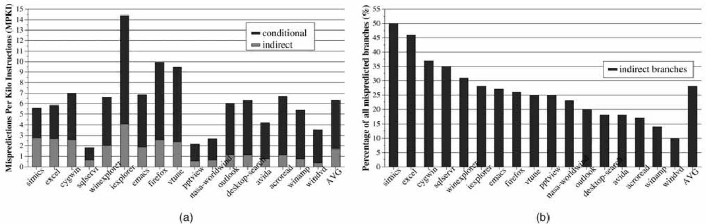
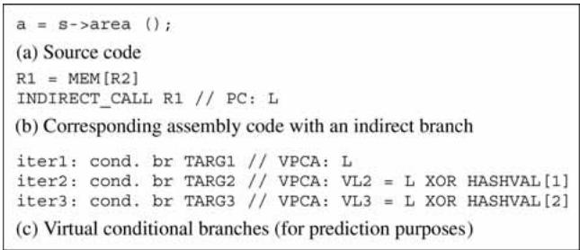
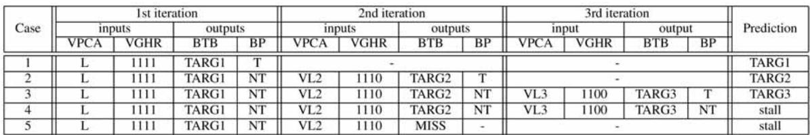
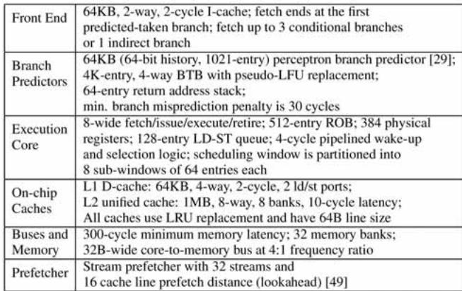
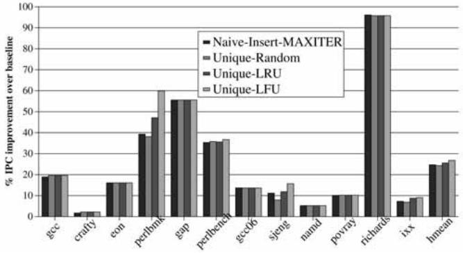

# Virtual Program Counter (VPC) Prediction: Very Low Cost Indirect Branch Prediction Using Conditional Branch Prediction Hardwar 论文解析

## 0. 论文基本信息

**作者 (Authors)**: Hyesoon Kim, José A. Joao, Onur Mutlu, et al.

**发表期刊/会议 (Journal/Conference)**: IEEE Transactions on Computers

**发表年份 (Publication Year)**: 2009

**研究机构 (Affiliations)**: Georgia Institute of Technology, University of Texas at Austin, Carnegie Mellon University, Intel Corporation

______________________________________________________________________

## 1. 摘要

**目的**

- 解决现代**面向对象语言**（如 C++、Java）中**间接分支**（indirect branches）预测精度低、硬件开销大的问题。
- 提出一种**低成本**的间接分支预测方案，利用处理器中已有的**条件分支预测硬件**（conditional branch prediction hardware），避免为间接分支预测引入额外的、复杂的专用存储结构。

**方法**

- 提出 **Virtual Program Counter **(VPC) **prediction** 机制，其核心思想是**动态去虚拟化**（dynamic devirtualization）。
- 将一个间接分支在硬件预测层面**视为多个“虚拟”条件分支**（virtual conditional branches）的序列。
- 每个虚拟分支拥有一个唯一的 \*\*Virtual PC \*\*(VPCA)，该地址通过将原始 PC 与一个迭代相关的随机常数进行哈希运算得到。
- 预测过程是**迭代式**的：
    - 使用 VPCA 和更新后的**虚拟全局历史寄存器**（VGHR）访问现有的**分支目标缓冲区**（BTB）和**方向预测器**。
    - 如果预测结果为 **not-taken**，则进入下一个虚拟分支的预测。
    - 如果预测结果为 **taken**，则使用 BTB 中对应的地址作为间接分支的目标地址，预测结束。
    - 若达到最大迭代次数（**MAX_ITER**）仍未预测成功，则**停顿前端**（stall the front-end）。
- 训练算法能根据预测是否正确，动态地在 BTB 中**插入新目标**或**更新现有目标**的预测信息，并采用 **Unique-LFU** 策略管理 BTB 条目。

 *Fig. 3. High-level conceptual overview of the VPC predictor.*

**结果**

- 在 **12 个 C/C++ 应用**上，与基于 BTB 的基线预测器相比，VPC 预测（MAX_ITER=12）实现了 **26.7%** 的平均性能提升，并将平均**间接分支 MPKI**（每千条指令的误预测数）从 **4.63** 降至 **0.52**。
- 在 **11 个 DaCapo Java 应用**上，VPC 预测实现了 **21.9%** 的平均性能提升，并将平均间接分支 MPKI 从 **11.9** 降至 **5.2**。
- **81%** 的 C/C++ 应用和 **78.7%** 的 Java 应用的正确预测能在 **前 3-4 次迭代内**完成，表明预测延迟较低。
- 在能效方面，VPC 预测在 C/C++ 和 Java 应用上分别实现了 **19%** 和 **22%** 的平均**能耗降低**，同时**几乎不增加**处理器的最大功耗。
- 性能表现可与需要大量专用硬件的复杂预测器（如 \*\*Tagged Target Cache \*\*(TTC) 或 **Cascaded Predictor**）相媲美，但硬件成本极低。

| 应用类型  | 平均性能提升 | 平均能耗降低 | 间接分支 MPKI (基线 → VPC) |
| :-------- | :----------- | :----------- | :------------------------- |
| **C/C++** | **26.7%**    | **19%**      | **4.63 → 0.52**            |
| **Java**  | **21.9%**    | **22%**      | **11.9 → 5.2**             |

 *Fig. 6. Performance of VPC prediction: (a) IPC improvement and (b) indirect branch MPKI.*
 *Fig. 13. Performance of VPC prediction on Java applications: (a) IPC improvement and (b) indirect branch MPKI.*

**结论**

- **VPC prediction** 是一种**高效且低成本**的间接分支预测技术，它巧妙地复用了现有的条件分支预测硬件，避免了为间接分支引入复杂且耗能的专用结构。
- 该技术在**面向对象语言**（尤其是 Java）密集使用间接分支的场景下，能带来**显著的性能和能效提升**。
- VPC prediction 具有**良好的适应性**，其效果会随着底层条件分支预测器准确率的提高而提升，并且可以与编译器的**静态去虚拟化**（devirtualization）优化协同工作。
- 该工作为未来处理器设计提供了一种实用的思路，有助于**弥合面向对象编程的软件工程优势与硬件性能之间的鸿沟**。

______________________________________________________________________

## 2. 背景知识与核心贡献

**研究背景**

- 现代 **object-oriented languages**（如 Java, C++）和 **virtual-machine-based runtime systems** 广泛使用 **polymorphism**，其核心实现机制是 **dynamically dispatched function calls**（即 **virtual functions**）。
- 这些虚拟函数调用在底层指令集架构中通常被编译为 **indirect branches**。研究表明，面向对象程序中的间接分支数量远超传统的 C/Fortran 程序。
- **Indirect branch prediction** 比 **conditional branch prediction** 困难得多，因为它需要预测一个 N-ary 的目标地址，而非一个二元的跳转方向（taken/not-taken）。
- 由于缺乏高效的硬件支持，**indirect branch mispredictions** 已成为高性能处理器的关键性能瓶颈，并拉大了面向对象语言与传统语言间的性能差距。

**研究动机**

- 先前提出的专用 **indirect branch predictors**（如 **tagged target cache**, **cascaded predictor**, **PPM predictor**）虽然有效，但需要**大量额外的硬件存储和复杂逻辑**，增加了功耗、面积和设计复杂度。
- 大多数商用高性能处理器因此并未采用这些复杂方案，而是复用现有的 **Branch Target Buffer (BTB)** 来预测间接分支，但这仅能实现简单的“上次目标”预测，**准确率很低**（约50%）。
- 作者观察到，现代处理器已经配备了**庞大且高度优化的 conditional branch prediction hardware**。研究的核心动机是：能否**不增加专用硬件**，直接利用这套现有设施来高效预测间接分支？

**核心贡献**

- 提出了一种名为 **Virtual Program Counter (VPC) prediction** 的全新间接分支预测技术。
- **核心思想**：在硬件层面，将**单个间接分支**动态地视为**多个虚拟的 conditional branches**（称为 **virtual branches**）。每个虚拟分支拥有唯一的 **Virtual PC (VPCA)**，并复用现有的 **conditional branch predictor** 和 **BTB** 进行预测。
    - 预测过程是迭代的：依次查询每个虚拟分支，若预测为 **not-taken** 则继续下一个；若预测为 **taken**，则使用其在 BTB 中存储的目标地址作为最终预测结果。
- **关键优势**：
    - **零额外存储**：间接分支的目标地址直接存储在现有的 BTB 中，无需为间接分支构建独立的、复杂的存储结构。
    - **低成本高效益**：仅需少量额外的控制逻辑（如寄存器、哈希表），就能获得与大型专用预测器相当的性能。
    - **动态适应性**：作为一种纯硬件机制，它能自适应地处理任何间接分支，不受编译时分析或静态 profile 的限制，并能应对 **dynamic class loading** 等运行时行为。
- **实验结果**：
    - 在 **C/C++** 应用上，相比 BTB 基线，**平均性能提升 26.7%**，**平均能耗降低 19%**。
    - 在 **Java DaCapo** 应用上，**平均性能提升 21.9%**，**平均能耗降低 22%**。
    - VPC 预测的准确性与底层 conditional branch predictor 的准确性正相关，可与任何现有条件分支预测机制协同工作。

 *Fig. 1. Indirect branch mispredictions in Windows applications: (a) MPKI and (b) percent of mispredictions due to indirect branches.*
 *Fig. 3. High-level conceptual overview of the VPC predictor.*

______________________________________________________________________

## 3. 核心技术和实现细节

### 0. 技术架构概览

**整体技术架构**

VPC (Virtual Program Counter) Prediction 的核心思想是**复用现有的条件分支预测硬件**来处理间接分支，从而避免为间接分支预测引入额外的、复杂的专用存储结构。其架构巧妙地将一个间接分支在硬件预测层面“动态地”视为一连串虚拟的条件分支。

- **基本概念**:

    - **虚拟分支 (Virtual Branch)**: 这些是仅对处理器的分支预测单元可见的、逻辑上的条件分支。它们不存在于程序二进制代码中，不影响程序的实际执行流。
    - **虚拟程序计数器 (Virtual PC, VPCA)**: 为每个虚拟分支分配一个唯一的、伪造的 PC 地址，用于索引现有的**条件分支方向预测器 (Conditional Branch Direction Predictor)** 和 **BTB (Branch Target Buffer)**。
    - **虚拟全局历史寄存器 (Virtual GHR, VGHR)**: 为每个虚拟分支提供上下文（分支历史）信息，以增强预测准确性。

- **预测流程**:

    - 处理器在取指阶段遇到一个间接分支。
    - 预测过程开始迭代，**MAX_ITER** 参数限定了最大迭代次数（即最多尝试多少个虚拟分支）。
    - **第一次迭代**: 使用间接分支的真实 **PC** 作为 **VPCA**，使用当前的 **GHR** 作为 **VGHR**，访问 BTB 和方向预测器。
        - 如果 BTB 命中且方向预测器预测为 **taken**，则使用 BTB 返回的地址作为预测目标，预测结束。
        - 如果预测为 **not-taken**，则进入下一次迭代。
    - **后续迭代 (第 N 次)**:
        - **VPCA** 通过将原始 PC 与一个预定义的、与迭代次数相关的**随机化常数 (HASHVAL[N])** 进行哈希运算得到。
        - **VGHR** 通过对上一次的 VGHR 进行左移一位（模拟前一个虚拟分支为 not-taken）得到。
        - 重复上述预测过程，直到某个虚拟分支被预测为 taken，或达到 **MAX_ITER** 次迭代仍未成功，此时处理器**停顿 (stall)** 直到间接分支的目标地址在执行阶段被解析出来。

 *Fig. 3. High-level conceptual overview of the VPC predictor.*

- **训练流程**:

    - 当间接分支在提交阶段被解析后，VPC 预测器会根据预测是否正确进行训练。
    - **预测正确时**: 所有在成功预测之前的虚拟分支都在方向预测器中被训练为 **not-taken**，而成功预测的那个虚拟分支则被训练为 **taken**，并更新其在 BTB 中条目的替换策略位。
    - **预测错误时 (Wrong-target)**: 如果正确的目标地址已存在于某个虚拟分支的 BTB 条目中，则将该虚拟分支的方向预测器训练为 **taken**，其余已检查的虚拟分支训练为 **not-taken**。
    - **预测错误时 (No-target)**: 如果正确的目标地址不在任何虚拟分支的 BTB 条目中，则需要将其插入 BTB。插入位置的选择策略（如 **Unique-LFU**）会影响性能，论文默认采用 LFU（Least Frequently Used）策略来替换使用频率最低的条目。

- **硬件开销**:

    - VPC 预测器的硬件成本极低，主要新增内容包括：
        - 用于预测和训练的少量寄存器（存储 iter, VPCA, VGHR）。
        - 一个小型的硬编码 **HASHVAL** 表（大小为 MAX_ITER，通常不超过16）。
        - 在流水线中携带 **predicted_iter** 值。
    - **关键优势**: **无需为间接分支目标地址维护任何额外的专用存储表**，所有目标地址都自然地存储在现有的 BTB 中。

- **与编译器优化的关系**:

    - VPC 预测可以被看作是一种**硬件实现的、动态的 devirtualization (去虚拟化)**。
    - 它克服了编译器静态 devirtualization 的局限性，如**需要静态分析/剖析、缺乏运行时适应性、可能增加代码体积**等。
    - VPC 预测与编译器优化是**正交且互补**的，即使在经过编译器优化的代码上，VPC 依然能带来显著的性能提升。

### 1. Virtual Program Counter (VPC) Prediction

**核心观点**

- **Virtual Program Counter (VPC) Prediction** 的核心思想是将一个**间接分支 (indirect branch)** 在硬件预测层面动态地“**虚拟化**”为一个由多个**虚拟条件分支 (virtual conditional branches)** 组成的序列。
- 该机制巧妙地复用处理器中已有的、高度优化的**条件分支预测器 (conditional branch predictor)** 和 **BTB (Branch Target Buffer)**，无需为间接分支目标地址预测增加任何专用的、复杂的存储结构，从而实现了极低的硬件成本。

**实现原理与算法流程**

- **虚拟分支的概念**：每个虚拟分支在软件层面并不存在，仅对硬件的分支预测单元可见。每个虚拟分支拥有自己唯一的**虚拟程序计数器 (Virtual PC, VPCA)** 和关联的**虚拟全局历史寄存器 (Virtual GHR, VGHR)** 值，用于索引现有的预测器和BTB。
- **预测过程 (Algorithm 1)**：
    - **初始化**：`iter = 1`, `VPCA = PC` (原始间接分支地址), `VGHR = GHR` (当前全局历史)。
    - **迭代循环**：
        - 使用 `(VPCA, VGHR)` 访问 BTB 和条件分支方向预测器。
        - 如果 BTB **命中** 且方向预测器预测结果为 **TAKEN**，则使用 BTB 返回的目标地址作为预测结果，预测成功并结束。
        - 否则（BTB **未命中**、预测为 **NOT-TAKEN** 或 `iter > MAX_ITER`），更新 `VPCA` 和 `VGHR` 并进入下一次迭代。
            - `VPCA` 更新：通过将原始 `PC` 与一个预定义的、基于 `iter` 的**随机化常量 (HASHVAL[iter])** 进行哈希运算得到，确保不同迭代的 `VPCA` 唯一。
            - `VGHR` 更新：简单地左移一位，模拟前一个虚拟分支被预测为 **NOT-TAKEN** 的历史。
    - **终止条件**：成功预测到目标，或达到最大迭代次数 `MAX_ITER`，或发生 BTB 未命中。若未能成功预测，则前端流水线**停顿 (STALL)**，等待间接分支在执行阶段解析出真实目标。
- **训练过程**：
    - **正确预测时 (Algorithm 2)**：所有在成功预测前的虚拟分支都被训练为 **NOT-TAKEN**，而成功预测的那个虚拟分支被训练为 **TAKEN**，并更新其 BTB 条目的替换策略位。
    - **错误预测时 (Algorithm 3)**：
        - **Wrong-target**：遍历所有虚拟分支，找到存储了正确目标地址的那个，并将其方向预测器训练为 **TAKEN**。
        - **No-target**：如果所有虚拟分支的 BTB 条目中都没有正确目标，则需要将正确目标插入 BTB。插入位置的选择策略（如 **Unique-LFU**）会影响性能，论文默认选择**最近最少使用 (LFU)** 值最小的条目进行替换。

 *Fig. 4. VPC prediction example: source, assembly, and the corresponding virtual branches.*
 *TABLE 1 Possible VPC Predictor States and Outcomes When Branch in Fig. 4b is Predicted*

**关键参数设置与硬件成本**

- **MAX_ITER**：这是最关键的参数，它决定了为一个间接分支最多可以维护多少个不同的目标地址（即虚拟分支的数量）。
    - 实验表明，`MAX_ITER=12` 能在 C/C++ 和 Java 应用上取得最佳性能平衡。
    - 过大的 `MAX_ITER` 会增加 BTB 的冲突缺失，并可能导致预测延迟增加。
- **硬件开销极小**：
    - 主要新增硬件包括：用于存储 `iter`、`VPCA`、`VGHR` 的少量寄存器（预测和训练各一套）。
    - 一个小型的硬编码**随机化哈希表 (HASHVAL)**，大小为 `MAX_ITER`。
    - 在流水线中为每个间接分支携带一个 `predicted_iter` 字段。
    - **无需**为间接分支目标地址增加任何新的、独立的存储表。

**输入输出关系及在整体中的作用**

- **输入**：
    - 间接分支的 **PC (Program Counter)** 地址。
    - 当前的 **GHR (Global History Register)** 状态。
    - 现有的 **BTB** 和 **条件分支方向预测器** 的状态。
- **输出**：
    - 预测的**目标地址 (Target Address)**。
    - 或者，在无法预测时，发出一个**停顿 (STALL)** 信号。
- **在处理器前端的作用**：
    - **无缝集成**：VPC 预测器完全构建在现有条件分支预测硬件之上，对指令获取和解码逻辑的改动极小。
    - **提升性能**：通过显著降低**间接分支 MPKI (Mispredictions Per Kilo Instructions)**，减少了因错误路径执行导致的流水线冲刷，从而大幅提升了 IPC (Instructions Per Cycle)。
    - **降低能耗**：减少了错误路径上指令的获取、解码和执行，直接降低了处理器的整体**能量消耗**和**能量延迟积 (EDP)**。
    - **赋能面向对象语言**：有效缓解了由**虚函数调用 (virtual function calls)** 和**动态分派 (dynamic dispatch)** 导致的性能瓶颈，使得使用 C++、Java 等现代面向对象语言编写的程序能获得接近传统语言的性能，鼓励了更高质量的软件开发实践。

______________________________________________________________________

**性能与能效数据摘要**

| 应用类型             | 平均性能提升 (IPC) | 平均能耗降低 | 平均 EDP 降低 | 关键指标 (MPKI)   |
| :------------------- | :----------------: | :----------: | :-----------: | :---------------- |
| **C/C++ 应用**       |     **26.7%**      |   **19%**    |    **42%**    | 从 4.63 降至 0.52 |
| **Java DaCapo 应用** |     **21.9%**      |   **22%**    |    **36%**    | 从 11.9 降至 5.2  |

- **预测效率**：在 `MAX_ITER=12` 时，**81%** 的 C/C++ 正确预测在**前3次迭代**内完成；对于目标更多的 Java 应用，**78.7%** 的正确预测在**前4次迭代**内完成。这表明大多数预测都能快速完成，引入的停顿周期很少。

 *Fig. 7. Distribution of the number of iterations (for correct predictions) (MAX_ITER=12).*
 *Fig. 14. Distribution of the number of iterations (for correct predictions) in the Java programs (MAX_ITER¼12).*

### 2. Virtual Branch and Virtual PC (VPCA)

**Virtual Branch 与 Virtual PC (VPCA) 的核心机制**

- **Virtual Branch（虚拟分支）** 并非真实存在于程序二进制中的指令，而是一种**纯硬件层面的概念**。它由 VPC 预测器在预测阶段动态创建，目的是将一个难以预测的**间接分支 (indirect branch)** 转化为一系列易于处理的**条件分支 (conditional branch)**。
- 每个 Virtual Branch 在硬件看来就是一个标准的条件分支，拥有自己独立的**预测方向 (taken/not-taken)** 和**目标地址 (target address)**。
- **Virtual PC (VPCA)** 是分配给每个 Virtual Branch 的唯一标识符。它的核心作用是让处理器能够使用现有的**条件分支预测硬件**（包括方向预测器和 BTB）来区分并预测不同的 Virtual Branch。

**VPCA 的生成算法与流程**

- VPCA 的生成是一个**迭代过程**，其详细逻辑在论文的 **Algorithm 1** 中定义。
- **初始迭代 (iter = 1)**:
    - `VPCA` 被直接设置为原始间接分支的 **PC** 地址。
    - `VGHR` (Virtual Global History Register) 被设置为当前的 **GHR** 值。
- **后续迭代 (iter > 1)**:
    - `VPCA` 通过一个哈希函数计算得出：`VPCA = Hash(PC, iter)`。
    - 论文中具体实现为：`VPCA = PC XOR HASHVAL[iter]`，其中 **HASHVAL** 是一个**硬编码的、包含随机数的硬件表**，表的大小由 **MAX_ITER** 参数决定。
    - `VGHR` 则通过对上一轮的 `VGHR` 进行**左移一位**来更新，这模拟了前一个 Virtual Branch 被预测为 **not-taken** 的历史。
- 这个迭代过程会持续进行，直到以下任一条件满足：
    - 某个 Virtual Branch 被预测为 **taken**，此时其 BTB 中存储的目标地址即为最终预测结果。
    - 迭代次数达到预设上限 **MAX_ITER**。
    - 在访问 BTB 时发生 **miss**。

 *Fig. 4. VPC prediction example: source, assembly, and the corresponding virtual branches.*

**关键参数与硬件成本**

- **MAX_ITER**: 这是一个至关重要的设计参数，它决定了：
    - 一个间接分支最多可以关联多少个不同的目标地址（即 Virtual Branch 的数量）。
    - 预测过程可能消耗的最大周期数。
    - 论文实验表明，**MAX_ITER=12** 能在性能和开销之间取得最佳平衡。
- **HASHVAL 表**: 一个小型的只读存储器，存储 **MAX_ITER** 个随机常量。论文指出其硬件成本极低。
- **额外寄存器**: 需要少量寄存器来在预测和训练过程中保存 `iter`、`VPCA` 和 `VGHR` 的当前值。

**输入输出关系及在整体架构中的作用**

- **输入**:
    - 间接分支的原始 **PC** 地址。
    - 当前的全局历史寄存器 **GHR** 值。
- **输出**:
    - **预测阶段**: 一个预测的**目标地址**，或者一个**STALL**信号（表示无法预测）。
    - **训练阶段**: 对 BTB 和条件分支方向预测器进行更新，以反映真实的分支行为。
- **在整体架构中的作用**:
    - **复用现有硬件**: VPC 预测的核心价值在于**完全复用**处理器中已有的、高度优化的**条件分支预测器**和 **BTB**，避免了为间接分支预测构建专用、复杂的存储结构（如 Target Cache）。
    - **动态去虚拟化 (Dynamic Devirtualization)**: 它在硬件层面动态地实现了类似编译器**去虚拟化 (devirtualization)** 的效果，但无需任何静态分析或配置文件信息，具有极强的**适应性 (Adaptivity)**。
    - **降低前端复杂度**: 通过将复杂的 N-ary 间接目标预测问题，转化为一系列简单的二元 (taken/not-taken) 条件分支预测问题，极大地简化了处理器前端的设计。

**训练机制对 VPCA 的影响**

- 训练算法（**Algorithm 2 & 3**）确保了预测结构的准确性。
- 当预测错误且正确的目标地址不在 BTB 中（**No-target case**）时，训练逻辑需要决定将新目标插入到哪个 Virtual Branch 的槽位中。
- 论文评估了多种策略（Naive-Insert, Unique-Random, Unique-LRU），最终选择了 **Unique-LFU**（替换使用频率最低的目标）。这个选择直接影响了哪个 `VPCA` 会被用来存储新的目标地址，从而影响未来预测的顺序和效率。

### 3. Iterative Prediction and Training Algorithms

**VPC预测算法 (Algorithm 1)**

- VPC预测是一个**迭代过程**，每次迭代对应一个**虚拟分支 (virtual branch)** 的预测。
- **输入**:
    - `PC`: 间接分支的真实程序计数器地址。
    - `GHR`: 全局历史寄存器值，记录了最近分支的执行历史。
    - `MAX_ITER`: 最大迭代次数，决定了为单个间接分支最多能存储多少个目标地址。
- **初始化**: 第一次迭代 (`iter = 1`) 使用真实的 `PC` 作为**虚拟程序计数器地址 (VPCA)**，并使用当前的 `GHR` 作为**虚拟全局历史寄存器 (VGHR)**。
- **核心循环**:
    - 使用当前的 `VPCA` 和 `VGHR` 访问**BTB**和**条件分支方向预测器**。
    - 如果 BTB 命中 (`pred_target` 有效) 且方向预测器预测为 **TAKEN**，则预测成功，将 `pred_target` 作为下一条取指地址，并结束预测。
    - 否则（即 BTB 未命中、方向预测为 **NOT-TAKEN** 或已达到 `MAX_ITER`），进入下一次迭代或触发**STALL**。
- **迭代更新**:
    - `VPCA` 通过哈希函数更新：`VPCA = Hash(PC, iter)`。论文中使用一个硬编码的随机数表 `HASHVAL[iter]` 来实现，确保每个虚拟分支有唯一的、可重现的地址。
    - `VGHR` 被左移一位（相当于在历史末尾添加一个 **NOT-TAKEN** 位），以反映上一个虚拟分支未被采用。
- **终止条件**: 预测成功（遇到 TAKEN）、达到 `MAX_ITER` 或 BTB 未命中。若未能成功预测，则前端流水线**STALL**，直到间接分支在后端被解析出真实目标。
- **作用**: 该算法巧妙地复用了现有的**条件分支预测硬件**，将一个N路的间接分支目标预测问题，转化为一系列二元的（TAKEN/NOT-TAKEN）虚拟条件分支预测问题。

 *Fig. 4. VPC prediction example: source, assembly, and the corresponding virtual branches.*

**VPC训练算法**

- 训练的目标是根据间接分支的实际执行结果，更新预测器状态，使其在未来能做出更准确的预测。
- **关键区分**: 训练逻辑首先需要判断预测失败的类型：
    - **Wrong-target**: 正确的目标地址存在于某个虚拟分支的 BTB 条目中，但该虚拟分支的方向被错误地预测为 **NOT-TAKEN**。
    - **No-target**: 正确的目标地址根本不在任何虚拟分支的 BTB 条目中。
- **正确预测时的训练 (Algorithm 2)**:
    - 对于所有在成功预测前的虚拟分支（即 `iter < predicted_iter`），将其方向预测器条目训练为 **NOT-TAKEN**。
    - 对于成功预测的那个虚拟分支（即 `iter = predicted_iter`），将其方向预测器条目训练为 **TAKEN**，并更新其 BTB 条目的**替换策略位**（如 LRU/LFU）。
- **错误预测时的训练 (Algorithm 3)**:
    - **迭代检查**: 按预测时的相同顺序，依次检查每个虚拟分支的 BTB 条目。
    - **Wrong-target 处理**: 一旦发现某个虚拟分支的 BTB 目标与实际目标匹配，立即将其方向预测器训练为 **TAKEN**，更新其 BTB 替换位，并停止后续检查。
    - **No-target 处理**: 如果遍历完所有 `MAX_ITER` 个虚拟分支都未找到正确目标，则需要将正确目标**插入 BTB**。
        - **插入位置选择**: 优先选择在预测阶段发生 **BTB miss** 的那个虚拟分支位置。如果没有 miss，则选择 BTB 条目中**使用频率最低 (Least-frequently-used, LFU)** 的位置进行替换。论文实验表明 **Unique-LFU** 策略效果最佳。
        - **插入后训练**: 将新插入的虚拟分支的方向预测器训练为 **TAKEN**。
- **作用**: 训练算法确保了预测器能够动态学习和适应间接分支的目标模式，通过调整虚拟分支的“taken”顺序和维护 BTB 中的目标集合，来逼近最优的预测效果。

 *TABLE 1 Possible VPC Predictor States and Outcomes When Branch in Fig. 4b is Predicted*

______________________________________________________________________

**关键参数与性能影响**

- **MAX_ITER**: 这是 VPC 预测机制中最关键的参数，它直接决定了：
    - 单个间接分支可以拥有的最大目标数量。
    - 预测延迟的上限（最坏情况下需要 `MAX_ITER` 个周期）。
    - 对 BTB 资源的压力（更多的虚拟分支意味着更多的 BTB 条目占用）。
- 实验结果表明，**MAX_ITER=12** 在所测试的 C/C++ 和 Java 应用中提供了最佳的性能平衡点。
    - 对于目标较少的程序（如 `eon`, `gap`），较小的 `MAX_ITER`（如2或4）就足以消除大部分误预测。
    - 对于目标极多的程序（如 `perlbench`, Java 应用），增大 `MAX_ITER` 能持续降低 MPKI，但过大的值（>12）会因 BTB **冲突缺失 (conflict misses)** 增加而导致性能下降。
- **预测效率**: 绝大多数（C/C++ 约 **81%**，Java 约 **78.7%**）的正确预测在前 **3-4** 次迭代内完成，说明平均预测延迟很低。

 *Fig. 7. Distribution of the number of iterations (for correct predictions) (MAX_ITER=12).*
 *Fig. 14. Distribution of the number of iterations (for correct predictions) in the Java programs (MAX_ITER¼12).*

### 4. Dynamic Devirtualization without Compiler Support

**核心观点：VPC预测的动态去虚拟化机制**

VPC (Virtual Program Counter) 预测的核心创新在于，它在**硬件层面**动态地将一个间接分支（indirect branch）模拟为多个“虚拟”的条件分支（virtual conditional branches），从而复用现有的、高度优化的**条件分支预测硬件**（包括方向预测器和BTB）来预测间接分支的目标地址。这一过程完全**无需编译器支持**，不依赖静态分析或运行时剖析（profiling），并能自适应程序行为的变化。

- **基本原理**：

    - 一个间接分支在软件中只存在一次，但在硬件预测时，VPC机制将其视为一个由多个虚拟分支组成的序列。
    - 每个虚拟分支都有一个唯一的**虚拟程序计数器**（VPCA），该VPCA是通过对原始间接分支的PC进行哈希变换生成的。
    - 硬件使用这个VPCA去查询现有的**条件分支方向预测器**（如gshare, perceptron等）和**分支目标缓冲区**（BTB）。
    - 如果方向预测器预测当前虚拟分支为“**taken**”，则使用BTB中与该VPCA关联的**目标地址**作为间接分支的预测目标，预测结束。
    - 如果预测为“**not-taken**”，则硬件自动移动到序列中的下一个虚拟分支，并用其对应的VPCA重复预测过程。

- **算法流程**（基于Algorithm 1）：

    - **初始化**：`iter = 1`, `VPCA = PC` (原始间接分支地址), `VGHR = GHR` (全局历史寄存器值)。
    - **迭代预测**：
        - 使用`VPCA`访问BTB，获取`pred_target`。
        - 使用`VPCA`和`VGHR`访问条件分支方向预测器，获取`pred_dir`。
        - **终止条件1**（成功预测）：如果`pred_target`存在（BTB命中）且`pred_dir`为**TAKEN**，则预测完成，下一取指地址为`pred_target`。
        - **终止条件2**（预测失败）：如果`pred_target`不存在（BTB miss）或`iter > MAX_ITER`，则预测失败，前端**STALL**，等待间接分支在执行阶段解析出真实目标。
        - **继续迭代**：如果以上条件均不满足，则更新`VPCA = Hash(PC, iter)`，`VGHR = Left-Shift(VGHR)`（模拟前一个虚拟分支为not-taken），`iter++`，进入下一轮循环。

 *Fig. 3. High-level conceptual overview of the VPC predictor.*

- **关键参数设置**：
    - **MAX_ITER**：这是最重要的参数，它定义了为一个间接分支最多尝试预测多少个虚拟分支。它直接决定了该间接分支在BTB中可以存储多少个不同的目标地址。
        - 论文实验表明，**MAX_ITER=12** 能在C/C++和Java应用上取得最佳性能平衡。
        - 过小的`MAX_ITER`无法覆盖多态性高的间接分支；过大的`MAX_ITER`会增加BTB冲突（conflict misses）并可能因迭代次数过多而引入额外延迟。
    - **HASHVAL**：一个硬编码的、包含`MAX_ITER`个条目的随机数表。用于生成不同迭代次数对应的唯一VPCA，确保不同虚拟分支能映射到预测结构的不同位置。

**训练与自适应机制**

VPC预测的自适应能力来源于其精细的训练算法，该算法在间接分支被提交（commit）后更新预测结构。

- **正确预测时的训练**（Algorithm 2）：

    - 对于序列中除最后一个（即预测正确的那个）之外的所有虚拟分支，将其在方向预测器中训练为**NOT-TAKEN**。
    - 对于最后一个虚拟分支，将其在方向预测器中训练为**TAKEN**，并更新其在BTB中的替换策略位（如LFU计数器）。

- **错误预测时的训练**（Algorithm 3）：

    - **Wrong-target情况**：正确的目标地址已存在于某个虚拟分支的BTB项中，但方向预测器错误地预测其为NOT-TAKEN。训练逻辑会找到该项，并将其方向预测器更新为**TAKEN**。
    - **No-target情况**：正确的目标地址不在任何虚拟分支的BTB项中。此时需要将新目标插入BTB。
        - 插入位置的选择至关重要。论文采用**Unique-LFU**策略：优先选择一个BTB miss的虚拟分支槽位；若无miss，则替换掉LFU（Least-Frequently-Used）值最小的虚拟分支槽位。这保证了BTB空间的有效利用，保留高频目标。

**输入输出关系及整体作用**

- **输入**：

    - **PC**：间接分支指令的程序计数器地址。
    - **GHR**：当前的全局分支历史。
    - **BTB和条件分支预测器的状态**：这是VPC机制复用的核心硬件资源。

- **输出**：

    - **预测目标地址**（`next_PC`）：如果在`MAX_ITER`次迭代内成功预测。
    - **STALL信号**：如果预测失败，通知前端暂停取指。

- **在处理器流水线中的作用**：

    - VPC预测发生在**取指**（Fetch）阶段，与常规分支预测并行。
    - 它通过将复杂的N路间接目标预测问题，巧妙地转化为一系列简单的二元（taken/not-taken）条件分支预测问题。
    - 其最大优势在于**零额外存储开销**：所有间接分支的目标地址都存储在原有的BTB中，无需像TTC（Tagged Target Cache）等方案那样引入专用的、庞大的间接目标存储结构。
    - 实验数据显示，在C/C++应用上平均提升**26.7%**性能，在Java DaCapo应用上平均提升**21.9%**性能，同时显著降低能耗。这证明了其作为一种**低成本、高效益**的间接分支处理方案的巨大价值。

### 5. Low-Cost Hardware Implementation

**VPC预测的低成本硬件实现原理**

VPC (Virtual Program Counter) 预测的核心思想是将一个间接分支在硬件层面动态地“虚拟化”为多个**conditional branch**，从而复用处理器中已经存在的、高度优化的**conditional branch prediction hardware**（包括方向预测器和BTB），避免了为间接分支目标地址构建专用存储结构的巨大开销。

- **虚拟分支 (Virtual Branch) 的概念**：

    - 虚拟分支并非真实存在于程序二进制中的指令，而是VPC预测机制在硬件内部创建的逻辑实体。
    - 每个虚拟分支都拥有自己唯一的**Virtual PC Address (VPCA)** 和关联的**Virtual Global History Register (VGHR)** 值，用于索引现有的分支预测结构。
    - 硬件依次预测这些虚拟分支：如果预测为 **not-taken**，则继续预测序列中的下一个；如果预测为 **taken**，则使用该虚拟分支在BTB中对应的**target address**作为间接分支的预测目标。

- **关键硬件组件与成本**：

    - **寄存器开销极小**：仅需少量额外寄存器来存储预测和训练过程中的迭代计数器 (`iter`)、当前VPCA和VGHR值。
    - **小型硬编码哈希表**：一个名为 `HASHVAL` 的硬编码表，包含 `MAX_ITER` 个（实验表明不超过16）32位随机数。该表用于在每次迭代中生成新的、唯一的VPCA，以区分不同的虚拟分支。
    - **复用现有BTB**：所有间接分支的目标地址都直接存储在现有的**Branch Target Buffer (BTB)** 中，每个目标地址通过其对应的VPCA进行索引。这完全消除了对专用间接分支目标缓存的需求。
    - **简单组合逻辑**：用于计算VPCA（`PC XOR HASHVAL[iter]`）和更新VGHR（左移一位，模拟前一个虚拟分支为not-taken）。这些计算不在关键路径上，因此不会影响预测延迟。

 *Fig. 3. High-level conceptual overview of the VPC predictor.*

**VPC预测与训练算法流程**

VPC的运作分为**预测 (Prediction)** 和 **训练 (Training)** 两个阶段。

- **预测算法 (Algorithm 1)**：

    - **初始化**：`iter = 1`, `VPCA = PC` (间接分支的真实PC), `VGHR = GHR` (全局历史寄存器的当前值)。
    - **迭代循环**：
        - 使用 `VPCA` 访问BTB获取预测目标 (`pred_target`)。
        - 使用 `VPCA` 和 `VGHR` 访问条件分支方向预测器获取预测方向 (`pred_dir`)。
        - **成功条件**：如果 `pred_target` 存在（BTB命中）且 `pred_dir` 为 **TAKEN**，则预测成功，使用 `pred_target` 作为下一条取指地址。
        - **继续条件**：如果 `pred_dir` 为 **NOT-TAKEN**，则更新 `VPCA = Hash(PC, iter)` 和 `VGHR = Left-Shift(VGHR)`，`iter++`，进入下一次迭代。
        - **失败/停顿条件**：如果 `iter > MAX_ITER` 或发生BTB miss，则预测失败，前端停顿直到间接分支在执行阶段被解析。

- **训练算法**：

    - **正确预测时 (Algorithm 2)**：对于预测序列中除最后一个（正确）虚拟分支外的所有分支，将其方向预测器条目训练为 **NOT-TAKEN**；将最后一个分支的方向预测器训练为 **TAKEN**，并更新其BTB条目的替换策略位（如LFU）。
    - **错误预测时 (Algorithm 3)**：
        - **Wrong-target**：遍历所有虚拟分支，找到存储了正确目标地址的那个，并将其方向预测器训练为 **TAKEN**。
        - **No-target**：如果正确目标未在任何虚拟分支的BTB条目中找到，则需要将其插入BTB。插入位置的选择策略（如 **Unique-LFU**）对性能有影响，它决定了新目标在虚拟分支序列中的“优先级”。

**参数设置与性能权衡**

- **核心参数 `MAX_ITER`**：

    - 它定义了为单个间接分支最多可以创建多少个虚拟分支，也即BTB中最多能为该分支缓存多少个不同目标。
    - 实验表明，`MAX_ITER=12` 在C/C++和Java基准测试中均能提供最佳性能。
    - **权衡**：增大 `MAX_ITER` 可以捕获更多目标，减少misprediction，但会增加BTB的**conflict misses**（尤其在Java等高间接分支密度的应用中），并且会增加预测所需的平均迭代次数（即前端停顿周期）。

- **输入输出关系**：

    - **输入**：间接分支的 **PC** 地址和当前的 **GHR** 值。
    - **输出**：预测的 **target address** 或一个 **STALL** 信号。
    - **在整体中的作用**：VPC预测器作为一个低开销的前端模块，无缝集成到现有的取指和分支预测流水线中。它显著降低了**Indirect Branch MPKI**（从4.63降至0.52），从而减少了由错误路径取指和执行引起的**pipeline flushes**，最终提升了**IPC**并降低了**energy consumption**。

**与其他方案的硬件成本对比**

| 方案                          | 目标地址存储        | 额外硬件复杂度                          | 能量效率                         |
| :---------------------------- | :------------------ | :-------------------------------------- | :------------------------------- |
| **Baseline (BTB-only)**       | BTB (Last-target)   | 无                                      | 低 (高MPKI)                      |
| **Tagged Target Cache (TTC)** | 专用目标缓存 (KB级) | 高 (需独立结构、标签、多路选择器)       | 低 (随缓存增大而恶化)            |
| **VPC Prediction**            | **复用现有BTB**     | **极低** (仅寄存器、小哈希表、简单逻辑) | **高** (减少flushes，自身开销小) |

如图所示，VPC预测在几乎不增加硬件复杂度的前提下，其性能可媲美数KB大小的专用预测器，同时在**energy-delay product (EDP)** 上优势巨大。

 *Fig. 10. Effect of VPC on energy/power consumption.*

______________________________________________________________________

## 4. 实验方法与实验结果

**实验设置**

- 评估平台为基于 **Pin** 和 **iDNA** 的周期精确 x86 模拟器，分别用于 C/C++ 和 Java 应用。
- 基线处理器配置如  *TABLE 2 Baseline Processor Configuration* 所示，是一个高性能的乱序执行核心，具有 32KB **BTB**、16KB **gshare** 条件分支预测器、32-entry **RAS** 等。
- **C/C++ 基准测试集**：包含 5 个 SPEC CPU2000 INT、5 个 SPEC CPU2006 INT/C++ 基准测试，以及 2 个额外的 C 基准测试（GAP, NAMD），共 12 个。所有程序均使用 **ICC -O3** 编译。
- **Java 基准测试集**：完整的 **DaCapo** 基准测试套件（11 个应用），在 **Sun J2SE 1.4.2_15 JRE** 上运行。
- 所有实验均使用 **reference/small** 输入集，并通过 **Pinpoints** 选择具有代表性的 2 亿条 x86 指令进行模拟。
- **基线间接分支预测器**：采用传统的 **BTB-based last-target predictor**，即假设下一次跳转目标与上一次相同。
- **VPC 预测器关键参数**：`MAX_ITER`（最大虚拟分支尝试次数）是主要变量，在实验中从 2 到 16 进行调整。

**结果数据**

- **性能提升**：
    - 在 12 个 C/C++ 应用上，VPC 预测（`MAX_ITER=12`）平均 **IPC** 提升 **26.7%**。
    - 在 11 个 Java DaCapo 应用上，VPC 预测（`MAX_ITER=12`）平均 **IPC** 提升 **21.9%**。
- **错误预测率降低**：
    - C/C++ 应用的平均间接分支 **MPKI**（每千条指令的错误预测数）从基线的 **4.63** 降至 **0.52**。
    - Java 应用的平均间接分支 **MPKI** 从基线的 **11.9** 降至 **5.2**。
- **能效提升**：
    - C/C++ 应用的平均 **整体能耗** 降低 **19%**，**能量延迟积 (EDP)** 降低 **42%**。
    - Java 应用的平均 **整体能耗** 降低 **22%**，**EDP** 降低 **36%**。
    - VPC 预测几乎不增加 **最大功耗**（\<0.1%），而专用预测器（如 12KB TTC）则会显著增加功耗（>2%）。
- **预测效率**：
    - 在 C/C++ 应用中，**44.6%** 的正确预测在第一次迭代完成，**81%** 在三次迭代内完成 ( *Fig. 7. Distribution of the number of iterations (for correct predictions) (MAX_ITER=12).*)。
    - 在 Java 应用中，**44.8%** 的正确预测在第一次迭代完成，**78.7%** 在四次迭代内完成 ( *Fig. 14. Distribution of the number of iterations (for correct predictions) in the Java programs (MAX_ITER¼12).*)。
- **与其他预测器的对比**：
    - VPC 预测的性能等同于一个 **3-6 KB** 的 **Tagged Target Cache (TTC)** 或 **5.5-11 KB** 的 **Cascaded Predictor**，但无需任何额外的专用存储结构 ( *Fig. 15. Performance of VPC prediction versus tagged target cache.*,  *Fig. 16. Performance of VPC prediction versus cascaded predictor.*)。

**消融实验**

- **`MAX_ITER` 参数敏感性分析**：
    - 对于目标较少的程序（如 eon, gap），较小的 `MAX_ITER`（如 2 或 4）即可消除大部分错误预测 ( *Fig. 6. Performance of VPC prediction: (a) IPC improvement and (b) indirect branch MPKI.*)。
    - 对于目标极多的程序（如 perlbmk, perlbench, sjeng），性能随 `MAX_ITER` 增大而持续提升，但过大的 `MAX_ITER`（>12）会导致 **BTB 冲突缺失** 增加和 **预测延迟** 变长，反而使性能下降。
    - **最优 `MAX_ITER` 值为 12**，在此值下，VPC 在所有基准测试上取得了最佳的性能平衡。
- **VPC 训练策略对比**：
    - 实验比较了四种将正确目标地址插入 BTB 的策略 ( *Fig. 9. Performance impact of different VPC training schemes.*)：
        - **Naive-Insert-MAXITER**: 实现简单，但会导致 BTB 中目标地址冗余，降低空间效率。
        - **Unique-Random**: 随机替换。
        - **Unique-LRU**: 替换最近最少使用的条目。
        - **Unique-LFU**: 替换最不频繁使用的条目（默认策略）。
    - 结果表明，**Unique-LFU** 策略性能最佳，因为它保留了更可能在未来被使用的高频目标。
- **微架构参数影响**：
    - **BTB 大小**：VPC 的性能增益随 BTB 容量增大而提高。在 Java 应用这种高冲突场景下，小 BTB（如 512-entry）会严重限制 VPC 的效果 ( *TABLE 6 Effect of Different BTB Sizes in Java Applications*)。
    - **处理器激进程度**：在流水线更短、惩罚更小的“非激进”处理器上，VPC 依然能带来 **11.1%** 的平均性能提升，证明其收益具有普适性 ( *Fig. 17. VPC prediction versus TTC on a less aggressive processor.*)。

______________________________________________________________________
